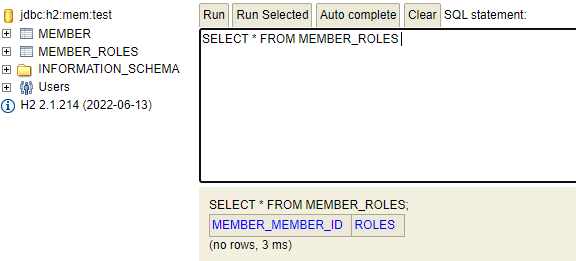

# HTTP 보안 구성 기본

```java
@Configuration
public class SecurityConfiguration {
    
    @Bean
    public SecurityFilterChain securityFilterChain(HttpSecurity http) throws Exception {
        
        //http 구현
        
        return http.build();
    }

    @Bean
    public UserDetailsManager userDetailsService() {
        UserDetails userDetails =
            User.withDefaultPasswordEncoder()
                .username("user")
                .password("1111")
                .roles("USER")
                .build();

        return new InMemoryUserDetailsManager(userDetails);
    }
}

```

`SecurityFilterChain` 으로 받는 `http` 에 메서드 체이닝으로 구현합니다. `UserDetailsManager` 은 인메모리 상 USER 를 만들 수 있습니다. (테스트 환경에서 사용)

> Spring Security 5.7 이전 버전에서는 HTTP 보안 설정을 구성하기 위해 WebSecurityConfigurerAdapter를 상속하는 형태의 방법을 주로 사용했지만 WebSecurityConfigurerAdapter는 5.7.0에서 Deprecated 되었습니다.

`SecurityFilterChain` 의 구현부를 채우면 아래와 같습니다.

```java
Bean
public SecurityFilterChain securityFilterChain(HttpSecurity http) throws Exception {

    http
            .csrf().disable()
            .formLogin()
            .loginPage("/auths/login-form")
            .loginProcessingUrl("/process_login")
            .failureUrl("/auths/login-form?error")
        .and()
            .authorizeHttpRequests()
            .anyRequest()
            .permitAll();

    return http.build();
}
```

폼 로그인의 기본적인 구성입니다. `loginPage` 를 구현해줘야 하고, 모든 리소스 요청에 대해 `permitAll` 설정입니다.

## 권한정보 설정

`SecurityFilterChain` 으로 권한정보를 설정할 수 있습니다.

```java
@Bean
    public SecurityFilterChain securityFilterChain(HttpSecurity http) throws Exception {

        http
                .csrf().disable()
                .formLogin()
                .loginPage("/auths/login-form")
                .loginProcessingUrl("/process_login")
                .failureUrl("/auths/login-form?error")
            .and()
                .exceptionHandling()
                .accessDeniedPage("/auths/access-denied") //accessDeniedPage 설정
            .and()
                .authorizeHttpRequests() //권한 정보 설정
                .antMatchers("/orders/**").hasRole("ADMIN")
                .antMatchers("/members/my-page").hasRole("USER")
                .antMatchers("/members/**").permitAll()
                ;

        return http.build();
    }
```

리소스에 접근하기 위한 권한 정보가 없을 때 `/auths/access-denied` 페이지로 이동합니다.

## 로그아웃 기능 구현

로그아웃 기능은 `logout()` 으로 메서드 체이닝을 시작합니다.

```java
@Bean
public SecurityFilterChain securityFilterChain(HttpSecurity http) throws Exception {

    http
            .csrf().disable()
            .formLogin()
            .loginPage("/auths/login-form")
            .loginProcessingUrl("/process_login")
            .failureUrl("/auths/login-form?error")
        .and()
            .logout()
            .logoutUrl("/logout")
            .logoutSuccessUrl("/") //로그아웃 성공 시 리다이렉트 페이지
        .and()
            .exceptionHandling()
            .accessDeniedPage("/auths/access-denied")
        .and()
            .authorizeHttpRequests()
            .antMatchers("/orders/**").hasRole("ADMIN")
            .antMatchers("/members/my-page").hasRole("USER")
            .antMatchers("/members/**").permitAll()
            ;

    return http.build();
}
```

# Custom UserDetailsService 를 이용한 회원가입 ,로그인

먼저 SecurityConfig 에서 `InMemoryUserDetailsManager` 는 삭제해야 합니다. 

## DBMemberService 

```java
@Transactional
@Service
@RequiredArgsConstructor
public class DBMemberService implements MemberService {

    private final PasswordEncoder passwordEncoder;
    private final MemberRepository memberRepository;

    @Override
    public Member createMember(Member member) {

        member.setPassword(passwordEncoder.encode(member.getPassword()));

        return memberRepository.save(member);
    }
}
```

멤버의 패스워드를 인코딩한 후 저장하는 간단한 로직입니다.

## HelloUserDetailsServiceV1

인증, 인가 처리 시 스프링 시큐리티가 조회하는 서비스입니다. `loadUserByUsername` 을 통해 정보를 가져옵니다.

```java
@Component
@RequiredArgsConstructor
public class HelloUserDetailsServiceV1 implements UserDetailsService {

    private final MemberRepository memberRepository;
    private final HelloAuthorityUtils authorityUtils;

    @Override
    public UserDetails loadUserByUsername(String username) throws UsernameNotFoundException {

        Member member = memberRepository.findByEmail(username).orElseThrow(() ->
                new BusinessLogicException(ExceptionCode.MEMBER_NOT_FOUND));

        Collection<? extends GrantedAuthority> authorities = authorityUtils.createAuthorities(member.getEmail());

        return new User(member.getEmail(), member.getPassword(), authorities);
    }
}
```

## HelloAuthorityUtils

Role 기반의 User 권한을 생성하기 위해 사용하는 커스텀 클래스입니다.

```java
public class HelloAuthorityUtils {

    @Value("${mail.address.admin}")
    private String adminMailAddress;

    private final List<GrantedAuthority> ADMIN_ROLES = AuthorityUtils.createAuthorityList("ROLE_ADMIN", "ROLE_USER");

    private final List<GrantedAuthority> USER_ROLES = AuthorityUtils.createAuthorityList("ROLE_USER");

    public List<GrantedAuthority> createAuthorities(String email) {

        if (email.equals(adminMailAddress)) {
            return ADMIN_ROLES;
        }
        return USER_ROLES;
    }
}
```

`application.yml` 에 `mail.address.admin` 을 넣어줍니다. 해당 이메일이면 `ADMIN_ROLES` 를 리턴하고 아니면 `USER_ROLES` 를 리턴합니다.

## Custom UserDetailsService 리팩토링

`UserDetails` 을 만드는 부분을 따로 빼줍니다. 권한 추출도 `UserDetails` 내부에서 구현합니다.

```java
@Component
@RequiredArgsConstructor
public class HelloUserDetailsServiceV2 implements UserDetailsService {

    private final MemberRepository memberRepository;
    private final HelloAuthorityUtils authorityUtils;

    @Override
    public UserDetails loadUserByUsername(String username) throws UsernameNotFoundException {

        Member member = memberRepository.findByEmail(username).orElseThrow(() ->
                new BusinessLogicException(ExceptionCode.MEMBER_NOT_FOUND));

        return new HelloUserDetails(member);
    }

    private final class HelloUserDetails extends Member implements UserDetails{

        HelloUserDetails(Member member) {
            setMemberId(member.getMemberId());
            setFullName(member.getFullName());
            setEmail(member.getEmail());
            setPassword(member.getPassword());
        }

        @Override
        public Collection<? extends GrantedAuthority> getAuthorities() {
            return authorityUtils.createAuthorities(this.getEmail());
        }

        @Override
        public String getUsername() {
            return getEmail();
        }

        @Override
        public boolean isAccountNonExpired() {
            return true;
        }

        @Override
        public boolean isAccountNonLocked() {
            return true;
        }

        @Override
        public boolean isCredentialsNonExpired() {
            return true;
        }

        @Override
        public boolean isEnabled() {
            return true;
        }
    }
}

```

`HelloUserDetails` 클래스는 `UserDetails` 인터페이스를 구현하고 있고 또한 `Member` 엔티티 클래스를 상속하고 있습니다. 이렇게 구성하면 **데이터베이스에서 조회한 회원 정보를 Spring Security의 User 정보로 변환하는 과정**과 **User의 권한 정보를 생성하는 과정**을 **캡슐화**할 수 있습니다.

## Member Entity 에 ROLE 추가

```java
@NoArgsConstructor
@Getter
@Setter
@Entity
public class Member extends Auditable {
    @Id
    @GeneratedValue(strategy = GenerationType.IDENTITY)
    private Long memberId;

    ...

    @ElementCollection(fetch = FetchType.EAGER)
    private List<String> roles = new ArrayList<>();

    ...
}
```

​	`List`, `Set` 같은 컬렉션 타입의 필드는 `@ElementCollection` 애너테이션을 추가하면 User 권한 정보와 관련된 별도의 엔티티 클래스를 생성하지 않아도 간단하게 매핑 처리가 됩니다.



## DBMemberService 에 member Role 추가 로직

`member` 를 저장할 때 `roles` 도 같이 저장하도록 합니다.

```java
@Transactional
@Service
@RequiredArgsConstructor
public class DBMemberService implements MemberService {

    private final PasswordEncoder passwordEncoder;
    private final MemberRepository memberRepository;
    private final HelloAuthorityUtils authorityUtils;


    @Override
    public Member createMember(Member member) {

        member.setPassword(passwordEncoder.encode(member.getPassword()));

        member.setRoles(authorityUtils.createRoles(member.getEmail()));

        return memberRepository.save(member);
    }
}
```

그리고 `HelloAuthorityUtils` 에서 `createRoles()` 메서드를 추가합니다.

```java
@Component
public class HelloAuthorityUtils {

    @Value("${mail.address.admin}")
    private String adminMailAddress;

    private final List<String> ADMIN_ROLES_STRING = List.of("ADMIN", "USER");
    private final List<String> USER_ROLES_STRING = List.of("USER");

	...

    public List<String> createRoles(String email) {
        if (email.equals(adminMailAddress)) {
            return ADMIN_ROLES_STRING;
        }
        return USER_ROLES_STRING;
    }
}
```

## HelloUserDetailsServiceV3

이번에는 UserDetails 생성 시 권한 정보를 DB 에서 얻도록 해보겠습니다.

```java
@Component
@RequiredArgsConstructor
public class HelloUserDetailsServiceV3 implements UserDetailsService {

    private final MemberRepository memberRepository;
    private final HelloAuthorityUtils authorityUtils;

    @Override
    public UserDetails loadUserByUsername(String username) throws UsernameNotFoundException {

        Member member = memberRepository.findByEmail(username).orElseThrow(() ->
                new BusinessLogicException(ExceptionCode.MEMBER_NOT_FOUND));

        return new HelloUserDetails(member);
    }

    private final class HelloUserDetails extends Member implements UserDetails{

        HelloUserDetails(Member member) {
            setMemberId(member.getMemberId());
            setFullName(member.getFullName());
            setEmail(member.getEmail());
            setPassword(member.getPassword());
            setRoles(member.getRoles()); //추가
        }

        @Override
        public Collection<? extends GrantedAuthority> getAuthorities() {
            return authorityUtils.createAuthorities(this.getRoles()); //List<String> 을 넘겨서 반환받음
        }

        @Override
        public String getUsername() {
            return getEmail();
        }

        ...
    }
}

```

`getAuthorities()` 메서드 호출 시 `this.getRoles()` 를 통해 권한 정보를 얻습니다. `this.getRoles()` 은 `member.getRoles()` 로 세팅된 권한 정보의 스트링 리스트값으로, DB 에서 얻은 정보입니다.

`HelloAuthorityUtils` 에 다음과 같이 추가합니다.

```java
public List<GrantedAuthority> createAuthorities(List<String> roles) {
    List<GrantedAuthority> authorities = roles.stream()
            .map(role -> new SimpleGrantedAuthority("ROLE_" + role))
            .collect(Collectors.toList());
    return authorities;
}
```

리스트 값으로 `"ROLE_" + role` 를 만듭니다.

# AuthenticationProvider 구현

​	스프링 시큐리티는 `AuthenticationFilter` 에서 `AuthenticationProvider ` 를 호출해서 인증을 위임합니다. 해당 `AuthenticationProvider`  를 구현해서 빈으로 등록한다면 인증 처리 절차를 커스텀할 수 있습니다.

```java
public class HelloUserAuthenticationProvider implements AuthenticationProvider {
    @Override
    public Authentication authenticate(Authentication authentication) throws AuthenticationException {
        return null;
    }

    @Override
    public boolean supports(Class<?> authentication) {
        return false;
    }
}
```

`authenticate()` 메서드는 인증이 완료된 `Authentication` 객체를 반환합니다. `supports()` 는 들어오는 `authentication` 이 해당 `Provider` 가 처리할 수 있는 객체인지 판단합니다.

아래는 구현한 로직입니다.

```java
@Component
@RequiredArgsConstructor
public class HelloUserAuthenticationProvider implements AuthenticationProvider {
    
    private final HelloUserDetailsServiceV3 userDetailsService;
    private final PasswordEncoder passwordEncoder;

    @Override
    public Authentication authenticate(Authentication authentication) throws AuthenticationException {
        UsernamePasswordAuthenticationToken authToken = (UsernamePasswordAuthenticationToken) authentication;

        String username = authToken.getName();
        
        Optional.ofNullable(username).orElseThrow(() -> new UsernameNotFoundException("Invalid User name or User Password"));
        try {
            UserDetails userDetails = userDetailsService.loadUserByUsername(username);
            String password = userDetails.getPassword();
            verifyCredentials(authToken.getCredentials(), password);

            Collection<? extends GrantedAuthority> authorities = userDetails.getAuthorities();
            return UsernamePasswordAuthenticationToken.authenticated(username, password, authorities);
        } catch (Exception ex) {
            throw new UsernameNotFoundException(ex.getMessage()); // (1) AuthenticationException으로 다시 throw 한다.
        }
    }

    @Override
    public boolean supports(Class<?> authentication) {
        return UsernamePasswordAuthenticationToken.class.equals(authentication);
    }

    private void verifyCredentials(Object credentials, String password) {
        if (!passwordEncoder.matches((String)credentials, password)) {
            throw new BadCredentialsException("Invalid User name or User Password");
        }
    }
}

```

- `userDetailsService.loadUserByUsername(username)` : `UserDetails` 정보를 가져옵니다. 해당 유저 정보가 없으면 `UsernameNotFoundException` 를 반환합니다.
- `verifyCredentials(authToken.getCredentials(), password);` : Authentication 내의 비밀번호와 `userDetails` 의 비밀번호를 비교합니다. 일치하지 않으면 `BadCredentialsException` 을 반환합니다.

