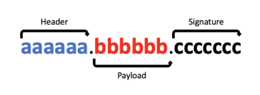

# JWT 구조



JWT는 위 그림과 같이 `.`으로 나누어진 세 부분이 존재합니다.

**Header**

어떤 종류의 토큰인지(지금의 경우엔 JWT), 어떤 알고리즘으로 Sign할지 정의합니다.

```json
{
  "alg": "HS256",
  "typ": "JWT"
}
```

**Payload**

Payload에는 서버에서 활용할 수 있는 사용자의 정보가 담겨 있습니다. 어떤 정보에 접근 가능한지에 대한 권한을 담을 수도 있고, 사용자의 이름 등 필요한 데이터를 담을 수 있습니다.

```json
{
  "sub": "someInformation",
  "name": "phillip",
  "iat": 151623391
}
```

**Signature**

 Signature 에서는 원하는 비밀 키(Secret Key)와 Header에서 지정한 알고리즘을 사용하여 **Header와 Payload에 대해서 단방향 암호화를 수행**합니다. 예를 들어, 만약 HMAC SHA256 알고리즘(암호화 방법 중 하나)을 사용한다면 Signature는 아래와 같은 방식으로 생성됩니다.

```java
HMACSHA256(base64UrlEncode(header) + '.' + base64UrlEncode(payload), secret);
```

# JWT의 장점과 단점

아래는 JWT 의 장점입니다.

1. 상태를 유지하지 않고(**Stateless**), 확장에 용이한(**Scalable**) 애플리케이션을 구현하기 용이합니다.
2. 클라이언트가 request 를 전송할 때마다 자격 증명 정보를 전송할 필요가 없습니다.
3. **인증을 담당하는 시스템을 다른 플랫폼으로 분리하는 것이 용이**합니다. 사용자의 자격 증명 정보를 직접 관리하지 않고, Github, Google 등의 다른 플랫폼의 자격 증명 정보로 인증하는 것이 가능합니다.
4. **권한 부여에 용이**합니다. 토큰의 Payload 안에 해당 사용자의 권한 정보를 포함할 수 있습니다.

 장점이 있다면 단점도 있겠죠.

1. **Payload는 디코딩이 용이합니다.** 만약 토큰을 탈취하여 Payload를 디코딩하면 토큰 생성 시 저장한 데이터를 확인할 수 있습니다. 따라서 Payload에는 민감한 정보를 포함하지 않아야 합니다.
2. **토큰의 길이가 길어지면 네트워크에 부하를 줄 수 있습니다.**
3. **토큰은 자동으로 삭제되지 않습니다.**

# JWT 생성 및 검증

## build.gradle

`dependencies` 에 아래와 같이 추가합니다.

```
implementation 'io.jsonwebtoken:jjwt-api:0.11.5'
runtimeOnly 'io.jsonwebtoken:jjwt-impl:0.11.5'
runtimeOnly	'io.jsonwebtoken:jjwt-jackson:0.11.5'
```

## JwtTokenizer 

토큰을 만드는 클래스입니다.

```java
public class JwtTokenizer {
    // (1)
    public String encodeBase64SecretKey(String secretKey) {
        return Encoders.BASE64.encode(secretKey.getBytes(StandardCharsets.UTF_8));
    }

    // (2)
    public String generateAccessToken(Map<String, Object> claims,
                                      String subject,
                                      Date expiration,
                                      String base64EncodedSecretKey) {
        Key key = getKeyFromBase64EncodedKey(base64EncodedSecretKey); // (2-1)

        return Jwts.builder()
                .setClaims(claims)          // (2-2)
                .setSubject(subject)        // (2-3)
                .setIssuedAt(Calendar.getInstance().getTime())   // (2-4)
                .setExpiration(expiration)  // (2-5)
                .signWith(key)              // (2-6)
                .compact();                 // (2-7)
    }

    // (3)
    public String generateRefreshToken(String subject, Date expiration, String base64EncodedSecretKey) {
        Key key = getKeyFromBase64EncodedKey(base64EncodedSecretKey);

        return Jwts.builder()
                .setSubject(subject)
                .setIssuedAt(Calendar.getInstance().getTime())
                .setExpiration(expiration)
                .signWith(key)
                .compact();
    }
    
    ...
    ...

    // (4)
    private Key getKeyFromBase64EncodedKey(String base64EncodedSecretKey) {
        byte[] keyBytes = Decoders.BASE64.decode(base64EncodedSecretKey);  // (4-1)
        Key key = Keys.hmacShaKeyFor(keyBytes);    // (4-2)

        return key;
    }
    
    //(5)
    public void verifySignature(String jws, String base64EncodedSecretKey) {
        Key key = getKeyFromBase64EncodedKey(base64EncodedSecretKey);

        Jwts.parserBuilder()
                .setSigningKey(key)   
                .build()
                .parseClaimsJws(jws);
    }

}
}
```

1. Secret Key 를 Base64 형식의 문자열로 인코딩해줍니다.
2.  AccessToken 생성 메서드입니다.
3. RefreshToken 생성 메서드입니다.
4. `getKeyFromBase64EncodedKey()` 는 JWT의 서명에 사용할 Secret Key를 생성해 줍니다.
   1. (4-1)의 `Decoders.BASE64.decode()` 메서드는 Base64 형식으로 인코딩 된 Secret Key를 디코딩한 후, byte array를 반환합니다.
   2. (4-2)의 `Keys.hmacShaKeyFor()` 메서드는 key byte array를 기반으로 적절한 HMAC 알고리즘을 적용한 Key(`java.security.Key`) 객체를 생성합니다.
5.  검증 메서드입니다. Secret Key를 이용해 내부적으로 Signature를 검증한 후, 검증에 성공하면 JWT를 파싱 해서 Claims를 얻을 수 있습니다.

