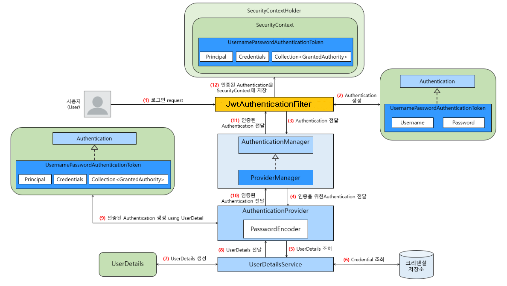
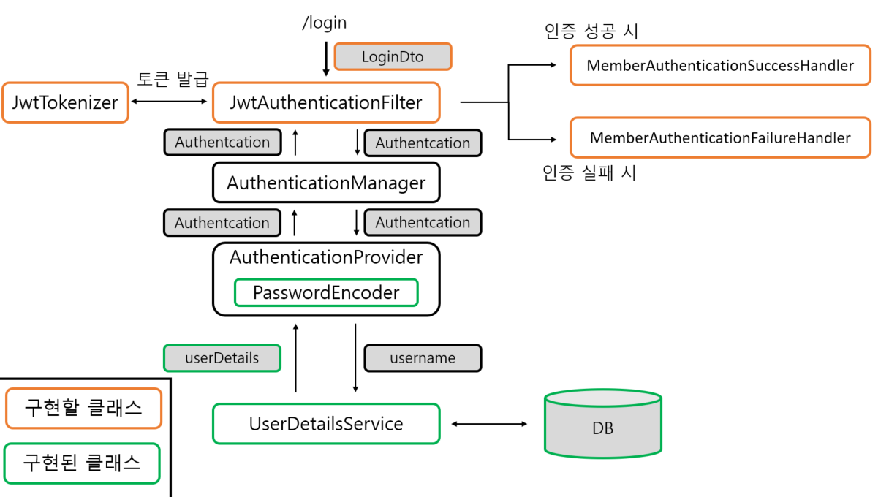
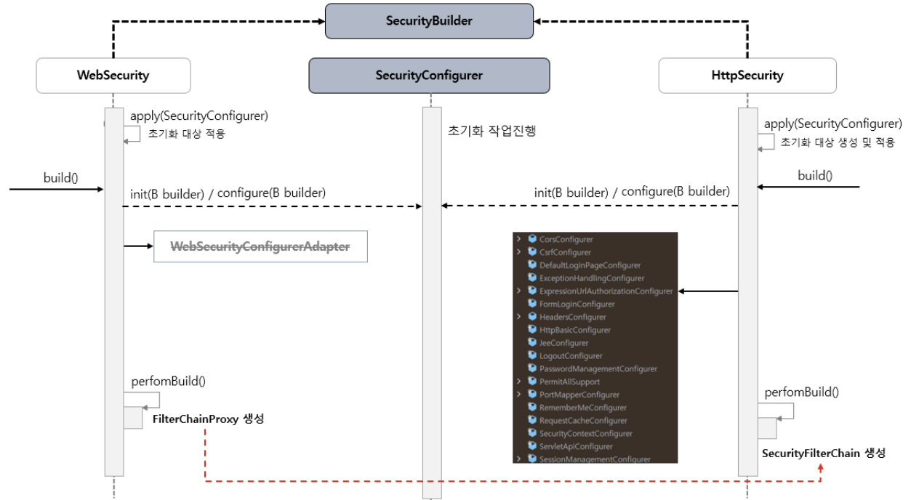
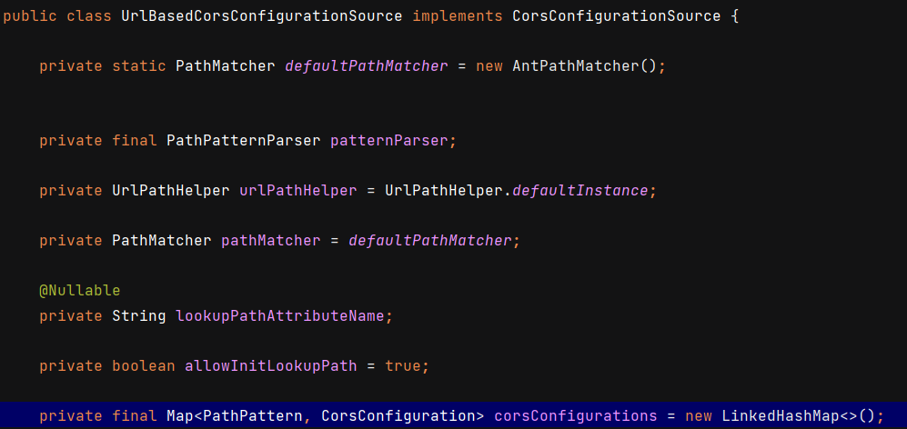
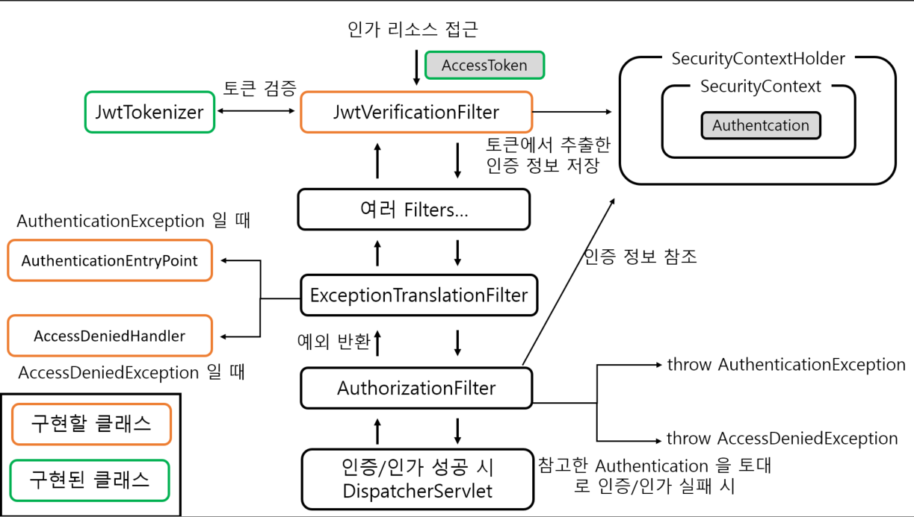

# JWT 자격 증명을 위한 로그인 인증 구현

## JWT 인증 흐름



JWT 인증 흐름 자체는 `UsernamePasswordAuthenticationFilter` 와 다른 점은 없습니다. 토큰 자체도 `UsernamePasswordAuthenticationToken` 을 사용합니다.  다만 인증이 필요한 정보에 접근할 때 SessionID 를 사용하느냐, Token 을 사용하느냐의 차이일 뿐입니다.

아래는 구현할 클래스 나타낸 것입니다. 주황색 박스가 실제로 구현할 클래스입니다.



## JwtTokenizer

Jwt 생성 및 발급, 검증 역할을 하는 클래스입니다.

```java
@Component
public class JwtTokenizer {
    @Getter
    @Value("${jwt.key}")
    private String secretKey;

    @Getter
    @Value("${jwt.access-token-expiration-minutes}")
    private int accessTokenExpirationMinutes;

    @Getter
    @Value("${jwt.refresh-token-expiration-minutes}")
    private int refreshTokenExpirationMinutes;

    public String encodeBase64SecretKey(String secretKey) {
        return Encoders.BASE64.encode(secretKey.getBytes(StandardCharsets.UTF_8));
    }

    public String generateAccessToken(Map<String, Object> claims,
                                      String subject,
                                      Date expiration,
                                      String base64EncodedSecretKey) {
        Key key = getKeyFromBase64EncodedKey(base64EncodedSecretKey);

        return Jwts.builder()
                .setClaims(claims)
                .setSubject(subject)
                .setIssuedAt(Calendar.getInstance().getTime())
                .setExpiration(expiration)
                .signWith(key)
                .compact();
    }

    public String generateRefreshToken(String subject, Date expiration, String base64EncodedSecretKey) {
        Key key = getKeyFromBase64EncodedKey(base64EncodedSecretKey);

        return Jwts.builder()
                .setSubject(subject)
                .setIssuedAt(Calendar.getInstance().getTime())
                .setExpiration(expiration)
                .signWith(key)
                .compact();
    }

    public Jws<Claims> getClaims(String jws, String base64EncodedSecretKey) {
        Key key = getKeyFromBase64EncodedKey(base64EncodedSecretKey);

        Jws<Claims> claims = Jwts.parserBuilder()
                .setSigningKey(key)
                .build()
                .parseClaimsJws(jws);
        return claims;
    }

    public void verifySignature(String jws, String base64EncodedSecretKey) {
        Key key = getKeyFromBase64EncodedKey(base64EncodedSecretKey);

        Jwts.parserBuilder()
                .setSigningKey(key)
                .build()
                .parseClaimsJws(jws);
    }

    public Date getTokenExpiration(int expirationMinutes) {
        Calendar calendar = Calendar.getInstance();
        calendar.add(Calendar.MINUTE, expirationMinutes);
        Date expiration = calendar.getTime();

        return expiration;
    }

    private Key getKeyFromBase64EncodedKey(String base64EncodedSecretKey) {
        byte[] keyBytes = Decoders.BASE64.decode(base64EncodedSecretKey);
        Key key = Keys.hmacShaKeyFor(keyBytes);

        return key;
    }
}
```

yml 설정파일에서 secretKey 값과 각각의 만료시간을 가져옵니다.

```yml
jwt:
  key: ${JWT_SECRET_KEY}               # 민감한 정보는 시스템 환경 변수에서 로드한다.
  access-token-expiration-minutes: 30
  refresh-token-expiration-minutes: 420
```

## JwtAuthenticationFilter 

요청에 대한 필터역할을 하는 `JwtAuthenticationFilter ` 입니다. `UsernamePasswordAuthenticationFilter` 를 상속받아 사용합니다.

```java
public class JwtAuthenticationFilter extends UsernamePasswordAuthenticationFilter {
    private final AuthenticationManager authenticationManager;
    private final JwtTokenizer jwtTokenizer;

    public JwtAuthenticationFilter(AuthenticationManager authenticationManager, JwtTokenizer jwtTokenizer) {
        this.authenticationManager = authenticationManager;
        this.jwtTokenizer = jwtTokenizer;
    }

    @SneakyThrows
    @Override
    public Authentication attemptAuthentication(HttpServletRequest request, HttpServletResponse response) {

        ObjectMapper objectMapper = new ObjectMapper();
        LoginDto loginDto = objectMapper.readValue(request.getInputStream(), LoginDto.class);

        UsernamePasswordAuthenticationToken authenticationToken =
                                                new UsernamePasswordAuthenticationToken(loginDto.getUsername(), loginDto.getPassword());

        return authenticationManager.authenticate(authenticationToken);
    }

    @Override
    protected void successfulAuthentication(HttpServletRequest request,
                                            HttpServletResponse response,
                                            FilterChain chain,
                                            Authentication authResult) {
        Member member = (Member) authResult.getPrincipal();

        String accessToken = delegateAccessToken(member);
        String refreshToken = delegateRefreshToken(member);

        response.setHeader("Authorization", "Bearer " + accessToken);
        response.setHeader("Refresh", refreshToken);
    }

    private String delegateAccessToken(Member member) {
        Map<String, Object> claims = new HashMap<>();
        claims.put("username", member.getEmail());
        claims.put("roles", member.getRoles());

        String subject = member.getEmail();
        Date expiration = jwtTokenizer.getTokenExpiration(jwtTokenizer.getAccessTokenExpirationMinutes());

        String base64EncodedSecretKey = jwtTokenizer.encodeBase64SecretKey(jwtTokenizer.getSecretKey());

        String accessToken = jwtTokenizer.generateAccessToken(claims, subject, expiration, base64EncodedSecretKey);

        return accessToken;
    }

    private String delegateRefreshToken(Member member) {
        String subject = member.getEmail();
        Date expiration = jwtTokenizer.getTokenExpiration(jwtTokenizer.getRefreshTokenExpirationMinutes());
        String base64EncodedSecretKey = jwtTokenizer.encodeBase64SecretKey(jwtTokenizer.getSecretKey());

        String refreshToken = jwtTokenizer.generateRefreshToken(subject, expiration, base64EncodedSecretKey);

        return refreshToken;
    }
}
```

​	필터 순서나 기본적인 동작방식은 `UsernamePasswordAuthenticationFilter` 을 따르되, `attemptAuthentication()` 메서드와 `successfulAuthentication()` 만 따로 구현합니다.

​	`attemptAuthentication()` 메서드를 먼저 보겠습니다.

```java
@SneakyThrows
@Override
public Authentication attemptAuthentication(HttpServletRequest request, HttpServletResponse response) {

    ObjectMapper objectMapper = new ObjectMapper();
    LoginDto loginDto = objectMapper.readValue(request.getInputStream(), LoginDto.class);

    UsernamePasswordAuthenticationToken authenticationToken =
                                            new UsernamePasswordAuthenticationToken(loginDto.getUsername(), loginDto.getPassword());

    return authenticationManager.authenticate(authenticationToken);
}
```

`objectMapper.readValue()` 를 통해 `request` 에 있는 `LoginDto` 를 읽어옵니다. 해당 정보로 `UsernamePasswordAuthenticationToken` 을 만들고 `authenticationManager` 에게 인증을 위임합니다.

`LoginDto` 는 아래와 같습니다. 기본적인 ID, PW 를 가집니다.

```java
@Getter
public class LoginDto {

    private String username;
    private String password;

}
```

​	다음은 `successfulAuthentication()` 을 보겠습니다.

```java
@Override
protected void successfulAuthentication(HttpServletRequest request,
                                        HttpServletResponse response,
                                        FilterChain chain,
                                        Authentication authResult) {
    Member member = (Member) authResult.getPrincipal();

    String accessToken = delegateAccessToken(member);
    String refreshToken = delegateRefreshToken(member);

    response.setHeader("Authorization", "Bearer " + accessToken);
    response.setHeader("Refresh", refreshToken);
}
```

`delegateAccessToken()` 과 `delegateRefreshToken()` 을 통해서 `member` 의 정보로 Jwt 를 만들고 response 에 실어서 보내줍니다.

## AuthenticationSuccessHandler

​	로그인 성공 시 실행 로직입니다. 인증 성공 후, 로그를 기록하거나 사용자 정보를 response로 전송하는 등의 추가 작업을 할 수 있습니다.

```java
@Slf4j
public class MemberAuthenticationSuccessHandler  implements AuthenticationSuccessHandler {

    @Override
    public void onAuthenticationSuccess(HttpServletRequest request,
                                        HttpServletResponse response,
                                        Authentication authentication) throws IOException {
        log.info("# Authenticated successfully!");
    }
}
```

`AuthenticationSuccessHandler` 인터페이스의 구현체로 만들면 됩니다.

## AuthenticationFailureHandler

​	로그인 실패 시 실행로직입니다. 인증 실패 시, 에러 로그를 기록하거나 error response를 전송할 수 있습니다. 

```java
@Slf4j
public class MemberAuthenticationFailureHandler implements AuthenticationFailureHandler { 
    @Override
    public void onAuthenticationFailure(HttpServletRequest request,
                                        HttpServletResponse response,
                                        AuthenticationException exception) throws IOException {

        log.error("# Authentication failed: {}", exception.getMessage());

        sendErrorResponse(response); 
    }

    private void sendErrorResponse(HttpServletResponse response) throws IOException {
        Gson gson = new Gson();
        ErrorResponse errorResponse = ErrorResponse.of(HttpStatus.UNAUTHORIZED);
        response.setContentType(MediaType.APPLICATION_JSON_VALUE);
        response.setStatus(HttpStatus.UNAUTHORIZED.value());
        response.getWriter().write(gson.toJson(errorResponse, ErrorResponse.class));
    }
}
```

​	위 로직에서는 `sendErrorResponse()` 메서드를 통해 `response` 에 에러값을 담아서 보내고 있습니다.

## SecurityConfiguration

​	이제 필요한 클래스는 다 만들었으니 `SecurityConfiguration` 에 추가해보도록 하겠습니다.

```java
@Configuration
@RequiredArgsConstructor
public class SecurityConfiguration {

    private final JwtTokenizer jwtTokenizer;
    private final CustomAuthorityUtils authorityUtils;

    @Bean
    public SecurityFilterChain filterChain(HttpSecurity http) throws Exception {
        http
                .headers().frameOptions().sameOrigin()
            .and()
                .csrf().disable()
                .cors(withDefaults()) //cors 적용
                .sessionManagement().sessionCreationPolicy(SessionCreationPolicy.STATELESS) //Jwt 는 세션 필요없음
            .and()
                .formLogin().disable()
                .httpBasic().disable()
            .and()
                .apply(new CustomFilterConfigurer()) //설정 파일 Configurer 적용
            .and()
                .authorizeHttpRequests(authorize -> authorize
                        .antMatchers(POST, "/*/members").permitAll()
                        .antMatchers(PATCH, "/*/members/**").hasRole("USER")
                        .antMatchers(GET, "/*/members").hasRole("ADMIN")
                        .antMatchers(GET, "/*/members/**").hasAnyRole("USER", "ADMIN")
                        .antMatchers(DELETE, "/*/members/**").hasRole("USER")
                        .anyRequest().permitAll()
                );

        return http.build();
    }

    @Bean
    public PasswordEncoder passwordEncoder() {
        return PasswordEncoderFactories.createDelegatingPasswordEncoder();
    }

    @Bean
    CorsConfigurationSource corsConfigurationSource(){ //cors 설정

        CorsConfiguration configuration = new CorsConfiguration();
        configuration.setAllowedOrigins(List.of("*")); // 모든 출처에 대해 CORS 를 허용
        configuration.setAllowedMethods(List.of("GET","POST","PATCH","DELETE")); // 허용할 HTTP method 지정

        UrlBasedCorsConfigurationSource source = new UrlBasedCorsConfigurationSource(); // CorsConfigurationSource 인터페이스의 구현 클래스
        source.registerCorsConfiguration("/**", configuration); // 모든 URL 에 대해 위에서 설정한 내용을 적용

        return source;

    }

    public class CustomFilterConfigurer extends AbstractHttpConfigurer<CustomFilterConfigurer, HttpSecurity> {
    
        @Override
        public void configure(HttpSecurity builder) throws Exception {
            AuthenticationManager authenticationManager = builder.getSharedObject(AuthenticationManager.class);

            JwtAuthenticationFilter jwtAuthenticationFilter = new JwtAuthenticationFilter(authenticationManager, jwtTokenizer);
            jwtAuthenticationFilter.setFilterProcessesUrl("/v11/auth/login");
            jwtAuthenticationFilter.setAuthenticationSuccessHandler(new MemberAuthenticationSuccessHandler());
            jwtAuthenticationFilter.setAuthenticationFailureHandler(new MemberAuthenticationFailureHandler());

            JwtVerificationFilter jwtVerificationFilter = new JwtVerificationFilter(jwtTokenizer, authorityUtils);

            builder
                    .addFilter(jwtAuthenticationFilter)
                    .addFilterAfter(jwtVerificationFilter, JwtAuthenticationFilter.class);
        }
    }
}

```

`SecurityConfig` 파일은 기본적으로 `HttpSecurity` 의 `build()` 를 통해 `Configurer` 클래스들을 만듭니다. 그리고 각각의 `Configurer` 들은 `init()`, `configure()` 메서드를 실행하면서 적용시킬 필터를 만듭니다.



### CorsConfigurationSource

```java
@Bean
CorsConfigurationSource corsConfigurationSource(){ //cors 설정

    CorsConfiguration configuration = new CorsConfiguration();
    configuration.setAllowedOrigins(List.of("*")); // 모든 출처에 대해 CORS 를 허용
    configuration.setAllowedMethods(List.of("GET","POST","PATCH","DELETE")); // 허용할 HTTP method 지정

    UrlBasedCorsConfigurationSource source = new UrlBasedCorsConfigurationSource(); // CorsConfigurationSource 인터페이스의 구현 클래스
    source.registerCorsConfiguration("/**", configuration); // 모든 URL 에 대해 위에서 설정한 내용을 적용

    return source;

}
```

`UrlBasedCorsConfigurationSource` 은 말 그대로 Url 을 기본으로 Cors 정책을 판단합니다. 해당 `CorsConfigurationSource` 에는 어떤 url 에 어떤 정책을 적용시킬지 설정할 수 있습니다. `CorsConfiguration` 가 개별정책이고 `CorsConfigurationSource` 는 여러 개의 `CorsConfiguration` 을 가질 수 있습니다. 내부적으로 `CorsConfiguration` 를 맵 형태로 가지고 있습니다.



마지막 필드값을 보면 Map 으로 PathPattern 과 CorsConfiguration 이 설정되있는걸 볼 수 있습니다. 즉, url 패턴으로 정책을 적용시킵니다.

### CustomFilterConfigurer

```java
public class CustomFilterConfigurer extends AbstractHttpConfigurer<CustomFilterConfigurer, HttpSecurity> {
    
    @Override
        public void configure(HttpSecurity builder) throws Exception {
            AuthenticationManager authenticationManager = builder.getSharedObject(AuthenticationManager.class);

            JwtAuthenticationFilter jwtAuthenticationFilter = new JwtAuthenticationFilter(authenticationManager, jwtTokenizer);
            jwtAuthenticationFilter.setFilterProcessesUrl("/v11/auth/login");
            jwtAuthenticationFilter.setAuthenticationSuccessHandler(new MemberAuthenticationSuccessHandler());
            jwtAuthenticationFilter.setAuthenticationFailureHandler(new MemberAuthenticationFailureHandler());

            JwtVerificationFilter jwtVerificationFilter = new JwtVerificationFilter(jwtTokenizer, authorityUtils);

            builder
                    .addFilter(jwtAuthenticationFilter)
            ;
        }
}
```

`JwtAuthenticationFilter` 를 구성하는 구성 클래스입니다. `configure()` 호출 시 `JwtAuthenticationFilter` 를 만들고 커스텀 핸들러를 매핑합니다. 또한 `.setFilterProcessesUrl()` 를 통해 어느 Url 로 요청 시 로그인을 수행하는지 지정했습니다.

### SecurityFilterChain

```java
@Bean
public SecurityFilterChain filterChain(HttpSecurity http) throws Exception {
    http
            .headers().frameOptions().sameOrigin()
        .and()
            .csrf().disable()
            .cors(withDefaults()) //cors 적용
            .sessionManagement().sessionCreationPolicy(SessionCreationPolicy.STATELESS)
        .and()
            .formLogin().disable()
            .httpBasic().disable()
        .and()
            .apply(new CustomFilterConfigurer()) //설정 파일 Configurer 적용
        .and()
            .authorizeHttpRequests(authorize -> authorize
                    .antMatchers(POST, "/*/members").permitAll()
                    .antMatchers(PATCH, "/*/members/**").hasRole("USER")
                    .antMatchers(GET, "/*/members").hasRole("ADMIN")
                    .antMatchers(GET, "/*/members/**").hasAnyRole("USER", "ADMIN")
                    .antMatchers(DELETE, "/*/members/**").hasRole("USER")
                    .anyRequest().permitAll()
            );

    return http.build();
}
```

마지막으로 만들었던 `CorsConfigurationSource` 와 `CustomFilterConfigurer` 을 등록시킵니다. `CorsConfigurationSource` 는 빈으로 등록되어있으면 자동으로 적용됩니다.

# JWT 를 이용한 자격 증명 및 검증 구현

토큰을 검증하는 클래스는 `JwtVerificationFilter` 입니다.



`JwtVerificationFilter` 는 JwtTokenizer 클래스를 통해 토큰을 검증하고 검증 정보를 `SecurityContext` 에 저장합니다. 그러면 `AuthorizationFilter` 에서 해당 검증 정보를 참고해서 리소스에 접근 가능한지 판단합니다. 판단 결과 인증/인가 실패 시 `Exception` 을 던지고, 이전 필터인 `ExceptionTranslationFilter` 에서 해당 예외를 받아서 처리합니다. 이 때 `AuthenticationException` 이면 `AuthenticationEntryPoint` 가 실행되고 `AccessDeniedException` 이면 `AccessDeniedHandler` 가 실행됩니다.

## JwtVerificationFilter

​	로그인 수행 이후 인가 처리를 하기 위한 필터입니다. 해당 필터를 지나면서 Jwt 토큰에 있는 인증정보로 `Authentication` 을 만들어 `SecurityContext` 에 저장합니다. `OncePerRequestFilter`를 확장해서 request 당 한 번만 실행되도록 구현합니다.

```java
public class JwtVerificationFilter extends OncePerRequestFilter {
    private final JwtTokenizer jwtTokenizer;
    private final CustomAuthorityUtils authorityUtils;

    public JwtVerificationFilter(JwtTokenizer jwtTokenizer,
                                 CustomAuthorityUtils authorityUtils) {
        this.jwtTokenizer = jwtTokenizer;
        this.authorityUtils = authorityUtils;
    }

    @Override
    protected void doFilterInternal(HttpServletRequest request, HttpServletResponse response, FilterChain filterChain) throws ServletException, IOException {
        try {
            Map<String, Object> claims = verifyJws(request);
            setAuthenticationToContext(claims);
        } catch (ExpiredJwtException ee) {
            request.setAttribute("exception", ee);
        } catch (Exception e) {
            request.setAttribute("exception", e);
        }

        filterChain.doFilter(request, response);

    }

    @Override
    protected boolean shouldNotFilter(HttpServletRequest request) throws ServletException {
        String authorization = request.getHeader("Authorization"); 

        return authorization == null || !authorization.startsWith("Bearer"); 
    }

    private Map<String, Object> verifyJws(HttpServletRequest request) {
        String jws = request.getHeader("Authorization").replace("Bearer ", "");
        String base64EncodedSecretKey = jwtTokenizer.encodeBase64SecretKey(jwtTokenizer.getSecretKey());
        Map<String, Object> claims = jwtTokenizer.getClaims(jws, base64EncodedSecretKey).getBody(); 

        return claims;
    }

    private void setAuthenticationToContext(Map<String, Object> claims) {
        String username = (String) claims.get("username");   // (4-1)
        List<GrantedAuthority> authorities = authorityUtils.createAuthorities((List) claims.get("roles")); 
        Authentication authentication = new UsernamePasswordAuthenticationToken(username, null, authorities);
        SecurityContextHolder.getContext().setAuthentication(authentication); 
    }
}
```

먼저 필드와 생성자를 보겠습니다.

```java
private final JwtTokenizer jwtTokenizer;
private final CustomAuthorityUtils authorityUtils;

public JwtVerificationFilter(JwtTokenizer jwtTokenizer,
                             CustomAuthorityUtils authorityUtils) {
    this.jwtTokenizer = jwtTokenizer;
    this.authorityUtils = authorityUtils;
}
```

토큰을 검증하기 위한 `jwtTokenizer` 와 권한정보를 추출해주는 `authorityUtils` 을 추가합니다.

> CustomAuthorityUtils 는 아래와 같습니다.
>
> ```java
> @Component
> public class CustomAuthorityUtils {
>     @Value("${mail.address.admin}")
>     private String adminMailAddress;
> 
>     private final List<GrantedAuthority> ADMIN_ROLES = AuthorityUtils.createAuthorityList("ROLE_ADMIN", "ROLE_USER");
>     private final List<GrantedAuthority> USER_ROLES = AuthorityUtils.createAuthorityList("ROLE_USER");
>     private final List<String> ADMIN_ROLES_STRING = List.of("ADMIN", "USER");
>     private final List<String> USER_ROLES_STRING = List.of("USER");
> 
>     // 메모리 상의 Role을 기반으로 권한 정보 생성.
>     public List<GrantedAuthority> createAuthorities(String email) {
>         if (email.equals(adminMailAddress)) {
>             return ADMIN_ROLES;
>         }
>         return USER_ROLES;
>     }
> 
>     // DB에 저장된 Role을 기반으로 권한 정보 생성
>     public List<GrantedAuthority> createAuthorities(List<String> roles) {
>         List<GrantedAuthority> authorities = roles.stream()
>                 .map(role -> new SimpleGrantedAuthority("ROLE_" + role))
>                 .collect(Collectors.toList());
>         return authorities;
>     }
> 
>     // DB 저장 용
>     public List<String> createRoles(String email) {
>         if (email.equals(adminMailAddress)) {
>             return ADMIN_ROLES_STRING;
>         }
>         return USER_ROLES_STRING;
>     }
> }
> ```

다음은 오버라이딩된 `doFilterInternal()` 와 `shouldNotFilter()` 메서드 입니다. 

```java
@Override
protected void doFilterInternal(HttpServletRequest request, HttpServletResponse response, FilterChain filterChain) throws ServletException, IOException {
    try {
        Map<String, Object> claims = verifyJws(request);
        setAuthenticationToContext(claims);
    } catch (ExpiredJwtException ee) {
        request.setAttribute("exception", ee);
    } catch (Exception e) {
        request.setAttribute("exception", e);
    }

    filterChain.doFilter(request, response);

}

@Override
protected boolean shouldNotFilter(HttpServletRequest request) throws ServletException {
    String authorization = request.getHeader("Authorization"); 

    return authorization == null || !authorization.startsWith("Bearer"); 
}
```

`shouldNotFilter()` 가 `true` 면 해당 필터를 검증하지 않습니다. 그러면 `Authentication` 이 `Anonymous` 가 되기 때문에 `AuthorizationFilter` 에서 인증 예외가 던져지게 되겠죠. 

`doFilterInternal()` 내부적으로는 `verifyJws()` 메서드로 Jwt 를 검증하고 `setAuthenticationToContext()` 메서드를 통해 `SecurityContext` 에 `Authentication` 을 저장합니다.

만약 `verifyJws()` 에서 검증 오류가 발생하면 해당 필터에서 예외를 리턴하는 게 아니라 `request` 에 실어서 `EntryPoint` 까지 도착하도록 합니다. `EntryPoint` 는 인증 실패 시 실행되는 클래스입니다.

그럼 `verifyJws()` 메서드를 보겠습니다.

```java
private Map<String, Object> verifyJws(HttpServletRequest request) {
    String jws = request.getHeader("Authorization").replace("Bearer ", "");
    String base64EncodedSecretKey = jwtTokenizer.encodeBase64SecretKey(jwtTokenizer.getSecretKey());
    Map<String, Object> claims = jwtTokenizer.getClaims(jws, base64EncodedSecretKey).getBody(); 

    return claims;
}
```

`request` 의 헤더값에서 `Authorization` 을 추출합니다. 그리고 `jwtTokenizer.getClaims().getBody()` 를 통해 정보가 담긴  `Map<String, Object> claims` 를 만듭니다.

`setAuthenticationToContext()` 메서드를 보겠습니다.

```java
private void setAuthenticationToContext(Map<String, Object> claims) {
    String username = (String) claims.get("username");   // (4-1)
    List<GrantedAuthority> authorities = authorityUtils.createAuthorities((List) claims.get("roles")); 
    Authentication authentication = new UsernamePasswordAuthenticationToken(username, null, authorities);
    SecurityContextHolder.getContext().setAuthentication(authentication); 
}
```

`claims` 에 있는 `username` 과 `roles` 값을 통해 `Authentication` 을 만들고 `SecurityContext` 에 저장합니다.

## AuthenticationEntryPoint 

​	인증 예외를 처리하는 EntryPoint 입니다. JWT 토큰이 유효하지 않을 때 실행됩니다. `AuthenticationEntryPoint` 인터페이스를 구현합니다. 앞서 말했듯이 `ExceptionTranslationFilter` 가 `MemberAuthenticationEntryPoint` 를 실행합니다.

```java
@Slf4j
@Component
public class MemberAuthenticationEntryPoint implements AuthenticationEntryPoint {
    @Override
    public void commence(HttpServletRequest request, HttpServletResponse response, AuthenticationException authException) throws IOException, ServletException {
        
        Exception exception = (Exception) request.getAttribute("exception");
        
        ErrorResponder.sendErrorResponse(response, HttpStatus.UNAUTHORIZED);

        logExceptionMessage(authException, exception);
    }

    private void logExceptionMessage(AuthenticationException authException, Exception exception) {
        String message = exception != null ? exception.getMessage() : authException.getMessage();
        log.warn("Unauthorized error happened: {}", message);
    }
}

```

`ErrorResponder` 클래스는 에러 응답을 작성하는 util 클래스입니다.

```java
public class ErrorResponder {
    public static void sendErrorResponse(HttpServletResponse response, HttpStatus status) throws IOException {
        Gson gson = new Gson();
        ErrorResponse errorResponse = ErrorResponse.of(status);
        response.setContentType(MediaType.APPLICATION_JSON_VALUE);
        response.setStatus(status.value());
        response.getWriter().write(gson.toJson(errorResponse, ErrorResponse.class));
    }
}
```

## AccessDeniedHandler 

​	`AccessDeniedHandler` 는 인증에는 성공했지만 해당 리소스에 대한 권한이 없으면 호출되는 핸들러입니다.

```java
@Slf4j
@Component
public class MemberAccessDeniedHandler implements AccessDeniedHandler {
    @Override
    public void handle(HttpServletRequest request, HttpServletResponse response, AccessDeniedException accessDeniedException) throws IOException, ServletException {
        ErrorResponder.sendErrorResponse(response, HttpStatus.FORBIDDEN);
        log.warn("Forbidden error happened: {}", accessDeniedException.getMessage());
        
    }
}
```

마찬가지로 `ErrorResponder` 를 통해 403 에러를 반환합니다.

## SecurityConfiguration

마지막으로 만든 설정들을 `SecurityConfiguration` 파일에 넣겠습니다.

```java
@Configuration
@RequiredArgsConstructor
public class SecurityConfiguration {

    private final JwtTokenizer jwtTokenizer;
    private final CustomAuthorityUtils authorityUtils;

    @Bean
    public SecurityFilterChain filterChain(HttpSecurity http) throws Exception {
        http
                .headers().frameOptions().sameOrigin()
            .and()
                .csrf().disable()
                .cors(withDefaults())
                .sessionManagement().sessionCreationPolicy(SessionCreationPolicy.STATELESS)
            .and()
                .formLogin().disable()
                .httpBasic().disable()
                .exceptionHandling() //exceptionHandling 으로 추가
                .authenticationEntryPoint(new MemberAuthenticationEntryPoint())
                .accessDeniedHandler(new MemberAccessDeniedHandler())
            .and()
                .apply(new CustomFilterConfigurer())
            .and()
                .authorizeHttpRequests(authorize -> authorize
                        .antMatchers(POST, "/*/members").permitAll()
                        .antMatchers(PATCH, "/*/members/**").hasRole("USER")
                        .antMatchers(GET, "/*/members").hasRole("ADMIN")
                        .antMatchers(GET, "/*/members/**").hasAnyRole("USER", "ADMIN")
                        .antMatchers(DELETE, "/*/members/**").hasRole("USER")
                        .anyRequest().permitAll()
                );

        return http.build();

    }


    ...

    public class CustomFilterConfigurer extends AbstractHttpConfigurer<CustomFilterConfigurer, HttpSecurity> {
        @Override
        public void configure(HttpSecurity builder) throws Exception {
            AuthenticationManager authenticationManager = builder.getSharedObject(AuthenticationManager.class);

            JwtAuthenticationFilter jwtAuthenticationFilter = new JwtAuthenticationFilter(authenticationManager, jwtTokenizer);
            jwtAuthenticationFilter.setFilterProcessesUrl("/v11/auth/login");
            jwtAuthenticationFilter.setAuthenticationSuccessHandler(new MemberAuthenticationSuccessHandler());
            jwtAuthenticationFilter.setAuthenticationFailureHandler(new MemberAuthenticationFailureHandler());

            JwtVerificationFilter jwtVerificationFilter = new JwtVerificationFilter(jwtTokenizer, authorityUtils);

            builder
                    .addFilter(jwtAuthenticationFilter)
                    .addFilterAfter(jwtVerificationFilter, JwtAuthenticationFilter.class); //추가
        }
    }
}
```

먼저 `SecurityFilterChain` 에서  `exceptionHandling()` 으로 `EntryPoint` 와 `AccessDeniedHandler` 를 추가합니다. 그리고 `CustomFilterConfigurer` 에 `JwtVerificationFilter` 를 추가하는데, 이때 `addFilterAfter()` 메서드를 통해 `jwtAuthenticationFilter` 이후에 추가하도록 합니다.