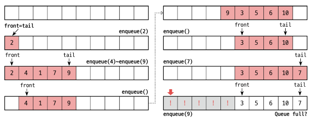
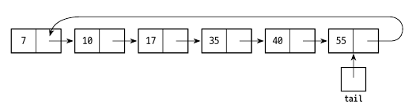

<div class="notice--danger">
    <b>'쉽게 배우는 자료구조 with 자바 (문병로)' 내용 중 일부입니다.</b>
</div>


# 큐

큐는 FIFO(First In First Out) 자료구조입니다. ADT 는 아래와 같습니다.

```
맨 끝에 원소를 추가한다.
맨 앞의 원소를 삭제하면서 알려준다.
맨 앞의 원소를 알려준다.
큐가 비어 있는지 확인한다.
큐를 깨끗이 비운다.
```


# 배열을 이용한 큐

먼저 큐를 위한 배열을 할당받습니다. 그리고 가장 먼저 들어온 인덱스를 front, 마지막 인덱스를 tail 로 설정합니다. tail 이 배열의 마지막으로 오면 가득 찬 걸로 간부합니다. 하지만 이렇게 할당했을 때 배열의 빈공간이 있음에도 가득 찬 걸로 여겨질 수 있습니다.


다음과 같은 구조에서 삽입과 삭제를 반복했을 때, tail 은 배열의 끝이지만 빈 공간이 있습니다. 따라서 front 나 tail 이 맨 끝으로 가면 그 다음은 0 으로 갈 수 있도록 **원형으로 모델링** 합니다.


## 배열 큐의 구현

먼저 인터페이스입니다.

```java
package datastructure.queue;

public interface QueueInterface<E>{
    void enqueue(E item);
    E dequeue();
    E front();
    boolean isEmpty();
    void dequeueAll();
}
```

다음은 구현 클래스입니다.

```java
package datastructure.queue.arrayqueue;

import datastructure.list.ArrayList.ArrayList;
import datastructure.queue.QueueInterface;

public class ArrayQueue<E> implements QueueInterface<E> {

    //저장 공간입니다.
    private E[] queue;
    //front, tail, numItems 선언
    private int front, tail, numItems;
    private static final int DEFAULT_CAPACITY = 64;

    public ArrayQueue(){
        queue = (E[]) new Object[DEFAULT_CAPACITY];
        front = tail = numItems = 0;
    }

    public ArrayQueue(int n){
        queue = (E[]) new Object[n];
        front = tail = numItems = 0;
    }

    @Override
    public void enqueue(E item) {
        if(isFull()) throw new RuntimeException("Queue is full");
        else{
            queue[tail] = item;
            tail = (tail + 1) % queue.length;
            numItems++;
        }
    }

    public boolean isFull(){
        return numItems == queue.length;
    }

    @Override
    public E dequeue() {
        if(isEmpty()) throw new RuntimeException("Queue is empty");
        else{
            E queueFront = queue[front];
            front = (front + 1) % queue.length;
            numItems--;
            return queueFront;
        }
    }

    @Override
    public E front() {
        if(isEmpty()) throw new RuntimeException("Queue is empty");
        else return queue[front];
    }

    @Override
    public boolean isEmpty() {
        return numItems == 0;
    }

    @Override
    public void dequeueAll() {
        queue = (E[]) new Object[DEFAULT_CAPACITY];
        front = tail = numItems = 0;
    }
}
```

enqueue, dequeue 시 `tail = (tail + 1) % queue.length;`, `front = (front + 1) % queue.length;` 로 할당합니다. 단순히 1 증가로는 원형 모델링이 안되기 때문입니다.

# 연결 리스트를 이용한 큐

연결리스트는 단방향, 양방향, 원형, 더미 헤드 노드 유무 등 다양한 선택지가 있습니다. 단방향 원형 연결리스트는 아래와 같습니다. 레퍼런스는 tail 만 있으면 됩니다.


Node 는 배열 리스트에서 사용한 클래스를 사용합니다.

```java
public class LinkedQueue<E> implements QueueInterface<E>{

    private Node<E> tail;

    public LinkedQueue(){
        tail = null;
    }

    @Override
    public void enqueue(E item) {
        //새 노드를 선언합니다.
        Node<E> newNode = new Node<>(item);
        //큐가 비어있다면 자기자신을 가리키게 합니다.
        if(isEmpty()){
            newNode.next = newNode;
            tail = newNode;
        }else {
            //새로운 노드의 next 에 tail 의 next 를 넣습니다.
            newNode.next = tail.next;
            //prevNode(tail) 의 next 를 newNode 로 지정합니다.
            tail.next = newNode;
            //tail 을 NewNode 로 변경합니다.
            tail = newNode;
        }
    }

    @Override
    public E dequeue() {
        if(isEmpty()) throw new RuntimeException("Queue is empty");
        else{
            Node<E> front = tail.next;
            if(front == tail) tail = null;
            else tail.next = front.next;
            return front.item;
        }
    }

    @Override
    public E front() {
        if(isEmpty()) throw new RuntimeException("Queue is empty");
        else return tail.next.item;
    }

    @Override
    public boolean isEmpty() {
        return tail == null;
    }

    @Override
    public void dequeueAll() {
        tail = null;
    }
}
```

`enqueue` 에서 큐 개수가 0 일때를 따로 구분합니다. tail.next 가 없기 때문입니다. 이 때 더미 헤드 노드를 사용한다면 따로 구분할 필요가 없겠습니다.

# 다른 클래스를 재사용한 큐

## 클래스 LinkedList 상속

연결 리스트를 이용한 큐는 앞서 만든 LinkedList<E> 의 내용과 많이 겹칩니다. 따라서 해당 클래스를 상속받아 재사용하면 구현에 드는 노력을 줄일 수 있습니다.

```java
package datastructure.queue.LinkedQueue;

import datastructure.list.linkedList.LinkedList;
import datastructure.queue.QueueInterface;

public class InheritedQueue<E> extends LinkedList<E> implements QueueInterface<E> {

    public InheritedQueue(){
        super();
    }

    @Override
    public void enqueue(E item) {
        append(item);
    }

    @Override
    public E dequeue() {
        return remove(0);
    }

    @Override
    public E front() {
        return get(0);
    }

    @Override
    public void dequeueAll() {
        clear();
    }
}
```


## ADT 리스트 사용

이번에는 ADT 리스트인 `ListInterface<E>` 를 필드로 받아서 큐를 구현해보겠습니다. 생성자를 통해 ArrayList 를 받고 있지만 LinkedList 를 받아도 무방합니다.

```java
package datastructure.queue.other;

import datastructure.list.ArrayList.ArrayList;
import datastructure.list.ArrayList.ListInterface;
import datastructure.queue.QueueInterface;

public class ListQueue<E> implements QueueInterface<E> {

    private ListInterface<E> list;

    public ListQueue(){
        list = new ArrayList<>();
    }

    @Override
    public void enqueue(E item) {
        list.append(item);
    }

    @Override
    public E dequeue() {
        return list.remove(0);
    }

    @Override
    public E front() {
        return list.get(0);
    }

    @Override
    public boolean isEmpty() {
        return list.isEmpty();
    }

    @Override
    public void dequeueAll() {
        list.clear();
    }
}
```


# 큐 응용 : 좌우동형 문자열 체크

​	좌우동형 문자열이란 문자열을 뒤집었을 때도 기존 문자열과 같은 문자열을 말합니다. (ex. 'abbcbba') 스택과 큐를 활용하면 해당 문자열이 좌우동형인지 체크할 수 있습니다. 물론 큐, 스택을 사용하지 않아도 체크할 수 있지만 연습한다고 생각하겠습니다.

​	임의의 문자열을 받으면 차례대로 스택과 큐에 동시에 저장합니다. 그리고 스택 또는 큐가 empty() 가 될 때까지 1개씩 빼면서 같은지 비교합니다. 읽어 들인 문자가 동일하면 계속 읽어 들이고, 동일하지 않으면 false 를 리턴합니다. while 문을 정상적으로 마쳤다면 true 를 리턴합니다.

```java
package datastructure.queue.other;

import datastructure.queue.LinkedQueue.LinkedQueue;

import java.util.Stack;

public class Palindrom {
    private static boolean isPalindrom(String A){
        Stack<Character> stack = new Stack<>();
        LinkedQueue<Character> queue = new LinkedQueue<>();
        
        for(int i = 0; i < A.length(); i++){
            stack.push(A.charAt(i));
            queue.enqueue(A.charAt(i));
        }
        
        while(!stack.isEmpty()){
            if(stack.pop() != queue.dequeue()) return false;
        }
        
        return true;
    }
}
```

