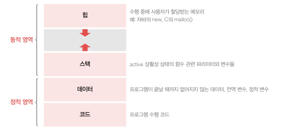
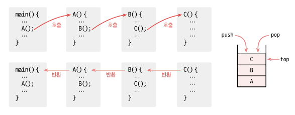
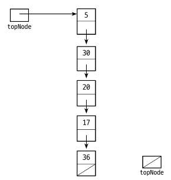

<div class="notice--danger">
    <b>'쉽게 배우는 자료구조 with 자바 (문병로)' 내용 중 일부입니다.</b>
</div>

# 스택

스택은 가장 뒤에 들어온 데이터가 가장 먼저 나가는 LIFO 형식입니다. 키보드의 입력과 삭제, 웹페이지 간 이동(뒤로가기, 앞으로가기) 등이 스택 구조라고 볼 수 있습니다. 

또한 다음과 같은 JVM 에서 가상 메모리 구조 중 스택 영역도 스택 메모리 형식입니다.


먼저 main() 메서드는 정적영역의 데이터 영역에 저장됩니다. 그리고 차례대로 호출되는 메서드는 나중에 들어간 메서드가 제일 먼저 끝나는 스택 구조입니다. 다음과 같습니다.



# 배열을 이용한 스택

배열을 이용한 스택은 배열 stack[0 ... n-1] 과 topIndex 를 가집니다. topIndex 의 값은 처음에는 원소가 없다는 의미로 -1 로 세팅합니다.

## 배열 구현

### 스택 인터페이스

```java
package datastructure.stack;

public interface StackInterface<E> {
    void push(E newItem);
    E pop();
    E top();
    boolean isEmpty();
    void popAll();
}
```

top() 은 peek() 입니다.

### 배열 스택 구현

전체적인 구조입니다.

```java
public class ArrayStack<E> implements StackInterface<E> {

    private E[] stack;
    private int topIndex;
    private static final int DEFAULT_CAPACITY = 64;

    public ArrayStack(){
        stack = (E[]) new Object[DEFAULT_CAPACITY];
        topIndex = -1;
    }

    @Override
    public void push(E newItem) {
        if(isFull()) throw new CustomException();
        stack[++topIndex] = newItem;
    }

    @Override
    public E pop() {
        if(topIndex == -1) throw new CustomException();
        return stack[topIndex--];
    }

    @Override
    public E top() {
        if(topIndex == -1) throw new CustomException();
        return stack[topIndex];
    }

    public boolean isFull(){
        return topIndex == stack.length - 1;
    }

    @Override
    public boolean isEmpty() {
        return topIndex == -1;
    }

    @Override
    public void popAll() {
        stack = (E[]) new Object[stack.length];
        topIndex = -1;
    }
}
```

- 필드로 E 타입을 가지는 배열, topIndex, DEFAULT_CAPACITY 가 있습니다.

간단하게 메서드를 쪼개서 보겠습니다.

### push()

```java
@Override
public void push(E newItem) {
    if(isFull()) throw new CustomException();
    stack[++topIndex] = newItem;
}
```

데이터 추가 메서드입니다. isFull 이면 Exception 을 던지고, 아니면 topIndex 에 1을 더하고 newItem 을 할당합니다.


### pop()

```java
@Override
public E pop() {
    if(topIndex == -1) throw new CustomException();
    return stack[topIndex--];
}
```

데이터를 빼내는 메서드입니다. topIndex 가 -1 이면 데이터가 없으므로 Exception 을 던지고, 아니면 topIndex 의 값을 리턴합니다. 이후 topIndex-- 를 합니다.

### top()

```java
@Override
public E top() {
    if(topIndex == -1) throw new CustomException();
    return stack[topIndex];
}
```

제일 위의 데이터를 확인하는 메서드입니다. opIndex 가 -1 이면 데이터가 없으므로 Exception 을 던지고, 아니면 topIndex 의 값을 리턴합니다.


### popAll()

```java
@Override
public void popAll() {
    stack = (E[]) new Object[stack.length];
    topIndex = -1;
}
```

모든 값을 꺼내고 stack 을 초기화 합니다. `topIndex = -1` 로 해도 초기화는 되지만, 각 배열의 참조값이 없어지지는 않습니다. 그렇게 되면 GC 가 작동하지 않아 메모리 낭비가 발생하므로 stack 배열까지 초기화해줍니다.

# 연결 리스트를 이용한 스택

연결리스트에서는 topNode 를 선언한 후에 제일 위의 Node 를 가리키면 됩니다. 각 노드는 자신의 밑에 있는 노드를 가리키고 있어야 합니다.


### 연결 리스트 스택 구현

```java
package datastructure.stack.linkedstack;

import datastructure.common.CustomException;
import datastructure.common.Node;
import datastructure.stack.StackInterface;

public class LinkedStack<E> implements StackInterface<E> {

    Node<E> topNode;

    public LinkedStack(){
        topNode = null;
    }

    @Override
    public void push(E newItem) {
        topNode = new Node<>(newItem, topNode);
    }

    @Override
    public E pop() {
        if(isEmpty()) throw new CustomException();
        Node<E> temp = topNode;
        topNode = topNode.next;
        return temp.item;
    }

    @Override
    public E top() {
        if(isEmpty()) throw new CustomException();
        return topNode.item;
    }

    @Override
    public boolean isEmpty() {
        return topNode == null;
    }

    @Override
    public void popAll() {
        topNode = null;
    }
}

```

- topNode 를 선언한 후 생성자에서 null 을 넣습니다.

### push()

```java
 @Override
public void push(E newItem) {
    topNode = new Node<>(newItem, topNode);
}
```

새로운 Node 를 만들고 그 노드의 next 값을 topNode 로 넣습니다. 그리고 topNode 를 새로운 노드로 변경해줍니다. 그러면 topNode 레퍼런스는 새로운 Node 를 가리키게 되고, 새로운 Node 의 next 는 이전의 topNode 를 가리키게 됩니다.

### pop()

```java
@Override
public E pop() {
    if(isEmpty()) throw new CustomException();
    Node<E> temp = topNode;
    topNode = topNode.next;
    return temp.item;
}
```

topNode 를 temp 에 임시로 저장해둡니다. 그리고 topNode 의 next 를 topNode 로 지정해줍니다. 임시로 저장해둔 temp 의 item 을 리턴합니다. 메서드가 끝나면 temp 은 없어지고 이전 topNode 는 GC 의 대상이 됩니다.

### popAll()

```java
 @Override
public void popAll() {
    topNode = null;
}
```

topNode 를 null 로 만들면 원래 topNode 의 참조값이 스택에서 없어지게 됩니다. 따라서 연쇄적으로 모든 객체가 GC 의 대상이 되어 삭제됩니다.


# 다른 클래스를 재사용한 스택

## 연결리스트를 상속

스택은 다른 컬렉션 타입의 리스트를 상속받아서 간단하게 구현할 수 있습니다. 5장에서 만든 LinkedList<E> 를 사용해서 만들어보겠습니다.

```java
package datastructure.stack.other;

import datastructure.common.CustomException;
import datastructure.list.linkedList.LinkedList;
import datastructure.stack.StackInterface;

public class InheritedStack<E> extends LinkedList<E> implements StackInterface<E> {

    public InheritedStack(){
        super();
    }

    @Override
    public void push(E newItem) {
        super.add(0, newItem);
    }

    @Override
    public E pop() {
        if(isEmpty()) throw new CustomException();
        return super.remove(0);
    }

    @Override
    public E top() {
        if(isEmpty()) throw new CustomException();
        return super.get(0);
    }

    @Override
    public void popAll() {
        super.clear();
    }
}
```

생성자는 super class 의 기본생성자입니다. 더미 헤드 노드가 있는 연결리스트입니다.

```java
public LinkedList(){
    numItems = 0;
    head = new Node<>(null, null);
}
```

나머지 메서드는 컬렉션과 비슷합니다. 저는 개인적으로 명확한 걸 좋아해서 super class 의 메서드면 super 를 붙였습니다만, 빼도 무방합니다.

## ADT 리스트 사용

이번에는 ADT 리스트를 이용하여 스택 클래스를 만들어보겠습니다. 필드는 list 하나이며 ListInterface<E> 를 상속받는 모든 구현체를 넣을 수 있습니다.

```java
package datastructure.stack.other;

import datastructure.list.ArrayList.ListInterface;
import datastructure.list.linkedList.LinkedList;
import datastructure.stack.StackInterface;

public class ListStack<E> implements StackInterface<E> {

    private ListInterface<E> list;

    public ListStack(){
        list = new LinkedList<>();
    }

    public ListStack(ListInterface<E> list){
        this.list = list;
    }

    @Override
    public void push(E newItem) {
        list.add(0, newItem);
    }

    @Override
    public E pop() {
        return list.remove(0);
    }

    @Override
    public E top() {
        return list.get(0);
    }

    @Override
    public boolean isEmpty() {
        return list.isEmpty();
    }

    @Override
    public void popAll() {
        list.clear();
    }
}
```

다 비슷한데요. pop, push 를 할 때 isEmpty() 체크를 하지 않았습니다. 어차피 ListInterface 를 구현하는 구현체에 예외처리가 다 되어있기 때문입니다. 또한 생성자 호출 시 ListInterface 구현체를 넣을 수 있게 해서 선택할 수 있도록 만들었습니다. (책에는 따로 없는 내용입니다. 문제점은 있지만 생성자 호출 시 주입한다는 개념만 봐주세요.)