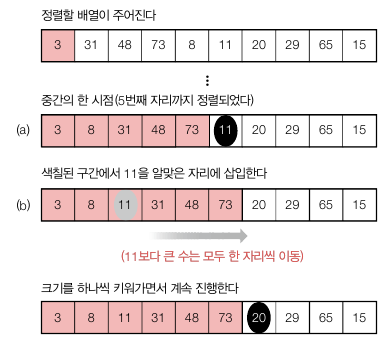

<div class="notice--danger">
    <b>'쉽게 배우는 자료구조 with 자바 (문병로)' 내용 중 일부입니다.</b>
</div>

# 정렬

​	정렬은 수행 시간에 따라 대략 세 그룹으로 나뉩니다. 여기서 특수 정렬은 원소들이 특수한 성질을 만족할 때 용됩니다


# 선택정렬

선택 정렬은 가장 큰 원소를 찾아서 제일 오른쪽으로 옮기는 작업을 반복하는 것입니다. 제일 작은 걸 찾은 뒤 왼쪽으로 옮겨도 결과는 같습니다.

```
selectionSort(A[0 ... n-1], n):
	for last <- n-1 downto 1
		A[0 ... last] 중 가장 큰 수 A[k] 를 찾는다
		A[k] <-> A[last]
```

선택정렬의 수행횟수는 n(n - 1)/2 로 시간복잡도는 모든 경우에 θ(n^2) 입니다.

```java
public void selectionSort(){
    int k;
    int tmp;
    for(int last = A.length - 1; last >= 1; last--){
        k = theLargest(last); //last 인덱스 이하에서 가장 값의 큰 인덱스 구하기
        tmp = A[k];
        A[k] = A[last];
        A[last] = tmp;
    }
}

private int theLargest(int last){
    int largest = 0;
    for(int i = 0; i <= last; i++){
        if(A[i] > A[largest]){
            largest = i;
        }
    }
    return largest;
}
```


# 버블 정렬

버블 정렬은 왼쪽부터 2개씩 비교해서 큰 수를 뒤로 보냅니다. 따라서 정렬이 한번 돌면 제일 오른쪽에 가장 큰 수가 됩니다. 

```
bubbleSort(A[], n):
	for last <- n-1 downto 1
		for i <- 0 to last-1
			if(A[i] > A[i+1])
				A[i] <-> A[i+1] 
```

​	버블 정렬은 선택 정렬보다 5배 정도 느린데, 한칸 이동할 때마다 계속해서 배열의 위치를 바꾸는 작업을 반복하기 때문입니다. 2번째 for loop 에서 원소 교환이 한번도 안일어났을 때를 체크한다면 대체로 빨라집니다. 원소 교환이 한번도 안일어났다는 뜻은 0 부터 last - 1 까지 정렬이 되었다는 뜻이기 때문입니다.

​	버블 정렬의 수행횟수도 선택정렬처럼 n(n - 1)/2 이기 때문에 시간복잡도는 θ(n^2) 입니다. for loop 에서 원소 교환 여부를 체크한다면 최선의 경우 시간복잡도는 θ(n) 가 됩니다.

```java
public void bubbleSort(){
    boolean swapped;

    for(int last = A.length - 1; last >= 2; last--){
        swapped = false;
        for(int i = 0; i <= last - 1; i++){
            if(A[i] > A[i + 1]){
                int tmp = A[i];
                A[i] = A[i + 1];
                A[i + 1] = tmp;
                swapped = true;
            }
            if(!swapped) break;
        }
    }
}
```


# 삽입 정렬

​	삽입 정렬은 버블, 선택 정렬과 정반대로 생각되는 정렬입니다. 삽입 정렬은 정렬된 배열의 크기를 1 에서 시작하여 하나씩 늘리는 정렬 방법입니다. 


위와 같이 삽입할 정렬 A[i + 1] 과 A[0...i] 를 비교하여 삽입할 위치를 찾아서 교환해줍니다.

```
insertionSort(A[], n):
	for i <- 1 to n-1
		A[0 ... i] 의 적합한 자리에 A[i] 를 삽입한다.
```

위 내용을 풀어서 써보겠습니다.

```
insertionSort(A[], n):
	for i <- 1 to n-1
	j <- i-1
	newItem <- A[i]
	while(0 <= j and newItem < A[j])
		A[j+1] <- A[j] //좌시프트
		j--
    A[j+1] <- newItem
```

​	삽입정렬은 최악의 경우와 평균인 상황에서  θ(n^2) 의 시간복잡도를 가집니다. 하지만 배열이 정렬되어있을 경우 while 문은 실행되지 않기 때문에  θ(n) 가 됩니다. 따라서 배열이 거의 정렬되어 있다면 삽입 정렬를 사용하는 것이 효과적입니다.

```java
public void insertionSort(){
    for(int i = 1; i < A.length - 1; i++){
        int location = i - 1;
        int tmp = A[i];
        while(location >= 0 && tmp < A[location]){
            A[location + 1] = A[location];
            location--;
        }
        A[location + 1] = tmp;
    }
}
```

