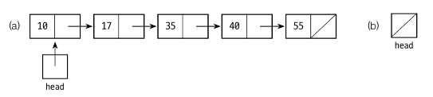
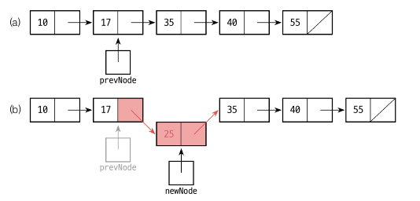
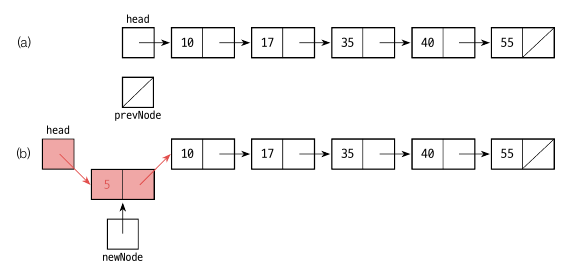
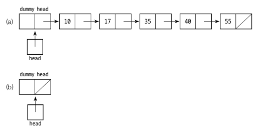
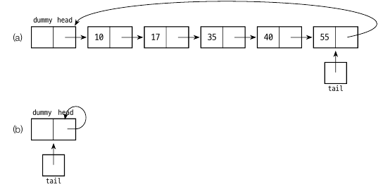
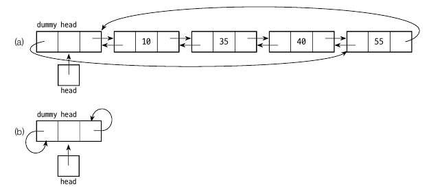

# 리스트

​	리스트란 '줄 세워져 있는 데이터' 또는 '죽 늘어선 데이터'를 의미합니다. 리스트를 관리하기 위한 작업은 다음과 같은 ADT 리스트로 대략 정리할 수 있습니다. 물론 개략적인 내용입니다. 

- i  번째 자리에 원소 x 를 삽입
- i 번째 원소를 삭제
- 원소 x 를 삭제
- i 번째 원소를 알려줌
- 원소 x 가 몇 번째인지 알려줌
- 리스트의 사이즈를 알려줌

​	리스트의 구현하는 방법은 대표적으로 두가지가 있습니다. 배열에 원소들을 쭉 배치하는 방법과 링크를 이용해 원소들을 연결하는 방법입니다. **배열을 이용한 리스트**는 가장 단순한 구현 방법으로 시작위치부터 빈자리 없이 자료를 순서대로 저장하므로 논리적인 순서와 물리적인 순서가 일치합니다. 하지만 충분한 공간을 확보해두어야 한다는 점과 공간 낭비가 있다는 점이 단점입니다. **연결 리스트**는 반대로 삽입, 삭제 연산 시에 논리적인 순서가 변경되어도 물리적인 순서는 변경되지 않습니다. 또한 원소가 추가될 때마다 공간을 할당받아 추가하는 동적 할당 방식으로 배열의 공간 낭비를 피할 수 있습니다.

# 배열 리스트

​	먼저 배열리스트를 구현해보겠습니다. 배열 리스트의 가장 대표적인 클래스는 ArrayList 지만 구현되는 코드가 완전히 일치하지는 않습니다.

- 필드 : item[] (저장 공간), newItems(원소의 개수)
- 메서드 : add(), append(), remove(), removeItem(), get(), set(), indexOf(), len(), isEmpty(), clear()

## add()

```
add(k, x):
	if(numItems >= item.length || k < 0 || k > numItems)
	/* error */
	else
		for i <- numItem-1 downto k
			item[i+1] <- item[i]
        item[k] <- x
        numItems++
```

`item[i+1] <- item[i]` 에서 모든 원소들은 오른쪽으로 한칸씩 밀어냅니다. 이때 제일 오른쪽 원소부터 밀어내야 합니다. 따라서 제일 오래걸리는 삽입은 맨 앞에 원소를 추가할 때 입니다.

## append()

```
append(x):
	if(numItems >= item.length)
	/* error */
	else
		item[numItems++] <- x
```

리스트의 맨 뒤에 원소를 추가하는 알고리즘입니다. add(numitems, x) 로 호출해도 되지만, 리스트 끝에 추가하는 작업은 잦기 때문에 따로 만들어줍니다.

## remove()

```
remove(k):
	if(isEmpty() || k < 0 || k > numItems-1)
	/* error */
	else
		for i <- k to numItems-2
			item[i] <- item[i+1]
        numItems--
```

k 번째 원소를 삭제하는 알고리즘입니다. k 번째 이후 원소들을 모두 좌시프트하면 삭제됩니다.

## removeItem()

```
removeItem(x):
	k <- 0
	while(k < numItems && item[k] ! = x)
		k++
    if(k == numItems) return false
    else
    	remove(k)
    	return true
```

특정 원소 x 를 삭제하는 알고리즘입니다. 삭제하려는 x 의 인덱스를 찾아서 remove() 와 같은 방식으로 삭제합니다.

## get()

```
get(i):
	if(i >= 0 && numItem-1)
		return item[i]
    else
    	return OUT_OF_BOUND
```

배열에서 i 번째 원소를 반환합니다. 범위 밖이라면 OUT_OF_BOUND 를 리턴합니다.

## set()

```
set(i, x):
	if(i >= 0 && i <= numItems-1)
		item[i] <- x
    else
    	/* error */
```

i 번째 원소를 x 로 대체합니다.


## indexOf()

```
indexOf(x):
	i <- 0
	while(i < numItems && item[i] != x)
		i++
    if(i = numItems)
    	return NOT_FOUND
    else
		return i
```

x 가 리스트 몇 번째 원소인지 반환합니다. 첫 번째 요소부터 비교하여 찾아냅니다.

## len(), isEmpty(), clear()

```
len():
	return numItems
	
isEmpty():
	if(numItems = 0)
		return true
    else
    	return false
    	
clear():
	numItems <- 0
```


## ArrayList 구현

**Interface**

​	이제 알고리즘을 구현해보겠습니다. 먼저 인터페이스를 만들고 List 를 구현하겠습니다.

```java
public interface ListInterface<E>{
	public void add(int i, E x);
	public void append(E x);
	public E remove(int i);
	public boolean removeItem(E x);
	public E get(int i);
	public void set(int i, E x);
	public int indexOf(E x);
	public int len();
	public boolean isEmpty();
	public void clear();
}
```

**ArrayList**

```java
package ArrayList;

public class ArrayList<E> implements ListInterface<E>{

    private E item[];
    private int numItems;
    private static final int DEFAULT_CAPACITY = 64;

    public ArrayList(){
        item = (E[]) new Object[DEFAULT_CAPACITY];
        numItems = 0;
    }

    public ArrayList(int n){
        item = (E[]) new Object[n];
        numItems = 0;
    }


    @Override
    public void add(int index, E x) {
        if(numItems >= item.length || index < 0 || index > numItems){
            throw new CustomException();
        }else{
            for(int i = numItems - 1; i >= index; i--){
                item[i + 1] = item[i];
            }
            item[index] = x;
            numItems++;
        }
    }

    @Override
    public void append(E x) {
        if(numItems >= item.length){
            throw new CustomException();
        }else{
            item[numItems++] = x;
        }

    }

    @Override
    public E remove(int index) {
        if(isEmpty() || index < 0 || index > numItems - 1){
            throw new CustomException();
        }else{
            E temp = item[index];
            for(int i = index; i <= numItems - 2; i++){
                item[i] = item[i + 1];
            }
            numItems--;
            return temp;
        }
    }

    @Override
    public boolean removeItem(E x) {
        int k = 0;
        while(k < numItems && ((Comparable) item[k]).compareTo(x) != 0){
            k++;
        }
        if(k == numItems){
            return false;
        }else{
            for(int i = k; i <= numItems - 2; i++){
                item[i] = item[i + 1];
            }
            numItems--;
            return true;
        }
    }

    @Override
    public E get(int index) {
        if(index >= 0 && index < numItems){
            return item[index];
        }else{
            throw new CustomException();
        }
    }

    @Override
    public void set(int index, E x) {
        if(index >= 0 && index < numItems){
            item[index] = x;
        }else{
            throw new CustomException();
        }

    }

    @Override
    public int indexOf(E x) {
        for(int i = 0 ; i < numItems; i++){
            if(((Comparable) item[i]).compareTo(x) == 0){
                return i;
            }
        }
        return -1;
    }

    @Override
    public int len() {
        return numItems;
    }

    @Override
    public boolean isEmpty() {
        return numItems == 0;
    }

    @Override
    public void clear() {
        item = (E[]) new Object[DEFAULT_CAPACITY];
        numItems = 0;
    }
}
```

​	알고리즘을 구현한 ArrayList 클래스입니다. 중간에 `indexOf` 와 `removeItem` 에 `((Comparable) item[i]).compareTo(x) == 0` 라고 사용한 부분이 있습니다. java.util.ArrayList 는 이 부분을 `equals` 로 구현하고 있습니다. `compareTo` 를 사용하면 주소값이 다르더라도 비교하려는 대상이 같으면 `0` 을 리턴할 수도 있습니다. 하지만 해당 클래스가 `Comparable` 을 상속해야 합니다.

​	반면 `equals` 는 `Object` 의 메서드로 모든 클래스에서 구현가능합니다. 하지만 클래스의 내용이 똑같아도 주소값이 다르다면 false 를 리턴합니다.

```java
import java.util.*;
import java.util.stream.Collectors;

public class Main implements Comparable<Main>{

    int size;

    public Main(int size){
        this.size = size;
    }

    public int add(int n) {
        return n + size;
    }

    @Override
    public int compareTo(Main o) {
        return Integer.compare(this.size, o.size);
    }

    public static void main(String[] args) {

        Main main = new Main(3);
        Main main2 = new Main(3);
        Main main3 = main;
        System.out.println(main.compareTo(main2) == 0); //true
        System.out.println(main.equals(main2)); //false
        System.out.println(main.equals(main3)); //true

        Integer a = 1000;
        Integer b = 1000;

        System.out.println(a.equals(b)); //true

    }
}
```

- 여기서 main 과 main2 는 내용물(size) 는 같지만 reference 자체가 다르므로 `equals` 에서 false 입니다. 하지만 `compareTo` 메서드의 구현체는 size 를 비교하므로 true(0) 이 나옵니다.
- main 과 main3 는 reference 가 같으므로 `equals` 에서 true 가 나옵니다.
- Integer 는 주소값이 다르지만 Primitive 로 바뀌면서 true 가 나옵니다.

즉, 다른 주소값이더라도 비교가 가능하도록 만들고 싶으면 `CompareTo` 를 사용하면 됩니다. 하지만 ArrayList 에 단순히 Wrapper 클래스만 넣을거면 `equals` 로도 충분히 값 비교가 가능합니다.


# 연결 리스트

​	연결 리스트는 원소가 추가될 때마다 공간을 할당받아 추가하는 방식으로, 배열의 공간 낭비를 피할 수 있는 자료구조입니다. 연결 리스트의 노드는 item 과 다음 노드를 가리키는 next 로 구성됩니다. item 은 Primitive type 이나 클래스 객체가 될 수 있습니다. next 는 다음 노드를 가리키는 링크입니다. 

​	연결리스트의 기본 형태는 아래와 같습니다.



첫 번째 노드를 가리키는 reference 인 head 가 있으며 나머지 노드는 첫 번째 노드에서 링크를 따라 접근합니다. 마지막 노드의 링크는 null 값을 할당합니다. 만약 빈 리스트이면 head 가 null 값입니다.

​	연결 리스트에 대한 접근은 첫번째 노드부터 시작합니다.  링크가 쭉 이어져있어서 삽입, 삭제, 조회 등 거의 모든 작업에서 첫 번째 노드를 거쳐갑니다.

## 삽입

```
newNode.item <- x
newNode.next <- prevNode.next
prevNode.next <- newNode
numItems++
```

- 먼저 x 값을 newNode.item 에 넣습니다. 

- newNode.next 값에 prevNode 의 next 값을 넣습니다. 중간에 끼어들기 때문입니다.

- prevNode.next 값은 newNode 입니다.

  

  

하지만 다음과 같이 맨앞에 노드를 삽입할 경우에는 prevNode 가 없기 때문에 따로 만들어줘야 합니다.



```
if(k = 0)
	newNode.item <- x
	newNode.next <- head
	head <- newNode
	numItems++
else
	(원래 삽입문)
```

- x 값을 newNode.item 에 넣습니다.
- head 에 있는 다음 값을 newNode.next 에 넣습니다.
- head 값을 newNode 로 변경해줍니다.

리스트의 맨 앞에 더미 헤드 노드를 두면 두가지 경우로 나누지 않아도 됩니다. 더미 헤드 노드는 원소가 들어 있지 않은 가짜 노드입니다.



이렇게 하면 항상 prevNode 가 있기 때문에 k = 0 일 경우를 고려하지 않아도 됩니다.

## 삭제

삭제도 마찬가지로 더미 헤드 노드가 있다고 가정하고 만들겠습니다. 특정 원소가 삭제되면 이전 노드의 next 가 한단계 건너뛴 노드를 가리키면 됩니다.

```
prevNode.next <- prevNode.next.next
numItems--
```


## 조회

조회도 마찬가지로 더미 헤드 노드가 있다고 가정하겠습니다. 노드의 인덱스는 0 ~ numItems-1 이지만 -1 은 더미 헤드라고 보겠습니다.

```
get(k):
	return getNode(k).item
	
getNode(k):
	if(k >= -1 && k <= numItems - 1)
		currNode <- head
		for <- 0 to k
			currNode <- currNode.next
		return currNode
    else return null /* error */
```

- get(k) 는 getNode(k) 를 호출합니다.
- getNode(k) 는 k 번째 node 를 리턴합니다.
- k = -1 이면 for loop 를 타지 않기 때문에 head 가 리턴됩니다. head 는 더미 헤드 노드입니다.
- for loop 에서 k 까지 계속해서 nextNode 를 탐색합니다.

## len(), isEmpty(), clear()

```
len():
	return numItems
	
isEmpty():
	if(numItems = 0)
		return true
    else
    	return false

clear():
	newNode.next <- null //dummy head node 로 만들 newNode
	head <- newNode
	numItems <- 0
```


> 객체지향적으로 Node 클래스를 만들기 위해선 item, next 에 접근하지 못하게 하고 getter 와 setter 를 사용해야 바람직합니다.

## 연결리스트 구현

먼저 연결리스트를 위한 Node 클래스입니다.

```java
package linkedList;

public class Node<E> {
    public E item;
    public Node<E> next;

    public Node(E newItem){
        item = newItem;
        next = null;
    }

    public Node(E newItem, Node<E> node){
        item = newItem;
        next = node;
    }
}
```

인터페이스는 배열 리스트에서 쓰던 인터페이스입니다.

```java
package linkedList;

import ArrayList.CustomException;
import ArrayList.ListInterface;

public class LinkedList<E> implements ListInterface<E>{

    private Node<E> head;
    private int numItems;

    public LinkedList(){
        numItems = 0;
        head = new Node<>(null, null);
    }

    @Override
    public void add(int index, E item) {
        if(index >= 0 && index <= numItems){
            Node<E> prevNode = getNode(index - 1);
            Node<E> newNode = new Node<>(item, prevNode.next);
            prevNode.next = newNode;
            numItems++;
        }
    }

    @Override
    public void append(E item) {
        Node<E> prevNode = head;
        while(prevNode.next != null){
            prevNode = prevNode.next;
        }
        Node<E> newNode = new Node<>(item, null);
        prevNode.next = newNode;
        numItems++;
    }

    @Override
    public E remove(int index) {
        if(index >= 0 && index <= numItems){
            Node<E> prevNode = getNode(index - 1);
            Node<E> currNode = prevNode.next;
            prevNode.next = prevNode.next.next;
            numItems--;
            return currNode.item;
        }else return null;
    }

    @Override
    public boolean removeItem(E item) {
        Node<E> currNode = head;
        Node<E> prevNode;
        for(int i = 0; i < numItems; i++){
            prevNode = currNode;
            currNode = currNode.next;
            if(((Comparable)(currNode.item)).compareTo(item) == 0){
                prevNode.next = currNode.next;
                numItems--;
                return true;
            }
        }
        return false;
    }

    @Override
    public E get(int index) {
        if(index >= 0 && index <= numItems){
            return getNode(index).item;
        }else return null;
    }

    @Override
    public void set(int index, E item) {
        if(index >= 0 && index <= numItems){
            getNode(index).item = item;
        }else{
            throw new CustomException();
        }

    }

    @Override
    public int indexOf(E item) {
        int i = 0;
        Node<E> currNode = head;
        for(i = 0; i < numItems; i++){
            currNode = currNode.next;
            if(((Comparable)(currNode.item)).compareTo(item) == 0) return i;
        }
        return -1;
    }

    @Override
    public int len() {
        return numItems;
    }

    @Override
    public boolean isEmpty() {
        return numItems == 0;
    }

    @Override
    public void clear() {
        numItems = 0;
        head = new Node<>(null, null);

    }

    private Node<E> getNode(int index){
        if(index >= -1 && index <= numItems - 1){
            Node<E> currNode = head;
            for(int i = 0; i <= index; i++){
                currNode = currNode.next;
            }
            return currNode;
        }else return null;
    }
}

```


# 배열 리스트와 연결리스트 비교

1. 배열 리스트는 고정된 크기를 지니고 있고, 연결 리스트는 원소가 들어오는 대로 공간을 할당받습니다.
2. 배열리스트는 연속된 공간에 저장하기 때문에 정렬이나 인덱스로 찾을 때 연결리스트보다 빠릅니다. k 번째 값을 찾을 때 배열리스트는 θ(1), 연결리스트는 θ(k) 의 시간복잡도를 가집니다.
3. 연결리스트는 다음 원소 링크를 위한 공간이 추가로 필요합니다. 다만 배열리스트는 공간을 미리 확보해야 하기 떄문에 공간 낭비가 불가피합니다.
4. 리스트에서 어떤 원소를 찾는 작업을 검색이라고 합니다. 리스트의 원소가 규칙이 없다면 둘 다 θ(n) 의 시간이 듭니다. 하지만 크기순으로 정렬된 경우라면 배열리스트는 최악의 경우에도 θ(log n) 이 걸리는 반면(이진 탐색 알고리즘 사용 시) 연결리스트는 최악과 평균 모두 θ(n) 의 검색 시간이 듭니다.
   

# 연결리스트 확장

## 원형 연결 리스트

연결 리스트에서 마지막 노드에 대한 접근성이 떨어지기 때문에, 마지막 노드가 첫번째 더미 노드를 링크하도록 합니다. 이런 구조의 연결 리스트를 원형 연결 리스트라고 합니다. 



reference tail 은 마지막 노드를 가리킵니다. 따라서 마지막 노드 삽입 시 tail 만 따라가면 되므로 θ(1) 시간이 듭니다. 제일 앞에 노드를 삽입할 때에는 마지막노드의 next 값이 head 값이므로 tail.next.next 값을 변경해주면 됩니다. 

생성자와 append 만 간단하게 보겠습니다.

```java
public class CircularLinkedList<E> implements ListInterface<E>{
	private Node<E> tail;
	private int numItems;
	
	public CircularLinkedList(){
		numItems = 0;
		tail = new Node(-1);
		tail.next = tail;
	}
	
	public void append(E x){
		Node<E> prevNode = tail;
		Node<E> newNode = new Node(x, tail.next);
		prevNode.next = newNode;
		tail = newNode;
		numItems++;
	}
}
```


## 양방향 연결 리스트

양방향 연결 리스트는 각 노드가 다음 노드뿐만 아니라 직전 노드에 대한 링크도 가지고 있습니다. 리스트에서 마지막 원소의 next 가 더미 헤드 노드를 가리키고, 헤드노드의 prev 가 마지막 노드를 가리킵니다.



**BidirectionalNode**

```java
package bidirection;

public class BidirectionalNode<E> {
    public BidirectionalNode<E> prev;
    public E item;
    public BidirectionalNode<E> next;
    
    public BidirectionalNode(){
        prev = next = null;
        item = null;
    }
    
    public BidirectionalNode(E newItem){
        prev = next = null;
        item = newItem;
    }
    
    public BidirectionalNode(BidirectionalNode<E> prevNode, E newItem, BidirectionalNode<E> nextNode){
        prev = prevNode;
        item = newItem;
        next = nextNode;
    }
}
```

**CircularDoublyLinkedList**

생성자와 add 메서드만 보겠습니다.

```java
public class CircularDoublyLinkedList<E> implements ListInterface<E>{

    private BidirectionalNode<E> head;
    private int numItems;
    
    public CircularDoublyLinkedList(){
        numItems = 0;
        head = new BidirectionalNode<>(null);
        head.prev = head.next = head;
    }
      
    @Override
    public void add(int index, E x) {
        if(index >= 0 && index <= numItems){
            BidirectionalNode<E> prevNode = getNode(index - 1);
            BidirectionalNode<E> newNode = new BidirectionalNode<>(prevNode, x, prevNode.next);
            prevNode.next.prev = newNode;
            prevNode.next = newNode;
            numItems++;
        }else{
            throw new CustomException();
        }
    }
}
```

