<div class="notice--danger">
    <b>'쉽게 배우는 자료구조 with 자바 (문병로)' 내용 중 일부입니다.</b>
</div>

# 균형 검색 트리란

​	이진 검색 트리는 검색, 삽입, 삭제에 평균 θ(logn) 시간이 소요되지만 노드가 한쪽으로 치우져있으면 θ(n) 이 될 수도 있습니다. 따라서 균형 이진 검색 트리를 만들어서 작업들이 항상 θ(logn) 를 만족하도록 할 수 있습니다. 

# AVL 트리

​	AVL 트리는 Adelson-Velskii 와 Landis 가 고안한 트리로 이진 검색 트리가 항상 균형을 유지하도록 운영하는 대표적인 예시입니다. 트리 내 어떤 노드도 좌서브 트리와 우서브 트리의 높이 차가 1보다 크지 않은 상태로 유지되는 이진 검색 트리입니다. 다음은 AVL 트리와 AVL 트리가 아닌 트리의 예시입니다.

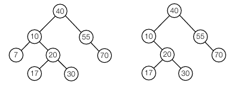

AVL 트리의 노드는 item, left, right 와 함께 트리의 높이인 height 가 있습니다. height 는 그 노드를 루트로 하는 서브 트리의 높이입니다. 

​	만약 AVL 의 균형이 깨진다면 즉시 수선 과정으로 들어가게 됩니다. 균형이 깨지는 경우는 하나의 서브트리가 깨질 수도 있고, 두개 이상의 서브트리가 깨질 수도 있습니다. 두 개 이상의 서브트리가 깨지는 경우에는 부모-자식 노드로 관계성이 있습니다. 아래와 같이 35 삽입 후 10 의 서브트리와 40 의 서브트리가 깨졌습니다.

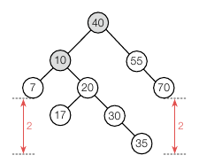

위 상태를 해결하는 방법이 좌회전 또는 우회전으로 깨진 노드를 기준으로 회전하는 것입니다. 다음 그림은 위 트리를 좌회전 시킨 경우입니다.

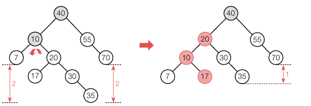

20 이 10 자리로, 10이 20 의 좌서브 트리로 들어갔습니다. 20 의 원래 좌서브 트리인 17 은 10 의 우서브트리로 들어갔습니다. 하지만 아래와 같이 한번의 회전으로 되지 않는 경우도 있습니다.


AVL 균형이 깨진 노드는 40 이지만 우회전으로 해소되지 않았습니다. 20 의 좌서브트리(17)의 깊이는 2, 우서브트리(37) 의 깊이는 3인데 여기서 우회전을 하면 우서브트리(37)는 그대로 기준노드의 좌서브트리가 되면서 깊이가 유지되는 반면, 좌서브트리(17) 는 깊이가 1 줄어들기 때문입니다. 

​	즉, 기준노드(40)를 우회전해야하는데, 좌서브트리(20) 의 왼쪽의 깊이가 깊으면 LL, 오른쪽의 깊이가 깊으면 LR 서브트리라고 합니다. 현재는 기준노드(40) 의 좌서브트리(20) 의 자식 노드 중 37 의 깊이가 3 으로 더 깊으니 LR 서브트리입니다. 반대로 자식노드 중 왼쪽의 깊이가 깊으면 LL 서브트리입니다. 먼저 이 기준노드(40) 에 대해 좌서브트리(20) 의 왼쪽 노드가 더 깊은 LL 서브트리를 만들어야만 우회전을 했을 때 AVL 균형이 유지됩니다. 이를 위해서 20 을 기준으로 좌회전을 해야 합니다. 아래와 같습니다.

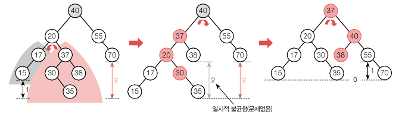

반면 LL 타입은 아과 같이 한번의 회전으로 균형이 해결됩니다.

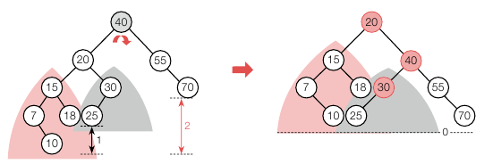

기준 노드의 우서브 트리가 더 깊은 상태에서 균형이 깨졌으면 좌회전을 해야 하는데 이때도 똑같이 RR 서브 트리이면 그대로 회전하면 되고, RL 서브 트리면 우회전을 한 번 한 후에 좌회전을 해야 합니다. RL 유형은 아래와 같습니다.

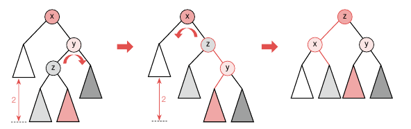

알고리즘은 아래와 같습니다.

```
좌회전(t): //t : 회전의 중심 노드
    RChild <- t.right
    RLChild <- RChild.left
    RChild.left <- t
    t.right <- RLChild
    RChild.height <- max(RChild.right.height, RChild.left.height) + 1
    t.height <- max(t.right.height, t.left.height) + 1

우회전(t):
	LChild <- t.left
    LRChild <- LChild.right
    LChild.left <- t
    t.right <- LRChild
    LChild.height <- max(LChild.right.height, LChild.left.height) + 1
    t.height <- max(t.right.height, t.left.height) + 1
    
balanceAVL(t, type):
	switch type:
        case LL: 우회전(t)
        case LR: 좌회전(t.left)
        		balanceAVL(t, LL)
        case RR: 좌회전(t)
        case RL: 우회전(t.right)
        		balanceAVL(t, RR)
```


# 레드-블랙 트리

 	RB 트리는 레드와 블랙 두 색을 사용해서 균형을 맞추는 트리입니다. RB 는 우선 null 리프 노드를 가정합니다. 통상적인 리프 노드 다음에 null 리프 노드가 한 층 더 있다고 가정합니다. RB 트리는 모든 노드에 다음과 같은 성질을 만족하도록 색을 칠합니다.
 	
 	1. 루트는 블랙입니다.
 	1. 모든 리프노드는 블랙입니다.
 	1. 루트로부터 임의의 리프 노드에 이르는 경로에 레드 노드 2개가 연속으로 출현하지 못합니다.
 	1. 루트 노드에서 임의의 리프 노드에 이르는 경로에서 만나는 블랙 노드의 수는 모두 같습니다.

아래와 같이 왼쪽 트리는 오른쪽과 같이 표현할 수 있습니다.

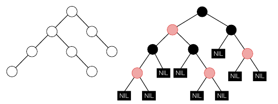

## 레드-블랙 트리 수선

검색 방법은 이진 검색과 같으므로 생략하고, 삽입이나 삭제 후 트리를 수선해야 할 때의 방법을 확인해보겠습니다. RB 트리에서 노드를 삽입할 때에는 먼저 새 노드를 레드로 칠한 후 삽입합니다. 삽입은 이진 검색 트리처럼 항상 리프 노드 쪽에 매달리게 되며 부모 노드의 색에 따라서 결정됩니다. 이 때 발생할 수 있는 case 는 다음과 같습니다. x 는 삽입 노드, p 는 부모노드, s 는 부모의 형제노드입니다. 그리고 p2 는 p 의 부모노드입니다.

| Case    | p     | s                | x                |
| ------- | ----- | ---------------- | ---------------- |
| case0   | black | *no matter what* | *no matter what* |
| case1   | red   | red              | *no matter what* |
| case2-1 | red   | black            | right node of p  |
| case2-2 | red   | black            | left node of p   |

**case 0** 은 부모노드인 p 가 블랙일 때입니다. 이때 x 는 레드이므로 RB 트리에 만족합니다.

**case 1** 는 p 와 s 의 색상을 블랙으로 바꾸고 p2 를 레드로 바꿉니다. 이 때 p2 가 RB 트리에 만족하지 않는다면 재귀적으로 다시 올라가야 합니다. 만약 p2 가 루트라면 다시 블랙으로 변경합니다.

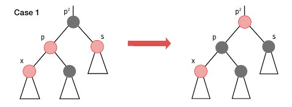

**case 2-1** 은 x 가 p 의 우측 노드일 때입니다. p 를 중심으로 좌회전하여 case2-2 로 변환하여 해결합니다. 여기서 p2 를 우회전한다면 각 서브 노드별 높이가 2 이상 차이가 나게 되는데, RB 트리의 4번 속성을 만족하지 못하게 됩니다.

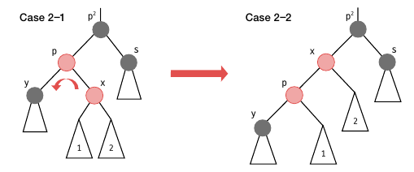

case 2-2 는 x 가 p 의 좌측 노드일 때입니다. p2 를 기준으로 우회전해줍니다. 그리고 p 와 p2 의 색상을 맞바꿉니다.

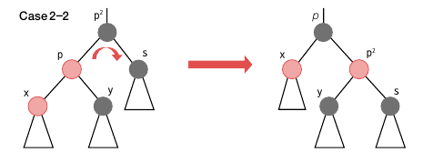

## 시간 복잡도

​	RB 트리는 최악의 경우에도 깊이가 O(logn) 으로 제한됩니다. 이상적인 트리의 깊이는 대략 logn 입니다. 그러므로 특성 4번에 의해 루트에서 임의의 리프 노드에 이르는 경로에 존재하는 블랙 노드의 개수는 logn 개를 넘을 수 없습니다. 한쪽에 몰리면 다른쪽은 블랙 노드개수가 부족해질테니까요. 또한 레드 노드의 개수는 특성 3번에 의해 블랙노드의 개수를 넘을 수 없습니다. 따라서 가장 긴 경로라고 해도 블랙 노드 + 레드 노드의 숫자는 2logn 을 넘길 수 없으므로 깊이는 O(logn) 으로 제한됩니다.

​	검색은 당연히 O(logn) 이고, 삽입과 삭제도 O(logn) 시간이 보장됩니다. case 0, case 2-1, case 2-2 는 상수 시간안에 완료됩니다. case 1 은 case 1 을 재귀적으로 호출하므로 최악의 경우에도 작업을 O(logn) 번하면 됩니다.


# B-트리

​	B-트리는 디스크에 색인을 두고 검색하는 외장 검색 트리이며, 분기의 수가 2개가 넘는 다진 검색 트리로, 합쳐서 **외장 다진 검색 트리**라고 합니다. 분기의 수가 2개가 넘는 이유는 디스크에서 페이지(블록) 단위로 메모리로 가져와서 찾고자하는 주소값을 확인하기 때문입니다. 어차피 페이지 단위로 가져올거면 해당 페이지에 넣을 수 있을만큼 노드를 넣는 것입니다. 이진 검색 트리처럼 2개의 노드만 가져오는 건 불가능하고, 가져온다하더라도 디스크에서 메모리로 가져오는 시간이 크기 때문에 페이지 단위로 한번에 가져와서 메모리에서 찾는 시간이 더 빠릅니다.

​	각 노드는 아래와 같은 구조를 가집니다. 
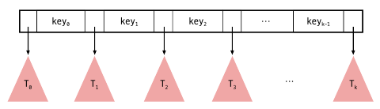

각 노드는 찾고자 하는 대상이 되는 key 값을 가지며 각각 키값 사이에 서브 노드인 Ti 가 있습니다. Ti 도 key 값을 가지고 있는데, 해당 값은 key(i-1) < Ti 의 key 값 < key(i) 가 됩니다. B-트리는 다음 성질을 만족해야 합니다.

1. 루트를 제외한 모든 노드는 k/2 ~ k 개의 키를 갖습니다.
2. 모든 리프 노드는 같은 깊이를 가집니다.

각각의 키는 검색 키와 일치했을 때 해당 키를 가진 레코드에 접근할 수 있는 페이지 번호가 같이 있어야 합니다. 또한 부모 노드의 레퍼런스도 필요합니다. 이를 반영한 B-트리의 노드 구조는 아래와 같습니다.
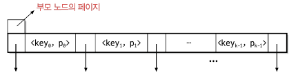

​	예를 들어 디스크의 한 블록이 4,096바이트이고, 키의 크기가 16바이트, 페이지 번호가 4바이트라면 각 블록은 최대 170개의 키를 가질 수 있고, B-트리는 85 ~ 170개의 키를 가져야 합니다. 이렇게 블록의 크기와 노드의 크기를 일치시키는 이유는 디스크에서 정보를 읽어올 때 블록 단위로 읽어오기 때문에 최대한 효율을 높이기 위해서입니다.

​	만약 노드가 10억개일 때 이진 검색 트리의 경우 깊이가 30 정도 됩니다. 따라서 최악의 경우 디스크를 30번 읽어야 일치하는 키값을 찾을 수 있습니다. 반대로 한 노드에서 1000개의 분기가 가능할 경우 트리의 깊이는 4 입니다. 따라서 4번만 읽는다면 키값을 찾을 수 있습니다. 위에서 서술했듯이 메모리에서 1000개 중에 일치하는 키값을 찾는 시간이 디스크에서 블록을 읽어오는 시간보다 훨씬 빠르기 때문에 최대한 분기를 나누는 것입니다.

## B-트리 알고리즘

**검색**

키 x 에 대한 검색은 기본적으로 이진 검색 트리와 같은 알고리즘입니다. 

**삽입**

B-트리에서 키 x 에 대한 삽입은 개략적으로 다음과 같은 과정으로 진행됩니다.

1. x 를 삽입할 리프 노드 r 을 찾습니다.
2. r 에 공간 여유가 있으면 키를 삽입하고 끝냅니다.
3. r 에 여유가 없으면 형제 노드에 공간의 여유가 있는지 살펴본다. 형제 노드에 여유가 있으면 키를 하나 넘깁니다. 그리고 부모노드에서의 키도 수정합니다.
4. 형제 노드에 여유가 없으면 노드를 2개로 분라한다. 분리 작업은 부모 노드로 키를 하나 넘기는 작업을 포함합니다.

**삭제**

1. x 를 키로 갖고 있는 노드를 찾습니다.
2. 이 노드가 리프 노드가 아니면 x 직후 원소 y 를 가진 리프 노드 r 을 찾아서 x 와 y 를 바꿉니다. 이때 직후 노드는 반드시 리프 노드에 있습니다.
3. 리프 노드 r 에서 x 를 제거합니다.
4. x 제거 후 노드에 언더플로우가 발생하면 형제 노드로부터 키를 받거나 부모 노드와 병합하는 방식으로 해소합니다.

## 시간 복잡도

​	B-트리에서 노드가 최대 d 개의 자식을 가질 수 있다면 B-트리의 깊이는 밑을 b 로 하는 logn 입니다. 따라서 높이는 점근적으로 O(logn) 이 되며 B 트리의 검색 시간도 O(logn) 입니다. 삽입과 삭제 자체는 상수 시간이지만 오버플로우, 언더플로우를 처리하는 데 최악의 경우 O(logn) 의 시간이 소요됩니다.