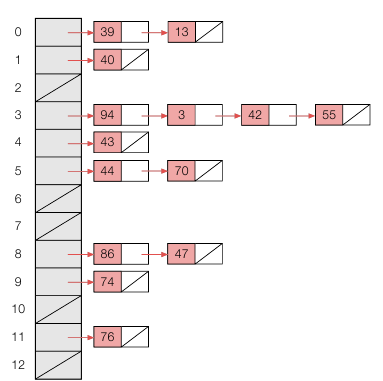
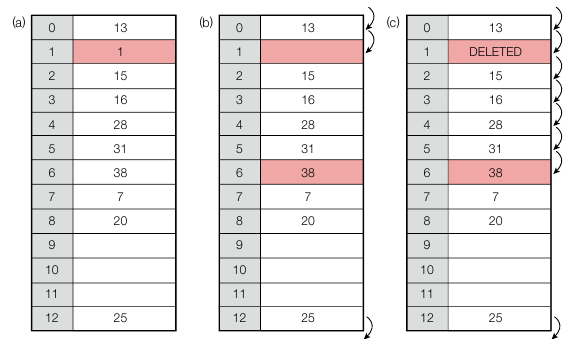
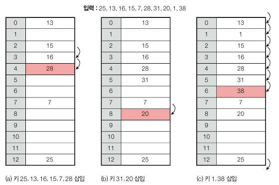
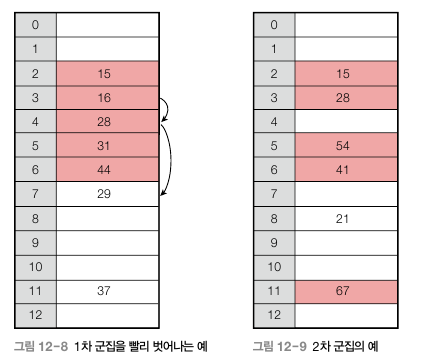

<div class="notice--danger">
    <b>'쉽게 배우는 자료구조 with 자바 (문병로)' 내용 중 일부입니다.</b>
</div>

# 해시 테이블

​	지금까지의 자료구조는 키를 검색, 삽입, 삭제 중 하나 이상은 평균 θ(n) 시간이 소모되었고, 검색 트리로도 평균 θ(logn) 의 시간이 걸렸습니다. 하지만 해시 테이블은 자료 검색, 삽입, 삭제에 평균 θ(1) 의 극단적 효율에 다다른 자료구조입니다. 검색 트리는 기본적으로 키 간의 비교 연산을 기본으로 했다면 해시 테이블은 키 자신의 값에 따라 자리가 결정됩니다.

​	임의의 키를 해시 테이블에 저장하려면 먼저 해당 키의 해시값을 계산해야 합니다. 해시값은 해시 함수에 의해 계산되는데 해시테이블이 총 m 개의 키를 저장할 수 있다면 테이블의 각 자리를 [0, m-1] 의 주소값으로 두고 해시값이 나오도록 만들면 됩니다. 예를 들어 총 5개의 키를 저장할 수 있다면 키값을 5 로 나눈 나머지를 해시값으로 사용할 수 있을 것입니다.

​	하지만 해시 테이블의 중요한 장애물은 같은 해시값을 가지는 '**충돌**' 입니다. 2 와 7 은 5 로 나눈 나머지가 같기 때문에 동시에 저장될 수 없습니다. 이러한 충돌 처리는 해시 테이블 이론의 핵심입니다.

​	또한 해시 테이블의 원소가 차 있는 비율은 해시 테이블 성능에 중요한 영향을 미치는데, 이 비율을 적재율이라고 합니다. 크기가 5 인 해시 테이블 중 1, 3 값에 키가 저장되어있으면 적재율은 2/5 입니다. **적재율이 높을수록 충돌확률이 높아져서 해시 테이블의 성능이 나빠집니다.**

## 해시 테이블 ADT

```
table[] //해시 테이블로 사용되는 배열
numItems //해시 테이블의 원소 수

search(x) //검색
insert(x) //삽입
delete(x) //삭제
isEmpty()
clear()
```


# 해시 함수

​	키값으로 해시값을 만드는 해시 함수는 해시 테이블 상의 주소를 리턴합니다. 해시 함수는 다음과 같은 성질을 만족해야 합니다.

**입력 키를 해시 테이블 전체에 고루 분산시켜 저장해야 한다.**

또한 두 키가 상대적으로 비슷하다고 해서 해시값이 비슷하지 않아야 합니다. 예를 들어 "김철수" 와 "이철수" 를 저장할 때 이 둘이 인접한 자리에 위치하는 경향이 있다면 좋은 해시 함수가 아닙니다. 해시 테이블의 모든 배열을 사용할 수 있도록 균등 분포를 가져야 하기 때문입니다.

## 나누기 방법

​	나누기 방법은 나머지 연산을 통해 해시값을 계산하는 방식입니다. m 개의 원소를 가지는 해시 테이블은 0 부터 m-1 까지 주소값을 가지므로 m 으로 나눈 나머지 연산을 사용하면 됩니다. m 의 값은 2의 멱수에 가깝지 않은 소수를 택하는 것이 좋습니다. (ex. 1601)

## 곱하기 방법

​	곱하기 방법은 입력값을 0 과 1 사이의 소수로 대응시킨 다음 해시 테이블 크기 m 을 곱하여 0 부터 m-1 사이로 팽창시킵니다. 따라서 이 방법에서는 해시 함수의 특성을 결정짓는 0~1 사이의 소수 A 를 미리 준비해놔야 합니다. 변환과정은 다음과 같습니다.

m = 65,636 / A = 0.6180339887 일 때 1,025,390 의 해시값 구하기

1. x 에 A 를 곱한 다음 소수부만 취합니다.

   A * x = 633,725.871673093 -> 소수부 : 0.871673093

2. 소수부에 m 을 곱하고 그 정수부를 해시값으로 사용합니다.

   소수부  * m = 57,125.967... -> 해시값 : 57,125

곱하기 방법은 나누기 방법과 달리 m 의 크기를 아무렇게나 잡아도 됩니다. 따라서 컴퓨터 환경에 맞게 2의 멱수로 잡습니다. 상수 A 가 어떤 값이냐에 따라 해시값 분포가 영향을 받는데 잘 작동하는 값은 (루트5 - 1)/2 입니다. ( = 0.6180339887...)


# 충돌 해결

충돌 해결에는 체이닝 방법과 개방 주소 방법이 있습니다. 체이닝 방법은 해당 주소로 들어오는 키들을 연결 리스트로 관리하고, 개방 주소 방법은 충돌 발생 시 키를 다른 자리로 넣는 방법입니다.


### 체이닝

​	체이닝은 같은 주소로 해싱되는 키를 모두 하나의 연결 리스트에 매달아서 관리합니다. 따라서 체이닝은 적재율이 1 을 넘어도 사용할 수 있습니다. 체이닝 방법으로 삽입 시 연결 리스트의 맨 앞에 삽입하게 됩니다. 다음은 각 키들을 13 으로 나눈 나머지를 해시 함수로 하여 저장한 값입니다. 



 알고리즘은 다음과 같습니다.

```
insert(x):
	리스트 table[h(x)] 의 맨 앞에 x 삽입

search(x):
	리스트 table[h(x)] 에서 x 값을 가지는 키를 검색
	
delete(x):
	리스트 table[h(x)] 에서 x 의 노드를 삭제
```

구현은 아래와 같고 LinkedList 는 챕터 5 에서 구현한 클래스입니다.

```java
package datastructure.hashtable;


import datastructure.common.CustomException;
import datastructure.common.IndexInterface;
import datastructure.common.Node;
import datastructure.list.linkedList.LinkedList;

public class ChainedHashTable implements IndexInterface<Node> {

    private LinkedList<Integer>[] table;
    int numItems = 0;

    public ChainedHashTable(int n){
        table = (LinkedList<Integer>[]) new LinkedList[n];
        for(int i = 0; i < n; i++){
            table[i] = new LinkedList<>();
        }
    }

    private int hash(Integer x){
        return x % table.length;
    }

    @Override
    public Node search(Comparable x) {
        if (x instanceof Integer) {
            Integer integerX = (Integer) x;
            int slot = hash(integerX);
            if(table[slot].isEmpty()) return null;
            else{
                int i = table[slot].indexOf(integerX);
                if(i == -1) return null;
                else return table[slot].getNode(i);
            }
        } else {
            throw new CustomException("ChainedHashTable only accepts Integer");
        }
    }


    @Override
    public void insert(Comparable x) {
        if (x instanceof Integer) {
            Integer integerX = (Integer) x;
            int slot = hash(integerX);
            table[slot].add(0, integerX);
            numItems++;
        } else {
            throw new CustomException("ChainedHashTable only accepts Integer");
        }
    }

    @Override
    public void delete(Comparable x) {
        if (x instanceof Integer) {
            Integer integerX = (Integer) x;

            if(isEmpty()) throw new CustomException("Item not found");
            else{
                int slot = hash(integerX);
                table[slot].removeItem(integerX);
                numItems--;
            }
        } else {
            throw new CustomException("ChainedHashTable only accepts Integer");
        }
    }

    @Override
    public boolean isEmpty() {
        return numItems == 0;
    }

    @Override
    public void clear() {
        for(int i = 0; i < table.length; i++){
            table[i] = new LinkedList<>();
        }
        numItems = 0;
    }
}
```

인터페이스에서 받는 파라미터가 Comparable 이라서 Integer 가 아니면 에러 처리를 했습니다.


### 개방 주소 방법

​	개방 주소 방법은 체이닝과 달리 추가 공간을 사용하지 않고, 충돌이 발생하면 어떻게든 주어진 테이블 공간에서 해결합니다. 따라서 모든 키가 반드시 자신의 해시값과 일치하는 주소에 저장된다는 보장은 없습니다. 먼저 키값에 대해 해시 함수로 계산을 한 후 그 자리에 다른 키가 있으면 정해진 규칙에 의해 다음 자리를 찾습니다. 따라서 h0, h1, h2 ... 와 같이 충돌로 인해 다음주소를 찾는 함수가 계속 있어야 합니다. 이 때 h0 는 h(x) 입니다.

```
insert(x):
	i <- 0
	repeat
		j <- hi(x)
		if(table[j] = null or table[slot] = DELETED)
			table[j] <- x
			return j
        else i++
    until (i = m)
    error "테이블 오버플로우"
    
search(x):
	i <- 0
	repeat
		j <- hi(x)
		if(table[j] = x) return j
		else i++
    until (table[j] = null or i = m)
    return NOT_FOUND
    
delete(x):
	i <- 0
	repeat
		j <- h0(x)
		if(table[j] = x)
			table[j] <- DELETED;
			break;
        else i++
    until (table[j] = null or i = m)
```

​	여기서는 고정된 해시 테이블 크기를 사용했지만 적재율이 어느정도 높아지면 효율이 급격히 떨어지므로 적당한 임계점을 상정한 후 그 임계점을 넘으면 해시 테이블 크기를 2배로 늘리는 게 일반적입니다. 테이블 크기가 바뀌면 해시 함수가 바뀌므로 모든 키를 다시 해싱해야 합니다.

​	또한 충돌 해결에서 중요한 건 삭제입니다. 해당 키와 같은 해시값을 가지는 값을 찾으면 충돌을 해결하는 방법으로 점프를 하며 해시값을 찾는데, 중간에 값이 비어버리면 그 다음값이 없다고 생각하고 검색이 종료되기 때문입니다. 따라서 DELETED 값을 넣어서 원래 키가 존재했는데 삭제됐다는 의미로 넣어줍니다.



h(x) = x % 13 일 때, 위와 같이 1 이 삭제되면 38 을 검색했을 때 38 로 가기 전에 1 이 빈 값이기 때문에 막힙니다. 따라서 DELETED 를 넣어줍니다.


**충돌 해결 1 : 선형탐색**

​	선형 탐색은 충돌이 발생했을 때 i 만큼 떨어진 곳에 점프하는 방법입니다. `hi(x) = (h(x) + ai + b) % m` 이며 a 와 b 의 값에 따라 간격이 달라집니다. 선형 탐색의 경우 특정 영역에 키가 몰릴 때 치명적으로 성능이 떨어지는데, 이런 현상을 **1차 군집**이라고 합니다.



**충돌 해결 2 : 이차원 탐색**

​	이차원 탐색은 i^2 만큼 떨어진 자리로 이동하는 것입니다. `hi(x) = (h(x) + ai^2 + bi + c) % m` 으로, 대표적으로 a = 1 일 때 1, 4, 9 ... 만큼 떨어진 자리를 탐색합니다. 이렇게 이차 함수를 사용하면 1차 군집이 생겨 특정 영역에 키가 몰려도 그 영역을 빨리 벗어날 수 있습니다. 하지만 여러 개의 키가 동일한 초기 해시 함수값(h0) 을 가지면 모두 같은 순서로 탐색하게 되므로 비효율은 피할 수 없습니다. 이런 현상을 **2차 군집**이라고 합니다.



**충돌 해결 3 : 더블 해싱**

​	더블 해싱은 다음과 같이 2개의 함수를 사용합니다. `hi(x) = (h(x) + i * f(x)) % m` 이 방법에서 충돌이 생기면 f(x) 값만큼 점프를 하게 되며, 서로 다른 두 키의 h(x) 값이 같더라도 f(x) 값이 같을 경우는 매우 낮으므로 서로 다른 보폭으로 점프하게 됩니다.

​	2개의 해시 함수를 정할 때 권장하는 방법은 소수 m 에 대하여 `h(x) = x % m` 으로 잡고, m 보다 조금 작은 소수 m' 에 대해 `f(x) = 1 + (x % m')` 로 잡는 것입니다.

**구현**

```java
package datastructure.hashtable;

import datastructure.common.IndexInterface;

import java.util.Arrays;

public class ArrayHashTable implements IndexInterface<Integer> {

    private Integer table[];
    int numItems = 0;
    static final Integer DELETED = -12345;
    static final Integer NOT_FOUND = -1;

    public ArrayHashTable(int n){
        table = new Integer[n];
        
        for(int i = 0; i < n; i++){
            table[i] = null;
        }
    }
    
    private int hash(int i, Integer x){
        return (i + x) % table.length;
    }
    
    @Override
    public Integer search(Comparable x) {
        if (x instanceof Integer) {
            Integer integerX = (Integer) x;
            int slot;
            for(int i = 0; i < table.length; i++){
                slot = hash(i, integerX);
                if(table[slot] == null) return NOT_FOUND;
                else if(table[slot].compareTo(integerX) == 0) return slot;
            }
            return NOT_FOUND;
        } else {
            throw new RuntimeException("ArrayHashTable only accepts Integer");
        }
    }

    @Override
    public void insert(Comparable x) {
        if (x instanceof Integer) {
            Integer integerX = (Integer) x;
            int slot;
            if(numItems == table.length) throw new RuntimeException("Table is full");
            else{
                for(int i = 0; i < table.length; i++){
                    slot = hash(i, integerX);
                    if(table[slot] == null || table[slot] == DELETED){
                        table[slot] = integerX;
                        numItems++;
                        break;
                    }
                }
            }
            
        } else {
            throw new RuntimeException("ArrayHashTable only accepts Integer");
        }
    }

    @Override
    public void delete(Comparable x) {
        if (x instanceof Integer) {
            Integer integerX = (Integer) x;
            int slot = 0;
            for(int i = 0; i < table.length; i++){
                slot = hash(i, integerX);
                if(table[slot] == null) break; //필요 시 에러 처리
                else if(table[slot].compareTo(integerX) == 0){
                    table[slot] = DELETED;
                    numItems--;
                    break;
                }
            }
        } else {
            throw new RuntimeException("ArrayHashTable only accepts Integer");
        }
    }
    
    public Integer getItem(Integer i){
        return table[i];
    }

    @Override
    public boolean isEmpty() {
        return numItems == 0;
    }

    @Override
    public void clear() {
        Arrays.fill(table, null);
        numItems = 0;
    }
}
```


# 검색 시간

​	체이닝 방법에서 적재율이 a 일 때 각 리스트에 저장된 키 수의 기댓값은 a 이기 때문에 탐색 횟수의 기대치는 a 에 비례합니다. 개방 주소 방법에서는 검색 실패 시 탐색 횟수의 기대치는 1/(1-a) 이하 입니다. 검색 성공 시에는 1/a * log(1/(1-a)) 이하 입니다. 따라서 a 가 1 에 가까워질수록 검색 시간이 아주 커지게 됩니다. 

​	이론적으로 체이닝이 더 좋지만 체이닝은 각 연결 리스트마다 헤드를 하나씩 두어야 하고, 연결 리스트를 위해 각 키마다 연결을 위한 공각이 필요합니다. 따라서 적재율이 그리 높지 않을 때는 (1/2 이하) 개방 주소 방법이 선호 됩니다. 두 방법 모두 궁극적으로 저장, 검색 시 상수 시간을 지향하므로 a 값이 너무 커지지 않도록 잘 통제해야 합니다.

> 참고로 java 의 hashMap, hashSet 은 chaining 방법을 사용합니다.
>
> 1. HashMap에 저장된 키-값 쌍 개수가 일정 개수 이상으로 많아지면, 일반적으로 Open Addressing은 Separate Chaining보다 느리기 때문입니다.
> 2. Open Addressing은 데이터를 삭제할 때 처리가 효율적이기 어려운데, HashMap에서 remove() 메서드는 매우 빈번하게 호출될 수 있기 때문입니다. Open Addressing의 경우 해시 버킷을 채운 밀도가 높아질수록 Worst Case 발생 빈도가 더 높아지기 때문입니다.(적재율)

