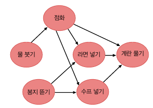
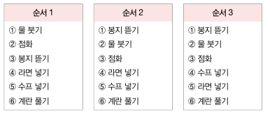
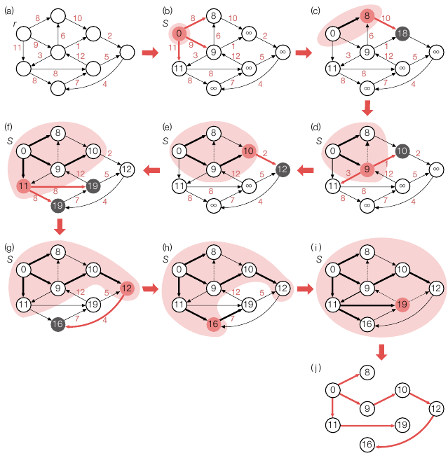
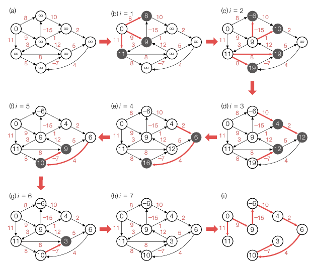
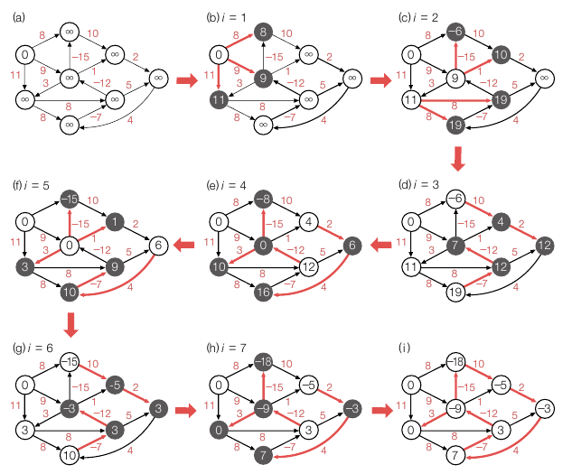

<div class="notice--danger">
    <b>'쉽게 배우는 자료구조 with 자바 (문병로)' 내용 중 일부입니다.</b>
</div>

드디어 마지막입니다! 원래 일주일 ~ 일주일 반 사이에 끝내려고 했는데 어려운 부분도 있어서 3주 가까이 걸렸네요.

# 위상정렬

​	위상정렬(Topological Sorting) 은 정점 사이의 순서가 유지되어야 한다는 것입니다. 예를 들어 라면 끓이기 작업의 선후 관계를 보겠습니다.



점화는 뭇붓기가 선행되어야 하고, 계란 풀기는 점화, 라면넣기, 수프넣기가 선행되어야 합니다. 또한 물붓기와 봉지 뜯기는 선후관계가 없기 때문에 여러 경우의 수가 있습니다.



이 작업들의 공통점은 간선 (i -> j) 가 존재한다면 작업 i 는 반드시 작업 j 보다 먼저 수행되어야 한다는 것입니다. 만약 **그래프에 싸이클이 있다면 위 성질은 결코 만족될 수 없습니다.** 

```
topologicalSort(G):
	for i <- 0 to n-1
		진입 간선이 없는 정점 u 를 선택합니다.
		A[i] <- u
		정점 u 와 u 의 진출 간선들을 모두 제거합니다.
```

여기서 진입 간선은 정점 u 로 들어오는 간선을 말하고, 진출 간선은 정점 u 에서 나가는 간선을 말합니다. 진입 간선이 없다면 선행 조건이 없거나 완료된 상태이므로 정점을 집합에 포함시킨다는 개념입니다.

​	위 알고리즘으로 라면 끓이기 그래프를 위상 정렬이 되도록 해보겠습니다.

1. 진입 간선이 없는 정점은 2개입니다. -> "물 붓기", "봉지 뜯기" 
2. 이중 임의로 "물 붓기" 를 선택하고 이 정점과 진출 간선을 모두 제거합니다. 현재 상태에서 진입 간선이 없는 정점은 2개입니다. "점화", "봉지 뜯기" / A[0] = "물 붓기"
3. 이번엔 "점화" 를 선택하고 이 정점과 진출 간선을 모두 제거합니다. 현재 상태에서 진입 간선이 없는 정점은 "봉지 뜯기" 1개입니다. / A[1] = "점화"
4. 이번엔 "봉지 뜯기" 를 선택하고 이 정점과 진출 간선을 모두 제거합니다. 현재 상태에서 진입 간선이 없는 정점은 "라면 넣기", "수프 넣기" 2개입니다. / A[2] = "봉지 뜯기"
5. 같은 방법으로 "라면 넣기" 와 "수프 넣기" 를 A 에 넣습니다. / A[3] = "라면 넣기", A[4] = "수프 넣기"
6. 이제 "계란 풀기"의 진입 간선이 없으므로 A[5] 에 "계란 풀기" 를 넣습니다.
7. A = ["물 붓기", "점화", "봉지 뜯기", "라면 넣기", "수프 넣기", "계란 풀기"] 는 순서 1 에 해당합니다.

​	**시간 복잡도**를 분석해보겠습니다. for loop 는 n 번 반복되며, 반복할 때마다 1개의 정점이 선택되고 해당 정점에 연결된 진출 간선이 모두 제거됩니다. 따라서 각 간선은 단 한번씩만 취급됩니다. 따라서 총 수행시간은 θ(V + E) 입니다. 


# 최단 경로

​	최단 경로는 목적지에 이르는 모든 가능한 경로 중 최단 경로를 찾는 알고리즘 입니다. 그래프 유형은 크게 두 가지인데, 하나는 간선 가중치가 음이 아닌 일반적인 경우이며, 하나는 음의 가중치가 존재하는 경우입니다. 전자는 다익스트라 알고리즘으로, 후자는 벨만-포드 알고리즘으로 이 문제를 해결합니다. 이 때 음의 가중치가 존재하는 경우에는 가중치 합이 음인 싸이클은 절대 허용되지 않습니다. 음의 싸이클이 있으면 해당 싸이클을 몇 번이고 반복해서 돌아 경로의 가중치 합을 무한정 낮출 수 있기 때문입니다.

## 다익스트라 알고리즘

```
Djkstra(G, r): //G = (V, E), r 은 시작 정점
	S <- {r}
    r.cost <- 0
    for each u in V-{r}
    	u.cost <- Wru
    while (S != V)
    	u <- deleteMin(V-S)
    	S <- S U {u}
    	for each v in u.adj //u.adj 는 정점 u 에 인접한 정점들의 집합
    		if (v is in V-S && u.cost + Wuv < v.cost)
    			v.cost <- u.cost + Wuv
    			v.prev <- u

deleteMin(Q):
	집합 Q 에서 u.cost 가 가장 작은 정점 u 를 리턴한다.
```

다익스트라 알고리즘은 최소 신장 트리를 위한 프림 알고리즘의 원리와 거의 비슷합니다. 다만 프림 알고리즘에서 v.cost 가 정점 v 와 부분 신장 트리를 연결하는 비용이라면, 다익스트라 알고리즘에서는 v.cost 가 시작 정점 r 에서 정점 v 에 이르는 거리를 저장합니다. 아래 그림은 정점 8개를 연결하는 다익스트라 알고리즘 수행입니다. 프림 알고리즘과 비슷하니 설명은 개략적으로 진행하겠습니다. [프림 알고리즘](https://hobeen-kim.github.io/datastructure/%EC%9E%90%EB%A3%8C%EA%B5%AC%EC%A1%B0-Ch-13.-%EA%B7%B8%EB%9E%98%ED%94%84/)



정점 안의 숫자는 r 과의 거리입니다. 

1. (a) 정점 r 을 선택하고 v.cost = 0 으로 둡니다.
2. (b) 인접한 정점 중 비용이 가장 작은 간선을 선택하고, 해당 정점을 S 에 포함시킵니다. 
3. (c) 해당 정점과 연결된 v 의 cost 를 u.cost + Wuv 로 설정합니다. (8 + 10)
4. (d) u.cost 가 가장 작은 정점을 찾습니다. (9) 해당 정점을 추가하고 연결된 u.adj 의 cost 를 업데이트 합니다.
5. (e) ~ (i) 해당 과정을 반복하여 모든 정점을 연결합니다.

r 에서 연결된 정점 중 비용이 가장 작은 간선을 선택하는 과정의 연속이, 최단거리를 선택하는 방법입니다. 그게 아니면 더 많은 비용을 투자해서 돌아가는 것밖에 안됩니다.


## 벨만-포드 알고리즘

​	다익스트라 알고리즘은 음의 가중치가 있는 경우를 해결하지 못합니다. 왜냐하면 현재 비용이 가장 작은 간선이 최단거리이기 때문입니다. 하지만 음의 가중치가 있다면 원래 선택한 길보다 비용이 작은 간선이 발생하게 됩니다. 최단 경로를 구하는 데 음의 가중치가 필요한 경우가 뭐가 있을까요? 바로 거쳐가면 좋을 장소에 음의 가중치를 주는 겁니다. 

​	벨만-포드 알고리즘은 간선을 최대 1개 사용하는 최단 경로, 간선을 최대 2개 사용하는 최단 경로, ... 와 같은 식으로 간선을 최대 n-1 개 사용하는 최단 경로까지 구해나갑니다.

```
BellmanFord(G, r): //G = (V, E), r : 시작 정점
	for each u in V
		u.cost <- infinite
    r.cost <- 0
    for i <- 1 to n-1 //n 은 정점의 총 개수
    	for each (u->v) in E
    		if(u.cost + Wuv < v.cost)
    			v.cost <- u.cost + Wuv
    			v.prev <- u
    
    for each (u->v) in E //음의 싸이클 존재 여부 확인
    	if(u.cost + Wuv < v.cost) output "해 없음: 음의 싸이클"
```

여기서 중요한 건 `for i <- 1 to n-1` 입니다. i = 1 일 때 최대 1개의 간선을 사용하는 최단 경로가 연결됩니다. 그리고 i = 2 일 때 최대 2개의 간선을 사용하는 최단 경로가 연결됩니다. for loop 를 다 수행하면 최대 n-1 개의 간선을 사용하는 최단 경로가 연결되고, 최대 n-1 개를 사용하면 두번 이상 포함되는 정점이 있는거니까 의미가 없습니다.



`for each (u->v) in E` 문은 음의 싸이클을 찾습니다. 최단 거리를 구했는데도 특정 간선에 대해 `u.cost + Wuv < v.cost` 를 만족한다면 음의 싸이클인 겁니다. 아래 그림의 마지막 (i) 를 기준으로 계산해보면 됩니다.



​	벨만-포드 알고리즘의 **시간복잡도는 θ(VE) **입니다. 시간 복잡도에 영향을 미치는 코드는 다음과 같습니다.

```
BellmanFord(G, r):
	...
    for i <- 1 to n-1 
    	for each (u->v) in E
    		상수 시간
    
 ...
```

첫번째 for loop 가 V 번, 두번째 for loop 가 E 번 반복되니까 VE 가 되겠습니다.

만약 u.cost 에 변동이 생긴 정점 u 에 대해서만 u 의 진출 간선을 살핀다면 효율을 더 높일 수 있습니다.