# Git 최초 설정

1. 사용자 이름과 이메일 설정

   ```
   git config --global user.name "(본인 이름)"
   git config --global user.email "(본인 이메일)"
   ```

   - 설정확인

   - ```
     git config --global user.name
     git config --global user.email
     ```

2. 기본 브랜치명 변경

   ```
   git config --global init.defaultBranch main
   ```

3. 깃 변경 사항 확인

   ```
   git stauts
   ```

## .gitignore 설정

​	깃에서 관리하지 않을 파일을 설정합니다.

```
# 모든 file.c
file.c

# 최상위 폴더의 file.c
/file.c

# 모든 .c 확장자 파일
*.c

# .c 확장자지만 무시하지 않을 파일
!not_ignore_this.c

# logs란 이름의 파일 또는 폴더와 그 내용들
logs

# logs란 이름의 폴더와 그 내용들
logs/

# logs 폴더 바로 안의 debug.log와 .c 파일들
logs/debug.log
logs/*.c

# logs 폴더 바로 안, 또는 그 안의 다른 폴더(들) 안의 debug.log
logs/**/debug.log
```

# Git 기본 명령어

*제가 모르는 거 위주입니다.*

## 커밋 기록 보기

```
git log
```

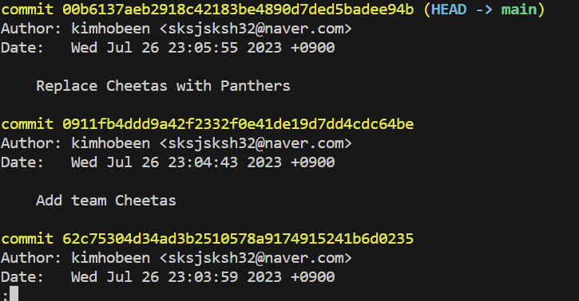

commit hash 는 아래에서 `reset`, `revert` 를 할 때 사용됩니다.

## reset 과 revert

git 에서 과거로 돌아가는 방법은 `reset` 과 `revert` 가 있습니다.

### reset

​	`reset` 은 커밋 내용을 지우고 과거로 돌아가는 방법입니다.

```
git reset --hard [commit hash]
```

작업 내용을 변경하다가 제일 최근 커밋 시점으로 돌아가고 싶으면 hash 를 빼고 입력합니다.

```
git reset --hard
```

> reset 의 3가지 옵션
>
> - --soft: `repository`에서 `staging area`로 이동
> - --mixed (default): `repository`에서 `working directory`로 이동
> - --hard: 수정사항 완전히 삭제

### revert

`revert` 는 과거의 특정 시점의 커밋 내용을 되돌리는 커밋을 시행합니다. `reset` 과 달리 지금까지의 커밋 기록이 남습니다.

```
git revert [commit hash]
```

만약 revert 중 충돌이 있다면 `main|REVERTING` 라고 뜹니다. 그러면 파일을 삭제하는 등의 충돌을 해결하고 revert 를 이어갑니다.

- 특정 파일 삭제 : `git rm leopards.yml`
- revert 계속 : `git revert --continue`

커밋하지 않고 revert 할 수도 있습니다. 원하는 다른 작업을 추가한 다음 함께 커밋하기 위해서입니다.

```
git revert --no-commit [commit hash]
```

## Branch

branch 는 분기점입니다.

### branch 만들기

새로운 branch 만드는 명령어입니다.

```
git branch [브랜치 명]
```

이렇게 만든 브랜치는 `git branch` 명령어를 통해 확인할 수 있습니다.

### branch 이동

해당 브랜치로 이동하려면 `switch` 를 사용합니다.

```
git switch [브랜치 명]
```

만약 브랜치 생성과 동시에 해당 브랜치로 이동하려면 아래와 같이 사용합니다.

```
git switch -c [브랜치 명]
```

브랜치 이름 변경은 아래 명령어로 합니다.

```
git branch -m [변경 전 브랜치 명] [변경할 브랜치 명]
```

### 브랜치 삭제

```
git branch -d [브랜치 명]
```

강제 삭제는 `-D` 를 사용합니다. 

```
git branch -D [브랜치 명]
```

### 브랜치 분기

각각의 브랜치를 수정하면 가지가 뻗어나가게 됩니다. 아래는 몇 개의 브랜치로 나눈 후 조금씩 수정했을 떄 소스트리에서의 모양입니다.

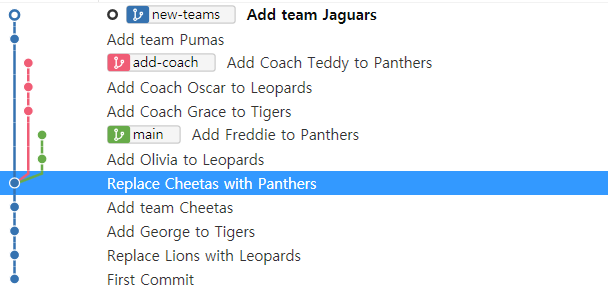

CLI 에서 위 가지처럼 보는 명령어는 아래와 같습니다.

```
git log --all --decorate --oneline --graph
```

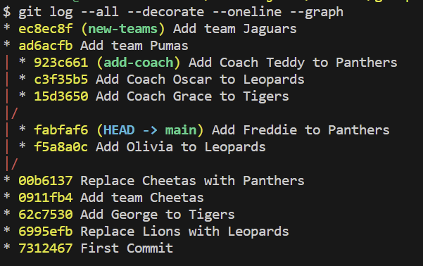

각 별표가 커밋에 해당됩니다.

## Branch 합치기

branch 를 합치는 방법은 `merge` 와 `rebase` 가 있습니다. `merge` 는 브랜치 가지를 남긴 채 새로운 커밋을 만드는 거라면, `rebase` 는 브랜치를 다른 브랜치에 이어붙입니다.

### merge

```
git merge [합칠 브랜치]
```

`merge` 명령어로 add-coach 를 main 에 합쳤습니다.

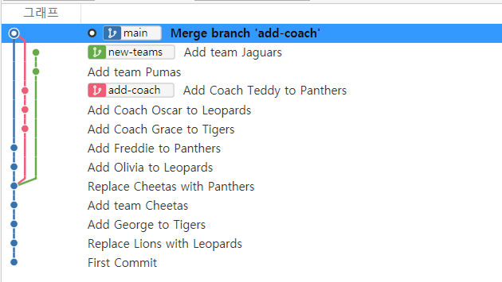

`merge` 를 취소하려면 `reset` 을 하면 됩니다. `merge` 도 하나의 커밋이기 때문입니다.

병합된 브랜치는 삭제하면 됩니다.

### rebase

`rebase` 는 `merge` 와 다르게 가지쪽에서 main 브랜치로 `rebase` 해줘야 합니다.

```
git rebase [합쳐질 메인 브랜치]
```

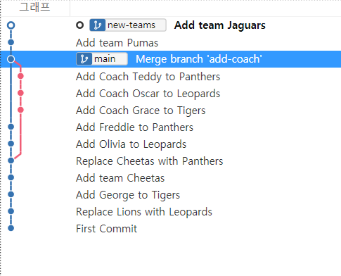

위 사진처럼, main 브랜치에 new-teams  가 덧씌워졌습니다. 하지만 main 브랜치 자체는 아직 2단계 정도 뒤쳐져있습니다. 이를 따라잡게 만들어야 합니다. 이를 위해선 **main 브랜치에서 merge 를 해줘야 합니다.**

```
git merge new-teams
```

## Branch 충돌 해결하기

먼저 다음과 같이 branch 가 나눠져있다고 해보겠습니다.

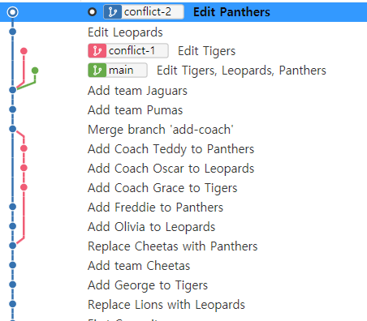

여기서 각각의 branch 는 충돌을 일으키게 설정했습니다. 

### merge 충돌 해결

먼저 conflict-1 과 main 을 병합해보겠습니다.

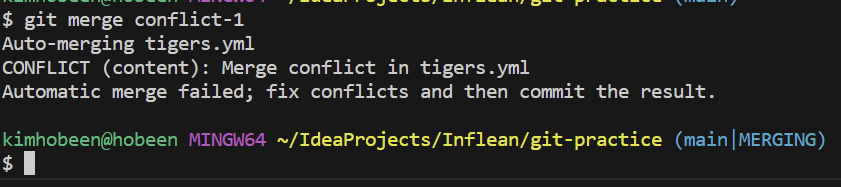

병합을 시도하면 실패가 뜨고 `main|MERGING` 이라고 브랜치가 표시됩니다.

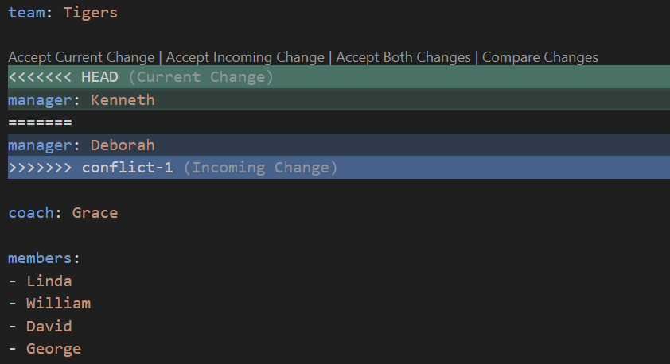

병합이 실패한 부분은 현재 변화로 accept 하거나, 병합될 브랜치의 변화로 accept 하거나 둘 다 받을 수도 있습니다. 이때 병합을 진행해야 할 부분이 많으면 `git merge --abort` 로 merge 를 중단할 수 있습니다.

여기서는 main 브랜치의 변화로 accept 합니다.

그리고 충돌이 해결되면 다시 add 와 commit 을 하면 됩니다.

### rebase 충돌 해결

이제 rebase 충돌을 해결해보겠습니다. merge 는 마지막 커밋끼리만 합치면 되지만, rebase 는 커밋 하나하나 모두 합쳐야 합니다. 위 예시에서 conflict-2 는 2번의 커밋으로 충돌이 2번 일어나게 설정했습니다.

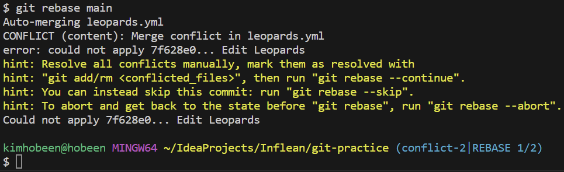

다음과 같이 `conflict-2|REBASE 1/2` 이라고 뜹니다.

그러면 `merge` 와 동일하게 어떤 변경사항으로 할지 정한 후 아래와 같이 실행합니다.

```
git add .
git rebase --continue
```

먼저 git add 를 한 후 다음 `rebase` 로 넘어가는 겁니다. 그 과정에서 commit 을 자동으로 하게 됩니다.

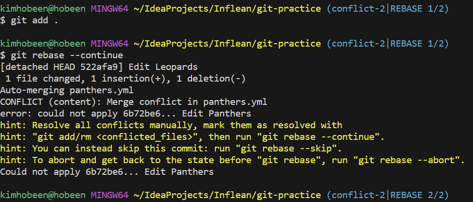

이제 `conflict-2|REBASE 2/2` 로 바꼈는데요. 마찬가지로 변경사항을 정한 후 아래와 같이 실행합니다.

```
git add .
git rebase --continue
```

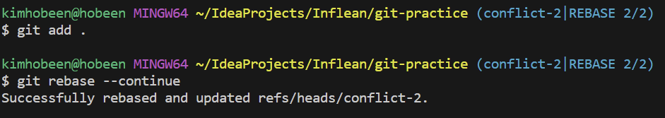

완료되면 최종적으로 `Successfully ~~` 메세지가 뜹니다.

그러면 마지막으로 main 브랜치로 가서 conflict-2 브랜치를 따라가도록 merge 를 해준 후 conflict-2 를 삭제합니다.

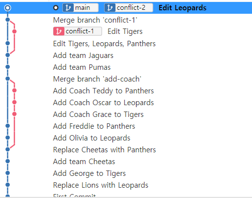

만약 중간에 당장 충돌 해결이 어려울 경우 아래 명령어로 `rebase` 를 중단할 수 있습니다.

```
git rebase --abort
```

## 원격 저장소

### 충돌 해결

​	로컬 저장소가 원격 저장소의 git 내용이 없다면 먼저 pull 을 한 후에 push 를 할 수 있습니다. (강제로 push 하는 건 `git push --force`) 하지만 서로 변경한 내용이 같아서 충돌이 일어날 수 있는데 해결방법은 2가지입니다.

### merge

먼저 `git pull --no-rebase` 로 pull 을 하면 merge 를 하는 것처럼 마지막 커밋끼리 비교해서 더해집니다.

### rebase

`git pull --rebase` 는 먼저 원격 저장소의 커밋을 로컬에 반영한 뒤 자신의 커밋을 반영하는 방법입니다. **협업 시 주로 사용합니다.**

### 원격 저장소에 브랜치 만들기

먼저 local 에서 다음과 같은 브랜치를 만듭니다.

```
git branch from-local
```

그리고 다음 명령어로 원격의 브랜치 명시 및 기본설정을 합니다.

```
git push -u origin from-local
```

이제 해당 로컬 브랜치에서 `git push` 를 하면 원격 저장소의 `from-local` 브랜치로 갑니다.

원격 저장소에 있는 브랜치까지 확인하려면 아래 명령어를 사용합니다.

```
git branch --all
git branch -a
```

### 원격 저장소에 있는 브랜치 pull 하기

원격 저장소에 브랜치가 만들어졌는데 (예를 들어 동료가 브랜치를 만들고 올렸는데) 자신의 로컬에 없다면 먼저 업데이트를 해야합니다.

```
git fetch
```

그리고 아래 명령어로 로컬에 같은 이름의 브랜치를 생성하여 연결하고 switch 할 수 있습니다.

```
git switch -t origin/from-remote
```

### 원격 저장소 브랜치 삭제하기

git push 를 통해 원격 저장소 브랜치를 삭제할 수 있습니다.

```
git push (원격 이름) --delete (원격의 브랜치명)
```

# Git 명령어 심화

## Head

git checkout 을 통해 특정 커밋의 위치로 이동할 수 있습니다. reset 은 앞의 커밋을 날리고, revert 는 기존 커밋에 이전 변경 커밋을 추가로 저장하는거라면 git checkout 은 말 그대로 이동만 합니다.

```
git checkout HEAD^
git checkout HEAD^^
git checkout HEAD^2

git checkout HEAD~
git checkout HEAD~~
```

`^` 또는 `~` 갯수만큼 이전으로 이동

커밋 해시로 이동할 수도 있습니다.

```
git checkout (커밋해시)
```

아래는 이동을 전 단계 되돌리는 명령어입니다.

```
git checkout -
```

기존 브랜치로 돌아오려면 git switch [브랜치 명] 을 사용하면 됩니다.

HEAD 를 사용해서 몇 단계 이전까지 reset 을 할 수 있습니다.

```
git reset HEAD(원하는 단계) (옵션)
```

## **fetch**와 **pull**의 차이

- `fetch`: 원격 저장소의 최신 커밋을 로컬로 가져오기만 함
- `pull`: 원격 저장소의 최신 커밋을 로컬로 가져와 `merge` 또는 `rebase`

만약 원격 저장소의 최신 커밋을 확인만 하고 아직 merge 하고 싶지 않다면 git fetch 로 최신 커밋을 로컬로 가져오기만 할 수 있습니다. 그 상태에서 변경사항을 `git checkout origin/main` 으로 확인합니다.

원격에 새 브랜치가 생겼다면 아래와 같이 최신 커밋을 확인할 수 있습니다.

```
git checkout origin/(브랜치명)
git switch -t origin/(브랜치명)
```

## config

config를 **--global**과 함께 지정하면 전역으로 설정됩니다. 반면 --global 을 붙이지 않으면 해당 프로젝트만 설정됩니다.

```
git config --global user.name "hobeen"
git config user.name "hobeen"
```

### 현재 모든 설정값 보기

```
git config (--global) --list
```


### 에디터에서 config 설정 수정

아래 명령어를 통해 vi 에서 config 값을 수정할 수 있습니다.

```
git config (--global) -e
```

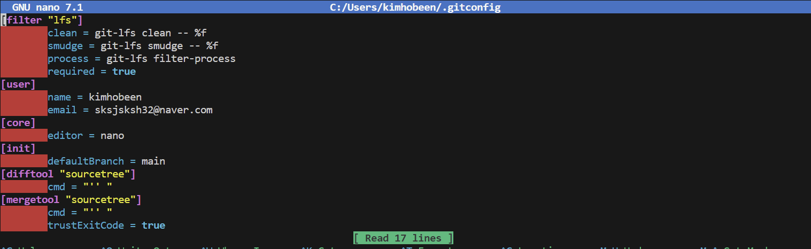

vscode 로 GUI 에서 config 를 수정하려면 아래와 같은 설정을 추가합니다.

```
git config --global core.editor "code --wait"
git config (--global) -e
```

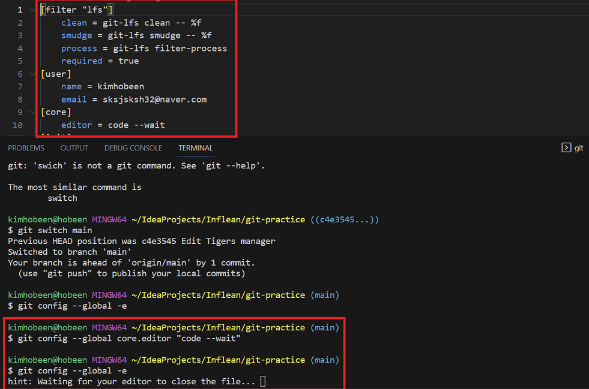

해당 에디터를 꺼야 CLI 가 다시 동작합니다. **해당 설정을 적용하면 commit 등 vi 에서 열리는 게 모두 GUI 로 변경됩니다.**

### 유용한 config 설정들

1. 줄바꿈 호환 문제 해결 : `git config --global core.autocrlf (윈도우: true / 맥: input)`

   - 윈도우와 맥에서 줄바꿈이 다르기 때문에 변경되었다고 인식하는 문제를 해결

2. `pull` 기본 전략 `merge` 또는 `rebase`로 설정

   ```
   it config pull.rebase false
   git config pull.rebase true
   ```

3. 기본 브랜치명 설정

   ```
   git config --global init.defaultBranch main
   ```

4. push시 로컬과 동일한 브랜치명으로

   ```
   git config --global push.default current
   ```

5. 단축키 설정

   ```
   git config --global alias.(단축키) "명령어"
   ```

   - 예시: `git config --global alias.cam "commit -am"`

   


