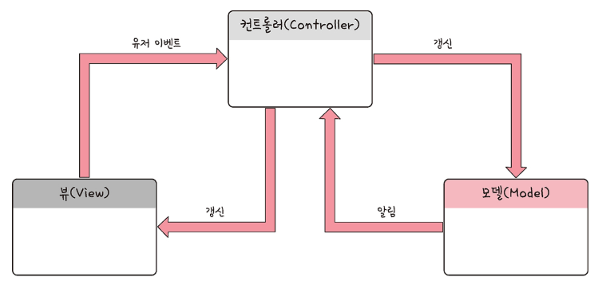
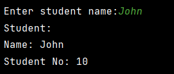
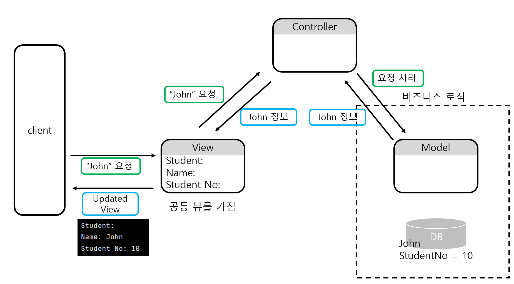
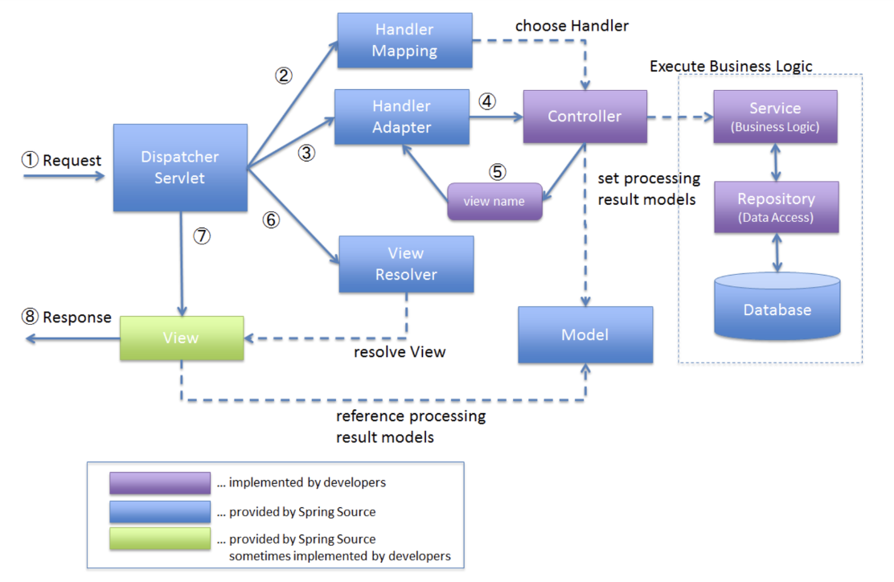
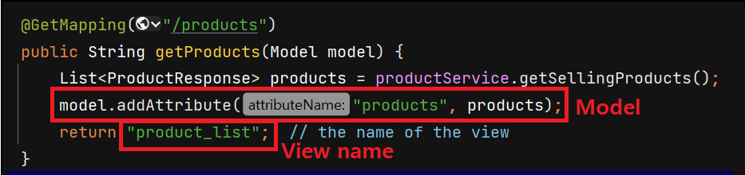

# MVC 패턴

​	디자인 패턴이란 프로그램이나 어떤 특정한 것을 개발하는 중에 발생했던 <u>"반복적인"</u> 문제점들을 정리해서 **상황에 따라 간편하게 적용해서 쓸 수 있는 것을 정리하여 특정한 "규약" 을 통해 쉽게 쓸 수 있는 형태로 만든 것**을 말합니다. 

​	MVC 패턴도 마찬가지로, 코드에 대한 유지보수를 어떻게 하면 편하게 할 수 있을까를 고민하다가 나온 결과물입니다. 

## MVC 란

​	MVC 는 Model, View, Controller의 약자 입니다. 하나의 애플리케이션, 프로젝트를 구성할 때 그 구성요소를 세가지의 역할로 구분한 패턴입니다. 



간단하게 아래와 같이 요약할 수 있습니다.

- Model : 데이터와 비스니스 로직에 관련된 부분
- View : 모델의 데이터를 사용해 사용자한테 보여지는 부분
- Controller : 사용자의 요청에 따라 Model 과 View 를 이어주는 부분

## MVC 패턴을 사용하는 이유

1. 뷰와 모델의 분리
   - 뷰와 모델은 서로 다른 관심사를 가지고 있습니다. 뷰는 사용자 인터페이스를 주로 고려하고, 모델은 비즈니스 정책이나 DB 상호 작용 등을 고려합니다. 
   - 모델을 분리하면 동일한 모델로 다양한 뷰에 적용할 수 있습니다.
2. 컨트롤러와 뷰의 분리
   - 컨트롤러는 요청을 처리하고 이를 모델에 적절히 반영하고 응답을 받아 보냅니다. 반면 모델은 비즈니스 로직을 처리합니다. 컴포넌트를 분리해서 각 컴포넌트가 자신의 역할에 집중할 수 있게 합니다. (SRP, 단일책임원칙)

## MVC 패턴 원칙

### 모델

​	모델은 애플리케이션의 정보, 데이터를 나타냅니다. 

1. 사용자가 편집하길 원하는 모든 데이터를 가지고 있어야 합니다. 사용자가 변경할 수 있는 부분은 모델이 동적으로 처리해서 전달해야 합니다.
2. 뷰나 컨트롤러에 대해 의존적이지 않아야 합니다. 즉, 모델의 코드 내에서는 뷰, 컨트롤러의 어떠한 필드나 메서드도 사용하지 않아야 합니다. 이를 통해 재사용성을 높입니다.

### 뷰

​	데이터의 입력, 화면 등 사용자 인터페이스 요소를 나타냅니다. 데이터를 기반으로 사용자들이 볼 수 있는 화면입니다.

1. 모델이 가진 정보를 따로 저장하면 안됩니다. 뷰에서 신경써야 하는 부분은 공통적인 사용자 인터페이스입니다.
2. 모델이나 컨트롤러와 같이 다른 구성요소에 의존적이지 않아야 합니다. 받는 데이터를 그대로 인터페이스에 보여주는 역할만 합니다. 물론 모델에서 주는 데이터에 맞춰서 렌더링하기 때문에 어느정도 모델에 의존적이기는 합니다.

**컨트롤러**

​	모델과 뷰를 연결하는 역할을 합니다. 컨트롤러는 사용자의 입력을 받아 이를 모델에 적절하게 반영하거나, 모델의 변화를 뷰에 반영하는 등의 동작을 담당합니다.

​	컨트롤러는 모델이나 뷰에 대해서 의존적이게 됩니다. 요청에 대해 특정 모델을 사용해서 뷰에 대한 응답값을 만들어 보내줘야하기 때문입니다.

## 간단한 예시

간단한 MVC 패턴 예시입니다. 사용자가 학생의 이름을 입력하면 아래와 같이 출력하는 프로그램입니다.



이를 위한 MVC 흐름은 아래와 같습니다.



간단하게 작성한 코드입니다.

```java
public class StudentController {
    private Student model;
    private StudentView view;

    public StudentController(Student model, StudentView view) {
        this.model = model;
        this.view = view;
    }

    public void updateView() {
        view.printStudentDetails(model.getName(), model.getStudentNo());
    }
}

public class Student {
    private String name;
    private String studentNo;

    public Student(String name, String studentNo) {
        this.name = name;
        this.studentNo = studentNo;
    }

    public String getStudentNo() {
        return studentNo;
    }

    public String getName() {
        return name;
    }

    public static Student retrieveStudentByName(String name){
        return new Student(name, "10");
    }
}

public class StudentView {
    public void printStudentDetails(String studentName, String studentNo) {
        System.out.println("Student: ");
        System.out.println("Name: " + studentName);
        System.out.println("Student No: " + studentNo);
    }
}


public class Main {
    public static void main(String[] args) {

        Scanner sc = new Scanner(System.in);

        //model
        System.out.print("Enter student name:");
        String name = sc.nextLine();
        Student model = Student.retrieveStudentByName(name);

        //view
        StudentView view = new StudentView();

        StudentController controller = new StudentController(model, view);

        controller.updateView();

    }
}
```

# Spring MVC

​	Spring MVC는 웹 애플리케이션 개발을 위한 Spring Framework의 일부로, MVC(Model-View-Controller) 디자인 패턴을 따르고 있습니다. Spring MVC에서 MVC 패턴은 다음과 같이 적용됩니다.



1. `DispatcherServlet` 으로 웹 요청(`HttpServletRequest`) 이 들어옵니다. (**프론트 컨트롤러 패턴**)
2. 해당 요청을 `Handler Mapping` 에 위임하여 해당 요청을 처리할 `Handler` (`Controller`)를 탐색합니다.
3. 찾은 `Handler` 를 실행할 수 있는 `HandlerAdapter` 를 탐색합니다.  (**어댑터 패턴**)
4. 찾은 `Handler Adapter` 를 사용해서 `Handler` 의 메소드를 실행합니다.
5. `Handler` 는 반환 값은 `Model` 과 `View` 를 반환합니다.
6. `View` 이름을 `ViewResolver` 에게 전달하고, `ViewResolver` 는 해당하는 `View` 객체를 전달합니다.
7. `DispatcherServlet` 은 `View` 에게 `Model` 을 전달하고 화면 표시를 요청합니다. 
8. 최종적으로 `DispatcherServlet` 은 `View` 결과(`HttpServletResponse`) 를 클라이언트에게 반환합니다.

> 서블릿과 톰캣의 개념은 여기를 참고하세요. [[web\] 서블릿(servlet)](https://hobeen-kim.github.io/web/WEB-서블릿(Servlet)/)

이 때 RestController 를 사용하면 6, 7번이 생략되고 반환 값에 알맞는 MessageConverter를 찾아 응답 본문을 작성합니다.

## MVC 컨트롤러 예시

아래는 요청을 받아 View name 과 Model 을 반환하는 컨트롤러 예시입니다.



`Model` 과 view name 을 리턴합니다. `Model` 은 `ArgumentResolver` 중 `ServletModelAttributeMethodProcessor` 가 주입해줍니다.

Spring MVC 에서 **컨트롤러 메소드가 문자열을 반환하는 경우**, 그 문자열이 뷰의 이름을 나타내는지 아니면 직접적인 응답 본문을 나타내는지는 `@ResponseBody` 어노테이션이 존재하는지에 따라 결정됩니다.

​	위의 예제 코드에서는 `@ResponseBody` 어노테이션이 없으므로, 메소드가 반환하는 문자열 `"product_list`" 는 뷰의 이름으로 해석됩니다. 이 경우, Spring 은 `ViewResolver`를 사용하여 **해당 이름의 뷰를 찾아서 렌더링**하게 됩니다. 기본적으로, 이 뷰의 이름은 템플릿 파일의 이름과 매칭되며 (`"product_list.html"`), `Model` 객체에 추가된 속성들은 이 템플릿 파일 내에서 사용될 수 있습니다.

반면에, 컨트롤러 메소드에 **`@ResponseBody` 어노테이션이 붙어 있으면, 메소드가 반환하는 값은 응답 본문으로 직접 사용**됩니다. 

# 예상 질문 및 답변

### MVC 패턴이란?

MVC 패턴은 애플리케이션의 로직을 모델(Model), 뷰(View), 컨트롤러(Controller) 로 분리합니다. 모델은 비즈니스 로직을 의미하고, 뷰는 사용자에게 정보를 표시하는 역할을 합니다. 컨트롤러는 사용자의 입력을 받아 모델의 상태를 변경하거나, 모델의 변경 사항을 뷰에 업데이트하는 역할을 합니다. MVC 패턴은 코드의 재사용성과 유지보수성을 높이는 데 효과적입니다. 각 컴포넌트는 서로 독립적으로 동작하므로, 한 컴포넌트를 수정하거나 교체하는 것이 다른 컴포넌트에 미치는 영향을 최소화합니다. 

### MVC 패턴을 지키기 위해 어떻게 하는지?

모델은 데이터를 처리하는 비즈니스 로직으로, 뷰나 컨트롤러에 대해 의존적이지 않아야 합니다. 사용자 입력에 따라 변화하는 값만 반환합니다. 뷰는 공통적인 사용자 인터페이스만 신경쓰면서 모델에는 의존적일 수 있으나 컨트롤러에 의존적이지 않게 합니다. 

### Spring MVC 란?

Spring MVC는 웹 애플리케이션 개발을 위한 Spring Framework의 일부로, MVC 디자인 패턴을 따르고 있습니다. Model, View, Controller를 명확하게 분리하여 매우 유연하고 확장성이 좋다는 특징이 있습니다.

### Spring MVC의 흐름

1. `DispatcherServlet` 으로 웹 요청(`HttpServletRequest`) 이 들어옵니다.
2. 해당 요청을 `Handler Mapping` 에 위임하여 해당 요청을 처리할 `Handler` (`Controller`)를 탐색합니다.
3. 찾은 `Handler` 를 실행할 수 있는 `HandlerAdapter` 를 탐색합니다.  (**어댑터 패턴**)
4. 찾은 `Handler Adapter` 를 사용해서 `Handler` 의 메소드를 실행합니다.
5. `Handler` 는 반환 값은 `Model` 과 `View` 를 반환합니다.
6. `View` 이름을 `ViewResolver` 에게 전달하고, `ViewResolver` 는 해당하는 `View` 객체를 전달합니다.
7. `DispatcherServlet` 은 `View` 에게 `Model` 을 전달하고 화면 표시를 요청합니다. 
8. 최종적으로 `DispatcherServlet` 은 `View` 결과(`HttpServletResponse`) 를 클라이언트에게 반환합니다.