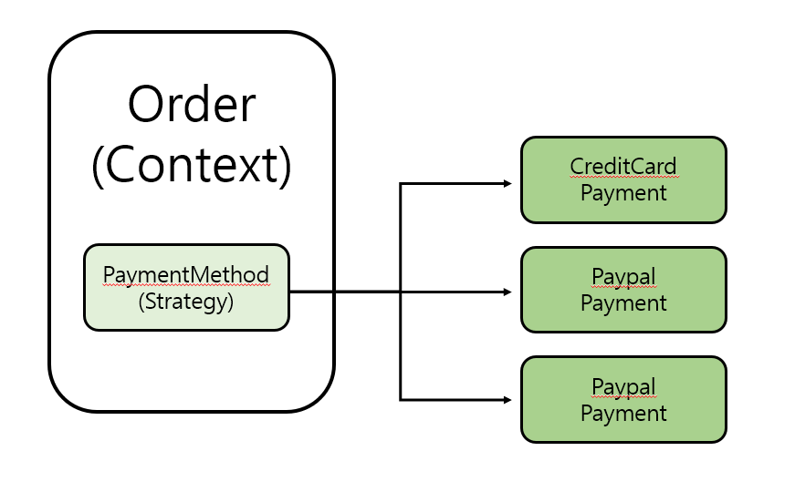

# 전략패턴

전략 패턴은 많은 알고리즘이 있고 이들 중 하나를 선택해서 사용해야 할 때 유용한 디자인 패턴입니다. 전략 패턴은 구체적인 알고리즘을 캡슐화하여 동적으로 알고리즘을 선택할 수 있게 합니다.

전략 패턴은 OCP (Open-Closed Principle) 와 연계되는데, 이를 통해 기존 코드를 변경하지 않고도 알고리즘을 쉽게 변경하거나 확장할 수 있습니다.

> **OCP** :  소프트웨어 구성요소(클래스, 모듈, 함수 등)는 확장에는 열려 있어야 하고, 변경에는 닫혀 있어야 한다는 원칙입니다.

## OCP 위반 코드

아래는 OCP 원칙을 위반한 코드입니다. 

```java
class Order {
    void processCreditCardPayment() {
        // 카드 결제 처리
    }

    void processPaypalPayment() {
        // Paypal 결제 처리
    }

}
```

만약 현금 결제라는 새로운 결제 방법이 추가된다면 어떻게 할까요? 아래와 같이 수정해야 합니다.

```java
class Order {
    void processCreditCardPayment() {
        // 카드 결제 처리
    }

    void processPaypalPayment() {
        // Paypal 결제 처리
    }
    
    void cashPayment() {
        // Paypal 결제 처리
    }

}
```

하나의 메서드인 `pay()` 로 만든다고 해도 아래 정도일 겁니다.

```java
class Order {
	public void pay(String paymentMethod){
		if(paymentMethod.equals(...))
		else if(paymentMethod.equals(...))
		else ifpaymentMethod.equals(...)
	}

    void processCreditCardPayment() {
        // 카드 결제 처리
    }

    void processPaypalPayment() {
        // Paypal 결제 처리
    }
    
    void cashPayment() {
        // Paypal 결제 처리
    }

}
```

​	이렇게 수정하는 방식은 **SOLID의 원칙 중 OCP( Open-Closed Principle )에 위배**됩니다. OCP에 의하면 기존의 코드는 수정하지 않으면서 행위가 수정되어야 하지만, 지금은 `Order` 에 메서드를 추가하거나 `pay()` 메서드를 직접 수정했습니다.

​	또한 지금과 같은 방식의 변경은 시스템이 확장이 되었을 때 유지보수를 어렵게 합니다. 계속해서 결제방법이 변경되거나 추가될 때 `Order` 클래스를 일일히 수정해줘야 하기 때문입니다.

## 전략 패턴을 통한 해결

이를 해결하기 위해, 전략패턴을 이용해 변경되는 부분(결제방법, `PaymentMethod`) 은 별도로 분리하겠습니다.

```java
interface PaymentMethod {
    void processPayment();
}

class CreditCardPayment implements PaymentMethod {
    @Override
    public void processPayment() {
        // 카드 결제 처리
    }
}

class PaypalPayment implements PaymentMethod {
    @Override
    public void processPayment() {
        // Paypal 결제 처리
    }
}

class Order {
    private PaymentMethod paymentMethod;
    
    public Order(PaymentMethod paymentMethod) {
        this.paymentMethod = paymentMethod;
    }
    
    void processPayment() {
        paymentMethod.processPayment();
    }
}
```

`Order` 클래스는 생성자를 통해 결제방법(`PaymentMethod`) 를 받아서 처리합니다.



​	`Context` 는 내부에 `Strategy` 필드를 가지고 있습니다. 이 필드에 변하는 부분인 `Strategy` 의 구현체를 주입하면 됩니다. **전략 패턴의 핵심은 `Context` 는 `Strategy` 인터페이스에만 의존한다는 점입니다**. 덕분에 `Strategy` 의 구현체를 변경하거나 새로 만들어도 `Context` 코드에는 영향을 주지 않습니다.

즉, 전략패턴은 기존의 코드 변경 없이 행위를 자유롭게 바꿀 수 있게 해주는, OCP 를 준수한 디자인 패턴입니다.

그리고 스프링에서 의존관계 주입에서 사용하는 방식이 바로 전략 패턴입니다.