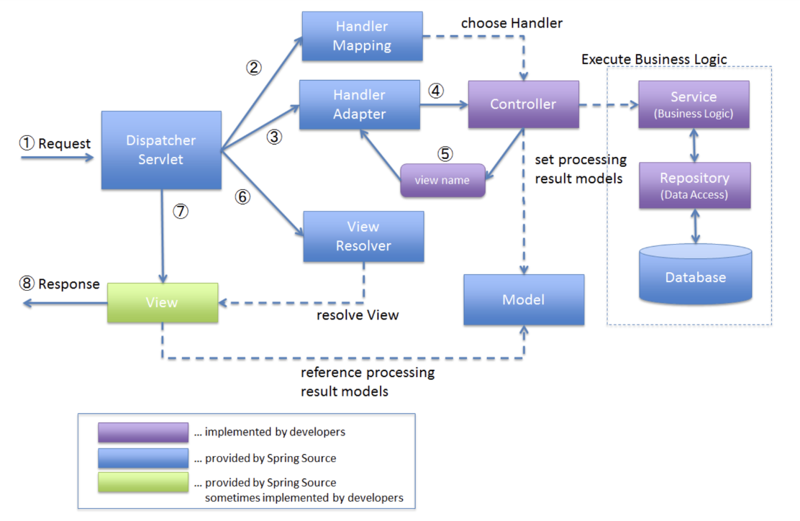

# Spring MVC

## Spring MVC 프레임워크의 요청처리 과정에 대해서 설명해 주세요.

1. `DispatcherServlet` 으로 웹 요청(`HttpServletRequest`) 이 들어옵니다. (**프론트 컨트롤러 패턴**)
2. 해당 요청을 `Handler Mapping` 에 위임하여 해당 요청을 처리할 `Handler` (`Controller`)를 탐색합니다.
3. 찾은 `Handler` 를 실행할 수 있는 `HandlerAdapter` 를 탐색합니다.  (**어댑터 패턴**)
4. 찾은 `Handler Adapter` 를 사용해서 `Handler` 의 메소드를 실행합니다.
5. `Handler` 는 반환 값은 `Model` 과 `View` 를 반환합니다.
6. `View` 이름을 `ViewResolver` 에게 전달하고, `ViewResolver` 는 해당하는 `View` 객체를 전달합니다.
7. `DispatcherServlet` 은 `View` 에게 `Model` 을 전달하고 화면 표시를 요청합니다. 
8. 최종적으로 `DispatcherServlet` 은 `View` 결과(`HttpServletResponse`) 를 클라이언트에게 반환합니다.

## Spring MVC에서 제공하는 CSR(Client Side Rendering)과 SSR(Server Side Rendering) 방식에 대해서 설명해 주세요.

​	Spring MVC에서 SSR 방식을 사용하면, 클라이언트로부터 요청이 올 때 서버에서 Model 을 통해 View 를 완전히 렌더링하고 클라이언트에 전송합니다. 이렇게 함으로써 클라이언트는 추가적인 JavaScript를 실행하지 않고도 완전한 페이지를 바로 볼 수 있습니다. 이 방식은 초기 페이지 로딩 속도가 빠르고, SEO(Search Engine Optimization)에 유리한 특징을 가지고 있습니다.

​	반대로 CSR 방식으로 렌더링을 한다면 서버의 역할은 원하는 데이터를 JSON 과 같은 적절한 형태로 제공하는 것이고, 실제 렌더링은 클라이언트 사이드에서 리액트 등과 같은 기술로 JavaScript를 사용하여 이루어집니다.

## Spring MVC에서 REST API 엔드포인트를 구현하기 위해 사용되는 애너테이션들에 대해서 설명해 주세요.

- @Controller, @RestController, @RequestMapping, @GetMapping, @PostMapping, @PatchMapping, @DeleteMapping 등

​	`@Controller`, @RestController 모두 라이언트의 HTTP 요청을 처리하는 역할을 합니다. `@Controller`가 선언된 클래스에서 메서드는 기본적으로 뷰 이름을 반환하며, 이 뷰 이름을 이용하여 뷰 리졸버가 해당하는 뷰를 찾아 렌더링을 수행합니다. `@RestController`는 `@Controller`와 `@ResponseBody`를 결합한 형태로, 선언된 클래스에서 메서드는 기본적으로 응답 본문에 직접 작성될 데이터를 반환합니다. 주로 JSON이나 XML과 같은 데이터를 REST API로 제공하는데 사용됩니다.

​	클라이언트의 요청이 들어오면, Spring MVC의 `Dispatcher Servlet` 은 핸들러매핑을 통해 이 요청을 처리할 수 있는 핸들러를 찾습니다. 이때 컨트롤러의 `@RequestMapping` 으로 엔드포인트를 찾습니다. `@ReqeustMapping` 의 `method` 속성으로 `get`, `post`, `patch`, `delete` 등을 줄 수 있는데, 해당 속성과 결합한 어노테이션이 `@GetMapping`, `@PostMapping`, `@PatchMapping`, `@DeleteMapping` 입니다.

## Controller에서 응답 객체로 사용하는 ResponseEntity에 대해서 설명해 주세요.

​	`ResponseEntity` 를 사용한다면 응답 객체 안에 HTTP status 와 헤더 값을 추가할 수 있습니다. HTTP 응답 상태를 명시적으로 함께 전달하면 클라이언트의 요청을 서버가 어떻게 처리했는지를 쉽게 알 수 있습니다. 헤더 값도 `HttpServletResponse` 를 직접 조작해서 추가하는 것보다는 원하는 헤더만 만들어서 `ResponseEntity` 하는 게 명시적이며 제한적이라서 좋습니다.

## Rest Client가 무엇인지 설명해 주세요.

Rest Clien 란 말 그대로 Rest API 서버에 HTTP 요청을 보낼 수 있는 클라이언트 툴 또는 라이브러리를 의미합니다. 예를 들어 Postman 같은 툴이 있습니다.

## Spring 에서 사용하는 Rest Client에 대해서 설명해 주세요.

Spring 에서는 **RestTemplate**이라는 Rest Client API를 제공합니다. `RestTemplate`을 이용하면 Rest 엔드 포인트 지정, 헤더 설정, 파라미터 및 body 설정을 한 줄의 코드로 손쉽게 전송할 수 있습니다.

## DTO가 무엇인지 설명해 주세요.

​	DTO 란 클라이언트와 서버 간 데이터를 주고받을 때 사용하는 데이터 형식입니다.

## DTO의 장단점에 대해서 설명해 주세요.

​	장점으로 하나의 엔티티에서 DTO 별 여러 가지 유효성 검증을 추가할 수 있습니다. 또한 변경할 부분이나 추가할 부분 등 필요한 정보만 선택해서 데이터를 보낼 수 있어 정보의 은닉화가 가능하며, 엔티티 내의 필드명이 수정되어도 DTO 만 변경해준다면 해당 DTO 를 사용하는 클라이언트와 서버는 전혀 영향을 받지 않지 않아 엔티티와의 결합도를 낮출 수 있습니다.

​	단점으로는 DTO 관리가 힘들어질 수도 있다는 점입니다. 엔드포인트가 하나 늘어날 수록 주고 받아야 하는 DTO 는 2개씩 늘어납니다. 이 부분은 공통된 멤버 변수의 추출 및 내부 클래스를 이용해서 어느 정도 개선이 가능합니다.

## DTO 클래스의 Request Body에 대한 유효성 검증 방법에 대해서 설명해 주세요.

DTO 클래스에서 유효성 검증을 하기 위해 먼저 해당 핸들러 메서드에 `@Valid` 어노테이션을 붙여줘야 합니다. 그리고 DTO 클래스 내 필드에서 `Validation`  어노테이션을 붙여줘야 하는데, `@Pattern`, `@NotNull`, `@Length` 등이 있습니다.

# 예외 처리

## Spring MVC에서의 예외 처리 기법에 대해서 설명해주세요.

Controller 내에서의 `@ExceptionHandler` 를 사용해서 특정 `Exception` 에 대해 응답값을 설정할 수 있습니다. 모든 컨트롤러에서 공통적으로 사용하려면 `@RestControllerAdvice` 사용한 글로벌 클래스를 만들고 해당 클래스 내에서  `@ExceptionHandler` 를 통한 예외 처리 로직을 만듭니다.

# 데이터 액세스 계층

##  ORM이 무엇인지 설명해 주세요.

​	ORM(Object-Relational Mapping)은 객체 지향 프로그래밍 언어와 관계형 데이터베이스 간의 호환되지 않는 데이터를 처리하기 위한 프로그래밍 기술입니다. 즉, 자바는 객체 중심의 언어이기 때문에 관계 중심의 데이터베이스와 패러다임이 일치하지 않게 됩니다. 이를 해결하기 위한 기술이 ORM 기술입니다. 객체와 데이터베이스 테이블 간의 맵핑을 통해 데이터베이스 접근을 추상화하고 관리하는 역할을 합니다.

## Spring JDBC, Spring Data JDBC, Spring Data JPA의 차이점을 설명해 주세요.

​	**Spring JDBC** 는 이것은 스프링 프레임워크에서 제공하는 모듈 중 하나로 예외 처리, 커넥션 관리, SQL 쿼리 생성 등의 반복적이고 효율성이 떨어지는 작업을 처리해줍니다. SQL 쿼리를 직접 작성하고, 각 테이블과 자바 객체 간의 맵핑을 직접 관리해야 합니다.

​	**Spring Data JDBC** 는 단순성과 가벼움을 유지하면서, 도메인 모델을 중심으로 데이터베이스 접근을 추상화합니다. Spring Data JDBC는 객체와 테이블 간의 맵핑, CRUD 기능의 구현 등을 제공합니다. 그러나 복잡한 쿼리를 작성하거나 객체 간의 복잡한 관계를 맵핑하는 것은 제한적입니다.

​	**Spring Data JPA** 는 JPA(Java Persistence API) 스펙을 준수하는 ORM 툴을 기반으로 데이터베이스 접근을 추상화합니다. Spring Data JPA는 개발자 대신 복잡한 쿼리를 작성하거나 객체 간의 복잡한 관계를 관리하는 등의 많은 기능을 제공합니다. 이를 통해 개발자는 데이터베이스에 관련된 비즈니스 로직에 더 집중할 수 있습니다. 

## Spring Data JDBC에서의 애그리거트와 애그리거트 루트에 대해서 설명해 주세요.

​	Spring Data JDBC는  DDD 의 개념인 애그리거트(Aggregate)와 애그리거트 루트(Aggregate Root)를 사용합니다. 

​	**애그리거트**는 관련된 객체들을 하나의 그룹으로 묶는 역할을 합니다. 애그리거트 안에는 여러 개의 객체나 엔티티가 있을 수 있지만, 그들 사이의 관계는 애그리거트 내부에 한정됩니다. 애그리거트의 범위 내에서만 객체들이 서로 영향을 미치며, 애그리거트 외부에서는 애그리거트의 일관성을 유지하는 데 개입할 수 없습니다. 이는 비즈니스 규칙의 일관성을 유지하고, 애플리케이션의 복잡성을 관리하는 데 도움이 됩니다.

​	**애그리거트 루트**는 애그리거트의 '루트' 엔티티로서, 애그리거트의 생명 주기를 관리합니다. 애그리거트 루트는 애그리거트 내부의 다른 객체들에 대한 진입점이 되며, 애그리거트의 일관성을 유지하는 데 필요한 규칙을 적용합니다. Spring Data JDBC 에서는 애그리거트 루트를 통해 애그리거트의 CRUD 연산을 수행합니다.

## JPA에서 의미하는 Persist에 대한 의미를 설명해 주세요.

​	persist 는 영속 상태를 의미하며, 영속 상태란 JPA 가 해당 객체를 엔티티가 영속성 컨텍스트에 저장해서 생성, 수정 등의 변화를 감지하고 생명주기를 관리하고 있는 상태를 말합니다. 

## JPA의 영속성 컨텍스트에 대해서 설명해 주세요.

영속성 컨텍스트(Persistence Context)는 엔티티를 영구 저장하는 환경을 말합니다. 일종의 엔티티 캐시로 볼 수 있으며, 데이터베이스와 애플리케이션 사이에서 엔티티의 생명주기를 관리합니다. 1차 캐시를 이용해서 엔티티를 저장할 수 있으며 변경감지를 통해 관리하고 있는 엔티티의 변화를 감지합니다. 또한 Lazy Loading 시 자동으로 DB 를 조회해서 값을 채우고, 같은 트랜잭션 내에서는 동일한 엔티티에 대해 항상 같은 인스턴스를 반환함으로써 데이터의 일관성을 보장합니다.

## JPA의 단일 엔티티 매핑 방법에 대해서 설명해 주세요.

​	클래스 레벨에서 `@Entity` 어노테이션 선언을 하고, `@Id`, `@GeneratedValue` 어노테이션으로 필드 레벨에서 primary key 를 선언합니다. 이후 각각의 필드를 선언하면 해당 필드가 테이블의 속성으로 매핑됩니다. 만약 매핑을 원하지 않으면 `@Transient` 어노테이션을 붙입니다. Enum 타입이면 `@Enumerated` 를 붙일 수 있고, `@MappedSuperclass` 로 다른 클래스를 상속받을 수 있습니다.

## JPA의 엔티티 간 연관 관계 매핑에 대해서 설명해 주세요.

​	다대일 관계를 매핑할 때는 `1` 클래스에 리스트 형태로 `N` 클래스를 필드로 선언합니다. 그리고 `@OneToMany` 어노테이션과 `mappedBy ` 속성을 줍니다. 이때 `mappedBy ` 의 값은 `N` 클래스에서의 `1` 클래스 필드 이름입니다. `1` 클래스에서는  `@ManyToOne` 을 선언하고 `@JoinColumn` 으로 FK 를 지정합니다. 이렇게 설정하면 양방향 다대일 관계를 설정한 것입니다. `mappedBy` 속성을 가진 `1` 클래스에서는 `list` 값을 수정해도 반영되지 않습니다. 

​	다대다 관계를 매핑할 때는 `@ManyToMany` 어노테이션을 사용하기보다는 중간 테이블 클래스를 만들고 중간 테이블과 다대일 관계를 만듭니다. 그 이유는 중간 테이블에도 정보가 추가될 수 있기 때문입니다.

​	일대일 관계에서는 주 테이블이나 대상 테이블 중에 외래 키 선택 가능합니다. 외래 키에 데이터베이스 유니크(UNI) 제약조건 추가해야 합니다.

# 트랜잭션

## 트랜잭션이 무엇인지 설명해 주세요.

트랜잭션이란 여러 개의 작업들을 하나의 그룹으로 묶어서 처리하는 단위로, 물리적으로는 여러 개의 작업을 논리적으로는 하나의 작업으로 인식합니다. 트랜잭션 내의 모든 작업은 전부 성공하거나 전부 실패하는(All or Nothing) 식으로만 처리되어야 트랜잭션의 의미를 가집니다.

## 트랜잭션 경계가 무엇인지 설명해 주세요.

​	트랜잭션 경계(Transaction Boundary) 는 트랜잭션의 시작과 끝을 나타내는 지점입니다. 데이터베이스 트랜잭션은 일련의 데이터 변경(INSERT, UPDATE, DELETE 등)을 묶은 작업 단위를 의미합니다. 이러한 트랜잭션은 ACID(원자성, 일관성, 고립성, 지속성) 속성을 만족해야 합니다.

​	트랜잭션 경계 내에서 수행된 모든 변경은 하나의 작업 단위로 취급되며, 이 모든 변경은 트랜잭션이 성공적으로 커밋될 때 데이터베이스에 반영됩니다. 만약 트랜잭션 중간에 오류가 발생하면, 트랜잭션 경계 내의 모든 변경은 롤백되며, 데이터베이스는 트랜잭션 시작 이전의 상태로 복원됩니다.

> - 원자성(Atomicity) : 트랜잭션에서의 원자성이란 작업을 더 이상 쪼갤 수 없음을 의미합니다.
> - 일관성(Consistency) : 트랜잭션이 에러 없이 성공적으로 종료될 경우, 비즈니스 로직에서 의도하는 대로 일관성 있게 저장되거나 변경되는 것을 의미합니다.
> - 격리성(Isolation) : 여러 개의 트랜잭션이 실행될 경우 각각 독립적으로 실행이 되어야 함을 의미합니다.
> - 지속성(Durability) : 트랜잭션이 완료되면 그 결과는 지속되어야 한다는 의미입니다.

## Spring에서 트랜잭션을 설정하는 방법에 대해서 설명해 주세요.

`@Transactional` 어노테이션을 사용해서 클래스 또는 메서드 레벨에서 선언할 수 있습니다. AOP 방식을 사용할 수도 있는데, Config 파일로 `TransactionInterceptor` 클래스를 빈으로 등록하고, 해당 빈과 적용할 클래스나 메서드를 포인트컷으로 만들어서 어드바이저로 등록하면 됩니다.

## 분산 트랜잭션이 무엇인지 설명해주세요.

​	서로 다른 데이터소스를 사용하는 한 개 이상의 데이터베이스를 하나의 트랜잭션으로 묶어서 처리해야 할 경우가 있는데, 이를 **분산 트랜잭션**이라고 합니다. 

## 트랜잭션 전파(Transaction Propagation)가 무엇인지 설명해 주세요.

트랜잭션 전파란 트랜잭션의 경계에서 진행 중인 트랜잭션이 존재할 때 또는 존재하지 않을 때, 어떻게 동작할 것인지 결정하는 방식을 의미합니다. 

- `Propagation.REQUIRED` : 진행 중인 트랜잭션이 없으면 새로 시작하고, 진행 중인 트랜잭션이 있으면 해당 트랜잭션에 참여합니다.
- `Propagation.REQUIRES_NEW` : 이미 진행 중인 트랜잭션과 무관하게 새로운 트랜잭션이 시작됩니다. 기존에 진행 중이던 트랜잭션은 새로 시작된 트랜잭션이 종료할 때까지 중지됩니다.
- `Propagation.MANDATORY` : `Propagation.REQUIRED`는 진행 중인 트랜잭션이 없으면 새로운 트랜잭션이 시작되는 반면, `Propagation.MANDATORY`는 진행 중인 트랜잭션이 없으면 예외를 발생시킵니다.
- `Propagation.NOT_SUPPORTED` : 트랜잭션을 필요로 하지 않음을 의미합니다. 진행 중인 트랜잭션이 있으면 메서드 실행이 종료될 때까지 진행 중인 트랜잭션은 중지되며, 메서드 실행이 종료되면 트랜잭션을 계속 진행합니다.
- `Propagation.NEVER` : 트랜잭션을 필요로 하지 않음을 의미하며, 진행 중인 트랜잭션이 존재할 경우에는 예외를 발생시킵니다.

## 트랜잭션 격리 레벨(Transaction Isolation Level)이 무엇인지 설명해 주세요.

​	트랜잭션은 다른 트랜잭션에 영향을 주지 않고, 독립적으로 실행되어야 하는 격리성이 보장되어야 하는데 Spring 은 이러한 격리성을 조정할 수 있는 옵션을 `@Transactional` 애너테이션의 `isolation` 속성을 통해 제공하고 있습니다.

- `Isolation.DEFAULT` 데이터베이스에서 제공하는 기본 값입니다.
- `Isolation.READ_UNCOMMITTED` 다른 트랜잭션에서 커밋하지 않은 데이터를 읽는 것을 허용합니다.
- `Isolation.READ_COMMITTED` 다른 트랜잭션에 의해 커밋된 데이터를 읽는 것을 허용합니다.
- `Isolation.REPEATABLE_READ` 트랜잭션 내에서 한 번 조회한 데이터를 반복해서 조회해도 같은 데이터가 조회되도록 합니다.
- `Isolation.SERIALIZABLE` 동일한 데이터에 대해서 동시에 두 개 이상의 트랜잭션이 수행되지 못하도록 합니다.

# 테스팅

## 기능 테스트, 통합 테스트, 슬라이스 테스트, 단위 테스트에 대해서 설명해 주세요.

기능 테스트에서는 주로 애플리케이션을 사용하는 사용자 입장에서 애플리케이션이 제공하는 기능이 올바르게 동작하는지를 테스트합니다. 통합 테스트에서는 애플리케이션을 만든 개발자 또는 개발팀이 테스트의 주체가 되어 클라이언트 측 툴 없이 개발자가 짜 놓은 코드를 테스트합니다. 슬라이스 테스트는 애플리케이션을 특정 계층으로 쪼개어서 하는 테스트를 의미합니다. 단위 테스트에서는 메서드 단위의 기능을 테스트합니다.

## JUnit의 Assertion이 무엇을 의미하는지 설명해 주세요.

​	테스트 케이스의 결과가 반드시 참(true)이어야 한다는 것을 논리적으로 표현한 것이 Assertion(어써션)인데, 한마디로 **"예상하는 결과 값이 참(true)이길 바라는 것"** 입니다.

## Given - When - Then 패턴에 대해서 설명해 주세요.

​	해당 패턴은 BDD(Behavior Driven Development)라는 테스트 방식에서 사용하는 용어입니다. `Given` 은 테스트의 사전 조건이며 테스트 실행 전 필요한 상태나 데이터를 준비합니다. `When` 은 실제로 테스트할 동작을 수행합니다. `Then` 에서는  `When` 단계에서의 행동 후 예상되는 상태를 검증합니다. 주로 `Assertion` 을 사용합니다.

## MockMvc를 이용해 Spring MVC의 API 엔드포인트인 Controller를 테스트하는 방법을 설명해 주세요.

`@WebMvcTest` 어노테이션을 테스트 클래스 레벨에서 선언하고 컨트롤러를 지정해줍니다. 그리고 컨트롤러가 스프링으로부터 주입받아야 하는 `service`, `mapper` 와 같은 필드값들은 `@MockBean` 어노테이션으로 선언한 후 필요한 반환값에 대해 `Mock` 으로 선언해줍니다.

## Mock이 무엇인지 설명해 주세요.

​	`Mock` 은 가짜 객체를 의미합니다. 컨트롤러를 테스트할 때 하위의 `Service`, `Repository` 와 분리해야 하기 때문에 가짜 객체를 주입해서 완전한 슬라이스 테스트가 되도록 합니다. 이렇게 함으로써  테스트하고자 하는 대상에서 다른 영역(다른 계층 또는 외부 통신이 필요한 서비스 등) 을 단절시켜 오로지 테스트 대상에만 집중할 수 있습니다.

## Stub과 Stubbing이 무엇인지 설명해 주세요.

`Stub` 는 테스트를 수행하는 동안 실제 구현 대신 사용되는 코드 조각이나 프로그램입니다. Stub은 실제 구현과 동일한 인터페이스를 가지지만, 미리 정의된 동작을 수행합니다. `Stubbing` 은 `Stub` 을 사용하여 테스트 환경을 설정하는 과정을 의미합니다. `Stubbing` 을 통해 특정 메서드 호출에 대한 반환값을 설정하거나, 예외 발생 조건을 만들어내는 등의 작업을 수행할 수 있습니다.

## Mockito가 무엇인지, Mockito의 역할에 대해서 설명해 주세요.

Mockito 란 Mock 객체를 생성하고, 해당 Mock 객체가 진짜처럼 동작하게 하도록 `Stubbing` 을 지원합니다. 또한 Mockito는 테스트 동안 Mock 객체에 대한 메소드 호출을 기록하고, 이를 검증하는 기능을 제공합니다. 

## @SpringBootTest와 @WebMvcTest의 차이점을 설명해 주세요.

​	**`@SpringBootTest`** 어노테이션은 Spring Boot 어플리케이션의 모든 빈을 로드하는 통합 테스트를 위한 어노테이션입니다. 따라서 테스트 실행 시간이 길어질 수 있습니다. **`@WebMvcTest`** 어노테이션은 Spring MVC 테스트를 위한 어노테이션이며, Web 레이어에 초점을 맞춘 테스트를 지원합니다. `@WebMvcTest`를 사용하면, 컨트롤러와 관련된 빈들(Controller, ControllerAdvice 등)만 로드되며, 그 외의 서비스나 리포지토리 등의 빈은 로드되지 않습니다. `@WebMvcTest`는 컨트롤러 계층의 단위 테스트를 작성할 때 유용하며, 이 어노테이션을 사용하여 HTTP 요청에 대한 테스트를 작성하거나, MockMvc 인스턴스를 자동으로 주입받아 사용할 수 있습니다. 다만  의존 객체들을 모두 설정해 주어야 합니다.

# API 문서화

## Swagger와 Spring Rest Docs의 장단점을 설명해 주세요.

Swagger 는 적용하기 쉽고 API 를 테스트할 수 있는 화면을 제공합니다. 하지만 코드에 어노테이션을 추가해야 하고, 테스트를 거치지 않기 때문에 실제 동작과 동기화가 안될 수 있습니다. Spring Rest Docs 는 실제 코드에 영향을 주지 않고, 테스트가 성공해야 문서가 작성되기 때문에 동작이 검증됩니다. 하지만 작성이 어렵다는 단점이 있습니다.

## Spring Rest Docs의 API 문서화 동작 방식에 대해서 설명해 주세요.

먼저 슬라이스 테스트 코드를 작성한 후 `.andDo()` 메서드를 통해 `Request` 와 `Response` 에 대한 API 스펙 정보를 작성합니다. 그리고 테스트를 실행 후 통과되면 지정한 위치에 `.adoc` 스니펫 파일이 생성됩니다. 해당 파일 중 필요한 부분만 모아서 src 폴더 하위의 `docs/asciidoc` 에 `.adoc` 파일을 만듭니다. 그리고 gradle 설정에 따라 빌드를 통해 해당 `.adoc` 파일로 `html` 파일을 만듭니다.

## Spring Boot 기반 애플리케이션을 빌드하는 방법에 대해서 설명해 주세요.

CLI 명령창에 `/gradlew build` 라고 입력하면 `jar` 파일이 생깁니다. 인텔리제이 IDE 를 사용한다면 `Gradle` 탭에서 `build/bootJar` 를 실행하면 됩니다.

## Spring Boot 기반 애플리케이션 빌드 시, 주로 사용하는 프로파일(Profile)에 대해서 설명해 주세요.

​	프로파일 기능은 빌드된 실행 파일을 어느 환경에서 실행할지 여부를 결정할 때 주로 사용됩니다. jar 파일 실행 시 마지막에 `--spring.profiles.active=local` 라고 지정해서 프로파일 설정을 변경할 수 있습니다.

## Spring Boot 애플리케이션 실행 파일을 배포하는 방법에 대해서 설명해 주세요.

 Executable Jar 파일을 서버에 배포하는 가장 일반적인 방법은 `scp` 나 `sftp` 같은 표준 유닉스 툴을 이용해서 서버로 간단히 전송하는 것입니다. 서버로 전송된 Jar 파일은 `JVM` 이 설치된 환경이라면 어디서든 손쉽게 실행할 수 있습니다. 또는 Heroku, AWS 등 클라우드를 통해서도 배포할 수 있습니다.