*스터디에서 할당받은 부분에 대해서만 면접 질문을 작성했습니다. (네트워크 기초, 토폴리지 제외)*

# 네트워크 기초

**처리량**

​	처리량(throughput) 이란 링크를 통해 전달되는 단위 시간당 데이터양을 말합니다. 단위로는 bps(bits per second) 를 씁니다. 

**지연 시간**

​	지연 시간(latency) 이란 요청이 처리되는 시간을 말하며 어떤 메시지가 두 장치 사이를 왕복하는 데 걸린 시간을 말합니다. 지연 시간은 매체 타입(무선, 유선), 패킷 크기, 라우터의 패킷 처리 시간에 영향을 받습니다.

# 네트워크 토폴로지

 	네트워크 토폴로지(network topology) 는 노드와 링크가 어떻게 배치되어 있는지에 대한 방식이자 연결 형태를 의미합니다.

**트리 토폴로지**

트리(tree) 토폴로지는 계층형 토폴로지라고 하며 트리 형태로 배치한 네트워크 구성을 말합니다.

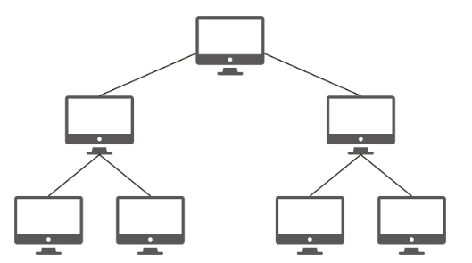

노드의 추가, 삭제가 쉬우며 특정 노드에 트래픽이 집중될 때 하위 노드에 영향을 끼칠 수 있습니다.

**버스 토폴로지**

​	버스(bus) 토폴로지는 중앙 통신 회선 하나에 여러 개의 노드가 연결되어 공유하는 네트워크 구성을 말하며 근거리 통신망(LAN)에서 사용합니다.

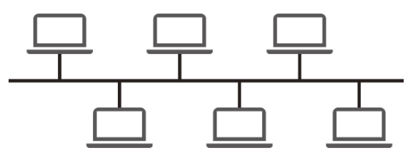

설치 비용이 적고 신뢰성이 우수하며 중앙 통신 회선에 노드를 추가하거나 삭제하기 쉽습니다. 그러나 스푸핑이 가능한 문제점이 있습니다.

**스타 토폴로지**

스타(star, 성형) 토폴로지는 중앙에 있는 노드에 모두 연결된 네트워크 구성을 말합니다.

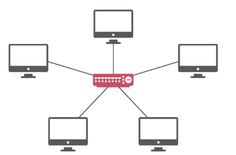

노드를 추가하거나 에러를 탐지하기 쉽고 패킷의 충돌 발생 가능성이 적습니다. 또한, 어떠한 노드에 장애가 발생해도 쉽게 에러를 발견할 수 있으며 장애 노드가 중앙 노드가 아닐 경우 다른 노드에 영향을 끼치는 것이 적습니다. 하지만 중앙 노드에 장애가 발생하면 전체 네트워크를 사용할 수 없고 설치 비용이 고가입니다.

**링형 토폴로지**

링형(ring) 토폴로지는 각각의 노드가 양 옆의 두 노드와 연결하여 전체적으로 고리처럼 하나의 연속된 길을 통해 통신을 하는 망 구성 방식입니다.

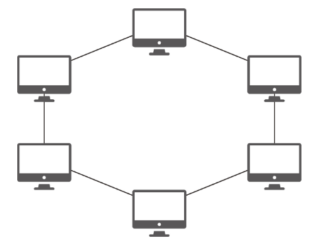

데이터는 노드에서 노드로 이동을 하게 되며, 각각의 노드는 고리 모양의 길을 통해 패킷을 처리합니다.

​	노드 수가 증가되어도 네트워크상의 손실이 거의 없고 충돌이 발생되는 가능성이 적고 노드의 고장 발견을 쉽게 찾을 수 있습니다. 하지만 네트워크 구성 변경이 어렵고 회선에 장애가 발생하면 전체 네트워크에 영향을 크게 끼치는 단점이 있습니다.

**메시 토폴로지**

메시(mesh) 토폴로지는 망형 토폴로지라고도 하며 그물망처럼 연결되어 있는 구조입니다.

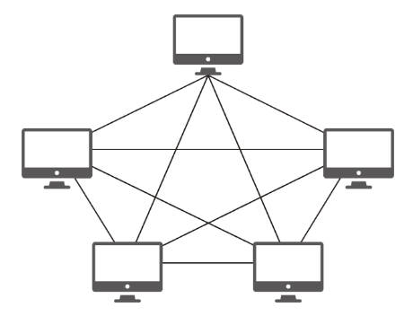

한 단말 장치에 장애가 발생해도 여러 개의 경로가 존재하므로 네트워크를 계속 사용할 수 있고 트래픽도 분산 처리가 가능합니다. 하지만 노드의 추가가 어렵고 구축 비용과 운용 비용이 고가인 단점이 있습니다.

# 네트워크 성능 분석 명령어

​	애플리케이션 코드상에는 전혀 문제가 없는데 사용자가 서비스로부터 데이터를 가져오지 못하는 상황이 발생되기도 하며, 이는 네트워크 병목 현상일 가능성이 있습니다. 네트워크 병목 현상의 주된 원인은 다음과 같습니다.

- 네트워크 대역폭
- 네트워크 토폴로지
- 서버 CPU, 메모리 사용량
- 비효율적인 네트워크 구성

 이때 네트워크 관련 테스트와 네트워크와 무관한 테스트를 통해 ‘네트워크로부터 발생한 문제점’인 것을 확인한 후 네트워크 성능 분석을 해봐야 합니다. 이때 사용되는 명령어들을 알아보겠습니다.

## ping

​	ping(Packet INternet Groper) 은 네트워크 상태를 확인하려는 대상 노드를 향해 일정 크기의 패킷을 전송하는 명령어입니다. 이를 통해 해당 노드의 패킷 수신 상태와 도달하기까지 시간 등을 알 수 있으며 해당 노드까지 네트워크가 잘 연결되어 있는지 확인할 수 있습니다.

아래는 윈도우 cmd 에서 `ping www.google.com -n 12` 명령어를 수행한 결과입니다.

1. `ping [IP 주소 또는 도메인 주소] -n [반복횟수]` 로 핑을 테스트할 수 있습니다. `-n [반복횟수 ]` 는 옵션이며 지정하지 않는다면 디폴트값은 4 입니다.
2. 32바이트 패킷을 해당 주소로 보냅니다. 응답이 다시 돌아오는 데 걸린 시간과 TTL 이 설정되어 있습니다. TTL 은 홉단위입니다.
3. ping 응답을 완료한 후 최종적인 결과를 보여줍니다.

> **TTL(Time To Live)** 는 세포의 ‘텔로미어’ 같은 역할을 합니다. 패킷이 네트워크 상을 떠돌아다니다가 목적지를 못찾으면 소멸되게 됩니다. 보통 128 이나 255 를 기본 단위로 합니다. TTL 은 라우터를 지날 때마다 1 씩 줄어드는데, 이 라우터 간 간격을 **홉(Hop)** 이라고 합니다.

## netstat

​	netstat 명령어는 접속되어 있는 서비스들의 네트워크 상태를 표시하는 데 사용되며 네트워크 접속, 라우팅 테이블, 네트워크 프로토콜 등 리스트를 보여줍니다. 주로 서비스의 포트가 열려 있는지 확인할 때 씁니다.

다음과 같이 cmd 명령창에 `netstat` 이라고 치면 됩니다.

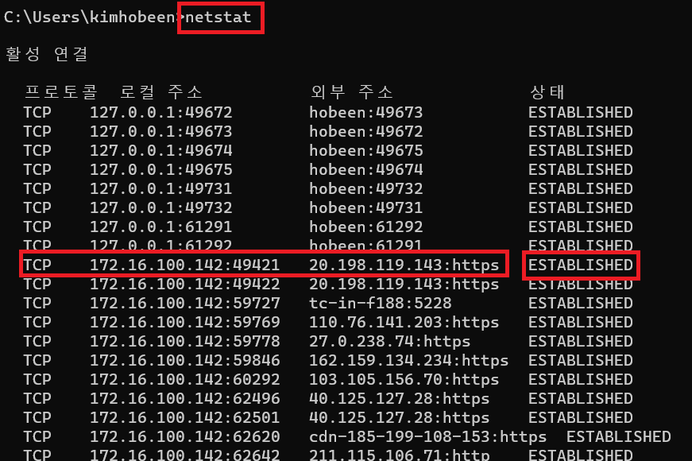

연결 포로토콜, 로컬주소 및 포트, 외부 주소 및 포트가 나와있습니다. 그리고 현재 연결 상태가 표시되었습니다. 대부분 `ESTABLISHED` 입니다. 연결 상태는 여러가지 값이 있습니다.

1. `LISTENING`: 포트가 열려 있고, 새로운 연결 요청을 기다리고 있는 상태입니다. 서버 프로세스가 해당 포트를 리스닝하고 있음을 나타냅니다.
2. `ESTABLISHED`: 포트가 열려 있고, 현재 활성화된 TCP 연결이 있는 상태입니다. 데이터 전송이 이루어지고 있는 상태입니다.
3. `CLOSE_WAIT`: 로컬 포트가 닫혀 있는 상태이지만, 원격 호스트로부터 연결 종료 요청(FIN)이 도착한 상태입니다. 연결 종료 과정에서 대기하고 있는 상태를 나타냅니다.
4. `TIME_WAIT`: 연결이 종료된 후 일정 시간 동안 포트가 사용 중인 상태입니다. 이 상태에서 대기하는 이유는 중복된 패킷이나 연결 요청이 도착하는 경우에 대비하기 위함입니다.
5. `CLOSE`: 포트가 닫혔고, 더 이상 활성화된 연결이 없는 상태입니다. 해당 포트는 더 이상 사용되지 않고 있음을 나타냅니다.
6. `FIN_WAIT1`, `FIN_WAIT2`: 연결 종료를 요청한 후, 원격 호스트로부터 확인 응답을 받기를 기다리는 상태입니다. 4-way handshake 과정에서 이 상태가 발생하며, 종료 과정이 진행 중임을 나타냅니다.
7. `SYN_SENT`: 클라이언트가 서버에게 SYN 패킷을 보냈지만, 아직 서버로부터 응답을 받지 못한 상태입니다. 클라이언트가 서버와의 연결을 시도 중임을 나타냅니다.
8. `SYN_RECEIVED`: 서버가 클라이언트로부터 SYN 패킷을 받은 상태입니다. 서버가 클라이언트와의 연결 요청을 수락하기 위해 ACK 패킷과 SYN 패킷을 보내야 합니다.

**해당 상태값은 3-way handshaking, 4-way handshaking 과정 중에 일어나는 일들** 이 대부분 입니다. 해당 과정의 자세한 내용은 [네트워크 핵심이론\] Section 4. L4 TCP, UDP](https://hobeen-kim.github.io/inflearn/네트워크-기초-Section-4.-L4-TCP,-UDP/) 을 참고하세요.

## nslookup

​	nslookup 은 DNS 에 관련된 내용을 확인하기 위해 쓰는 명령어입니다. 특정 도메인에 매핑된 IP 를 확인하기 위해 사용합니다.

아래는 cmd 명령창에 차례대로 `nslookup`, `nslookup google.com` 을 실행한 결과입니다.

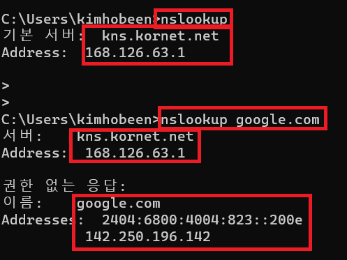

`nslookup` 을 실행하면 DNS 서버의 정보가 나옵니다. `kns.kornet.net` 은 KT 의 DNS 서버이고, 해당 서버의 IP 는 `168.126.63.1` 입니다. `nslookup google.com` 을 실행하면 먼저 KT DNS 서버 정보를 알려준 후에 ` google.com` 의 정보를 알려줍니다. ISP(Internet Service Provider) 에 따라 DNS 가 달라집니다.

### DNS 서버 변경

​	DNS 서버는 사이트 주소인 도메인을 IP 주소 변경하는 역할을 합니다. DNS 서버마다 응답하는 IP 주소가 다르고 일부 DNS 서버의 경우 특정 사이트의 주소를 정상적으로 응답하지 못하는 경우가 있습니다. 그래서 자신에게 맞는 DNS 서버로 설정해 줄 수도 있습니다. 보통은 자동으로 DNS 서버 주소 받기로 사용해도 크게 문제가 되지 않습니다.

1. 먼저 제어판에서 네트워크 연결로 들어간 뒤, 사용하는 인터넷 연결에서 속성을 클릭합니다.

   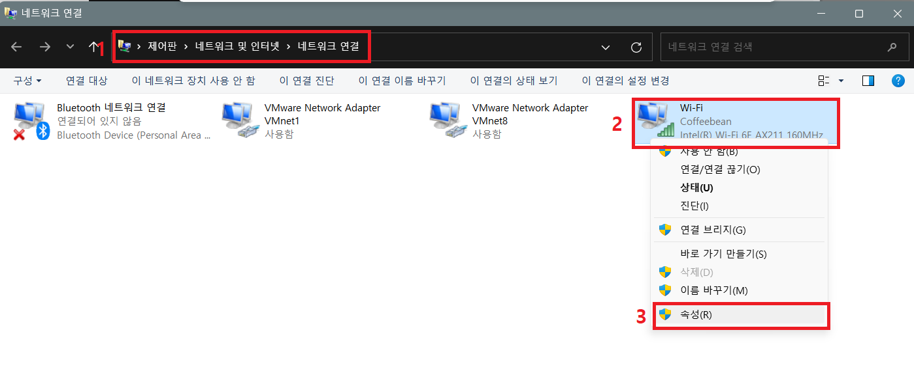

2. 속성에서 '인터넷 프로토콜 버전 4(TCP/IPv4)' 를 클릭한 뒤 DNS 서버를 '8.8.8.8(구글 DNS)' 로 설정합니다.

   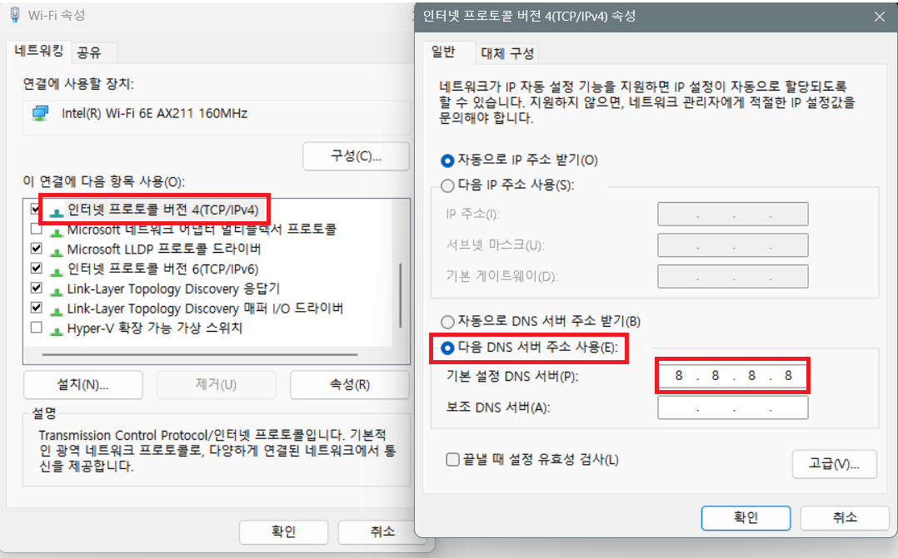

3. 이제 다시 nslookup 으로 확인하면 DNS 서버가 google DNS 서버로 변경된 것을 확인할 수 있습니다.

   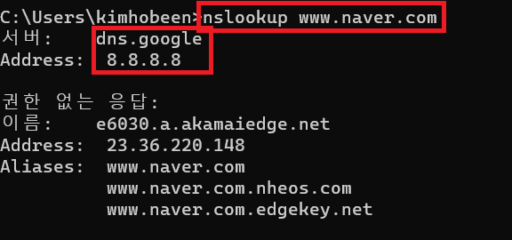

## tracert

​	목적지 노드까지 네트워크 경로를 확인할 때 사용하는 명령어입니다. 목적지 노드까지 구간들 중 어느 구간에서 응답 시간이 느려지는지 등을 확인할 수 있습니다. `tracert [IP 주소 또는 도메인 주소]` 로 확인합니다.

​	tracert 는 ICMP (Internet Control Message Protocol) 를 사용하여 패킷을 전송하며, 각 라우터에서는 TTL(Time to Live) 값을 기반으로 패킷을 처리합니다. TTL 값은 패킷이 라우터를 경유할 때마다 감소하며, 0에 도달하면 라우터에서는 패킷을 폐기하고 "시간 초과" 에러 메시지를 반환합니다.

tracert 는 목적지까지의 경로를 추적하기 위해 TTL 값을 조절하여 패킷을 전송합니다. 처음에는 TTL 값을 1로 설정하여 가장 가까운 라우터에게 패킷을 보내고, 그 다음에는 TTL 값을 2로 설정하여 그 이후의 라우터에게 패킷을 보냅니다. 이 과정을 반복하여 목적지까지의 경로를 추적하고, 각 홉에서의 응답 시간을 측정하게 됩니다.

아래 cmd 창을 보겠습니다.

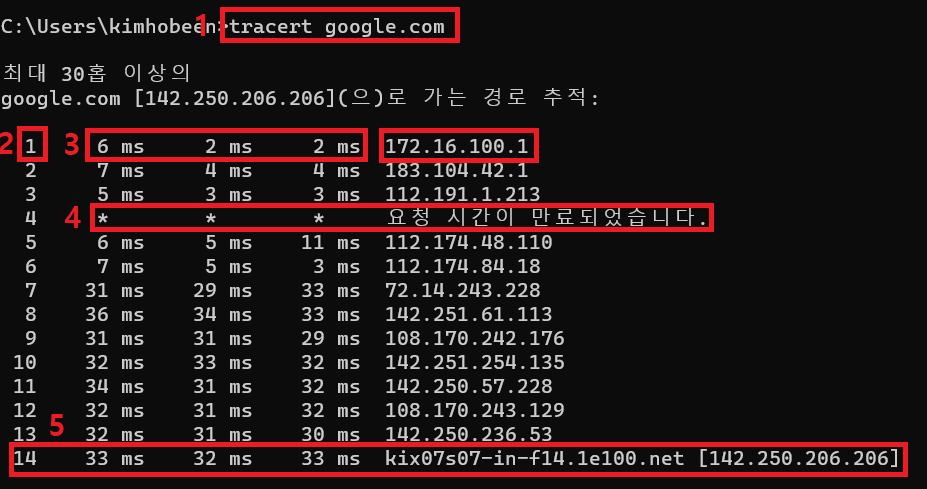

1. `tracert google.com` 으로 명령어를 실행합니다.
2. n 번째 홉임을 나타냅니다.
3. 총 3개의 패킷을 TTL = 1 로 보내고, 해당 홉에서의 응답 시간을 총 3번 측정합니다. 해당 라우터의 IP 주소와 함께 보여줍니다.
4. `*`으로 표시된 홉은 패킷이 해당 라우터를 통과하는 데 실패했거나, 해당 라우터가 응답을 거부했음을 의미합니다. 이는 보안 정책, 방화벽, 네트워크 문제 등 여러 가지 이유로 발생할 수 있습니다.
5. 마지막으로 구글까지 도착했을 때 시작입니다.

만약 특정 구간에서 시간이 늘어난다면 해당 라우터 사이에서 네트워크 문제가 있을 수 있습니다. (병목 현상, 라우터 CPU 부족 등)

아래는 그림을 통한 설명입니다.

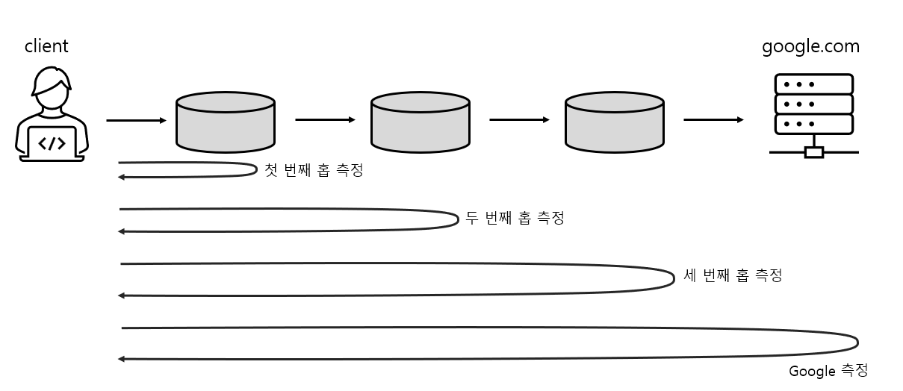

먼저 TTL = 1 로 첫 번째 라우터와의 응답 시간을 측정합니다. 그리고 TTL = 2 로 설정하여 두 번째 라우터와의 응답 시간을 측정합니다. 이렇게 점점 TTL 을 늘려가면서 최종 목적지인 Google 에 도착할 때까지 사이에 있는 라우터들의 응답 시간을 모두 측정합니다.

Traceroute는 ICMP (Internet Control Message Protocol)를 사용하여 패킷을 전송하며, 각 라우터에서는 TTL(Time to Live) 값을 기반으로 패킷을 처리합니다. TTL 값은 패킷이 라우터를 경유할 때마다 감소하며, 0에 도달하면 라우터에서는 패킷을 폐기하고 "시간 초과" 에러 메시지를 반환합니다.

Traceroute는 목적지까지의 경로를 추적하기 위해 TTL 값을 조절하여 패킷을 전송합니다. 처음에는 TTL 값을 1로 설정하여 가장 가까운 라우터에게 패킷을 보내고, 그 다음에는 TTL 값을 2로 설정하여 그 이후의 라우터에게 패킷을 보냅니다. 이 과정을 반복하여 목적지까지의 경로를 추적하고, 각 홉에서의 응답 시간을 측정하게 됩니다.

# 네트워크 프로토콜 표준화

​	네트워크 프로토콜이란 다른 장치들끼리 데이터를 주고받기 위해 설정된 공통된 인터페이스를 말합니다. 이러한 프로토콜은 기업이나 개인이 발표해서 정하는 것이 아니라 IEEE 또는 IETF라는 표준화 단체가 이를 정합니다.

1. **IEEE (Institute of Electrical and Electronics Engineers)**: 해당 기관은 전기, 전자, 컴퓨팅 기술 및 관련 분야에 대한 표준을 만드는 데 있어 세계적으로 중요한 역할을 합니다. 예를 들어, 우리가 일상적으로 사용하는 Wi-Fi 표준은 IEEE 802.11이라는 규칙에 따라 정의되어 있습니다. 또한 IEEE802.3은 유선 LAN 프로토콜로, 유선으로 LAN을 구축할 때 쓰이는 프로토콜입니다. 
2. **IETF (Internet Engineering Task Force)**: 해당 기관은 인터넷 표준을 개발하고 유지하는 역할을 합니다. 예를 들어, HTTP, SMTP, FTP와 같은 대부분의 인터넷 프로토콜은 IETF에 의해 개발되고 표준화되었습니다.

이들 조직은 다양한 분야의 전문가들이 참여하는 광범위한 커뮤니티를 통해 작동하며, 이들의 합의를 통해 새로운 표준을 만들어 냅니다. 이런 방식으로 만들어진 표준은 여러 제조사의 제품이 서로 호환될 수 있게 하고, 그로 인해 사용자들은 다양한 기기와 서비스를 자유롭게 선택하고 사용할 수 있게 됩니다.

# 예상 질문 및 답변

## ping 명령어는 어떤 명령이고 어떨 때 사용하나요?

## netstat명령어는 어떤 명령이고 어떨 때 사용하나요?

## nslookup 명령어는 어떤 명령이고 어떨 때 사용하나요?

## tracert 명령어는 어떤 명령이고 어떨 때 사용하나요?

## tracert 명령어는 어떤 방식으로 작동하나요?

## 네트워크 프로토콜을 표준화하는 기관에 대해 알고 있나요?