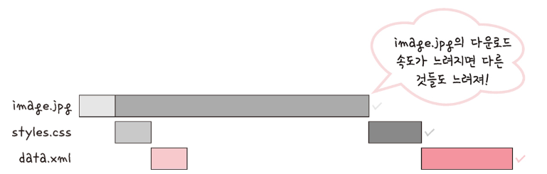
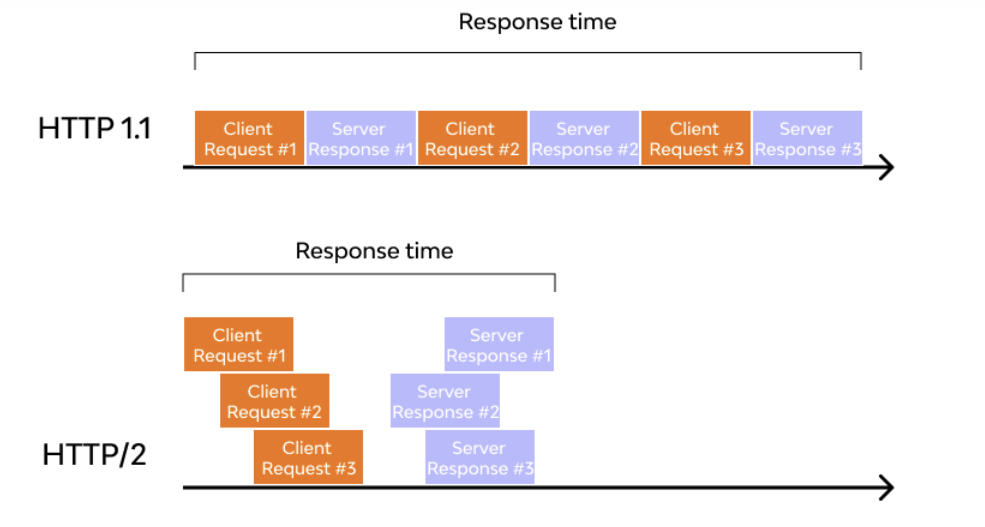
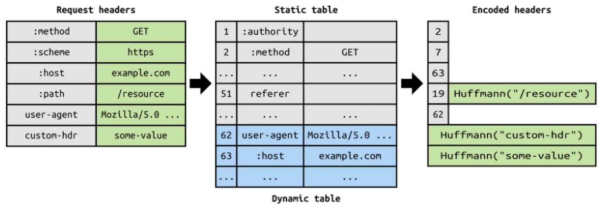
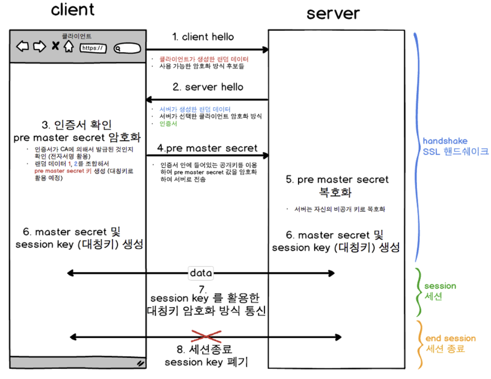
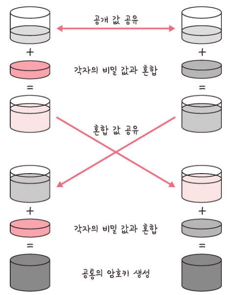

# HTTP 1.0 과 1.1

​	HTTP 1.0 은 한 연결당 하나의 요청을 처리하는 비지속적인 연결로 설계되었습니다. 이는 각 요청과 응답마다 새로운 TCP 연결을 생성하고 종료해야 하고, 이에 따라 RTT(Round Trip Time) 가 증가합니다. 매번 연결할 때마다 RTT가 증가하니 서버에 부담이 많이 가고 사용자 응답 시간이 길어졌습니다.

​	반면, HTTP 1.1 에서는 한 번 연결한 이후에 keep-alive 옵션으로 여러 개의 요청과 응답을 송수신할 수 있게 바뀌었습니다. 이를 통해  네트워크 자원을 훨씬 효율적으로 사용할 수 있습니다.


위 그림처럼 HTTP 1.0 에서는 매 요청마다 3 way-handShake 를 하지만 HTTP 1.1 은 한 번의 연결로 여러 송수신을 할 수 있습니다.

## HTTP 1.1 에서 발생하는 HOL Blocking 과 무거운 헤더구조

​	**HOL Blocking** (Head Of Line Blocking) 은 HTTP/1.1이 순차적인 패킷 전달을 요구하기 때문에 발생하는 현상입니다. 만약 한 요청이 지연되면, 그 이후의 모든 요청도 블록되어 기다려야 하는 상황을 말합니다. 이는 특히 네트워크 상황이 불안정하거나 패킷 손실이 발생하는 경우 성능 저하를 초래할 수 있습니다.



​	또한 HTTP 메세지 전송 시 사용하는 헤더는 요청이나 응답에 대한 정보, 캐싱 정책, 콘텐츠 타입, 인증 등에 대한 데이터를 포함하는데, 해당 데이터가 매 요청마다 반복되어 전송된다는 문제가 있습니다. 이를 **무거운 헤더구조**라고 하는데, 많은 양의 중복 데이터를 전송하게 되며, 전체적인 효율성을 저하시킵니다.

# HTTP 2.0

​	HTTP 2.0 은 SPDY 프로토콜에서 파생된 HTTP 1.x보다 지연 시간을 줄이고 응답 시간을 더 빠르게 할 수 있으며 멀티플렉싱, 헤더 압축, 서버 푸시, 요청의 우선순위 처리를 지원하는 프로토콜입니다.

## HTTP 2.0 의 특징

### 멀티플렉싱(multiplexing)

​	HTTP 2.0 은 멀티플렉싱(multiplexing) 을 통해 하나의 TCP 연결로 여러 요청과 응답을 동시에 교환할 수 있습니다. 이는 각 요청/응답이 별도의 **스트림**으로 처리되며, 이 스트림들이 동시에 처리될 수 있음을 의미합니다. 이로 인해 네트워크 효율성이 크게 향상되며, HOL Blocking 문제도 해결됩니다.



​	HTTP 1.1의 경우, 같은 연결을 통해 한 번에 하나의 요청-응답 쌍만 처리할 수 있었으며, 다음 요청은 이전 요청이 완료된 후에만 전송될 수 있었습니다. 이러한 점은 Head-of-Line(HOL) Blocking 문제를 초래하였습니다.

 멀티플렉싱 기능을 통해 HTTP 2.0 은  이러한 HOL Blocking 문제를 해결하였습니다. HTTP 2.0 은 단일 TCP 연결을 통해 동시에 여러 요청과 응답을 교환하고, 각 요청/응답을 독립적인 스트림으로 분리하여 처리합니다. 따라서 하나의 요청이 지연되더라도 다른 요청들이 계속 처리될 수 있습니다. 이는 네트워크 효율성과 웹 성능을 크게 향상시킵니다.

### 헤더 압축

​	HTTP 2.0 은 **HPACK** 라는 특수한 압축 알고리즘을 사용하여 헤더 데이터를 압축합니다. 이를 통해 요청과 응답에 포함된 중복 헤더 정보의 데이터 전송량을 크게 줄일 수 있습니다.



​	만일 메세지 헤더에 중복값이 존재하는 경우, 위의 그림에서 Static / Dynamic Header Table 개념을 사용하여 중복 헤더를 검출하고, 중복된 헤더는 index 값만 전송하고 중복되지 않은 Header 정보의 값은 호프만 인코딩(Huffman Encoding) 기법을 사용하는 **HPACK 압축 방식**으로 인코딩 처리 하여 전송하여, 데이터 전송 효율을 높입니다.

### 서버 푸시

​	HTTP 2.0 은 서버가 클라이언트의 명시적인 요청 없이도 리소스를 클라이언트에게 **푸시**할 수 있는 기능을 제공합니다. 이는 서버가 클라이언트가 다음에 요청할 리소스를 미리 예측하고 빠르게 전송할 수 있게 해, 성능을 더욱 향상시킵니다.

### 흐름 제어 및 우선 순위 지정 

​	HTTP 2.0 은 각 스트림에 대해 흐름 제어를 제공하며, 클라이언트와 서버가 각각의 스트림에 우선 순위를 지정할 수 있게 합니다. 이는 네트워크 자원을 더욱 효과적으로 사용하는 데 도움이 됩니다.

# HTTPS

## HTTP 와 HTTPS 의 차이점

​	HTTPS는 HTTP의 보안 버전입니다. HTTPS는 SSL/TLS 를 사용하여 데이터를 암호화합니다. 이는 중간자 공격을 통해 데이터를 도청하거나 변조하는 것을 방지해줍니다. HTTPS를 사용하면 웹 서버와 클라이언트 사이에서 교환되는 모든 데이터가 암호화되므로, 사용자의 정보가 안전하게 보호됩니다.

## HTTPS 에서 최초 연결 시 연결 과정

HTTPS에서 최초 연결이 이루어질 때, SSL/TLS 핸드셰이크라는 과정이 일어납니다. 이 과정은 클라이언트(웹 브라우저)와 서버 사이에 안전한 연결을 설정하기 위한 것으로, 아래와 같은 순서로 진행됩니다.



1. **클라이언트 헬로(Client Hello):** 클라이언트는 서버에게 "헬로" 메시지를 보냅니다. 이 메시지에는 클라이언트가 지원하는 SSL/TLS 버전, 암호화 알고리즘 목록(싸이퍼 스위트), 그리고 랜덤으로 생성한 데이터가 포함됩니다.
2. **서버 헬로(Server Hello):** 서버는 클라이언트에게 "헬로" 메시지를 응답합니다. 이 메시지에는 서버가 선택한 SSL/TLS 버전, 암호화 알고리즘, 그리고 랜덤으로 생성한 데이터가 포함됩니다. 또한, 서버는 자신의 공개키가 담긴 인증서도 함께 보냅니다.
3. **인증서 검증:** 클라이언트는 서버의 인증서를 검증합니다. 이는 인증서가 신뢰할 수 있는 CA(Certificate Authority)에 의해 발급되었는지, 그리고 인증서가 만료되지 않았는지 확인하는 과정입니다.
4. **Pre-Master Secret 생성 및 전송:** 클라이언트는 랜덤 데이터로 이루어진 Pre-Master Secret을 생성하고, 이를 서버의 공개키로 암호화하여 서버에게 전송합니다.
5. **Pre-Master Secret 복호화** : 서버는 비공개 키를 통해 전송받은 Pre-Master Secret 를 복호화합니다.
6. **세션 키 생성:** 클라이언트와 서버 모두 Pre-Master Secret, 클라이언트 헬로 메시지의 랜덤 데이터, 그리고 서버 헬로 메시지의 랜덤 데이터를 이용하여 동일한 세션 키를 생성합니다.
7. **핸드셰이크 완료:** 이제 클라이언트와 서버는 모두 동일한 세션 키를 갖게 되었으며, 이 세션 키를 이용하여 통신하는 모든 데이터를 암호화 및 복호화할 수 있습니다. 클라이언트와 서버는 서로에게 암호화된 핸드셰이크 완료 메시지를 보내 연결이 성공적으로 설정되었음을 알립니다.

이러한 과정을 통해 클라이언트와 서버 사이에 안전한 HTTPS 연결이 설정됩니다. 이 연결이 설정된 후에는, 클라이언트와 서버 사이에서 교환되는 모든 데이터가 세션 키를 이용하여 암호화되어 안전하게 전송됩니다.

이러한 키 교환 암호화 알고리즘으로은 대수곡선 기반의 ECDHE(Elliptic Curve Diffie-Hellman Ephermeral) 또는 모듈식 기반의 DHE(Diffie-Hellman Ephermeral)를 사용하는데, 둘 다 **디피-헬만(Diffie-Hellman) 방**식을 근간으로 만들어졌습니다.



​	앞의 그림처럼 처음에 공개 값을 공유하고 각자의 비밀 값과 혼합한 후 혼합 값을 공유합니다. 그다음 각자의 비밀 값과 또 혼합합니다. 그 이후에 공통의 암호키가 생성되는 것이죠.

## SHA-256 해싱 알고리즘이란?

​	SHA-256 해싱 알고리즘 SSL/TLS 에서 해싱 알고리즘으로 많이 사용하고 있습니다. SHA-256은 "Secure Hash Algorithm 256-bit"의 약자로, 암호학적 해시 함수의 한 종류입니다. 이는 데이터 블록을 입력으로 받아 고정 길이의 유일한 문자열(해시 값) 을 출력하는 함수입니다. SHA-256 해싱 알고리즘은 어떤 크기의 입력이라도 항상 256비트 길이의 해시 값을 생성하며 원래의 입력 데이터를 추론할 수 없는 단방향입니다.

​	또한 충돌 저항성이 낮습니다. 충돌이란 두 개의 다른 입력이 같은 해시 값을 가질 수 있는 상황을 말합니다. 하지만, SHA-256은 충돌 저항성이 매우 높아서, 실제로 충돌을 발견하는 것은 계산적으로 거의 불가능합니다.

# SEO 를 관리하기 위한 방법

​	SEO(Search Engine Optimization)는 검색엔진 최적화를 뜻하며 사용자들이 구글, 네이버 같은 검색엔진으로 웹 사이트를 검색했을 때 그 결과를 페이지 상단에 노출시켜 많은 사람이 볼 수 있도록 최적화하는 방법을 의미합니다. 이를 위한 방법으로 캐노니컬 설정, 메타 설정, 페이지 속도 개선, 사이트맵 관리 등이 있습니다. 또한 HTTPS 를구축하는 것도 최적화를 위한 방법 중 하나입니다.

## 캐노니컬 설정

​	캐노니컬 태그는 한 페이지를 가리키는 여러 개의 주소가 존재할 때, 검색 엔진이 어떤 주소가 원본인지 알 수 있도록 하기 위해 사용하는 태그입니다.

```
https://www.mysite.com/shop
https://www.mysite.com/shop?ct=1
https://www.mysite.com/shop?utm_campaign=event
```

​	예를 들어 위와 같이 동일한 페이지지만 파라미터 값이 있거나 데이터 분석을 위한 추적코드를 삽입한 경우가 있다고 가정할 때 실질적으로는 동일한 페이지로 연결되지만 URL은 다를 수 있습니다. 하지만 검색엔진이 볼 때는 아래 URL는 콘텐츠가 유사한 다른 페이지로 인식하며 이 페이지들을 동일한 페이지의 중복 버전으로 간주하게 됩니다.

​	이때 캐노니컬 태그를 적용하지 않으면 의도와 다른 페이지를 원본페이지로 인식하거나, 검색엔진에게 패널티를 받을 수 있습니다. 분산된 URL 주소는 SEO 점수를 낮출 수 있으며 의도가 고의적인지 알 수가 없기 때문에 검색엔진이 패널티를 줍니다.

​	캐노니컬 태그는 아래와 같이 합니다.

```
<head>
   <link rel="canonical" href="https://www.mysite.com/shop">
</head>
```

## 메타 설정

메타는 메타 데이터를 의미하며 이러한 태그가 제공하는 데이터의 종류인 페이지의 데이터에 대한 정보입니다. 즉, 메타 데이터는 방문하는 검색엔진 로봇들을 위해 페이지에 저장된 컨텐츠 입니다. 메타태그를 통해 검색엔진에게 홈페이지의 컨텐츠가 무엇에 관한 것인지 쉽게 알려줄 수 있으므로 SEO에 매우 중요합니다.

## 페이지 속도 개선

​	2010년 Google에서는 사이트 속도가 검색 순위에 반영될 것이라고 발표했습니다. Google에서의 자체 조사에 따르면 모바일 사이트의 53%가 로드되는 데 3초 이상 걸리면 사용자가 완전히 포기한다고 합니다.

​	 구글의 PageSpeedInsights 에서 페이지 속도 리포팅을 받을 수 있습니다.

• 페이지 인사이트 링크: https://developers.google.com/speed/pagespeed/insights/

## 사이트맵 관리

​	사이트맵이란 웹사이트에서 구글이나 네이버와 같은 검색 엔진에 색인할 모든 페이지를 나열한 XML 파일로, 웹사이트에 방문하는 검색엔진 크롤러에게 지도와 같은 역할을 합니다.

```html
<?xml version="1.0" encoding="UTF-8"?>
<urlset xmlns="http://www.sitemaps.org/schemas/sitemap/0.9">
   <url>
      <loc>http://www.example.com/</loc>
      <lastmod>2005-01-01</lastmod>
      <changefreq>monthly</changefreq>
      <priority>0.8</priority>
   </url>
   <url>
      <loc>http://www.example.com/catalog?item=12&amp;desc=vacation_hawaii</loc>
      <changefreq>weekly</changefreq>
   </url>
   <url>
      <loc>http://www.example.com/catalog?item=73&amp;desc=vacation_new_zealand</loc>
      <lastmod>2004-12-23</lastmod>
      <changefreq>weekly</changefreq>
   </url>
   <url>
      <loc>http://www.example.com/catalog?item=74&amp;desc=vacation_newfoundland</loc>
      <lastmod>2004-12-23T18:00:15+00:00</lastmod>
      <priority>0.3</priority>
   </url>
   <url>
      <loc>http://www.example.com/catalog?item=83&amp;desc=vacation_usa</loc>
      <lastmod>2004-11-23</lastmod>
   </url>
</urlset>
```

검색엔진에게 웹사이트에서 크롤링되고 색인이 되어야 할 중요한 페이지들에 대한 정보를 제공함으로써 웹사이트가 더 효율적으로 크롤링되는데 도움을 주기 때문에 결과적으로 검색엔진 최적화에 긍정적인 영향을 끼칩니다.

# HTTP 3.0 특징

 	HTTP 3.0 의 가장 두드러진 특징은 TCP 대신 **QUIC** 프로토콜을 사용하는 것입니다. QUIC (Quick UDP Internet Connections) 는 Google 에서 개발한 UDP 기반의 전송 프로토콜 입니다. QUIC은 TCP의 3-way handshake 과정을 최적화 하는 것에 초점을 두고 개발되었습니다. Google에서 TCP의 구조적 문제로 성능 향상이 어렵다고 판단하여 UDP 기반을 선택했고 이는 네트워크 전환시 연결의 지연 시간을 줄이고, 패킷 손실 시 전체 연결의 속도 저하를 방지하는 등의 이점을 제공합니다. 또한  QUIC는 TLS 1.3을 기본으로 내장하고 있어, 별도의 TLS 핸드셰이크 과정 없이 연결 설정 시 암호화를 제공합니다. 

# Ref

[ HTTP 2.0 소개 & 통신 기술 알아보기](https://inpa.tistory.com/entry/WEB-%F0%9F%8C%90-HTTP-20-%ED%86%B5%EC%8B%A0-%EA%B8%B0%EC%88%A0-%EC%9D%B4%EC%A0%9C%EB%8A%94-%ED%99%95%EC%8B%A4%ED%9E%88-%EC%9D%B4%ED%95%B4%ED%95%98%EC%9E%90#http_2.0_%ED%86%B5%EC%8B%A0_%EA%B3%BC%EC%A0%95)