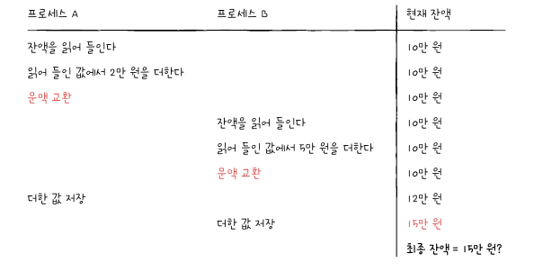
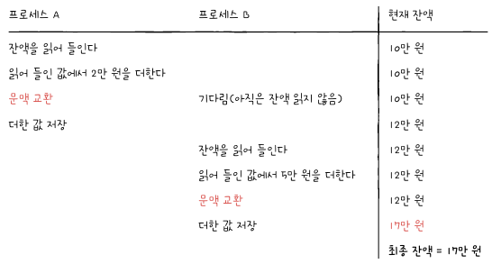
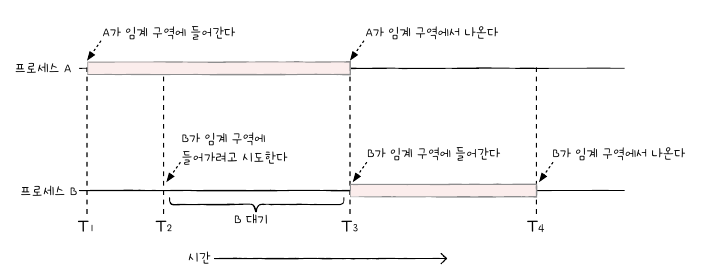
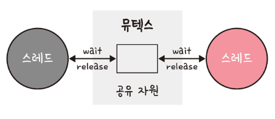
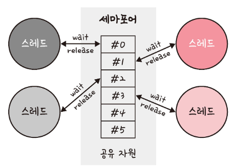
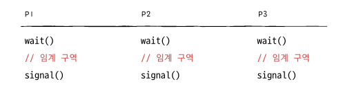
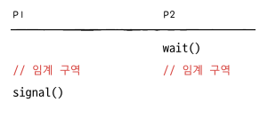
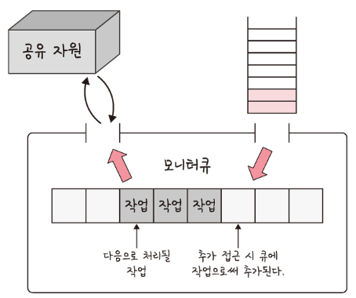

# 프로세스와 컴파일 과정

​	프로세스는 컴퓨터에서 실행되고 있는 프로그램을 말합니다. 스레드는 프로세스 내 작업의 흐름을 지칭합니다.ㄴ


프로그램이 **메모리에 올라가면 프로세스가 되는 인스턴스화가 일어납니다.**

## 프로세스와 컴파일 과정

​	컴파일이란 프로그램이 컴퓨터가 이해할 수 있는 기계어로 번역되어 실행될 수 있는 파일이 되는 것입니다. 프로그램의 컴파일 과정은 아래와 같습니다.

> 여기서 말하는 프로그램이란 **C 언어 기반의 프로그램**을 의미하며, 이는 별도의 컴파일 과정 없이 한 번에 한 줄씩 읽어들여서 실행하는 프로그램인 인터프리터 언어(파이썬 등)로 된 프로그램과는 다릅니다.


- 전처리 : 소스 코드의 주석을 제거하고 # include 등 헤더 파일을 병합하여 매크로를 치환합니다.
- 컴파일러 : 오류 처리, 코드 최적화 작업을 하며 어셈블리어로 변환합니다.
- 어셈블러 : 어셈블리어는 목적 코드(object code)로 변환됩니다.
- 링커 : 프로그램 내에 있는 라이브러리 함수 또는 다른 파일들과 목적 코드를 결합하여 실행 파일을 만듭니다.
- 라이브러리 : 라이브러리는 정적 라이브러리와 동적 라이브러리로 나뉩니다. 
  - **정적 라이브러리**는 프로그램 빌드 시 라이브러리가 제공하는 모든 코드를 실행 파일에 넣는 방식이며, 시스템 환경 등 외부 의존도가 낮고 코드 중복 등 메모리 효율성이 떨어지는 단점이 있습니다.
  - **동적 라이브러리**는 프로그램 실행 시 필요할 때만 DLL이라는 함수 정보를 통해 참조하는 방식이며, 메모리 효율성에서의 장점과 외부 의존도가 높아진다는 단점이 있습니다.

 # 프로세스의 상태

​	프로세스는 저마다의 상태가 있습니다. 예를 들어서 윈도우 작업 관리자의 [자세히] 탭을 보면 프로세스의 상태가 보이죠.


이런 상태 프로세스는 PCB 에 기록됩니다. PCB 는 뒤에 자세히 기술하겠습니다.

​	컴퓨터는 여러 프로세스들을 빠르게 번갈아가면서 실행합니다. 그 과정에서 하나의 프로세스는 여러 상태를 거치며 실행되게 되는데요. **운영체제는 프로세스의 상태를 PCB 를 통해 인식하고 관리합니다.** 프로세스 상태를 표현하는 방식은 대표적으로 아래와 같습니다.


## 생성 상태

​	프로세스를 생성 중인 상태를 생성상태(**create**) 라고 합니다. `fork()` 또는 `exec()` 함수를 통해 생성합니다. 이때 **PCB가 할당**됩니다.

​	 `fork()` 는 부모 프로세스에서 자식 프로세스를 생성하는 함수이고 `exec()` 는 새로운 프로세스를 생성하는 함수입니다. 해당 함수는 뒤에서 더 자세히 알아보겠습니다.

## 대기 상태

​	대기 상태(**ready**) 는 메모리 공간이 충분하면 메모리를 할당받고 아니면 아닌 상태로 대기하고 있으며 실행 차례가 되면 CPU 스케줄러로부터 CPU 소유권이 넘어오기를 기다리는 상태입니다.

> 준비 상태인 프로세스가 실행상태로 전환되는 것을 디스패치(dispatch) 라고 합니다.

## 대기 중단 상태

​	대기 중단 상태(**ready suspended**) 는 메모리 부족으로 일시 중단된 상태입니다.

## 실행 상태

​	실행 상태(**running**) 는 CPU 소유권과 메모리를 할당받고 인스트럭션을 수행 중인 상태를 의미합니다. 이때 프로세스가 할당된 시간을 모두 사용한다면 (타이머 인터럽트가 발생하면) 다시 준비상태가 되고, 실행 도중 입출력장치를 사용하여 입출력장치의 작업이 끝날 때까지 기다려야 한다면 중단 상태(**blocked**) 가 됩니다.

## 중단 상태

​	중단 상태(**blocked**)는 어떤 이벤트가 발생한 이후 기다리며 프로세스가 차단된 상태입니다. I/O 디바이스에 의한 인터럽트로 이런 현상이 많이 발생하기도 합니다. 

​	입출력 작업은 CPU 에 비해 처리 속도가 느리기 때문에, 입출력 작업을 요청한 프로세스는 입출력장치가 입출력을 끝날 때까지(입출력 완료 인터럽트를 받을 때까지) 기다려야 합니다. 이렇게 기다리는 상태가 중단 상태입니다. 입출력 작업이 완료되면 해당 프로세스는 다시 준비 상태로 CPU 할당을 기다립니다.

## 일시 중단 상태

일시 중단 상태(**blocked suspended**)는 대기 중단과 유사합니다. 중단된 상태에서 프로세스가 실행되려고 했지만 메모리 부족으로 일시 중단된 상태입니다.

## 종료 상태

종료 상태(**terminated**)는 메모리와 CPU 소유권을 모두 놓고 가는 상태를 말합니다. 

# 프로세스의 메모리 구조

​	프로세스가 생성되는 커널 영역에는 PCB 가 생성되고 사용자 영역에는 프로세스가 배치됩니다.


​	사용자 영역의 메모리는 아래와 같이 동적영역의 스택, 힙 영역과 정적 영역인 데이터, 코드 영역으로 구분됩니다.


## 스택 영역

​	스택 영역(**stack segment**) 은 **데이터를 일시적으로 저장하는 공간**입니다. 스택에는 지역변수, 매개변수, 함수가 저장되고 컴파일 시에 크기가 결정되며 '동적'인 특징을 갖습니다.

​	일시적으로 저장할 데이터는 스택 영역에 PUSH 되고, 더 이상 필요하지 않은 데이터는 POP 됨으로써 스택 영역에서 사라집니다.

​	스택 영역은 함수가 함수를 재귀적으로 호출하면서 동적으로 크기가 늘어날 수 있는데, 이때 힙과 스택의 메모리 영역이 겹치면 안 되기 때문에 힙과 스택 사이의 공간을 비워 놓습니다. 따라서 **힙 영역은 메모리가 낮은 주소에서 높은 주소로 할당되고, 스택 영역은 높은 주소에서 낮은 주소로 할당됩니다.**

 

## 힙 영역

​	힙 영역(**heap segment**) 은 프로그래머가 직접 할당할 수 있는 저장 공간입니다. 힙 영역에 메모리 공간을 할당했다면 언전가는 해당 공간을 반환해야 합니다. 메모리 공간을 반환하는 의미는 '더 이상 해당 메모리 공간을 사용하지 않겠다' 라고 운영체제에 말해주는 것과 같습니다.

​	메모리 공간을 반환하지 않는다면 할당한 공간은 메모리 내에 계속 남아 메모리 낭비를 초래합니다. 이런 문제를 메모리 누수(**memory leak**) 라고 합니다.

## 데이터 영역

​	데이터 영역(**data segment**) 은 프로그램이 실행되는 동안 유지할 데이터가 저장되는 공간입니다. 전역변수, 정적변수가 저장되고, 정적인 특징을 갖는 프로그램이 종료되면 사라지는 변수가 들어 있는 영역입니다.

​	데이터 영역과 아래의 코드 영역은 그 크기가 변하지 않습니다. 그래서 해당 영역을 **정적 할당 영역**이라고 부릅니다.

## 코드 영역

​	코드 영역(**code segment**) 은 프로그램에 내장되어 있는 소스 코드가 들어가는 영역입니다. 이 영역은 수정 불가능한 기계어로 저장되어 있으며 정적인 특징을 가집니다. 

​	해당 영역은 CPU 가 실행할 명령어가 담겨 있기 때문에 쓰기가 금지되어 있는 읽기 전용(read-only) 공간 입니다.

# PCB

​	모든 프로세스는 실행을 위해 CPU 를 필요로 하지만 CPU 자원은 한정되어 있습니다. 그렇기 때문에 프로세스들은 차례대로 돌아가면서 CPU 를 이용합니다.

​	운영체제는 빠르게 번갈아 수행되는 프로세스의 실행순서를 관리하고 자원을 배분해야 하는데, 이를 위해 운영체제는 **<span style="color:orange">PCB(Process Control Block, 프로세스 제어 블록)</span>** 을 이용합니다. **PCB 는 메모리 영역 중 커널 영역에 생성**됩니다.

​	PCB 는 운영체제에서 프로세스에 대한 메타데이터를 저장한 **데이터**를 말하며 <u>해당 프로세스를 식별하기 위해 꼭 필요한 정보들이 저장됩니다.</u>

## PCB 의 구조

PCB는 프로세스 스케줄링 상태, 프로세스 ID 등의 다음과 같은 정보로 이루어져 있습니다.

- **프로세스 스케줄링 상태** : 준비, 일시중단 등 프로세스가 어떤 상태인지 저장되어 있습니다.
- **프로세스 ID** : 프로세스 ID, 해당 프로세스의 자식 프로세스 ID 가 있습니다. 같은 프로그램이라도 두 번 실행하면 PID 가 다른 두 개의 프로세스가 생성됩니다.
- **프로세스 권한** : 컴퓨터 자원 또는 I/O 디바이스에 대한 권한 정보입니다.
- **프로그램 카운터** : 프로세스에서 실행해야 할 다음 명령어의 주소에 대한 포인터입니다.
- **CPU 레지스터** : 프로세스를 실행하기 위해 저장해야 할 레지스터에 대한 정보입니다. <u>프로세스는 자신의 실행 차례가 돌아오면 이전까지 사용했던 레지스터의 중간값들을 모두 복원합니다.</u> 그래야만 이전까지 진행했던 작업들을 그대로 이어 실행할 수 있기 때문이빈다.
- **CPU 스케줄링 정보** : 프로세스가 언제, 어떤 순서로 CPU  를 할당받을지에 대한 정보입니다.
- **계정 정보** : 프로세스 실행에 사용된 CPU 사용량, 실행한 유저의 정보입니다.
- **I/O 상태 정보** : 프로세스에 할당된 I/O 디바이스 목록입니다.

## 컨텍스트 스위칭

​	하나의 프로세스에서 다른 프로세스로 실행 순서가 넘어가면 컨텍스트 스위칭(context switching) 이 발생합니다. 예를 들어 프로세스 A 가 실행되다고 프로세스 B 로 CPU 사용을 넘긴다고 가정해보겠습니다.

​	이 상황에서 직전까지 실행되된 A 는 프로그램 카운터를 비롯한 각종 레지스터 값, 메모리 정보, 실행을 위해 열었던 파일이나 입출력 장치 등 중간 정보를 백업해야 합니다. 그래야 다음 차례가 왔을 떄 다시 실행을 재개할 수 있기 때문입니다.

​	이러한 기억해야 할 중간 정보를 **<span style="color:orange">문맥(context)</span>** 이라고 합니다. 하나의 프로세스 문맥은 해당 프로세스의 PCB 에 표현되어있습니다. 

​	컴퓨터는 많은 프로그램을 동시에 실행하는 것처럼 보이지만 어떠한 시점에서 실행되고 있는 프로세스는 단 한 개이며, 많은 프로세스가 동시에 구동되는 것처럼 보이는 것은 다른 프로세스와의 컨텍스트 스위칭이 아주 빠른 속도로 실행되기 때문입니다. (싱글코어 기준)


​	앞의 그림처럼 한 개의 프로세스 A가 실행하다 멈추고, 프로세스 A의 PCB를 저장하고 다시 프로세스 B를 로드하여 실행합니다. 그리고 다시 프로세스 B의 PCB 를 저장하고 프로세스 A의 PCB를 로드합니다. 컨텍스트 스위칭이 일어날 때 앞의 그림처럼 **유휴 시간(idle time)** 이 발생하는 것을 볼 수 있습니다. 이뿐만 아니라 이 컨텍스트 스위칭에 드는 비용이 더 있습니다. 바로 **캐시미스** 입니다.

 ### 캐시미스

​	컨텍스트 스위치가 일어나면, 새로운 프로세스가 실행되기 위해 해당 프로세스의 컨텍스트 정보를 메모리에서 CPU로 가져와야 합니다.

​	이 때, 캐시 클리어 과정이 필요합니다. 캐시는 CPU가 빠르게 접근할 수 있는 작은 메모리 영역으로, 이전에 실행되던 프로세스(A 프로세스) 의 정보가 여전히 남아있을 수 있습니다. 새로운 프로세스의 컨텍스트를 불러오기 전에 이전 프로세스의 데이터를 제거하거나 무효화하는 과정이 필요한데, 이를 '**캐시 클리어**'라고 합니다.

​	캐시 클리어 과정에서 캐시 미스가 발생합니다. <u>캐시 미스는 CPU가 캐시에서 데이터를 찾으려고 할 때 해당 데이터가 캐시에 없는 상황을 의미</u>합니다. 캐시가 클리어된 상태에서 새로운 프로세스의 데이터를 불러오려고 하면, 해당 데이터는 캐시에 존재하지 않으므로 메인 메모리에서 불러와야 하며, 이 과정에서 캐시 미스가 발생하게 됩니다.

​	결국, 캐시 미스는 추가적인 시간이 소요되므로 컨텍스트 스위칭의 비용을 늘리는 요소 중 하나라고 할 수 있습니다.

## 스레드에서의 컨텍스트 스위칭

​	컨텍스트 스위칭은 스레드에서도 일어납니다. 스레드는 스택 영역을 제외한 모든 메모리를 공유하기 때문에 스레드 컨텍스트 스위칭의 경우 비용이 더 적고 시간도 더 적게 걸립니다.

# 멀티프로세싱과 멀티스레딩

## 멀티 프로세싱

​	멀티프로세싱은 즉 멀티프로세스를 통해 동시에 두 가지 이상의 일을 수행할 수 있는 것을 말합니다. 이를 통해 하나 이상의 일을 병렬로 처리할 수 있으며 특정 프로세스의 메모리, 프로세스 중 일부에 문제가 발생되더라도 다른 프로세스를 이용해서 처리할 수 있으므로 신뢰성이 높은 강점이 있습니다.

## IPC

​	멀티프로세스는 IPC (Inter Process Communication) 를 통해 프로세스끼리 데이터를 주고받고 공유 데이터를 관리합니다. IPC의 종류로는 **공유 메모리, 파일, 소켓, 익명 파이프, 명명 파이프, 메시지 큐**가 있습니다. <u>이들은 모두 메모리가 완전히 공유되는 스레드보다는 속도가 떨어집니다.</u>

## 멀티 스레딩

​	멀티스레딩은 프로세스 내 작업을 여러 개의 스레드, 멀티스레드로 처리하는 기법이며 스레드끼리 서로 자원을 공유하기 때문에 효율성이 높습니다. 


아래는 멀티 프로세스와 멀티 스레드에 관한 추가 포스팅입니다. [[java\] 멀티 프로세스와 멀티 스레드, 스레드풀](https://hobeen-kim.github.io/java/JAVA-%EB%A9%80%ED%8B%B0-%ED%94%84%EB%A1%9C%EC%84%B8%EC%8A%A4%EC%99%80-%EB%A9%80%ED%8B%B0-%EC%8A%A4%EB%A0%88%EB%93%9C,-%EC%8A%A4%EB%A0%88%EB%93%9C%ED%92%80/#%EB%A9%80%ED%8B%B0-%ED%94%84%EB%A1%9C%EC%84%B8%EC%8A%A4%EC%99%80-%EB%A9%80%ED%8B%B0-%EC%8A%A4%EB%A0%88%EB%93%9C)

# 공유 자원과 임계 영역

## 동기화란

​	멀티 프로세싱 환경에서 프로세스들은 실행 순서와 자원의 일관성을 보장해야 합니다. 이를 **<span style="color:orange">동기화(synchronization)</span>** 라고 합니다. 프로세스 동기화는 크게 아래 두가지를 일컫습니다.

- 실행 순서 제어 : 프로세스를 올바른 순서대로 실행하기
- 상호 배제 : 동시에 접근해서는 안되는 자원에 하나의 프로세스만 접근하게 하기

> 프로세스뿐만 아니라 스레드도 동기화 대상입니다. 정확히 말하면 실행의 흐름을 갖는 모든 것은 동기화 대상입니다.

### 실행 순서 제어를 위한 동기화

​	예를 들어 Writer 프로세스와 Reader 프로세스가 있다고 가정하겠습니다. 두 프로세스는 각각 Book.txt 를 쓰고 읽는 역할을 합니다. 두 프로세스는 아무 순서대로 실행되어서는 안되는데, Reader 프로세스보다 Writer 프로세스가 먼저 실행되어야 합니다. 즉, 먼저 쓰고 나서 읽어야 하는 것입니다. 이렇게 **동시에 실행되는 프로세스를 올바른 순서대로 실행하는 것이 실행 순서 제어를 위한 동기화**입니다.

### 상호 배제를 위한 동기화

​	상호 배제(mutual exclusion) 는 공유가 불가능한 자원의 동시 사용을 피하기 위해 사용하는 알고리즘입니다. 예를 들어 계좌에 10만 원이 저축되어 있고 프로세스 A 는 현재 저축된 금액에 2만원을 넣는(+) 프로세스, 프로세스 B 는 현재 저축된 금액에 5만원을 넣는(+) 프로세스라고 가정해보겠습니다.

- 프로세스 A : 계좌의 잔액 읽기 -> 읽은 잔액에 2만 원 넣기(+) -> 더한 값을 저장
- 프로세스 B : 계좌의 잔액 읽기 -> 읽은 잔액에 5만 원 넣기(+) -> 더한 값을 저장

​	만약 프로세스 A, B 가 동시에 실행되면 당연히 17만 원이 계좌에 남을 것을 기대합니다. 하지만 동기화가 제대로 이루어지지 않으면 다음과 같이 진행됩니다.



​	최종 잔액은 15만원입니다. 이런 일이 발생한 이유는 A 와 B 는 **'잔액'** 이라는 데이터를 동시에 사용하는데, A 가 끝나기 전에 B 가 잔액을 읽어버렸기 때문입니다. **A 와 B 를 올바르게 실행하기 위해서는 아래와 같이 한 프로세스가 잔액에 접근했을 때 다른 프로세스는 기다려야 합니다.**



​	이렇게 **동시에 접근해서 안되는 자원에 동시에 접근하지 못하게 하는 것이 상호 배제를 위한 동기화**입니다.

## 공유 자원

​	동시에 접근해서 안되는 자원을 **공유 자원(shared resource)** 이라고 부릅니다. 공유 자원은 시스템 안에서 각 프로세스, 스레드가 함께 접근할 수 있는 모니터, 프린터, 메모리, 파일, 데이터 등의 자원이나 변수 등을 의미합니다. 이 공유 자원을 두 개 이상의 프로세스가 동시에 읽거나 쓰는 상황을 경쟁 상태(race condition) 라고 합니다.

## 임계 영역

​	**임계 영역(critical section)** 은 <u>둘 이상의 프로세스, 스레드가 공유 자원에 접근할 때 순서 등의 이유로 결과가 달라지는 코드 영역을 말합니다.</u> 두 개 이상의 프로세스가 임계 구역에 진입하고자 하면 둘 중 하나는 대기해야 합니다.



임계 영역을 해결하기 위한 방법은 크게 뮤텍스, 세마포어, 모니터 세 가지가 있으며, 이 방법 모두 **상호 배제, 한정 대기, 융통성**이란 조건을 만족합니다. 이 방법에 토대가 되는 메커니즘은 잠금(lock)입니다. 

> - 상호 배제 :한 프로세스가 임계 영역에 들어갔을 때 다른 프로세스는 들어갈 수 없다.
> - 한정 대기 : 특정 프로세스가 영원히 임계 영역에 들어가지 못하면 안 된다.
> - 융통성 : 한 프로세스가 다른 프로세스의 일을 방해해서는 안 된다.

## 동기화 기법

### 뮤텍스

​	뮤텍스(Mutex, MUTual EXclustion) 는 프로세스나 스레드가 공유 자원을 lock()을 통해 잠금 설정하고 사용한 후에는 unlock()을 통해 잠금 해제하는 객체입니다. 잠금이 설정되면 다른 프로세스나 스레드는 잠긴 코드 영역에 접근할 수 없고 해제는 그와 반대입니다. 또한 뮤텍스는 잠금 또는 잠금 해제라는 상태만을 가집니다.



뮤텍스는 하나의 전역 변수와 두 개의 함수로 매우 단순한 형태로 구현할 수 있습니다.

- 자물쇠 역할 : 프로세스들이 공유하는 전역 변수 lock
- 임계 구역을 잠그는 역할 : acquire 함수
- 임계 구역 잠금을 해제하는 역할 : release 함수

```java
boolean lock;

acquire(){
	while(lock == true){} //만약 임계구역이 잠겨있다면 임계구역이 잠겨 있는지 계속 확인
	lock = true;
}

release(){
	lock = false;
}

void method(){
	acquire();
	// 임계구역
	release();
}
```

​	간단하게 위와 같이 표현할 수 있습니다.

아래는 자바 코드로 구현한 간단한 뮤텍스입니다. 공유 자원인 `account` 에 스레드 t1, t2 가 1000원 씩 10번 저장하는 로직입니다.

> 아래 뮤텍스는 스레드 단위의 락이지만 실행 흐름이라는 측면에서 봐주기 바랍니다.

```java
public class Main {
    public static void main(String[] args) throws InterruptedException {
        MutexLock mutexLock = new MutexLock();

        Thread t1 = new Thread(() -> {
            try {
                for(int i = 0; i < 10; i++){
                    mutexLock.deposit(1000);
                }
            } catch (InterruptedException e) {
                e.printStackTrace();
            }
        }, "t1");

        Thread t2 = new Thread(() -> {

            try {
                for(int i = 0; i < 10; i++){
                    mutexLock.deposit(1000);
                }
            } catch (InterruptedException e) {
                throw new RuntimeException(e);
            }

        }, "t2");

        t1.start();
        t2.start();

        Thread.sleep(15000L);
    }
}
```

Thread t1, t2 는 각각 1000원을 10번씩 예금합니다.

```java
public class MutexLock {

    private boolean lock;
    private int account = 10000;

    synchronized void acquire() throws InterruptedException {
        while (lock) {
            System.out.println(Thread.currentThread().getName() + " is waiting for lock ...");
            wait();
        }
        System.out.println(Thread.currentThread().getName() + " acquired lock");
        lock = true;
    }

    synchronized void release() {
        System.out.println(Thread.currentThread().getName() + " is releasing lock ...");
        lock = false;
        notify();
    }

    void deposit(int amount) throws InterruptedException {
        acquire();
        System.out.println(Thread.currentThread().getName() + " is depositing ...");
        Thread.sleep(500L);
        account += amount;
        System.out.println("current account: " + account);
        release();
    }
}
```

​	`acquire()`, `release()` 는  `synchronized` 키워드를 사용합니다. 락을 확인하는 동안에 다른 쓰레드가 락을 획득하거나 놓을 수 있기 때문에 `synchronized` 가 없다면 동시성 문제를 일으킵니다. `synchronized` 키워드를 이용하면 특정 메소드 또는 블록을 한 번에 한 쓰레드만 실행할 수 있게 할 수 있습니다.

​	그리고 `while (lock)` 안에서 계속 lock 의 상태를 확인하지 않도록 `wait()` 를 합니다. `release()` 에서 `notify()` 로 스레드를 깨웁니다. 두 메서드 모두 `synchronized` 가 있어야 사용할 수 있습니다.

실행 로그는 아래와 같습니다.

```
t1 acquired lock
t1 is depositing ...
t2 is waiting for lock ...
current account: 11000
t1 is releasing lock ...
t1 acquired lock
t1 is depositing ...
t2 is waiting for lock ...
current account: 12000
t1 is releasing lock ...
t2 acquired lock
t2 is depositing ...
t1 is waiting for lock ...
current account: 13000
t2 is releasing lock ...
t2 acquired lock
t2 is depositing ...
t1 is waiting for lock ...
current account: 14000
t2 is releasing lock ...
t2 acquired lock
t2 is depositing ...
t1 is waiting for lock ...
current account: 15000
t2 is releasing lock ...
t2 acquired lock
t2 is depositing ...
t1 is waiting for lock ...
current account: 16000
t2 is releasing lock ...
...
```


### 세마포어

세마포어(semaphore) 는 일반화된 뮤텍스입니다. 간단한 정수 값과 두 가지 함수 wait(P 함수라고도 함) 및 signal(V 함수라고도 함)로 공유 자원에 대한 접근을 처리합니다.

wait()는 자신의 차례가 올 때까지 기다리는 함수이며, signal()은 다음 프로세스로 순서를 넘겨주는 함수입니다.



​	예를 들어 옷가게에 탈의실이 세 개 있다고 생각해보겠습니다. 하나의 탈의실에는 한 사람만 들어갈 수 있지만 세 명이 동시에 탈의실을 이용할 수 있습니다. 즉, 하나의 자원을 사용할 수 있는 프로세스는 하나지만, 총 세 개의 프로세스가 공유 자원을 이용할 수 있습니다.


​	세마포어는 뮤텍스와 비슷하게 하나의 변수와 두 개의 함수로 단순하게 구현할 수 있습니다.

- 임계 구역에 진입할 수 있는 프로세스 개수를 나타내는 **전역변수 S**
- 임계 구역에 들어가도 좋은지 기다려야 할지를 알려주는 **wait 함수**
- 임계 구역 앞에서 기다리는 프로세스에 '이제 가도 좋다' 고 신호를 주는 **signal 함수**

```
int S = 2;

wait(){
	while( S <= 0){}
	S--;
}

signal(){
	S++;
}

void method(){
	wait()
	//임계구역
	signal();
}
```

​	예를 들어 세 개의 프로세스 P1, P2, P3 가 두 개의 공유자원에 P1, P2, P3 순서대로 접근한다고 가정할 때 아래와 같은 순서로 실행됩니다.



1. 프로세스 P1 `wait()` 호출, S 는 현재 2 이므로 S 를 1 감소시키고 임계 구역 진입
2. 프로세스 P2 `wait()` 호출, S 는 현재 1 이므로 S 를 1 감소시키고 임계 구역 진입
3. 프로세스 P3 `wait()` 호출, S 는 현재 0 이므로 무한히 반복하며 S 확인
4. 프로세스 P1 임계 구역 작업 종료, `signal()` 호출, S 를 1 증가
5. 프로세스 P3 는 S 가 1 이 됨을 확인하고 S 를 1 감소시키고 임계 구역 진입

​	또한 세마포어를 통해 실행 순서 제어를 위한 동기화도 할 수 있습니다. 방법은 간단한데요. 세마포 변수 S 를 0 으로 두고 먼저 실행할 프로세스 뒤에 signal 함수, 다음에 실행할 프로세스 앞에 wait 함수를 붙이면 됩니다.



​	이 경우, P1 이 먼저 실행되면 P1 이 임계 구역에 먼저 진입하는 건 당연한 일이고, P2 가 먼저 실행되더라도 `wait()` 함수로 인해 P1 이 먼저 임계 구역에 진입합니다. 그리고 P1 이 실행을 끝내고 `signal()` 을 호출해야 P2 가 임계 구역에 진입합니다. 즉, 어떤 프로세스가 먼저 실행되든 임계구역에서 순서는 P1, P2 로 실행됩니다.

**바이너리 세마포어**

​	위에서 예시로 든 건 **카운팅 세마포어** 입니다. 카운팅 세마포어는 여러 개의 값을 가질 수 있는 세마포어이며, 여러 자원에 대한 접근을 제어하는 데 사용됩니다.

​	반면 바이너리 세마포어는 0과 1의 두 가지 값만 가질 수 있는 세마포어입니다. 구현의 유사성으로 인해 뮤텍스는 바이너리 세마포어라고 할 수 있지만 엄밀히 말하면 뮤텍스는 잠금을 기반으로 상호배제가 일어나는 ‘잠금 메커니즘’이고, 세마포어는 신호를 기반으로 상호 배제가 일어나는 ‘신호 메커니즘’입니다. 

### 모니터

​	세마포어는 임계 구역 앞뒤로 일일이 wait, signal 함수를 명시해줘야 하기 때문에 번거롭기도 하고 휴먼 에러 가능성도 있습니다. 이를 해결하기 위해 **모니터**는 둘 이상의 스레드나 프로세스가 공유 자원에 안전하게 접근할 수 있도록 공유 자원을 숨기고 해당 접근에 대해 인터페이스만 제공합니다.



앞의 그림처럼 모니터는 모니터큐를 통해 공유 자원에 대한 작업들을 순차적으로 처리합니다.

​	모니터는 세마포어보다 구현하기 쉬우며 모니터에서 상호 배제는 자동인 반면에, 세마포어에서는 상호 배제를 명시적으로 구현해야 하는 차이점이 있습니다.

# 교착 상태 (작성중)

교착 상태(deadlock)는 두 개 이상의 프로세스들이 서로가 가진 자원을 기다리며 중단된 상태를 말합니다. 예를 들어 프로세스 A가 프로세스 B의 어떤 자원을 요청할 때 프로세스 B도 프로세스 A가 점유하고 있는 자원을 요청하는 것이죠. 이에 대한 원인과 해결 방법은 다음과 같습니다.

## 교착 상태의 원인

• 상호 배제: 한 프로세스가 자원을 독점하고 있으며 다른 프로세스들은 접근이 불가능합니다.

• 점유 대기: 특정 프로세스가 점유한 자원을 다른 프로세스가 요청하는 상태입니다.

• 비선점: 다른 프로세스의 자원을 강제적으로 가져올 수 없습니다.

• 환형 대기: 프로세스 A는 프로세스 B의 자원을 요구하고, 프로세스 B는 프로세스 A의 자원을 요구하는 등 서로가 서로의 자원을 요구하는 상황을 말합니다.

## 교착 상태의 해결 방법

1. 자원을 할당할 때 애초에 조건이 성립되지 않도록 설계합니다.
2. 교착 상태 가능성이 없을 때만 자원 할당되며, 프로세스당 요청할 자원들의 최대치를 통해 자원 할당 가능 여부를 파악하는 ‘은행원 알고리즘’을 씁니다.
3. 교착 상태가 발생하면 사이클이 있는지 찾아보고 이에 관련된 프로세스를 한 개씩 지웁니다.
4. 교착 상태는 매우 드물게 일어나기 때문에 이를 처리하는 비용이 더 커서 교착 상태가 발생하면 사용자가 작업을 종료합니다. 현대 운영체제는 이 방법을 채택했습니다. 예를 들어 프로세스를 실행시키다 ‘응답 없음’이라고 뜰 때가 있죠? 교착 상태가 발생한 경우에 이와 같은 경우가 발생하기도 합니다.

# Ref.

1. [혼자 공부하는 컴퓨터 구조+운영체제](https://product.kyobobook.co.kr/detail/S000061584886)
