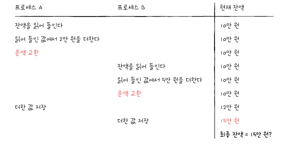
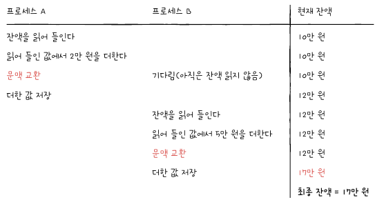
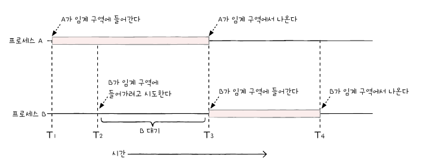
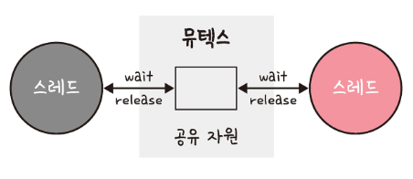
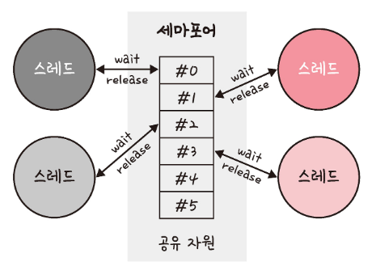
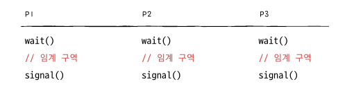
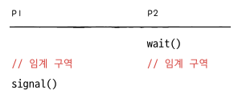
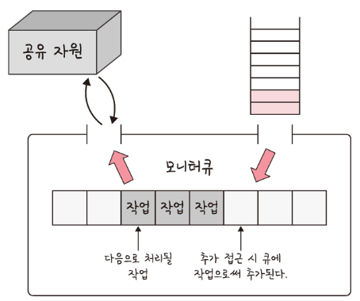
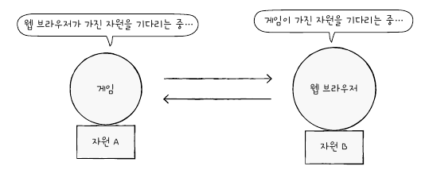

# 공유 자원과 임계 영역

## 동기화란

​	멀티 프로세싱 환경에서 프로세스들은 실행 순서와 자원의 일관성을 보장해야 합니다. 이를 **<span style="color:orange">동기화(synchronization)</span>** 라고 합니다. 프로세스 동기화는 크게 아래 두가지를 일컫습니다.

- 실행 순서 제어 : 프로세스를 올바른 순서대로 실행하기
- 상호 배제 : 동시에 접근해서는 안되는 자원에 하나의 프로세스만 접근하게 하기

> 프로세스뿐만 아니라 스레드도 동기화 대상입니다. 정확히 말하면 실행의 흐름을 갖는 모든 것은 동기화 대상입니다.

### 실행 순서 제어를 위한 동기화

​	예를 들어 Writer 프로세스와 Reader 프로세스가 있다고 가정하겠습니다. 두 프로세스는 각각 Book.txt 를 쓰고 읽는 역할을 합니다. 두 프로세스는 아무 순서대로 실행되어서는 안되는데, Reader 프로세스보다 Writer 프로세스가 먼저 실행되어야 합니다. 즉, 먼저 쓰고 나서 읽어야 하는 것입니다. 이렇게 **동시에 실행되는 프로세스를 올바른 순서대로 실행하는 것이 실행 순서 제어를 위한 동기화**입니다.

### 상호 배제를 위한 동기화

​	상호 배제(mutual exclusion) 는 공유가 불가능한 자원의 동시 사용을 피하기 위해 사용하는 알고리즘입니다. 예를 들어 계좌에 10만 원이 저축되어 있고 프로세스 A 는 현재 저축된 금액에 2만원을 넣는(+) 프로세스, 프로세스 B 는 현재 저축된 금액에 5만원을 넣는(+) 프로세스라고 가정해보겠습니다.

- 프로세스 A : 계좌의 잔액 읽기 -> 읽은 잔액에 2만 원 넣기(+) -> 더한 값을 저장
- 프로세스 B : 계좌의 잔액 읽기 -> 읽은 잔액에 5만 원 넣기(+) -> 더한 값을 저장

​	만약 프로세스 A, B 가 동시에 실행되면 당연히 17만 원이 계좌에 남을 것을 기대합니다. 하지만 동기화가 제대로 이루어지지 않으면 다음과 같이 진행됩니다.



​	최종 잔액은 15만원입니다. 이런 일이 발생한 이유는 A 와 B 는 **'잔액'** 이라는 데이터를 동시에 사용하는데, A 가 끝나기 전에 B 가 잔액을 읽어버렸기 때문입니다. **A 와 B 를 올바르게 실행하기 위해서는 아래와 같이 한 프로세스가 잔액에 접근했을 때 다른 프로세스는 기다려야 합니다.**



​	이렇게 **동시에 접근해서 안되는 자원에 동시에 접근하지 못하게 하는 것이 상호 배제를 위한 동기화**입니다.

## 공유 자원

​	동시에 접근해서 안되는 자원을 **공유 자원(shared resource)** 이라고 부릅니다. 공유 자원은 시스템 안에서 각 프로세스, 스레드가 함께 접근할 수 있는 모니터, 프린터, 메모리, 파일, 데이터 등의 자원이나 변수 등을 의미합니다. 이 공유 자원을 두 개 이상의 프로세스가 동시에 읽거나 쓰는 상황을 경쟁 상태(race condition) 라고 합니다.

## 임계 영역

​	**임계 영역(critical section)** 은 <u>둘 이상의 프로세스, 스레드가 공유 자원에 접근할 때 순서 등의 이유로 결과가 달라지는 코드 영역을 말합니다.</u> 두 개 이상의 프로세스가 임계 구역에 진입하고자 하면 둘 중 하나는 대기해야 합니다.



임계 영역을 해결하기 위한 방법은 크게 뮤텍스, 세마포어, 모니터 세 가지가 있으며, 이 방법 모두 **상호 배제, 한정 대기, 융통성**이란 조건을 만족합니다. 이 방법에 토대가 되는 메커니즘은 잠금(lock)입니다. 

> - 상호 배제 :한 프로세스가 임계 영역에 들어갔을 때 다른 프로세스는 들어갈 수 없다.
> - 한정 대기 : 특정 프로세스가 영원히 임계 영역에 들어가지 못하면 안 된다.
> - 융통성 : 한 프로세스가 다른 프로세스의 일을 방해해서는 안 된다.

## 동기화 기법

### 뮤텍스

​	뮤텍스(Mutex, MUTual EXclustion) 는 프로세스나 스레드가 공유 자원을 lock()을 통해 잠금 설정하고 사용한 후에는 unlock()을 통해 잠금 해제하는 객체입니다. 잠금이 설정되면 다른 프로세스나 스레드는 잠긴 코드 영역에 접근할 수 없고 해제는 그와 반대입니다. 또한 뮤텍스는 잠금 또는 잠금 해제라는 상태만을 가집니다.



뮤텍스는 하나의 전역 변수와 두 개의 함수로 매우 단순한 형태로 구현할 수 있습니다.

- 자물쇠 역할 : 프로세스들이 공유하는 전역 변수 lock
- 임계 구역을 잠그는 역할 : acquire 함수
- 임계 구역 잠금을 해제하는 역할 : release 함수

```java
boolean lock;

acquire(){
	while(lock == true){} //만약 임계구역이 잠겨있다면 임계구역이 잠겨 있는지 계속 확인
	lock = true;
}

release(){
	lock = false;
}

void method(){
	acquire();
	// 임계구역
	release();
}
```

​	간단하게 위와 같이 표현할 수 있습니다.

아래는 자바 코드로 구현한 간단한 뮤텍스입니다. 공유 자원인 `account` 에 스레드 t1, t2 가 1000원 씩 10번 저장하는 로직입니다.

> 아래 뮤텍스는 스레드 단위의 락이지만 실행 흐름이라는 측면에서 봐주기 바랍니다.

```java
public class Main {
    public static void main(String[] args) throws InterruptedException {
        MutexLock mutexLock = new MutexLock();

        Thread t1 = new Thread(() -> {
            try {
                for(int i = 0; i < 10; i++){
                    mutexLock.deposit(1000);
                }
            } catch (InterruptedException e) {
                e.printStackTrace();
            }
        }, "t1");

        Thread t2 = new Thread(() -> {

            try {
                for(int i = 0; i < 10; i++){
                    mutexLock.deposit(1000);
                }
            } catch (InterruptedException e) {
                throw new RuntimeException(e);
            }

        }, "t2");

        t1.start();
        t2.start();

        Thread.sleep(15000L);
    }
}
```

Thread t1, t2 는 각각 1000원을 10번씩 예금합니다.

```java
public class MutexLock {

    private boolean lock;
    private int account = 10000;

    synchronized void acquire() throws InterruptedException {
        while (lock) {
            System.out.println(Thread.currentThread().getName() + " is waiting for lock ...");
            wait();
        }
        System.out.println(Thread.currentThread().getName() + " acquired lock");
        lock = true;
    }

    synchronized void release() {
        System.out.println(Thread.currentThread().getName() + " is releasing lock ...");
        lock = false;
        notify();
    }

    void deposit(int amount) throws InterruptedException {
        acquire();
        System.out.println(Thread.currentThread().getName() + " is depositing ...");
        Thread.sleep(500L);
        account += amount;
        System.out.println("current account: " + account);
        release();
    }
}
```

​	`acquire()`, `release()` 는  `synchronized` 키워드를 사용합니다. 락을 확인하는 동안에 다른 쓰레드가 락을 획득하거나 놓을 수 있기 때문에 `synchronized` 가 없다면 동시성 문제를 일으킵니다. `synchronized` 키워드를 이용하면 특정 메소드 또는 블록을 한 번에 한 쓰레드만 실행할 수 있게 할 수 있습니다.

​	그리고 `while (lock)` 안에서 계속 lock 의 상태를 확인하지 않도록 `wait()` 를 합니다. `release()` 에서 `notify()` 로 스레드를 깨웁니다. 두 메서드 모두 `synchronized` 가 있어야 사용할 수 있습니다.

실행 로그는 아래와 같습니다.

```
t1 acquired lock
t1 is depositing ...
t2 is waiting for lock ...
current account: 11000
t1 is releasing lock ...
t1 acquired lock
t1 is depositing ...
t2 is waiting for lock ...
current account: 12000
t1 is releasing lock ...
t2 acquired lock
t2 is depositing ...
t1 is waiting for lock ...
current account: 13000
t2 is releasing lock ...
t2 acquired lock
t2 is depositing ...
t1 is waiting for lock ...
current account: 14000
t2 is releasing lock ...
t2 acquired lock
t2 is depositing ...
t1 is waiting for lock ...
current account: 15000
t2 is releasing lock ...
t2 acquired lock
t2 is depositing ...
t1 is waiting for lock ...
current account: 16000
t2 is releasing lock ...
...
```


### 세마포어

세마포어(semaphore) 는 일반화된 뮤텍스입니다. 간단한 정수 값과 두 가지 함수 wait(P 함수라고도 함) 및 signal(V 함수라고도 함)로 공유 자원에 대한 접근을 처리합니다.

wait()는 자신의 차례가 올 때까지 기다리는 함수이며, signal()은 다음 프로세스로 순서를 넘겨주는 함수입니다.



​	예를 들어 옷가게에 탈의실이 세 개 있다고 생각해보겠습니다. 하나의 탈의실에는 한 사람만 들어갈 수 있지만 세 명이 동시에 탈의실을 이용할 수 있습니다. 즉, 하나의 자원을 사용할 수 있는 프로세스는 하나지만, 총 세 개의 프로세스가 공유 자원을 이용할 수 있습니다.


​	세마포어는 뮤텍스와 비슷하게 하나의 변수와 두 개의 함수로 단순하게 구현할 수 있습니다.

- 임계 구역에 진입할 수 있는 프로세스 개수를 나타내는 **전역변수 S**
- 임계 구역에 들어가도 좋은지 기다려야 할지를 알려주는 **wait 함수**
- 임계 구역 앞에서 기다리는 프로세스에 '이제 가도 좋다' 고 신호를 주는 **signal 함수**

```
int S = 2;

wait(){
	while( S <= 0){}
	S--;
}

signal(){
	S++;
}

void method(){
	wait()
	//임계구역
	signal();
}
```

​	예를 들어 세 개의 프로세스 P1, P2, P3 가 두 개의 공유자원에 P1, P2, P3 순서대로 접근한다고 가정할 때 아래와 같은 순서로 실행됩니다.



1. 프로세스 P1 `wait()` 호출, S 는 현재 2 이므로 S 를 1 감소시키고 임계 구역 진입
2. 프로세스 P2 `wait()` 호출, S 는 현재 1 이므로 S 를 1 감소시키고 임계 구역 진입
3. 프로세스 P3 `wait()` 호출, S 는 현재 0 이므로 무한히 반복하며 S 확인
4. 프로세스 P1 임계 구역 작업 종료, `signal()` 호출, S 를 1 증가
5. 프로세스 P3 는 S 가 1 이 됨을 확인하고 S 를 1 감소시키고 임계 구역 진입

​	또한 세마포어를 통해 실행 순서 제어를 위한 동기화도 할 수 있습니다. 방법은 간단한데요. 세마포 변수 S 를 0 으로 두고 먼저 실행할 프로세스 뒤에 signal 함수, 다음에 실행할 프로세스 앞에 wait 함수를 붙이면 됩니다.



​	이 경우, P1 이 먼저 실행되면 P1 이 임계 구역에 먼저 진입하는 건 당연한 일이고, P2 가 먼저 실행되더라도 `wait()` 함수로 인해 P1 이 먼저 임계 구역에 진입합니다. 그리고 P1 이 실행을 끝내고 `signal()` 을 호출해야 P2 가 임계 구역에 진입합니다. 즉, 어떤 프로세스가 먼저 실행되든 임계구역에서 순서는 P1, P2 로 실행됩니다.

**바이너리 세마포어**

​	위에서 예시로 든 건 **카운팅 세마포어** 입니다. 카운팅 세마포어는 여러 개의 값을 가질 수 있는 세마포어이며, 여러 자원에 대한 접근을 제어하는 데 사용됩니다.

​	반면 바이너리 세마포어는 0과 1의 두 가지 값만 가질 수 있는 세마포어입니다. 구현의 유사성으로 인해 뮤텍스는 바이너리 세마포어라고 할 수 있지만 엄밀히 말하면 뮤텍스는 잠금을 기반으로 상호배제가 일어나는 ‘잠금 메커니즘’이고, 세마포어는 신호를 기반으로 상호 배제가 일어나는 ‘신호 메커니즘’입니다. 

### 모니터

​	세마포어는 임계 구역 앞뒤로 일일이 wait, signal 함수를 명시해줘야 하기 때문에 번거롭기도 하고 휴먼 에러 가능성도 있습니다. 이를 해결하기 위해 **모니터**는 둘 이상의 스레드나 프로세스가 공유 자원에 안전하게 접근할 수 있도록 공유 자원을 숨기고 해당 접근에 대해 인터페이스만 제공합니다.



앞의 그림처럼 모니터는 모니터큐를 통해 공유 자원에 대한 작업들을 순차적으로 처리합니다.

​	모니터는 세마포어보다 구현하기 쉬우며 모니터에서 상호 배제는 자동인 반면에, 세마포어에서는 상호 배제를 명시적으로 구현해야 하는 차이점이 있습니다.

# 교착 상태 

​	교착 상태(deadlock) 는 두 개 이상의 프로세스들이 서로가 가진 자원을 기다리며 중단된 상태를 말합니다. 예를 들어 게임 프로세스는 자원 A 를 점유한 채 웹 브라우저 프로세스가 점유하고 있는 자원 B 의 사용이 끝나길 기다리고, 웹 브라우저 프로세스는 자원 B 를 점유한 채 게임 프로세스의 자원 A 사용이 끝나길 기다리는 상황과 같습니다. 이런 경우 게임과 웹 브라우저 프로세스는 상대방이 가진 자원을 기다리기만 하다가 결국실행 한 번 못하는 상황이 벌어집니다.



## 교착 상태의 원인

​	교착 상태 발생 조건에는 네 가지가 있습니다. 아래 조건 중 하나라도 만족하지 않는다면 교착 상태가 발생하지 않지만 모두 만족할 때 교착 상태가 발생할 가능성이 생깁니다.

- 상호 배제(mutual exclusion)  : 한 프로세스가 자원을 독점하고 있으며 다른 프로세스들은 접근이 불가능합니다.
- 점유 대기(hold and wait) : 특정 프로세스가 점유한 자원을 다른 프로세스가 요청하는 상태입니다.
- 비선점(nonpreemptive) : 다른 프로세스의 자원을 강제적으로 가져올 수 없습니다.
- 환형 대기(circular wait) : 프로세스 A는 프로세스 B의 자원을 요구하고, 프로세스 B는 프로세스 A의 자원을 요구하는 등 서로가 서로의 자원을 요구하는 상황을 말합니다.

## 교착 상태의 해결 방법

1. 자원을 할당할 때 애초에 조건이 성립되지 않도록 설계합니다.
2. 교착 상태 가능성이 없을 때만 자원 할당되며, 프로세스당 요청할 자원들의 최대치를 통해 자원 할당 가능 여부를 파악하는 ‘은행원 알고리즘’을 씁니다.
3. 교착 상태가 발생하면 사이클이 있는지 찾아보고 이에 관련된 프로세스를 한 개씩 지웁니다.
4. 교착 상태는 매우 드물게 일어나기 때문에 이를 처리하는 비용이 더 커서 교착 상태가 발생하면 사용자가 작업을 종료합니다. 현대 운영체제는 이 방법을 채택했습니다. 예를 들어  교착 상태가 발생한 경우에 프로세스를 실행시키다 ‘응답 없음’이라고 뜨는 경우입니다.

>은행원 알고리즘에서 운영체제는 안전상태를 유지할 수 있는 요구만 수락하고 불안전 상태를 초래할 사용자의 요구는 나중에 만족될 수 있을 때까지 계속 거절합니다.
>
>- 안전 상태 (Safe State) : 시스템이 교착 상태를 일의지 않으면서 각 프로세스가 요구한 최대 요구량만큼 필요한 자원을 할당해줄 수 있는 상태로 안전순서열이 존재하는 상태를 말합니다.
>- 불안전상태 (Unsafe State) : 안전순서열이 존재하지 않는 상태로, 불안전상태는 교착생태이기 위한 필요조건입니다.

# Ref.

1. [혼자 공부하는 컴퓨터 구조+운영체제](https://product.kyobobook.co.kr/detail/S000061584886)