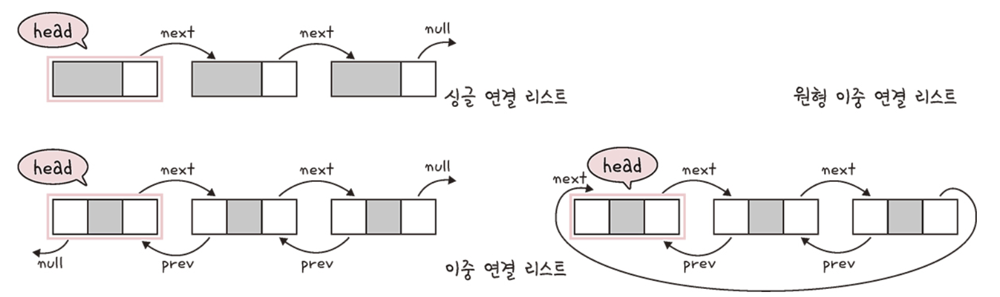
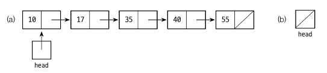
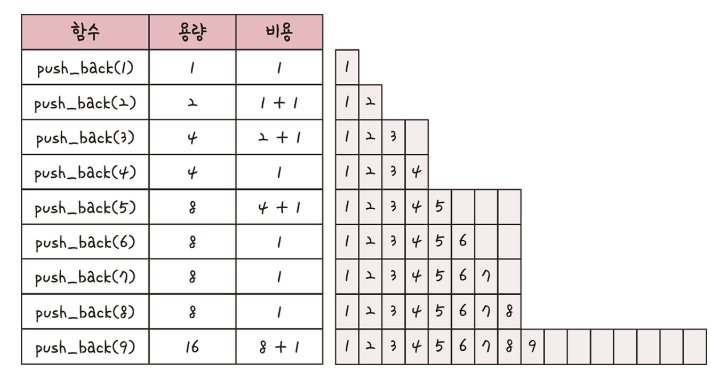
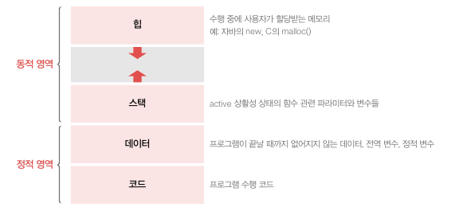
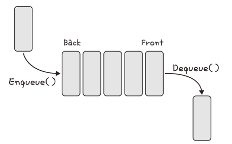

# 연결 리스트

연결 리스트는 싱글 연결 리스트, 이중 연결 리스트, 원형 이중 연결 리스트가 있습니다. 삽입과 삭제가 O(1) 이 걸리며 탐색에는 O(n) 이 걸립니다.

## 싱글 연결 리스트

​	연결 리스트는 원소가 추가될 때마다 공간을 할당받아 추가하는 방식으로, 배열의 공간 낭비를 피할 수 있는 자료구조입니다. 연결 리스트의 노드는 item 과 다음 노드를 가리키는 next 로 구성됩니다. item 은 Primitive type 이나 클래스 객체가 될 수 있습니다. next 는 다음 노드를 가리키는 링크입니다. 

## 이중 연결리스트

​	이중 연결 리스트는 싱글 연결 리스트에서 에서 이전 노드의 주소값인 prev 를 가지고 있습니다.

## 이중 원형 연결리스트

​	이중 원형 연결 리스트에서는 마지막 원소의 next 가 더미 헤드 노드를 가리키고, 헤드노드의 prev 가 마지막 노드를 가리킵니다.

# 배열

​	배열(array)은 같은 타입의 변수들로 이루어져 있고, 크기가 정해져 있으며, 인접한 메모리 위치에 있는 데이터를 모아놓은 집합입니다. 또한, 중복을 허용하고 순서가 있습니다.

## 배열과 연결리스트 비교

1. 배열 리스트는 고정된 크기를 지니고 있고, 연결 리스트는 원소가 들어오는 대로 공간을 할당받습니다.
2. 배열리스트는 연속된 공간에 저장하기 때문에 정렬이나 인덱스로 찾을 때 연결리스트보다 빠릅니다. k 번째 값을 찾을 때 배열리스트는 θ(1), 연결리스트는 θ(k) 의 시간복잡도를 가집니다.
3. 연결리스트는 다음 원소 링크를 위한 공간이 추가로 필요합니다. 다만 배열리스트는 공간을 미리 확보해야 하기 떄문에 공간 낭비가 불가피합니다.
4. 리스트에서 어떤 원소를 찾는 작업을 검색이라고 합니다. 리스트의 원소가 규칙이 없다면 둘 다 θ(n) 의 시간이 듭니다. 하지만 크기순으로 정렬된 경우라면 배열리스트는 최악의 경우에도 θ(log n) 이 걸리는 반면(이진 탐색 알고리즘 사용 시) 연결리스트는 최악과 평균 모두 θ(n) 의 검색 시간이 듭니다.

# 벡터

​	벡터(vector)는 동적으로 요소를 할당할 수 있는 동적 **배열**입니다. 컴파일 시점에 개수를 모른다면 벡터를 써야 합니다. 벡터는 배열에 데이터를 저장하지만 크기가 동적으로 변하는 특징을 가지고 있습니다.

push_back(n) 은 맨 뒤 배열에 삽입하는 메서드입니다. push_back(1) ~ push_back(n) 까지의 비용은 3n - 1 입니다. 이때 총 n 번 push_back 을 했으니 시간복잡도는 (3n - 1) / n 으로 O(1) 입니다.

메서드는 뒤부터 요소를 더하는 push_back(), 맨 뒤부터 지우는 pop_back(), 지우는 erase(), 요소를 찾는 find(), 배열을 초기화하는 clear() 함수 등이 있습니다.

## 자바 환경에서 Vector 와 ArrayList 차이

Vector 와 ArrayList 는 둘 다 동적 배열입니다.

### 동기화

​	`Vector`는 각 메서드가 동기화되어 있어서 여러 스레드가 동시에 Vector 를 변경하지 못하도록 합니다. 이는 여러 **스레드 환경에서 안전하게 사용할 수 있도록 해주지만, 이로 인한 성능 오버헤드**가 있습니다. 

​	반면, `ArrayList`의 메서드들은 동기화되지 않아 성능이 더 좋지만, 여러 스레드에서 동시에 사용할 때는 외부에서 동기화를 처리해야 합니다.

### 성능

​	위의 동기화 관련 차이점 때문에, 단일 스레드 환경에서는 `ArrayList`가 `Vector`보다 일반적으로 더 빠릅니다.

​	결론적으로, `Vector`는 여러 스레드 환경에서 안전하게 사용해야 하는 경우에서 사용할 수 있습니다. 그러나 성능이 중요하고, 단일 스레드 환경이거나 외부에서 동기화를 처리할 수 있는 경우에는 `ArrayList`를 사용하는 것이 일반적입니다.

# 스택

​	스택은 가장 뒤에 들어온 데이터가 가장 먼저 나가는 LIFO 형식입니다. 키보드의 입력과 삭제, 웹페이지 간 이동(뒤로가기, 앞으로가기) 등이 스택 구조라고 볼 수 있습니다. 

​	또한 다음과 같은 JVM 에서 가상 메모리 구조 중 스택 영역도 스택 메모리 형식입니다.

삽입 및 삭제에 O(1), 탐색에 O(n)이 걸립니다.

# 큐

큐는 FIFO(First In First Out) 자료구조입니다. 나중에 집어넣은 데이터가 먼저 나오는 스택과는 반대되는 개념을 가졌습니다. 삽입 및 삭제에 O(1), 탐색에 O(n)이 걸립니다.

