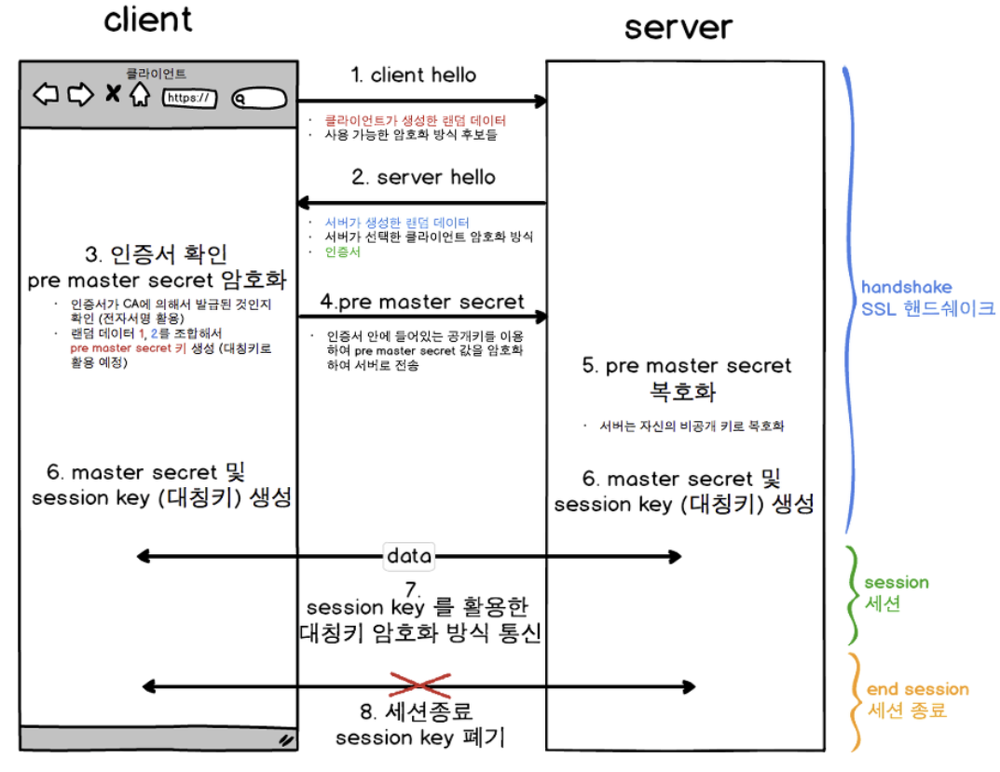

# 인증 / 보안

## 인증과 인가의 차이에 대해 설명해 주세요.

​	인증은 자신이 누구인지 증명하는 과정입니다. 주로 아이디, 비밀번호를 통해 인증을 실시하고, 추가로 이메일 인증, 지문 인식, FACE ID 등도 인증의 과정입니다. 인가는 사용자가 접근할 수 있는 자원과 서비스를 결정하는 과정입니다.

## 세션에 대해서 모르는 사람한테 설명하듯 간단하게 설명해 주세요.

​	세션은 웹사이트를 방문할 때 방문한 사용자가 누군인지 서버에 저장하는 방법입니다. 웹은 기본적으로 상태를 유지하지 않는(stateless) 구조입니다. 따라서 사용자가 한번 로그인을 해도 서버는 로그인 상태를 기억하지 않습니다. 그러면 사용자는 매 요청마다 로그인을 해서 인증 처리를 하는 과정이 필요합니다. 여기서 세션을 사용하면, 서버는 사용자를 기억하고 각 사용자에게 고유한 세션을 부여합니다. 사용자가 로그인하면, 서버는 세션을 생성하고 그 세션에 사용자의 로그인 정보를 저장합니다. 그리고 이 세션에 대한 고유한 ID를 사용자의 브라우저에 보내줍니다. 사용자가 페이지를 이동할 때마다 이 세션 ID가 서버로 전송되어, 서버는 이 ID를 통해 각각의 사용자를 구분하고 해당 사용자의 세션을 찾아 사용자의 상태를 유지할 수 있게 됩니다. 

## 세션과 쿠키 그리고 토큰 인증 방식에 대해 설명해 주세요.

​	세션은 서버 측에서 관리되는 사용자 정보입니다. 사용자가 웹사이트에 로그인하면, 서버는 유저에 대한 정보를 세션에 저장하고 이 세션에 대한 고유한 ID를 생성합니다. 이 ID는 클라이언트에게 반환되며, 클라이언트는 이후 요청 시 이 세션 ID를 함께 보내 서버로부터 인증받습니다. 

​	쿠키는 클라이언트 측에서 관리되는 작은 텍스트 파일입니다. 쿠키는 서버로부터 클라이언트에 전달되어 클라이언트의 컴퓨터에 저장되며, 클라이언트가 서버에 요청을 보낼 때마다 해당 쿠키가 자동으로 서버에 전송됩니다. 

​	토큰 기반 인증에서는 사용자가 로그인하면 서버는 사용자의 인증 정보를 암호화한 토큰을 발급합니다. 클라이언트는 이 토큰을 저장하고 서버에 요청을 보낼 때마다 이 토큰을 함께 보내 사용자를 인증합니다. 서버는 토큰을 해독하여 사용자가 누구인지를 알 수 있습니다. 이 방식은 상태를 유지하지 않는(stateless) 방식이며, 서버가 사용자 정보를 계속해서 유지하지 않아도 되므로 세션 기반 인증에 비해 서버의 부담을 줄일 수 있습니다.

## 세션과 토큰 인증 방식 중 각각의 장단점을 말씀해 주세요.

### 세션 인증 방식의 장단점

**장점**

1. 세션은 서버에서 관리되기 때문에 클라이언트에서 조작되거나 변경되는 것을 막을 수 있습니다.
2. 세션 ID는 사용자의 인증 정보 자체가 아니기 때문에, 만약 세션 ID가 탈취당하더라도 사용자의 실제 인증 정보는 안전합니다.

**단점**

1. 세션은 서버에서 관리되므로 서버의 메모리를 사용하며, 이는 대규모 트래픽이 발생할 경우 서버에 부담을 줄 수 있습니다.
2. 세션 ID가 브라우저 종료, 쿠키 삭제 등으로 사라지면 사용자는 다시 로그인해야 합니다.
3. 여러 서버 간에 세션 상태를 공유해야 하는 분산 환경에서는 세션 관리가 복잡해질 수 있습니다.

### 토큰 인증 방식의 장단점

**장점**

1. 토큰 인증 방식은 상태를 유지하지 않는(stateless) 방식이므로, 서버가 사용자 정보를 계속 유지할 필요가 없습니다. 이는 서버의 부하를 줄여 성능 향상에 도움이 됩니다.
2. 토큰은 클라이언트 측에서 저장되고 관리되므로, 서버는 클라이언트의 요청에 대해 상태를 유지하지 않아도 됩니다. 이는 분산 환경에서 효율적으로 작동합니다.
3. JWT(JSON Web Token)와 같은 표준은 토큰에 추가 정보를 포함할 수 있어 유연성을 제공합니다.

**단점**

1. 토큰이 탈취당하면 사용자의 인증 정보가 노출될 수 있으므로, 토큰의 보안 관리가 중요합니다.
2. 토큰은 일반적으로 세션 ID에 비해 크기가 크므로, 매 요청마다 토큰을 전송하는 것은 추가적인 네트워크 오버헤드를 초래할 수 있습니다.
3. 토큰이 만료되기 전까지는 유효하므로, 한 번 발급된 토큰을 무효화하는 것이 어렵습니다. 따라서 토큰의 만료 시간을 짧게 설정하고, 필요한 경우 새 토큰을 발급하는 방식을 사용해야 합니다.

## HTTP와 HTTPS 각각에 대해 설명하고둘의 차이점을 말씀해 주세요.

1. **HTTP** 는 웹 브라우저(클라이언트)와 웹 서버 간에 HTML 등의 웹 문서를 주고받는데 사용되는 프로토콜입니다. HTTP는 암호화가 이루어지지 않은 텍스트 데이터를 전송하기 때문에, 데이터가 전송되는 과정에서 다른 사용자에 의해 쉽게 열람, 수정될 수 있는 위험이 있습니다. **HTTPS** 는 HTTP의 보안이 강화된 버전으로, SSL/TLS 프로토콜을 사용하여 전송되는 데이터를 암호화합니다. 이로써 데이터의 도난이나 변조를 방지하여 보안성을 높여줍니다. 

​	HTTPS 는 HTTP 의 보안 버전입니다. HTTPS 는 SSL/TLS 를 사용하여 데이터를 암호화합니다. 이는 중간자 공격을 통해 데이터를 도청하거나 변조하는 것을 방지해줍니다. HTTPS 를 사용하면 웹 서버와 클라이언트 사이에서 교환되는 모든 데이터가 암호화되므로, 사용자의 정보가 안전하게 보호됩니다.

## HTTPS의 동작 방식을 설명해 주세요.

HTTPS에서 최초 연결이 이루어질 때, SSL/TLS 핸드셰이크라는 과정이 일어납니다. 이 과정은 클라이언트(웹 브라우저)와 서버 사이에 안전한 연결을 설정하기 위한 것으로, 아래와 같은 순서로 진행됩니다.

1. **클라이언트 헬로(Client Hello):** 클라이언트는 서버에게 "헬로" 메시지를 보냅니다. 이 메시지에는 클라이언트가 지원하는 SSL/TLS 버전, 암호화 알고리즘 목록(싸이퍼 스위트), 그리고 랜덤으로 생성한 데이터가 포함됩니다.
2. **서버 헬로(Server Hello):** 서버는 클라이언트에게 "헬로" 메시지를 응답합니다. 이 메시지에는 서버가 선택한 SSL/TLS 버전, 암호화 알고리즘, 그리고 랜덤으로 생성한 데이터가 포함됩니다. 또한, 서버는 자신의 공개키가 담긴 인증서도 함께 보냅니다.
3. **인증서 검증:** 클라이언트는 서버의 인증서를 검증합니다. 이는 인증서가 신뢰할 수 있는 CA(Certificate Authority)에 의해 발급되었는지, 그리고 인증서가 만료되지 않았는지 확인하는 과정입니다.
4. **Pre-Master Secret 생성 및 전송:** 클라이언트는 랜덤 데이터로 이루어진 Pre-Master Secret을 생성하고, 이를 서버의 공개키로 암호화하여 서버에게 전송합니다.
5. **Pre-Master Secret 복호화** : 서버는 비공개 키를 통해 전송받은 Pre-Master Secret 를 복호화합니다.
6. **세션 키 생성:** 클라이언트와 서버 모두 Pre-Master Secret, 클라이언트 헬로 메시지의 랜덤 데이터, 그리고 서버 헬로 메시지의 랜덤 데이터를 이용하여 동일한 세션 키를 생성합니다.
7. **핸드셰이크 완료:** 이제 클라이언트와 서버는 모두 동일한 세션 키를 갖게 되었으며, 이 세션 키를 이용하여 통신하는 모든 데이터를 암호화 및 복호화할 수 있습니다. 클라이언트와 서버는 서로에게 암호화된 핸드셰이크 완료 메시지를 보내 연결이 성공적으로 설정되었음을 알립니다.

이러한 과정을 통해 클라이언트와 서버 사이에 안전한 HTTPS 연결이 설정됩니다. 이 연결이 설정된 후에는, 클라이언트와 서버 사이에서 교환되는 모든 데이터가 세션 키를 이용하여 암호화되어 안전하게 전송됩니다.

## OAuth 2.0의 워크플로우에 대해서 설명해 주세요.

## Spring Security 의 인증 처리 흐름에 대해 설명해 주세요.

## Spring Security 의 인가 처리 흐름에 대해 설명해 주세요.

## Filter 가 무엇인지 설명하고 Filter Chain 의 동작에 대해 설명해 주세요.
