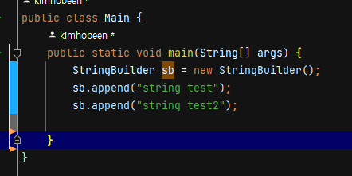
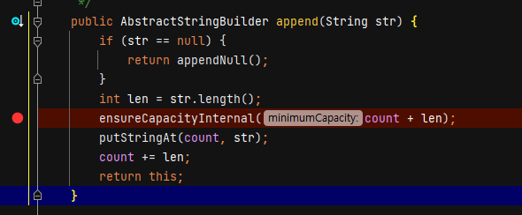
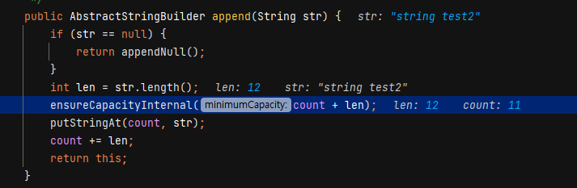
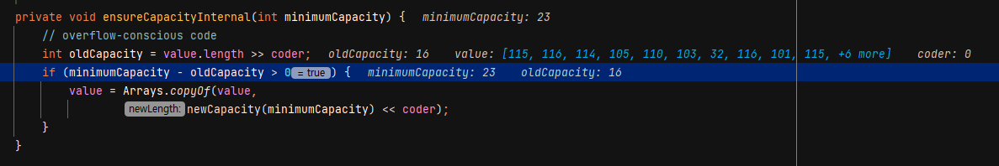
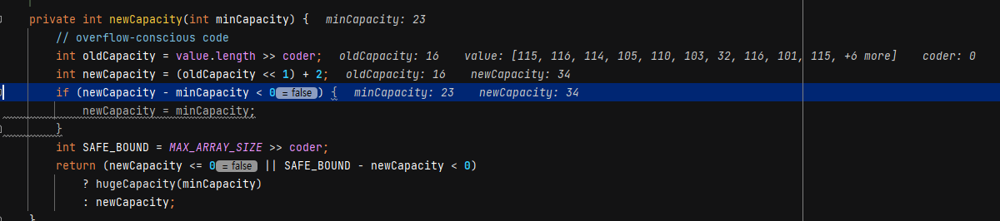
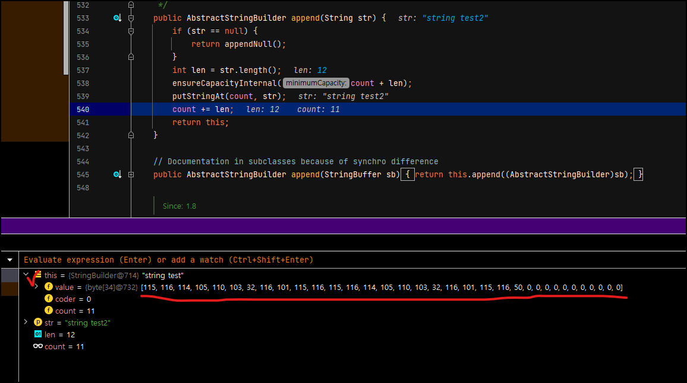

String 클래스는 변수를 선언할 때 int 타입과 함께 제일 많이 사용되고 있습니다. 

**하지만 이런 String 클래스를 잘못 사용한다면 심각한 메모리 낭비와 성능 저하를 야기할 수 있습니다. 지금부터 알아보겠습니다.**

이 내용은 해당 유튜브 영상을 보고 필요성을 느껴 찾아보면서 정리했습니다. [유튜브 보기](https://youtu.be/ike9OvlyQSo) (한글 자막 없습니다.)

# 문자열 추가 시 String 연산자가 느린 이유

먼저 얼마나 느린지 보겠습니다. 다음과 같이 코드를 짜보겠습니다.

```java
public class Main {
    public static void main(String[] args) {
        int number = 1_000_000;
		//String 클래스에 += "*"
        String str = "";
        long startTime = System.currentTimeMillis();
        for(int i = 0; i < number; i++){
            str += "*";
        }
        long endTime = System.currentTimeMillis();
        System.out.println("str time : " + (endTime - startTime));

        //StringBuilder 클래스에 append("*")
        startTime = System.currentTimeMillis();
        StringBuilder sb = new StringBuilder();
        for(int i = 0; i < number; i++){
            sb.append("*");
        }
        endTime = System.currentTimeMillis();
        System.out.println("sb time : " + (endTime - startTime));
    }
}
```

첫 번째 케이스는 String 클래스에 직접 `"*"`  을 1_000_000번 더합니다. **총 85초 가량 걸렸습니다.** (컴퓨터 성능 무엇)

두 번째 케이스는 StringBuilder 클래스에 append() 메서드로 1_000_000번을 더합니다. **총 0.012초 걸렸습니다.**

이렇게 같은 결과물인데도 String 클래스가 느린 이유는 무엇일까요? **바로 String 클래스의 `immutable` 특성입니다.** `immutable` 이란 변경할 수 없는, 불변의 라는 뜻으로 String 의 value 값은 한 번 생성되면 변경될 수 없습니다.

예를 들어 아래와 같은 코드가 있습니다.

```java
String a = "aa";
String b = new String("bb");

a = a + b;
```

이 코드는 어떻게 동작할까요? a 와 b 는 똑같이 `new String();` 으로 인스턴스가 생성됩니다. 즉, `String a = "aa";` 는 사실 `String a = new String("aa");` 인 겁니다.

a 와 b 각각의 문자열에 대해 메모리가 할당되고, a, b 는 그 주소값을 참조합니다.

그 다음 `a = a + b;` 를 하게 되면, 원래 있던 String 클래스의 `a` 값에 `a + b` 값이 들어가는 게 아니라 **`new String(a+b);` 로 새로운 String 클래스를 만듭니다.** 왜냐하면 String 클래스는 `immutable` 하니깐요. 이전에 참조하던 `"aa"` 데이터는 쓰레기가 되고 가비지 컬렉션에 의해 처리됩니다. 즉, 기존 값에 새로운 값을 더하는 것이 아닌, 메모리를 확보하고 참조값을 변경하는 등 **추가 연산이 필요**하기 때문에 StringBuilder나 StringBuffer보다 퍼포먼스가 떨어진다고 볼 수 있습니다. 바로 이러한 이유때문에 더 많은 시간과 메모리가 소요됩니다.

# StringBuilder 가 성능이 더 좋은 이유

String 이 덧셈 연산에서 좋지 않은 성능을 보인 이유가 연산이 수행될 때마다 두 문자열을 읽고 새로운 메모리에 복사하기 때문이었습니다. 반면에 StringBuilder 는 마찬가지로 문자열 복사를 하긴 하지만 가변 크기 배열을 이용해서 필요한 경우에만 문자열을 복사합니다.

StringBuilder 가 어떻게 구현되어 있는지 확인해보겠습니다. StringBuilder 는 AbstractStringBuilder 라는 추상 클래스를 상속 받아 구현되어있습니다.

하나하나 살펴보도록 하겠습니다.

**StringBuilder**

먼저 StringBuilder 생성자입니다.

```java
public final class StringBuilder extends AbstractStringBuilder implements ...{
    ...
	public StringBuilder() {
        super(16);
    }
    ...
}
```

StringBuilder 생성 시 위와 같이 AbstractStringBuilder 생성자를 사용합니다. 

다음은 아래에 `AbstractStringBuilder(int capacity`) 생성자를 보겠습니다.

**AbstractStringBuilder**

```java
abstract class AbstractStringBuilder implements Appendable, CharSequence {
    
    /**
     * 미리 확보해둔 char 의 저장 공간입니다. 
     */
    byte[] value;

    /**
     * 인코딩 방식입니다. 0 아니면 1 입니다. (생성자를 통해 결정됩니다.)
     */
    byte coder;

    /**
     * 저장 공간 중 사용하고 있는 공간의 개수입니다.
     */
    int count;
    
    AbstractStringBuilder(int capacity) {
        if (COMPACT_STRINGS) {
            value = new byte[capacity];
            coder = LATIN1;
        } else {
            value = StringUTF16.newBytesFor(capacity);
            coder = UTF16;
        }
    }
    
    ...
    }
```

여기서 `COMPACT_STRINGS` 가 true 인지, false 인지에 따라 `value` 와 `coder` 값이 결정됩니다. 이 값은 String 클래스에 있습니다.

**String**

```java
public final class String implements java.io.Serializable, Comparable<String>, CharSequence {
    static final boolean COMPACT_STRINGS;
	...
        static {
            COMPACT_STRINGS = true;
        }
    ...
    @Native static final byte LATIN1 = 0;
    @Native static final byte UTF16  = 1;
    ...
}
```

`COMPACT_STRINGS` 의 기본 값은 true 입니다. 해당 값은 string 의 메모리 최적화를 위해서 JVM 이 주입합니다. 그리고 `LATIN1` 은 0, `UTF16` 는 1 입니다.

다시 AbstractStringBuilder 으로 돌아가겠습니다.

**AbstractStringBuilder**

```java
AbstractStringBuilder(int capacity) { //capacity = 16 으로 받아왔습니다.'super(16)'
    if (COMPACT_STRINGS) {
        value = new byte[capacity];
        coder = LATIN1;
    } else {
        value = StringUTF16.newBytesFor(capacity);
        coder = UTF16;
    }
}
```

`COMPACT_STRINGS` 는 true 이므로 해당 생성자를 통해 `value` 의 저장공간은 기본 16개, coder 는 0 이 설정되는 걸 알 수 있습니다. 

이제 append 를 보겠습니다.

**AbstractStringBuilder.append(String str)**

```java
public AbstractStringBuilder append(String str) {
        if (str == null) {
            return appendNull();
        }
        int len = str.length();
        ensureCapacityInternal(count + len);
        putStringAt(count, str);
        count += len;
        return this;
    }
```

한줄 한줄 분석해보겠습니다.

1. 먼저 `str == null` 인지 체크해서 null 이면 `appendNull();` 를 호출하고 있습니다. 이건 String 클래스도 똑같은데요. null 값을 받으면 문자 "null" 로 출력하는 겁니다. 

   - ```java
     public class Main {
         public static void main(String[] args) {
             String a = "A";
             String b = null;
             System.out.println(a + b);
         }
     }
     //출력값 "Anull"
     ```

   - null 값이 그대로 출력됩니다. `appendNull()` 은 직접 찾아보면 재밌습니다.

2.  `int len = str.length();` : 입력받은 str 의 길이입니다.

3. `ensureCapacityInternal(count + len);` : 원래 있던 사용량(count) 에 str 의 길이(len) 를 저장공간(value) 에 넣으려고 할 때 저장공간이 부족한지 체크하고 늘려줍니다. 자세히 보겠습니다.

   - ```java
     private void ensureCapacityInternal(int minimumCapacity) {
         // overflow-conscious code
         int oldCapacity = value.length >> coder;
         if (minimumCapacity - oldCapacity > 0) {
             value = Arrays.copyOf(value,
                     newCapacity(minimumCapacity) << coder);
         }
     }
     ```

     -  `int oldCapacity` : `coder` 는 0 이기 때문에 `>> coder` 는 무시해도 됩니다.  value(저장공간) 의 현재 크기입니다.

     - `minimumCapacity - oldCapacity > 0` 를 해서 입력 받은 `minimumCapacity` 값(`count + len`) 이 현재 저장공간보다 크면 공간을 늘려줍니다.

     - `Arrays.copyOf(value, newCapacity(minimumCapacity) << coder);` 는 아래와 같습니다.

       - ```java
         private int newCapacity(int minCapacity) {
                 // overflow-conscious code
                 int oldCapacity = value.length >> coder;
                 int newCapacity = (oldCapacity << 1) + 2;
                 if (newCapacity - minCapacity < 0) {
                     newCapacity = minCapacity;
                 }
                 int SAFE_BOUND = MAX_ARRAY_SIZE >> coder;
                 return (newCapacity <= 0 || SAFE_BOUND - newCapacity < 0)
                     ? hugeCapacity(minCapacity)
                     : newCapacity;
             }
         ```

       - `int newCapacity = (oldCapacity << 1) + 2;` : 이 부분만 보면 됩니다. 원래 있던 저장공간(`oldCapacity`) 에 `<< 1` 을 해서 2배로 늘려줍니다. 그리고 해당값을 반환해줍니다.

       -  여기서 `+2` 를 해주는 건 더블링을 수용하기 위한 buffer 를 제공하기 위해서이며, 문자가 1, 2개가 추가될 때마다 value 배열의 크기를 즉시 조정할 필요가 없어져 리사이징 작업의 빈도가 줄어들고 전반적인 성능이 향상된다고 합니다. (아래 예시에서 확인해보겠습니다.)

       - 만약에 크기가 `MAX_ARRAY_SIZE` 을 넘어간다면 `hugeCapacity(minCapacity)` 를 반환합니다. (이거는 따로 설명하지 않겠습니다. 코드 까보면 재밌습니다. ~~저는 안까봤습니다.~~ -> 하루 지나고 까봤습니다. 별거 없었습니다.)

     - 즉, 공간이 부족하다면 `Arrays.copyOf(value, 2배 더 큰 저장공간)` 을 통해 value 값의 저장공간을 확장해줍니다. 이제 저장공간이 충분한지 체크하고 늘려주는 작업까지 완료했습니다.

4. `putStringAt(count, str);` : `str` 을 `count` 번째부터 넣는 작업입니다. 현재까지 저장된 개수가 `count` 이니 `count` 부터 새로 넣어야겠죠.

   - `putStringAt(count, str);` 은 아래와 같습니다. AbstractStringBuilder 에 있습니다.

   - ```java
     private final void putStringAt(int index, String str) {
             if (getCoder() != str.coder()) {
                 inflate();
             }
             str.getBytes(value, index, coder);
         }
     ```

     - 대부분의 경우 `str` 의 `coder` 와 AbstractStringBuilder 의 `coder` 가 똑같으니 `str.getBytes(value, index, coder);` 가 실행됩니다.

     - `str.getBytes(value, index, coder);` 은 String 클래스에 있습니다.

     - ```java
       void getBytes(byte dst[], int dstBegin, byte coder) {
               if (coder() == coder) {
                   System.arraycopy(value, 0, dst, dstBegin << coder, value.length);
               } else {    // this.coder == LATIN && coder == UTF16
                   StringLatin1.inflate(value, 0, dst, dstBegin, value.length);
               }
           }
       ```

       - `coder() == coder` 이니 `System.arraycopy(value, 0, dst, dstBegin << coder, value.length);` 가 실행됩니다.
       - `System.arraycopy(arr1, i, arr2, j, length)` 는 arr1 을 i 번째부터 length 길이만큼 복사해서 arr2 의 j 번째부터 넣어라는 뜻입니다.
       - 여기서 주의해야할 건 `value` 는 AbstractStringBuilder 의 `value` 가 아니라 `str` 의 `value` 입니다. 여기서 저도 좀 헷갈렸습니다. 즉 `str= "abc"` 라면 `value = ["a", "b", "c"]`인 것입니다. (배열은 개략적으로 적었습니다.) 
       - 결론적으로 `str` 을 `dst`(AbstractStringBuilder 의 `value`) 의 `dstBegin` (AbstractStringBuilder 의 `count`) 부터 복사하라는 겁니다. 그렇게 되면 AbstractStringBuilder 의 `value` 의 뒤쪽에 `str` 이 붙게 되겠죠?
       - 이제 저장까지 완료됐습니다.

5. `count += len;` : `count` 값에 `str` 길이를 추가합니다. `count` 자체가 마지막 배열값의 인덱스니까 `str` 을 추가했으면 그만큼 더해줘야겠죠.

**결론**

StringBuilder 는 `value`에 사용되지 않고 남아있는 공간에 새로운 문자열이 들어갈 정도의 크기가 있다면 그대로 삽입합니다. 그렇지 않다면 `value` 배열의 크기를 두배로 증가시키면서 기존의 문자열을 복사하고 새로운 문자열을 삽입합니다. 

즉, **문자열 복사를 하긴 하지만 가변 크기 배열을 이용해서 필요한 경우에만 문자열을 복사합니다.**

## 예시

예시를 한번 들어보겠습니다.



1. `StringBuilder sb = new StringBuilder();` : sb 를 생성합니다. 저장 공간은 기본적으로 16입니다.

2. `sb.append("string test")` : 문자열을 저장합니다. 문자열 크기가 11 이고, 빈 공간은 16 이므로 문자열 복사 없이 바로 추가됩니다.

   - count 는 11로 갱신됩니다.

3. `sb.append("string test2")` : 문자열 길이가 12 이므로 총 길이는 23이 되고, 빈 공간이 더 필요하게 됩니다. 한번 빈공간이 더 생기는지 디버깅으로 확인해보겠습니다.

   - 아래와 같이 찍어주고 실행합니다.

   

   - 아래와 같이 "string test2" 를 저장할 때 `count` 는 11, `str.lengh()`  12 인걸 확인할 수 있습니다.

     

   - `ensureCapacityInternal()` 에 들어오면 `minimumCapacity` 가 23 이라서 if 문에 걸리는 걸 확인할 수 있구요.

     

   - 아래처럼 `newCapacity` 가 만들어졌는데요. 크기가 34 인걸 알 수 있습니다. 16의 2배에다가 +2 를 하니까요.

     

   - 아래 this.value 를 보면 잘 추가된 걸 볼 수 있습니다. (~~다들 ascii 는 외우시잖아요~~)

     

4. 최종적으로 sb 에 "string test" 와 "string test2" 가 들어간다고 볼 수 있겠습니다.

# 그렇다면 왜 String 클래스가 있나요?

*"String 클래스, 단점 밖에 없는데요?"*

String 클래스의 장점으로, String 클래스는 값이 변경되지 않기 때문에 여러 스레드가 데이터를 공유하더라도 동기화를 신경쓸 필요가 없이 안정성이 유지되는 장점이 있습니다. 

또한 StringBuffer, StringBuilder 클래스도 문자열을 출력하기 위해선 결국  `toString()` 메서드로  String 객체를 생성해서 반환해야 합니다. 따라서 연산이 적게 사용되고, 문자열 값의 수정 없이 읽기가 많은 경우에는 String 클래스의 사용이 더 적절합니다.


# 마치며

코드 뒤적거리는 게 제일 시간 때우기 좋은 것 같습니다. 22시반 정도에 시작했는데 벌써 새벽 1시네요. 그래도 순수 java 뒤적거리는 게 Spring  보다 100배는 쉬운 거 같습니다.

원래 StringBuilder vs StringBuffer 까지 하려고 했었는데요. 글이 길어질 거 같아 간단하게 블로그 인용으로 갈음하겠습니다.

> StringBuffer클래스는 동기화 *(Synchronized)*를 지원하며 멀티 스레드 환경에서도 동기화를 지원한다. 그렇기 때문에 단일 스레드일 경우 StringBuilder 클래스를, 멀티 스레드일 경우 StringBuffer 클래스의 사용이 권장된다. *(StringBuffer 클래스의 경우 혼용해도 상관없지만, 동기화 처리 문제로 퍼포먼스상의 이슈가 있다고 한다.)*
>
> 실제로 맨 위에 예제로 만든 소스의 실행 결과를 보면 ***단일 스레드 환경***에서 ***StringBuilder 클래스가 StringBuffer클래스보다 퍼포먼스가 좋은 것을 확인***할 수 있다.
>
> *from* Ref. 두번째 블로그

# Ref.

[StringBuffer, StringBuilder 가 String 보다 성능이 좋은 이유와 원리](https://cjh5414.github.io/why-StringBuffer-and-StringBuilder-are-better-than-String/)

[String vs. StringBuilder vs. StringBuffer 예제를 통한 비교](https://xxxelppa.tistory.com/57)