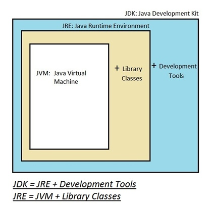
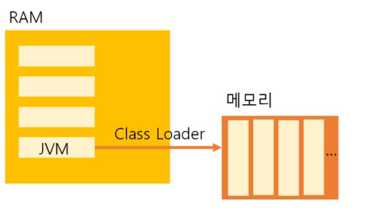
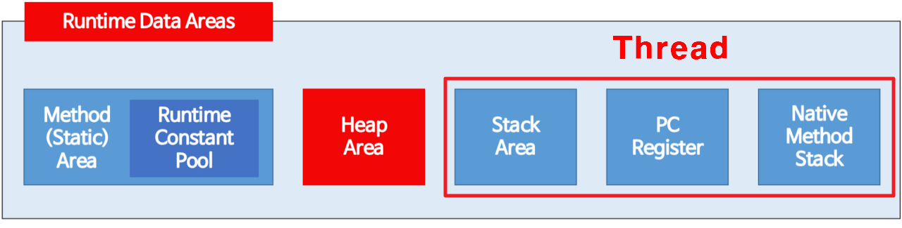
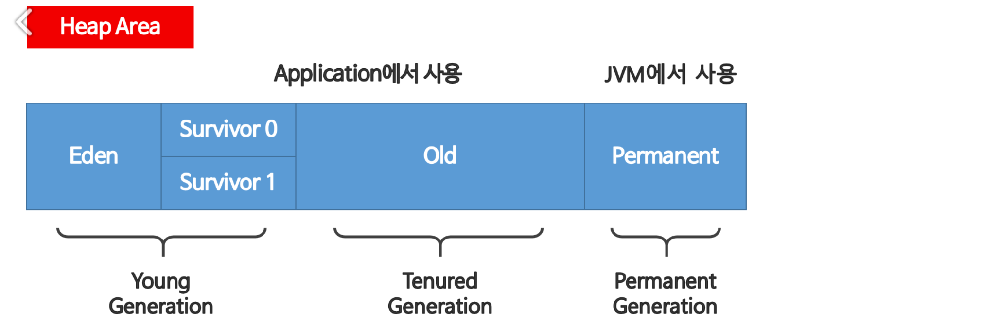
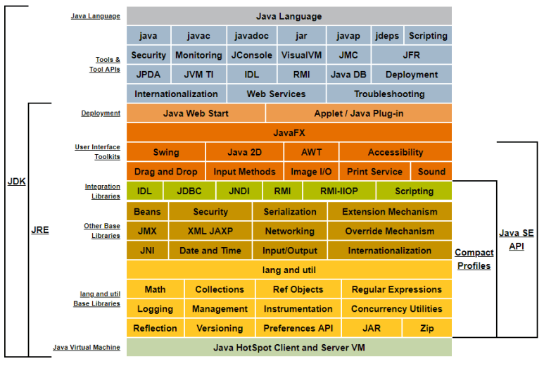
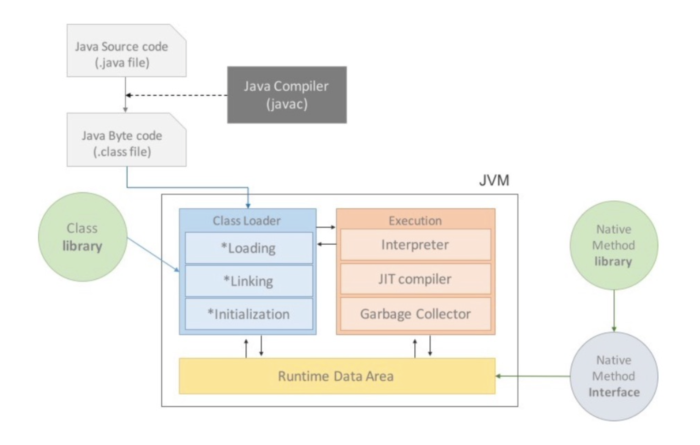
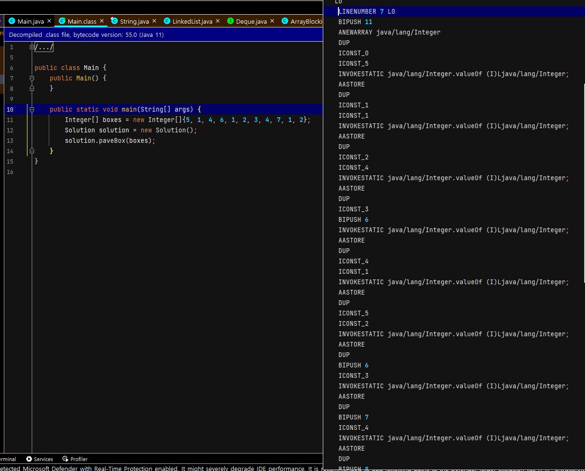

오늘은 그동안 제 머리속에서 미지의 영역이었던 "java 란 무엇인가" , ''java 는 어떻게 컴파일되고 변환되어 실행되는가", "jvm, jbe, jdk 는 무엇인가" 등 **몰라도 상관없지만 궁금증을 유발하는 질문**에 대해 적어보려고 합니다. 

# 자바의 역사

## 자바의 시작

​	최초 자바 언어는 1991년 제임스 고슬링(James Gosling) 의 팀에 의해 고안되었습니다. 원래 목표는 TV, 전자레인지 등 다양한 전자기기에 사용할 언어를 개발할 목적이었다고 하는데요. WEB 출현과 함께 목표가 바뀌게 됩니다.

​	인터넷은 다양한 운영 체제와 CPU 에서 실행되는데요. 이에 따라서 '이식성 문제' 가 발생하게 됩니다. 예를 들어서 C++ 은 모든 CPU 에 컴파일될 수 있지만 그것을 위해 해당 CPU 에 맞는 C++ 컴파일러가 필요합니다. 대부분의 컴퓨터 기종에서 C++ 을 지원하기하지만요. 

​	하지만 자바는 처음부터 개발 목적이 다양한 CPU 에 활용할 수 있는 언어를 개발하는 것이었습니다. 왜냐하면 다양한 가전기기를 포괄하기 위해서 CPU 의 종류에 따라 컴파일러도 일일히 만드는 건 너무 시간 낭비였거든요. 

​	따라서 이러한 이식성 문제를 해결할 수 있는 자바가 인터넷을 위한 코드에 적합하여 개발 방향이 인터넷으로 옮겨지게 되었습니다. 고슬링의 목표는 C/C++ 스타일의 언어와 가상 머신을 구현하는 것이었습니다. 그렇게 하여 WORA(Write Once, Read Anywhere) 이라는 Cross Platform 언어인 1995년 Java 1.0 이 발표되었습니다. (처음에는 Oak 로 출시되었으며 1.0.2 버전부터 Java 라고 명명했습니다.)

​	여담으로 Java 의 이름은 인도네시아 자바섬에서 재배되는 커피원두에서 가져왔다고 합니다. 다양한 랜덤 후보군 중에서 골랐다고 하네요. 

## Spring

​	초기 기업들은 WAS 를 구현하기 위해 자바 표준 기술인 EJB(Enterprise Java Bean) 을 사용했습니다. 하지만 비싸고, 어렵고, 복잡하며 느렸습니다. 이렇게 EJB 에 대한 단점으로 POJO(Plain Old Java Object, 순수 자바) 로 다시 돌아가자는 얘기까지 나왔죠.

​	Rod Johnson 은 이러한 상황 속에서 '차라리 내가 만들면 더 낫겠다' 라는 생각으로 'J2EE Development Without EJB' 라는 책을 집필하게 됩니다. 해당 책에는 수 만 라인의 예제 코드까지 함께 있었는데요. 결국 EJB 에 지친 수많은 개발자가 합심하여 오픈 소스 프로젝트로 Spring 프레임워크를 만들게 됩니다. Spring 은 겨울(EJB) 에 반대되는 단어로 차용한거라고 합니다.

# 자바의 특징

1. 이식성이 높다

   자바는 이식성이 높습니다. 앞서 역사에서 본것처럼 자바는 WORA(Write Once, Read Anywhere)  로 시작하였습니다. 따라서 서로 다른 플랫폼의 특성을 고려할 필요 없이, 다른 운영체제나 CPU 에서도 같은 코드를 사용할 수 있습니다. 

2. Multi-Threading

   자바는 multithreading 을 지원하는데요. 하나의 프로그램에서 여러 개의 스레드를 동시에 실행시킬 수 있습니다. 따라서 개발자는 서버 사이드와 분산된 컴퓨팅 환경에서 효율적인 반응형 어플리케이션을 만들 수 있습니다.

3. 객체 지향 언어

   자바는 read-world의 개념을 표현하고, 코드를 재사용하기 위해 객체와 클래스를 사용합니다. 객체 지의 원칙(SOLID)에는 5가지로 다음과 같습니다.

   - 단일 책임 원칙(SRP, Single Responsibility Principle) : 객체나 메서드가 각각 오직 하나의 책임을 가져야 한다는 원칙입니다. 따라서 하나의 책임만 수행하게끔 객체나 메소드의 분리를 수행하여야 하고 접근제어자를 활용하여 그 책임을 강제시킵니다.
   - 개방 폐쇄 원칙(OCP, Open/Closed Principle) : 객체의 확장에는 열려있고, 수정에는 닫혀있어야 한다는 원칙입니다. 기존 코드를 변경하지 않고도 기능을 수정하거나 추가할 수 있도록 설계하여야 합니다. 이 원칙이 지켜지기 위해서는 변경되는 것이 무엇인지에 초점을 맞추어야 합니다. 자주 변경되는 내용은 수정하기 쉽게 설계하고, 아닌 것은 수정되는 내용에 영향받지 않도록 분리해서 설계하는 것이 중요합니다.
   - 리스코프 치환 원칙(LSP, Liskov Substitution Principle) : 변수 타입이 선언됐을 때 하위 타입은 상위 타입의 기능을 문제없이 모두 수행할 수 있어야 한다는 것입니다. 즉, 상속관계에 놓인 두 클래스에서, 잣식 클래스는 부모 클래스에서 가능한 행위를 모두 수행할 수 있어야 합니다.
   - 인터페이스 분리 원칙(ISP, Interface Segregation Principle) : 인터페이스를, 그걸 사용하는 클라이언트를 기준으로 분리해야한다는 원칙입니다. 즉, 한 클래스는 자신이 사용하지 않는 인터페이스를 구현하지 않아야 한다는 뜻입니다. 하나의 제너럴한 인터페이스보다는, 여러개의 구체적인 인터페이스가 적합합니다. 이 법칙으로 시스템의 내부 의존성을 약화시켜서 리팩토링도 비교적 수월하게 수행할 수 있게 됩니다.
   - 의존 역전 원칙(DIP, Dependency Inversion Priciple) :  구체적인 클래스보다 인터페이스나 추상 클래스와 관계를 맺는다는 것입니다. 즉, 변화하기 쉬운 것보단 변하기 어려운 것에 의존해야한다는 원칙입다.

# JVM, JRE, JDK 

이제 자바의 실행으로 넘어가기 전, JVM, jre, jdk 와 같은 비슷한 용어를 정리하고자 합니다. 기본적인 관계는 이렇게 됩니다.

## JVM

JVM 은 Java Virtual Machine 으로, WORA 를 구현하기 위한 가상 환경입니다. JVM 은 JAVA 와 OS 사이의 중개자 역할을 수행하며 JAVA 가 OS 에 관계 없이 동작하도록 합니다. 메모리 관리, GC 기능 또한 수행합니다. 내부 구조 내의 Class Loader, Execution Engine, Garbage Collecter, Runtime Data Area를 살펴 보겠습니다. 

**Class Loader**

​	자바는 동적으로 클래스를 읽어오기 때문에 프로그램이 실행 중인 런타임에 모든 코드가 JVM 과 연결됩니다. 이렇게 동적으로 클래스를 로딩해주는 역할을 하는 것이 Class Loader 입니다. Class Loader 는 .class 파일을 묶어서 JVM 이 할당받은 메모리 영역인 Runtime Data Area 로 적재합니다.

**실행엔진(Execution Engine)**

​	Class Loader 에 의해 배치된 .class 파일들은 JVM 이 실행 엔진에 제공해서 정의된 내용대로 바이트 코드를 실행시킵니다. 즉, 로드된 바이트 코드를 실행하는 런타임 모듈이 바로 실행 엔진입니다.

**가비지 컬렉터(Garbage Collector)**

​	JVM 은 GC 를 이용하여 더 이상 사용하지 않는 메모리를 자동 회수합니다. 따라서 개발자가 따로 메모리를 관리하지 않아도 됩니다. Heap 메모리 영역에 적재된 객체들 중 참조되지 않은 객체들은 탐색 후 제거되며, GC 가 역할의 스레드가 실행되는 동안 나머지 모든 스레드는 일시정지상태가 됩니다.

###  **런타임 데이터 영역 (Runtime Data Area)** 

## 

**메서드 영역(Method Area)** 

​	클래스 멤버 변수의 이름, 타입, 접근 제어자 정보와 같은 각종 필드 정보들과 메서드 정보, Contant pool, static, final class 등이 생성됩니다.

**힙 영역(Heap Area)**

​	new 키워드로 생성된 객체와 배열이 생성되는 영역입니다.

​	힙 영역은 효율적인 GC 를 위해 세 영역으로 구분됩니다. Young Generation 은 자바 객체가 생성되자마자 저장되는 곳으로, 최초 Eden 영역에 할당됩니다. 그리고 이 영역에 데이터가 쌓이면 참조정도에 따라 Survivor 로 이동되거나 회수됩니다. 그러다가 Young Generation 이 다 차게 되면 참조 정도에 따라 Old 영역으로 이동하거나 회수됩니다. 지금까지 영역 이동 간 회수를 Minor GC 라고 합니다.

​	Old 영역에 할당된 메모리가 허용치를 넘게 되면 다시 Old 영역의 모든 객체들을 검사하여 사용하지 않는 값들을 삭제하는데요. 시간이 오래걸리고 나머지 스레드는 작업을 멈춥니다. 이를 'Stop-the-World' 라고 하고 해당 GC 를 Major GC 라고 합니다.

**스택 영역 (Stack Area)**

​	지역변수, 파라미터, 리턴 값, 연산에 사용되는 임시 값 등입니다.

**PC 레지스터 (PC Register)**

​	Thread가 생성될 때마다 생성되는 영역으로 프로그램 카운터, 즉 현재 스레드가 실행되는 부분의 주소와 명령을 저장하고 있는 영역입니다.

**네이티브 메서드 스택 (Native Method Stack)**

​	C, C++ 같은 native code 와 JAVA 를 연결하기 위해 사용하는 메모리 영역입니다. 보통 C/C++ 등의 코드를 수행하기 위한 스택입니다.

# JRE

​	JRE(Java Runtime Environment, 자바 런타임 환경) 는 자바 어플리케이션을 실행시키기 위한 필수적인 components 를 제공하는 소프트웨어 패키지입니다. 즉, JAVA 를 실행할 수 있는 '런타임 환경'을 만들어주는 것입니다. 런타임 환경이란 프로그램 실행을 위해 클래스 파일을 로드하고 메모리 및 기타 시스템 리소스에 대한 엑세스를 확보하는 것입니다. JRE 에는 Java Class Library, Java Class Loader, JVM 이 포함됩니다. JDK 를 다운로드하면 항상 호환 버전의 JRE 가 포함되게 됩니다.

​	또한 JRE 는 자바와 OS 사이에서 실행되며 부가적인 서비스도 제공하게 됩니다. 예를 들어JRE 의 자동 메모리 관리는 메모리 할당과 재할당을 수동으로 조작할 필요가 없게 해줍니다.

​	**Java Class Library** 는 자바 실행에 반드시 필요한 라이브러리로 `java.lang`, `java.util`, `java.io`, `java.net` 과 같이 데이터 구조, I/O, 네트워크, 동시성 등에 대한 기능을 제공하기 위해 있습니다.

​	**Java Class Loader** 는 어디에서는 JVM 이라고 하고, 어디에서는 JRE 라고 하더군요. 일단 제가 찾은 바로는 JRE 구성 요소라고 합니다. 하지만 JVM 구성요소로 설명한 곳도 많아 정확해질 때까지 계속 확인하겠습니다. 일단 여기서의 Class Loader 의 설명은 JVM 과 같습니다.

*Class Loader 의 자세한 설명은 여기 참조 >* [[조금 더 깊은 Java] JRE의 Classloader 에 대해 알아보자](https://wonit.tistory.com/590)

## JDK 

​	JDK(Java Devepment Kit) 는 이름 그대로 개발자들이 자바를 개발하는 데 사용됩니다. JDK 안에 개발 시 필요한 라이브러리들과 javac, javadoc 등의 개발 도구를 포함합니다. JDK 는 JRE 를 포함한다고 보면 되겠습니다. JDK 는 쓰기(write) 를 위해, JRE는 읽기(read) 를 위해 있다고 생각하면 됩니다. JRE 만 있어도 java 파일 실행은 가능합니다. 

​	아래는 JDK 와 JRE 의 내부 구성입니다.

# java 실행 과정

1. 작성한 .java 파일은 Java Compiler 가 실행되면서 .class 파일인 바이트 코드 파일로 변경됩니다.

   

   - 왼쪽과 같은 파일이 바이트 코드입니다. nav bar 에서 view > show ByteCode 로 확인할 수 있습니다.

2. JVM 은 OS 로부터 소스 코드 실행에 필요한 메모리를 할당받았는데요. Class Loader 가 .class 파일을 Runtime Data Area 에 배치합니다. 

3. Execution Engine 이 Load 된 ByteCode 를 해석합니다. 이 때 두가지 방식으로 ByteCode 가 실행됩니다.

   - Interpreter 로 코드를 한 줄씩 번역하여 실행
   - JIT Compiler(Just-In-Time Compiler) 를 통해 코드 전체를 기계어로 변역하여 실행
     - JIT Compiler 는 같은 코드를 매번 해석하지 않고 실행할 때 컴파일 하면서 코드를 캐싱합니다. 사전에 정의된 임계치에서 시작하여 호출될 때마다 감소시키는 방식으로 자주 사용되는 메서드를 찾습니다. 자주 사용되는 메서드는 저장해서 해석하지 않고 바로 실행시키는 방식으로 성능을 향상시킵니다.

4. 이렇게 ByteCode 가 BinaryCode 로 변경됩니다.

# 마치며

어려울 것 없는 포스팅이 될 줄 알았는데, 막상 자료마다 조금씩 내용이 통합되지 않게 다르고, Java docs 도 제가 원하는 내용이 없어서 하루에 두시간 정도 공부하면서 3일 걸렸습니다. 그래도 공부하면서 파편화된 제 지식을 조각모음할 수 있었습니다.

# Ref

**Java**

- [Java 의 개발 철학과 특징](https://joooootopia.tistory.com/28)
- [자바의 철학으로 보는 JVM](https://bgpark.tistory.com/141)
- [자바 (프로그래밍 언어)](https://ko.wikipedia.org/wiki/%EC%9E%90%EB%B0%94_(%ED%94%84%EB%A1%9C%EA%B7%B8%EB%9E%98%EB%B0%8D_%EC%96%B8%EC%96%B4))
- [[Java] 자바(Java)의 역사](https://jhyonhyon.tistory.com/15)
- [자바의 역사와 철학](https://www.holaxprogramming.com/2017/08/16/java-history/)

**JVM, JRE, JDK**

- [Java - JVM 구성 요소와 역할 정리! (+ JIT 컴파일러, 인터프리터, 클래스 로더, 가비지 컬렉터란 무엇인가?)](https://jaehoney.tistory.com/173)
- [[Java\] 자바 가상머신 JVM(Java Virtual Machine) 총정리](https://coding-factory.tistory.com/827)
- [[Java] JDK? JRE? JVM?](https://m.blog.naver.com/goreng2/221770110714)
- ["JRE 란 무엇인가", 자바 런타임 환경의 이해](https://www.itworld.co.kr/news/110768)

**Java 실행**

- [[JAVA] 자바 프로그램 실행 과정 및 기본 구조](https://pienguin.tistory.com/entry/JAVA-%EC%9E%90%EB%B0%94-%ED%94%84%EB%A1%9C%EA%B7%B8%EB%9E%A8-%EC%8B%A4%ED%96%89-%EA%B3%BC%EC%A0%95-%EB%B0%8F-%EA%B8%B0%EB%B3%B8-%EA%B5%AC%EC%A1%B0)
- 코드스테이츠 교육 내용