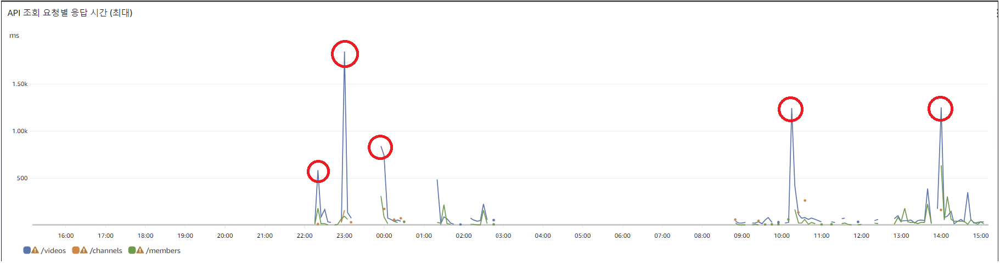
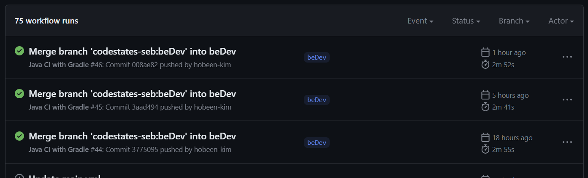
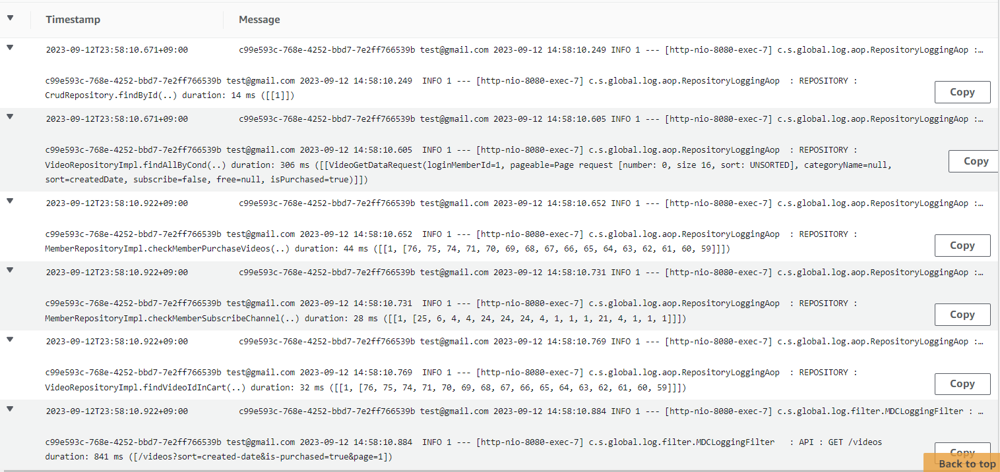
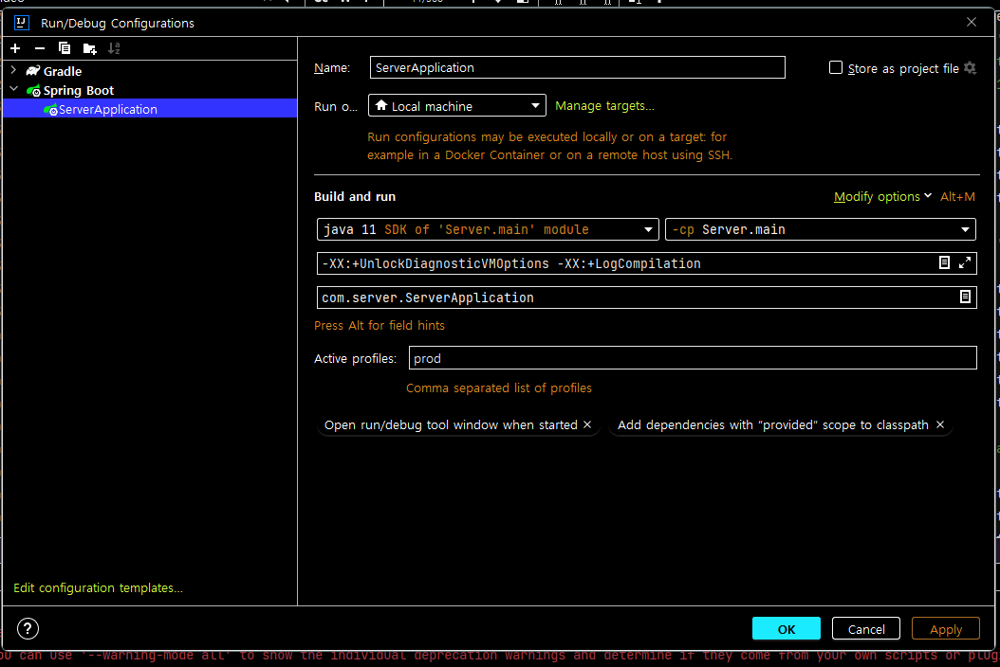
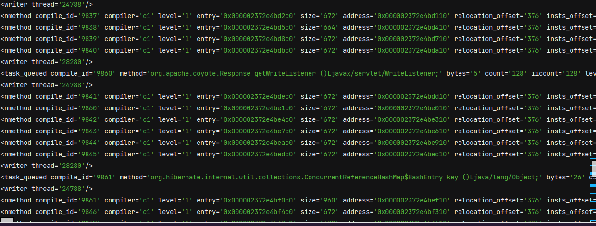
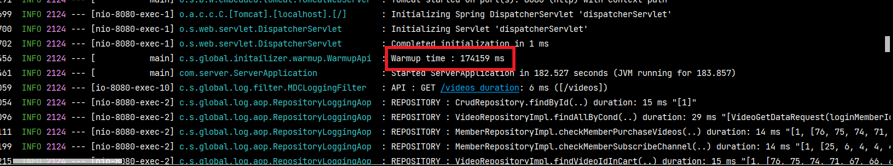

# 1. 문제 상황

*문제 상황은 [카카오 if JVM warm up](https://www.youtube.com/watch?v=CQi3SS2YspY) 으로 확인할 수 있었습니다.

​	API 응답 시간 로깅을 하는 중 GET `/videos` 의 응답시간이 튀는 현상을 발견했습니다.  



## 왜?

원인은 여러가지가 있는데 가장 큰 원인은 캐시 문제와 JIT, 그리고 쿼리 그 자체에 문제가 있지 않나 생각했습니다.

1. 캐시 문제(**MySQL 쿼리 캐시**) : MySQL 은 쿼리 캐시 기능을 제공하며, 같은 쿼리에 대한 결과를 캐시에 저장하여 빠르게 응답할 수 있습니다. 따라서 처음 쿼리를 수행할 때는 실제로 데이터를 읽어오지만, 그 이후에는 캐시된 결과를 반환하기 때문에 응답 시간이 줄어들 수 있습니다.
2. **JIT (Just-In-Time)** : 자바는 코드가 실제로 실행될 때 그 부분을 기계 코드로 변환하는 방식인 JIT 컴파일러를 사용합니다. 따라서 해당 코드가 처음 실행되면 약간의 성능 문제가 발생할 수 있지만, 이후 계속 자주 실행되면 코드를 최적화하여 실행시킵니다.
3. 쿼리문의 연산 자체가 느릴 수 있습니다.

2번 문제로 발생할 수 있는 경우는 1, 2, 4, 5번째 동그라미라고 판단했습니다. 해당 시간에 배포 혹은 오토 스케일링이 발생했기 때문입니다.



재배포 시간입니다. 각각 9월 12일 22시, 9월 13일 10시, 9월 13일 2시입니다.

하지만 3번째는 왜 841ms 나 걸린건지 생각해봤습니다.

## 로직 수행 시간 분석

먼저 로깅을 DB 접근 시간, API 수행 시간 두 가지만 남기기 때문에 크게 분석할 수 있는 건 없지만 접근 방법은 생각해볼 수 있겠습니다.

아래는 응답시간이 841ms 인 3번째 상황일 때 각각의 응답시간입니다.



로그를 보면

1. 로그인 멤버 정보 조회 : 14ms
2. 비디오 조회 : 306ms
3. 로그인 멤버가 비디오를 구매했는지 조회 : 44ms
4. 로그인 멤버가 해당 비디오의 채널을 구독했는지 조회 : 28ms
5. 로그인 멤버가 해당 비디오를 카트에 담았는지 조회 : 32ms
6. API 응답 시간 : 841ms

이며, 내부 로직 수행 시간은 API 응답 시간 - DB 응답 시간 합 = **417ms** 입니다. 

내부 로직을 수행하는 데 절반 가량이 걸렸는데요. 해당 로그의 특이사항은 **로그인된 사용자로 조회**하는 첫번째 요청이었다는 겁니다.  

여기서 문제는 JIT 였다는 생각이 들었습니다. 실제로 쿼리문 수행은 데이터가 적다보니 mysql 에서 실행 결과 20ms 미만의 시간이 걸렸고, 이에 따라 내부 로직 시간 수행 시간이 많이 걸렸다는 걸 알 수 있었습니다.

## JIT

​	자바 코드는 컴파일 시 Byte Code 로 변환됩니다. Byte Code는 JVM에 의해 번역되어 Jar 또는 War로 변환되어 활용하게 됩니다. 즉, 자바는 **컴파일과 인터프리터 두 동작에 의해 실행되는 언어**입니다.

​	그러다 보니 Java 는 컴파일 과정에서 바로 기계어로 번역하는 C, C++  같은 컴파일 개발 언어보다 성능이 뒤쳐지게 집니다. 컴파일 언어들이 런타임 환경에서 **준비된 기계어를 즉시 실행**하기 때문이기도 하고, 컴파일로 기계를 만들 때 `코드 최적화`를 진행하기 때문이기도 합니다. 다만 컴파일을 통해 생성된 기계어는 **빌드 환경의 cpu 아키텍처에 종속적**이기 때문에 다른 아키텍처 환경에서 실행하려면 해당 빌드 환경에서 새로 빌드해야 한다는 단점이 있습니다. 이렇듯 컴파일 언어가 인터프리터 언어보다 성능적으로 더 유리합니다. 인터프리터 방식을 취하는 자바는 이러한 문제를 해결하기 위해 JVM에 **JIT 컴파일러**를 사용하고 있습니다.

JIT 컴파일러는 바이드 코드를 머신 코드로 변환하는 과정에서 머신 코드를 **캐시**에 저장하고 활용합니다.
이를 통해 반복되는 변환 과정을 줄여 성능을 향상시키고 런타임 환경에 맞춰 코드를 최적화함으로써 성능을 보완하고 있습니다.

하지만 애플리케이션을 시작하는 단계에서는 캐시된 내역들이 없기 때문에 JIT 컴파일러의 성능이 좋을 수 없습니다. 그래서 애플리케이션 시작 후 의도적으로 미리 로직을 실행하여 기계어가 캐시에 저장되고 최적화될 수 있도록 하는 **warm up 절차가 필요**합니다.

# 2. 해결

## warm up 방법

warm up 의 방법은 성능을 테스트하기 위한 도구로도 할 수 있고, 스프링 애플리케이션 내부에서도 할 수 있습니다. 저는 스프링 애플리케이션 내부에서 api 를 호출하면서 진행하도록 하겠습니다.

warm up 해야 하는 클래스들을 하나하나 호출하기보다는 필요한 API 위주로 warm up 을 하려고 했습니다. 그렇게 하면 연관된 스프링 빈을 모두 호출할 수 있으며 놓치는 부분이 없어지기 때문입니다. 하지만 네트워크 비용이나 지연 시간이 포함되기 때문에 목적에 따라 잘 선택하면 될 것 같습니다.

## warm up 대상

테스트로 API 하나만 warmup 해봤는데 시간이 꽤 걸리는 작업이었습니다. 따라서 모든 API 에 대해 warmup 하는 것보다 **사용자가 빠르게 응답받기를 원하는 API** 만 warmup 하기로 결정했습니다.

- GET /members/**
- GET /channels/**
- GET /videos/**

위 API 들만 GET 요청으로 warmup 하겠습니다. 대부분의 요청이 GET 이기도 하고, R 을 제외한 CUD 는 R 보다는 어느정도 지연을 염두에 두니까요.

## 목표

일단 현재 최초 요청에 대한 응답시간입니다. (로그인 기준) 요구되는 API 는 많지만 대표적으로 3가지만 추렸습니다.

|                                       | /videos    | /channels/{channel-id}/videos | /members/orders |
| ------------------------------------- | ---------- | ----------------------------- | --------------- |
| 1회                                   | 1045ms     | 915ms                         | 1554ms          |
| 2회                                   | 1122ms     | 789ms                         | 1014ms          |
| 3회                                   | 1351ms     | 1100ms                        | 1025ms          |
| 4회                                   | 1501ms     | 941ms                         | 856ms           |
| 5회                                   | 1878ms     | 1215ms                        | 988ms           |
| 5회 평균값                            | **1379ms** | **992ms**                     | **1089ms**      |
| 최초 요청 아닐 때<br />평균 응답 시간 | **292ms**  | **212ms**                     | **192ms**       |

목표는 **최초 요청 시에도 평균 응답시간을 받는 것**입니다. 그리고 warmup 중에는 외부 요청을 받지 않도록 하겠습니다. 이 부분은 사실 blue, green 배포 시 해야할 부분이긴 하지만 저는 최초 응답을 빠르게 받는게 목표이기 때문에 일단 warmup 시에는 503 에러를 반환하도록 설정해보겠습니다.

추가로 지금 스프링을 띄우고 서버 가동시키는데 15~20초가 걸리는데 warm up 과정이 끝나려면 얼마나 걸리는지도 확인해보겠습니다.

## 실행 시 진단 모드 수행

warmup 을 하면서 JIT 로그를 확인하기 위해 로그를 켜두겠습니다. JIT 은 level 0 ~ level 4 까지 있는데 level 이 몇까지 올라가는지 보겠습니다. 

> **Compilation level**
>
> - level 0 : interpreted code
> - level 1 : simple c1 compiled code 더이상 최적화 불필요하다고 느끼는 곳, profile 수집도 안함
> - level 2 : limited c2 compiled code 제한된 최적화 진행
> - level 3 : full c1 compiled code profile수집 후 최적화 진행
> - level 4 : c2 compiled code 성능 최적화

​	먼저 `-XX:PrintFlagsFinal` 으로 JVM 의 기본값을 확인할 수 있는데요. `java -XX:+PrintFlagsFinal -version | grep CompileThreshold` 을 통해 메세드가 언제 Level 4 로 전환되는지 알 수 있습니다. 기본값은 10,000 입니다. 즉 메서드가 만 번 호출되면 Level 4 가 됩니다.

​	각 레벨마다의 임계치는 정적으로 고정된 것이 아니라 JVM 내부에서 다양한 휴리스틱을 사용하여 동적으로 조정되며, 대략적인 임계치는 아래와 같습니다.

1. **Level 0 (Interpreter)**
2. **Level 1 (C1, Limited profiling)** - 몇 백 번의 호출 이후
3. **Level 2 (C1, Full profiling)** - 몇 천 번의 호출 이후
4. **Level 3 (C1, Full profiling with some optimizations)** - 더 많은 호출 이후 (하지만 Level 4보다는 적게)
5. **Level 4 (C2, Full optimization)** - `-XX:CompileThreshold`에 설정된 호출 횟수 이후 (기본값은 10,000)

VM 옵션으로 `-XX:+UnlockDiagnosticVMOptions -XX:+LogCompilation` 을 설정하면 `hotspot_pidxxxxx.log` 파일이 생기고 JIT 로그 확인이 가능해집니다.

# 코드 레벨

클래스는 API 를 호출하는 **WarmupApi**, warmup 상태를 유지하는 **WarmupState**, 그리고 warmup 중 외부 접근을 막는 **WarmupFilter** 가 있습니다.

## vm 설정



로그 분석을 위해 `-XX:+UnlockDiagnosticVMOptions -XX:+LogCompilation` 설정하고 prod 환경으로 실행시켜봅니다.

## WarmupState

```java
@Component
public class WarmupState {

    private boolean isWarmupCompleted = false;

    public boolean isWarmupCompleted() {
        return isWarmupCompleted;
    }

    public void setWarmupCompleted(boolean isWarmupCompleted) {
        this.isWarmupCompleted = isWarmupCompleted;
    }
}
```

`isWarmupCompleted` 를 관리합니다. warmup 이 끝나면 true 로 변경해줍니다.

## WarmupFilter

```java
@Component
@Profile("prod")
@Order(Ordered.HIGHEST_PRECEDENCE)
public class WarmupFilter implements Filter {

    private final WarmupState warmupState;
    private final ObjectMapper objectMapper;

    public WarmupFilter(WarmupState warmupState, ObjectMapper objectMapper) {
        this.warmupState = warmupState;
        this.objectMapper = objectMapper;
    }

    @Override
    public void doFilter(ServletRequest request, ServletResponse response, FilterChain chain)
            throws IOException, ServletException {

        HttpServletRequest httpRequest = (HttpServletRequest) request;

        if (!warmupState.isWarmupCompleted()) {

            if (!isWarmupRequest(httpRequest)) {

                setRejectResponse(response);
                return;
            }
        }
        chain.doFilter(request, response);
    }

    private boolean isWarmupRequest(HttpServletRequest request) {

        String warmup = request.getHeader("warmup");

        return "true".equals(warmup);
    }

    private void setRejectResponse(ServletResponse response) throws IOException {
        ApiSingleResponse<String> apiSingleResponse = ApiSingleResponse.of(
                "warmup",
                HttpStatus.SERVICE_UNAVAILABLE,
                "서버가 초기화되고 있습니다. 잠시 후 다시 시도해주세요.");

        String apiResponse = objectMapper.writeValueAsString(apiSingleResponse);

        response.setContentType("application/json;charset=UTF-8");
        response.getWriter().write(apiResponse);
    }
}
```

warmup 요청인지 확인합니다. WarmupState 에서 `isWarmupCompleted` 필드가 false 라면 해당 필터를 통과하지 못하고 `서버가 초기화되고 있습니다. 잠시 후 다시 시도해주세요.` 에러 메시지를 반환시킵니다. 하지만 header 에 (warmup, true) 가 있으면 warmup 요청으로 판단하고 통과시킵니다. 만약 해당 헤더값을 숨기고 싶다면 스프링 부팅 시에 랜덤값을 할당해주면 됩니다.

## WarmupApi

```java
@Component
@Profile("prod")
@Slf4j
public class WarmupApi implements ApplicationListener<ContextRefreshedEvent> {

    private final RestTemplate restTemplate;
    private final WarmupState warmupState;
    private final JpaUserDetailsService jpaUserDetailsService;
    private final JwtProvider jwtProvider;
    private static final int WARMUP_COUNT = 100;

    public WarmupApi(RestTemplate restTemplate, WarmupState warmupState,
                     JpaUserDetailsService jpaUserDetailsService, JwtProvider jwtProvider) {
        this.restTemplate = restTemplate;
        this.warmupState = warmupState;
        this.jpaUserDetailsService = jpaUserDetailsService;
        this.jwtProvider = jwtProvider;
    }

    @Override
    public void onApplicationEvent(ContextRefreshedEvent event) {
        if (event.getApplicationContext().getParent() == null && !warmupState.isWarmupCompleted()) {

            long startTime = System.currentTimeMillis();
            warmup();
            long endTime = System.currentTimeMillis();

            log.info("Warmup time : {} ms", endTime - startTime);

            warmupState.setWarmupCompleted(true);
        }
    }

    public void warmup() {

        request("http://localhost:8080/videos");
        request("http://localhost:8080/videos/1");
        request("http://localhost:8080/videos/1/replies");
        request("http://localhost:8080/channels/4");
        request("http://localhost:8080/channels/4/videos");
        request("http://localhost:8080/members");
        request("http://localhost:8080/members/rewards");
        request("http://localhost:8080/members/subscribes");
        request("http://localhost:8080/members/orders");
        request("http://localhost:8080/members/playlists");
        request("http://localhost:8080/members/playlists/channels");
//        request("http://localhost:8080/members/watchs");

    }

    private void request(String url) {

        HttpHeaders headers = getBasicHeader();

        HttpEntity<String> entity = new HttpEntity<>(headers);

        for (int i = 0; i < WARMUP_COUNT; i++) {
            restTemplate.exchange(
                    url,
                    HttpMethod.GET,
                    entity,
                    String.class
            );
        }
    }

    private HttpHeaders getBasicHeader() {
        HttpHeaders headers = new HttpHeaders();
        headers.setContentType(MediaType.APPLICATION_JSON);
        headers.setAcceptCharset(List.of(StandardCharsets.UTF_8));
        headers.setBearerAuth(getAccessToken());
        headers.set("warmup", "true");
        return headers;
    }

    private String getAccessToken() {

        UserDetails userDetails = jpaUserDetailsService.loadUserByUsername("test@gmail.com");
        UsernamePasswordAuthenticationToken authentication = new UsernamePasswordAuthenticationToken(
                userDetails, null, userDetails.getAuthorities()
        );

        return jwtProvider.createAccessToken(authentication, 3600000L);
    }
}
```

1. `@Profile("prod")` 로 prod 환경에서만 시작되도록 합니다.
2. `WARMUP_COUNT` 로 해당 url 을 몇번 호출할지 정합니다.
3. `warmup()` 메서드에서 `url` 로 request 를 보냅니다. 로그인한 사용자를 대상으로 할 것이기 때문에 헤더값에 토큰을 포함해줍니다.
4. `request("http://localhost:8080/videos");` 로 요청을 보냅니다.

# 결과 확인

아래는 warmup 시 최초 요청 평균 레이턴시를 비교한 내용입니다.

|                                       | /videos    | /channels/{channel-id}/videos | /members/orders |
| ------------------------------------- | ---------- | ----------------------------- | --------------- |
| warmup x 최초 요청 평균               | **1379ms** | **992ms**                     | **1089ms**      |
| warmup o 최초 요청 평균               | **310ms**  | **212ms**                     | **214ms**       |
| 최초 요청 아닐 때<br />평균 응답 시간 | **292ms**  | **212ms**                     | **192ms**       |

아래는 log 로 찍힌 c1-level1 입니다. 잘려서 안보이지만 오른쪽에 어떤 메서드가 c1-level 1 인지 보여줍니다.



아래는 warmup time 입니다. 174초(약 3분) 이 걸렸습니다.



## 개선

먼저 warmup 시간이 3분이나 걸린다는 것도 너무 길어보였는데요. 해당 시간에 API 가 반복적으로 네트워크를 타야 하고, 모든 필터를 다 통과해야 한다는 점이 있습니다.

또한 서버가 2개 이상이고 blue, green 배포를 한다고 할 때, warmup 요청이 정상 가동 중인 API 로 갈 수 있는 문제도 있었습니다. 이 부분을 통제하려면 ALB 에서 추가적인 설정이 필요해보였습니다.

따라서 그냥 내부에서 controller 의 method 를 호출하면 어떨까 생각을 하고 아래와 같이 재구성해보았습니다.

```java
@Override
public void onApplicationEvent(ContextRefreshedEvent event) {

    if (event.getApplicationContext().getParent() == null && !warmupState.isWarmupCompleted()) {

        long startTime = System.currentTimeMillis();
        methodWarmup();
        long endTime = System.currentTimeMillis();

        log.info("Warmup time : {} ms", endTime - startTime);

        warmupState.setWarmupCompleted(true);
    }
}

private void methodWarmup() {

    videoMethodWarmup();
    channelMethodWarmup();
    memberMethodWarmup();
}

private void videoMethodWarmup() {

    for (int i = 0; i < WARMUP_COUNT; i++) {
        videoController.getVideos(1, 10, VideoSort.CREATED_DATE, "aws", true, null, true, 1L);
        videoController.getVideo(1L, 1L);
        videoController.getReplies(1L, 1, 10, ReplySort.CREATED_DATE, 3);
    }
}

private void channelMethodWarmup() {

    for (int i = 0; i < WARMUP_COUNT; i++) {
        channelController.getChannel(4L, 1L);
        channelController.getChannelVideos(4L, 1, 10, VideoSort.CREATED_DATE, "aws", true, false, 1L);
    }
}

private void memberMethodWarmup() {

    for (int i = 0; i < WARMUP_COUNT; i++) {
        memberController.getRewards(1, 10, 1L);
        memberController.getSubscribes(1, 10, 1L);
        memberController.getOrders(1L, 1, 10, 3);
        memberController.getPlaylists(1L, 1, 10, PlaylistsSort.NAME);
        memberController.getPlaylistChannels(1L, 1, 10);
        memberController.getPlaylistChannelDetails(1L, 1, 10, 4L);
    }
}
...
```

​	Controller 의 메서드한 호출했을 때 총 **145s** 가 소요되었습니다. 약 30초 정도 빨라졌습니다. 하지만 이렇게 설정했을 때 최초 요청은 `GET:/videos` 기준 **393ms 부터 783ms 까지, 평균적인 응답시간(292ms) 보다 길었습니다.** 저는 이 원인으로 Controller 이전의 DispatcherServlet 구성부터 필터가 로딩되지 않았기 때문이라고 판단했습니다. 따라서 `/warmup` 엔드 포인트를 만들어서 해당 엔드포인트를 호출하도록 구성하겠습니다. `localhost:8080` 으로 호출하면 어차피 자기 자신을 호출하기 때문에 아래와 같이 구성했습니다.

```java
@Override
public void onApplicationEvent(ContextRefreshedEvent event) {

    if (event.getApplicationContext().getParent() == null && !warmupState.isWarmupCompleted()) {

        long startTime = System.currentTimeMillis();
        request("http://localhost:8080/warmup"); // 추가, 100번 호출
        methodWarmup();
        long endTime = System.currentTimeMillis();

        log.info("Warmup time : {} ms", endTime - startTime);

        warmupState.setWarmupCompleted(true);
    }
}
```

**WarmupController**

```java
@RestController
@RequestMapping("/warmup")
public class WarmupController {

    private final WarmupState warmupState;

    public WarmupController(WarmupState warmupState) {
        this.warmupState = warmupState;
    }

    @GetMapping
    public ResponseEntity<String> warmup() {

        if(warmupState.isWarmupCompleted()) { //warmup 중일 때만 동작, 아니면 404 에러를 반환하는 엔드포인트
            return ResponseEntity.notFound().build(); 
        }

        return ResponseEntity.ok("warming up...");
    }
}
```

해당 API 를 추가했을 때 warmup 소요시간은 총 150s 로 5초 가량 늘었고 `GET : /videos` 기준 5회 최초 요청 평균값은 356ms 이었습니다.

최종적인 모습은 아래와 같습니다. (GET : /videos 기준, 로그인한 상태 / 평균 응답 시간 : 292ms)

|                                  | warm up x | API 요청 warmup | method 요청 warmup | 혼합 요청 warmup |
| -------------------------------- | --------- | --------------- | ------------------ | ---------------- |
| 최초 요청에 대한 <br />응답 시간 | 1379ms    | 310ms           | 494ms              | 356ms            |
| 서버 가동 시간                   | 20s       | 174s            | 145s               | 150s             |

저는 API 요청 warmup 과 혼합(method+API) warmup 의 차이가 크게 없다고 생각했기 때문에 혼합 요청 warmup 방식을 선택하려고 합니다. 시간적으로는 30초 가량 이득이니까요.

## 마치며

처음에는 쿼리문에 문제가 있는 것 같아서 시작한 부분이지만 결론은 JIT 최적화였습니다. 여기서 추가로 더 한다고 하면 JPA 2차 캐시로 자주 조회되는 Video 의 정보를 넣어놓는 것도 좋다고 생각합니다.

그리고 일정시간 동안 메서드 호출이 이뤄지지 않으면 JIT 컴파일이 다시 더 낮은 레벨로 떨어지는 줄 알았는데 찾아보니까 level 1로 컴파일된 메서드는 일정 시간이 지나거나 사용되지 않아도 다시 level 0로 돌아가는 일은 없다고 합니다.
