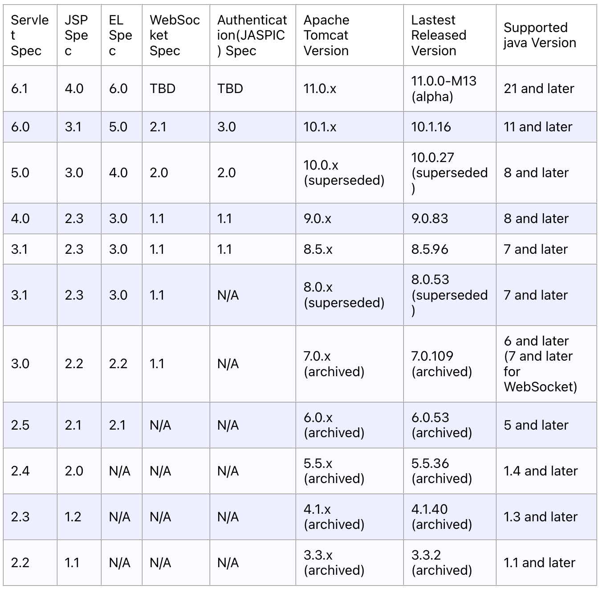

이번 AWS Elastic Beanstalk 의 Linux 2023 플랫폼에서는 Tomcat 8.5 + Java(Corretto) 8 을 더이상 지원하지 않기 때문에, deprecated 된 Linux 2022 를 사용하거나 애플리케이션 버전업을 해야 합니다.

간단한 애플리케이션은 버전업하기 쉽지만, Tomcat 의 버전별 차이를 알고난 뒤 버전업을 해야 하기 때문에 정리하게 되었습니다.

# 요약

필요한 부분만 먼저 요약으로 정리했습니다. 크게 Servlet 버전업, Java 버전업, 내부 API 변경이 있습니다.

## Jakarta Servlet 6.0 버전

10.0 버전부터 Jakarta Servlet 을 사용하기 때문에 **사용하는 API 중 javax.\* 를 모두 jakarta.\* 로 변경해야 합니다.** (10.0 은 Jakarta Servlet 5.0, 10.1 은 Jakarta Servlet 6.0 사용) 웬만하면 javax 를 jakrta 로 직접 바꿔주면 모두 import 됩니다. 안된다면 서블릿 버전이 업그레이드 되면서 변경되거나 deprecated 된 것일 수도 있으니 직접 찾아봐야 합니다.

또한 해당 버전에서 쿠키 명세 중 RFC 6265 를 제외한 지원이 삭제되었고 해당되는 메서드들이 deprecated 되었습니다. 이 변경사항으로 인해 LegacyCookieProcessor 대신 Rfc6265CookieProcessor 를 사용해야 합니다. 쿠키와 관련해서, Cookie.setAttribute(String name, String value) 메서드가 추가되었습니다.

톰캣은 migration tool 을 이용하여 배포 간 Java EE 8 을 Jakarta EE 9 로 변경할 수 있습니다. 이를 위해서 웹 애플리케이션을 legacyApBase 폴더 (webapps-javaee) 에 넣으면 appBase folder(webapps) 에 동일한 Jakarta EE 로 변환됩니다.

## Java 버전

톰캣 8.5 버전은 자바 7 이상인 반면, 톰캣 10.1 버전은 자바 11 버전 이상이 필요합니다.

## 내부 API

사실 내부 API 기능 변경은 여기서 다 다룰 수는 없고, 관련된 API Docs 를 참고해야 합니다. 아래는 Tomcat docs 에 명시된 내용입니다. (Of particular note)

- GenericPrincipal.getPassword() 가 삭제되었습니다.
- JreMemoryLeakPreventionListener 의 많은 구성 옵션이 제거되었습니다.

아래부터는 **세부 내용**입니다. (Docs 요약 수준)

 

# 톰캣 버전

[Apache Tomcat](https://tomcat.apache.org/) 에 나와있는 버전별 Documentation 은 8.5, 9.0, 10.1 버전이 있습니다.

- 8.5 버전 - 2016년 릴리즈
- 9.0 버전 - 2018년 릴리즈
- 10.1 버전 - 2021년 릴리즈

그리고 버전별 특징에 대한 개략적인 정보는 [여기](https://tomcat.apache.org/whichversion.html)서 확인할 수 있습니다.

## 톰캣 8.5

톰캣 8.5 버전은 2016년 톰캣 9.0 알파 버전을 기본으로 하여 만들어졌습니다. 당시 9.0 버전은 안정되지 않았는데, 기술적 요구사항을 반영하기 위해 8.5 버전을 출시하게 되었습니다. 그리고 8.5 버전은 8.0 버전을 대체하게 되었습니다.

다음과 같은 변경사항이 있습니다.

- HTTP/2 에 대한 지원 (Tomcat Native 라이브러리 필수)
- JSSE connectors (NIO, NIO2) 를 통해 OpenSSL 을 사용한 TLS 지원
- SNI (TLS 가상 호스팅) 에 대한 지원
- HTTP 및 AJP 커넥터의 BIO 구현 삭제
- Comet API 지원 중지

## 톰캣 9.0

톰캣 8.0 및 8.5 를 기반으로 하며 Servlet 4.0, JSP 2.3, EL 3.0, WebSocket 1.1 및 JASPIC 1.1 을 구현합니다.

다음과 같은 변경사항이 있습니다.

- HTTP/2 에 대한 지원 (Tomcat Native 라이브러리 또는 Java 9 (Apache Tomcat 9.0.0.M18 이후) 필요)
- JSSE connectors (NIO, NIO2) 를 통해 OpenSSL 을 사용한 TLS 지원
- SNI (TLS 가상 호스팅) 에 대한 지원

##  톰캣 10.1

톰캣 9.0 을 기반으로 하며 Servlet 6.0, JSP 3.1, EL 5.0, WebSocket 2.1 및 Authentication 3.0 을 구현합니다. **사용하는 api 중 javax.\* 를 jakarta.\* 로 변경해야 합니다.** 

# 각 버전별 마이그레이션 고려사항(차이)

## 톰캣 8.5 에서 9.0 으로 마이그레이션

*톰캣 8.5 에서 9.0 으로 마이그레이션하는 [공식 문서](https://tomcat.apache.org/migration-9.html)를 참고했습니다.*

- 자바 버전 : 톰캣 8.5 는 자바 7 이상이지만, 톰캣 9.0 은 자바 8 이상이 필요합니다. 

- servlet 4.0 API 로 변경 : (JSP 문제로, JSP 를 사용하지 않는 다면 고려할 필요 없음) JSP 페이지에서 와일드 카드를 사용할 때 웹 애플리케이션과 충돌이 있을 수 있는 문제로 다음과 같이 import 를 사용할 수 없습니다. (<%@page imoprt="a.*">) 대신 명백히 import 를 해야 합니다. (import="a.PushBuilder")

- 내부 API 변경 : 톰캣 9 에서 일부 API 가 변경되었으나 주요 API 는 8.5 버전 기준으로는 변경되지 않았습니다. (8.0 에서 9.0 으로 마이그레이션 할 때는 확인 필요)

- 기본 CookieProcessor 가 Rfc6265CookieProcessor 로 변경되었습니다.

- RemoteAddrValve 가 localhost 에서 Manager 와 HostManager 웹 애플리케이션으로의 접근을 제한합니다.

  

## 톰캣 9.0 에서 10.1 으로 마이그레이션

공식 문서는 톰캣 9.0 에서 10.0, 10.0 에서 10.1 로 나누어져있습니다.

### 톰캣 9.0 에서 10.0

*톰캣 9.0 에서 10.0 으로 마이그레이션하는 [공식 문서](https://tomcat.apache.org/migration-10.html)를 참고했습니다.*

- 명세 API 변경 (Jakarta Servlet 5.0, Jakarta Server Pages 3.0, Jakarta Expression Language 4.0, JakartaWebSocket 2.0 and Jakarta Authentication 2.0)
  - 제일 중요한 변경 사항으로, javax 를 jakarta 로 변경해야 합니다.
  - 톰캣은 migration tool 을 이용하여 배포 간 Java EE 8 을 Jakarta EE 9 로 변경할 수 있습니다. 이를 위해서 웹 애플리케이션을 legacyApBase 폴더 (webapps-javaee) 에 넣으면 appBase folder(webapps) 에 동일한 Jakarta EE 로 변환됩니다.
- 내부 API 도 세부적인 부분에서 많은 변경이 있었기 때문에 JavaDoc 을 확인해야 합니다.
- conf/web.xml 의 기본 요청과 응답이 UTF-8 로 인코딩됩니다.
- 재시작 시 Session persistence 가 기본적으로 비활성화됩니다. conf/context.xml 이나 개별 웹 애플리케이션에서 활성화할 수 있습니다.

### 톰캣 10.0 에서 10.1

*톰캣 9.0 에서 10.0 으로 마이그레이션하는 [공식 문서](https://tomcat.apache.org/migration-10.1.html)를 참고했습니다.*

- Java 11 필수
- 명세 API 변경 (Jakarta Servlet 6.0, Jakarta Server Pages 3.1, Jakarta Expression Language 5.0, JakartaWebSocket 2.1 and Jakarta Authentication 3.0)
  - Servlet 5.0 → Servlet 6.0
    - 5.0 에서 deprecated 로 된 API 는 모두 삭제되었습니다.
    - 쿠키 명세 중 RFC 6265 를 제외한 지원이 삭제되었고 해당되는 메서드들이 deprecated 되었습니다.
    - Cookie.setAttribute(String name, String value) 메서드가 추가되었습니다.
- 내부 API 도 세부적인 부분이 변경되고 deprecated 가 모두 제거되었습니다.
