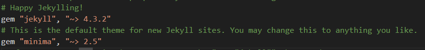
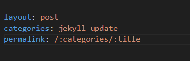
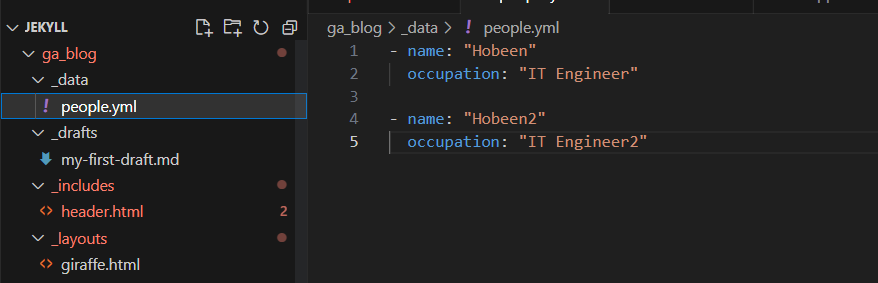
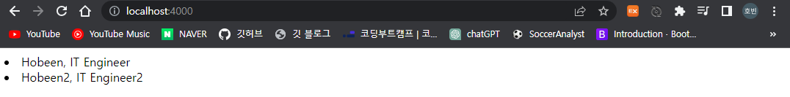
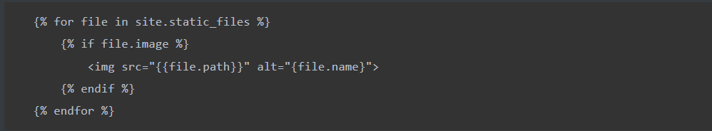
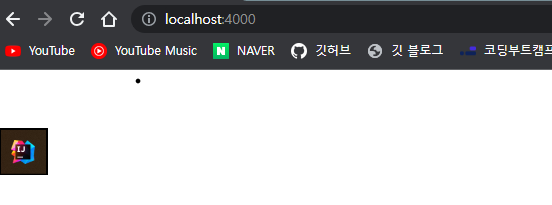

[jekyll 강의 영상(유튜브)](https://www.youtube.com/playlist?list=PLLAZ4kZ9dFpOPV5C5Ay0pHaa0RJFhcmcB)



# 기본 설정

ruby 다운로드가 필요합니다.

터미널 창에서 `jekyll new ga_blog` 로 jekyll 기본 세팅을 다운로드할 수 있습니다.

실행은 `bundle exec jekyll serve` 로 합니다. 4000번 포트로 열립니다. 처음 이후로는 `jekyll serve` 로 실행합니다.

**Gemfile**



Gemfile 에서 gem "jekyll" 은 jekyll 버전, gem "minima" 는 테마를 의미합니다. 기타 dependencies 가 있습니다. 다른 테마(ex. hacker 테마) 를 다운로드받으려면 `gem 'jekyll-theme-hacker', '~> 0.2.0'` 를 하고 `bundle install` 을 해줘야 합니다.

# Front Matter 

​	Front Matter 는 타이틀, 페이지 정보 등의 메타정보를 의미합니다.

```ruby
---
layout: post
title:  "Welcome to Jekyll!"
date:   2023-06-11 13:58:12 +0900
categories: jekyll update
---
```

YAML, JSON 의 key, value 형식입니다.

> title 을 지정안해도 되지만, 대문자를 사용하려면 Welcome-to-Jekyll! 와 같이 저장해야 합니다.

# drafts

_draft 폴더에 파일을 넣으면 보이지 않습니다. `jekyll serve --draft` 로 실행하면 post 에 나타납니다. 날짜는 최근 수정일입니다.

블로그 포스트를 작성할 때 기본 드래프트를 넣어놓고 사용하면 됩니다.

# permalink

​	해당 포스트의 url 를 할당할 수 있습니다.



​	위와 같이 쓰면 해당 카테고리의 해당 title 로 url 이 지정됩니다. `http://localhost:4000/jekyll/update/my-first-blog-post`

# default 설정

​	Front Matter 를 default 로 설정할 수 있습니다.

**_config.yml 파일**

```yaml
defaults:
  - scope:
      path: ""
    values:
      layout: post
```

​	모든 경로 파일의 layout 을 post 로 지정합니다. default 설정이며 파일에서 직접 다른 레이아웃으로 변경하면 파일 내 설정이 우선됩니다.

# theme 설정

​	rubygems.org 에서 theme 이라고 검색하면 여러가지 테마가 나옵니다. Gemfile 에 설정해준 뒤 ``bundle install`` 을 실행해줍니다. 이후 `_config.yml` 파일에서 `theme: minima` 을 다른 테마로 변경해줍니다.

다운로드 받은 후에는 bundle exec jekyll serve 로 실행해줘야 합니다.

테마마다 레이아웃 값이 다르니 확인해줘야 합니다. layout: post 를 사용하지 않는 테마도 있다는 뜻입니다.

#  _layouts

​	블로그의 뼈대인 layout 을 만드는 곳입니다.

`{{content}}` 는 현재 페이지의 파일을 의미합니다.

**post.html**

```html
---
layout: "wrapper"
---
<h1>This is a post</h1>
<hr>
{{content}}
```

​	위와 같이 계층적으로 만들 수 있습니다. post.html 은 wrapper.html 의 {{content}} 입니다.

**wrapper.html**

```html
<html lang="en">
<head>
    <meta charset="UTF-8">
    <title>Document</title>
</head>
<body>
    Wrapper <br>
    {{content}}
    <br> Wrapper
</body>
</html>
```

# 변수

​	Front Matter 로 변수를 임의로 만들 수 있습니다. 아래는 author 변수를 만들고 사용하는 방법입니다.

```html
---
layout: "wrapper"
author: "Hobeen"
---
<h1>This is a post</h1>
<h3>{{layout.author}}</h3>
<hr>
{{content}}
```

`{{layout.author}}` : "Hobeen" 을 출력합니다.

​	_config.yml 파일의 값을 접근할 때 주로 `site.` 을 사용합니다. 아닌 경우도 있으니 아래의 변수 관련 jekyll Docs 를 확인해보세요.

```html
<html lang="en">
<head>
    <meta charset="UTF-8">
    <title>{{site.title}}</title>
</head>
<body>
    Wrapper <br>
    {{content}}
    <br> Wrapper
</body>
</html>
```

변수 Docs : https://jekyllrb.com/docs/variables/

# includes

_includes 폴더는 여러 페이지에서 반복적으로 사용되는 코드 조각을 저장하는 곳입니다. 예를 들어, 헤더와 푸터, 사이드바, 코드 하이라이팅 등의 공통 요소를 이 디렉토리에 넣을 수 있습니다. 이러한 요소들은 `` 구문을 통해 레이아웃이나 페이지에 삽입될 수 있습니다.

**_layout/wrapper.html**

```html
<html lang="en">
<head>
    <meta charset="UTF-8">
    <title>{{site.title}}</title>
</head>
<body>
    
    <br>
    {{content}}
    <br> 
</body>
</html>
```

`` 를 통해 _includes 폴더의 header.html 을 불러올 수 있습니다. 

**_includes/header.html** 파일입니다.

```
<h1 style="color: {{ include.color }}">{{site.title}}</h1>
<hr><br>
```

`color="blue"` 로 include 파일의 색을 지정할 수 있습니다.

#  Looping through Post

index.md 를 보면 home 을 layout 으로 사용합니다.

```
---
# Feel free to add content and custom Front Matter to this file.
# To modify the layout, see https://jekyllrb.com/docs/themes/#overriding-theme-defaults
layout: home
---

```

home.html 을 만들어서 커스텀을 해봅시다.

```html

    <li><a href="{{post.url}}">{{post.title}}</a></li>

```

`` : site 에 있는 모든 posts 를 루프를 돌립니다.

post.url, post.title 등으로 값에 접근할 수 있습니다.

# Conditionals

조건문 사용 예시입니다.

```java
---
layout: "wrapper"
author: "Hobeen"
---


    This is the first post

    This is my first post

    This is another post



    <li><a style=" color:red;" href="{{post.url}}">{{post.title}}</a></li>


<h1>{{page.title}}</h1>
<h2>{{page.date}}</h2>
<h3>{{layout.author}}</h3>
<hr>
{{content}}

```

첫 if 문은 if ~ elsif ~ else 로 되는데요. 해당 페이지의 title 을 기준으로 텍스트를 출력합니다.

두번째는 for 문으로 post 리스트를 출력합니다. 그리고 post.url 과 page.url 이 같다면 빨간색으로 변경합니다.

# Data

_data 폴더를 만들어서 데이터 파일을 관리할 수 있습니다. csv, yaml, json 을 사용할 수 있습니다.



이렇게 저장하고 home.html 을 변경해보겠습니다.

```html

<li>{{person.name}}, {{person.occupation}}</li> 

```



site.data.people 로 접근할 수 있습니다. 

# static 파일

assets 폴더에 저장하지만, 사실 상 위치는 상관없습니다.

예를 들어 assets/img 파일에 imagetest.png, 루트 폴더에 imagetestoutside.png 를 저장하고 아래와 같이 출력해보겠습니다.

```html

    {{file.path}}, {{file.name}}, {{file.basename}}, {{file.extname}}<br>

```

결과는 아래와 같습니다.

```
/assets/img/imagetest.png, imagetest.png, imagetest, .png
/imagetestoutside.png, imagetestoutside.png, imagetestoutside, .png
/assets/minima-social-icons.svg, minima-social-icons.svg, minima-social-icons, .svg
```

`/imagetestoutside.png` 도 선택되는 걸 알 수 있습니다. `site.static_files` 이라고 하면 모든 static 파일이 선택됩니다.

## front matter 부여

_config.yml 파일에서 assets/img 에 있는 모든 파일에 default 값을 부여하겠습니다.

```java
defaults:
  - scope:
      path: "assets/img"
    values:
      image: true
```

이제 해당 값을 이용해서 if 문을 작성해보겠습니다.



`file.image` 의 값은 assets/img 하위의 파일만 true 입니다. 따라서 imagetestoutside 는 출력되지 않고 imagetest 만 출력됩니다.




