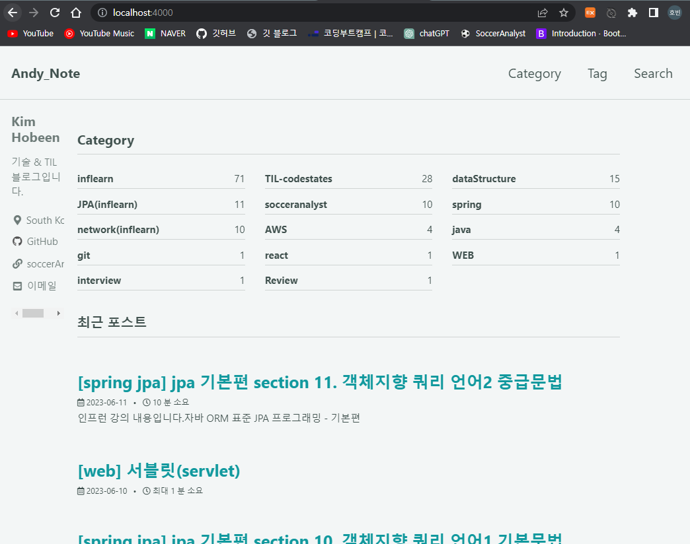
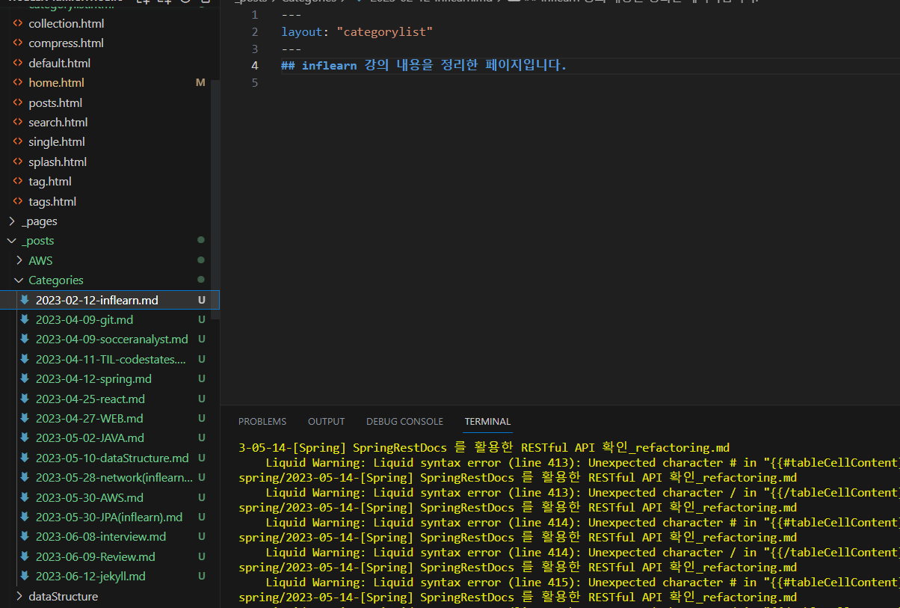
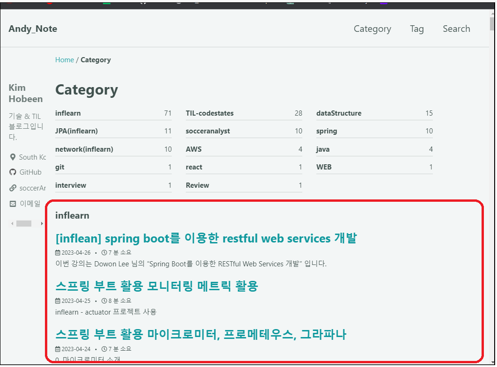

# Home (index) 에 카테고리 추가


​	현재 홈화면에는 최근 포스트만 접근할 수 있습니다. 여기에 **저에 관한 개략적인 정보나 카테고리를 추가하면 좋을 것 같은데요.** 해당 화면을 구성하는 문서가 _layouts/home.html 입니다.


​	이 파일을 수정하면 위 그림의 홈 화면에서 빨간색 영역을 수정하는 겁니다. 여기에 카테고리별 분류를 추가해줍니다.



```html
---
layout: archive
---

{{ content }}
추가되는 부분 시작
<h3 class="archive__subtitle">Category</h3>



  
    
  


<ul class="taxonomy__index">
  
    
      
        <li>
          <a href="/{{ category[0] }}"> 여기도 변경해줍니다.
            <strong>{{ category[0] }}</strong> <span class="taxonomy__count">{{ i }}</span>
          </a>
        </li>
      
    
  
</ul>
추가되는 부분 끝
<h3 class="archive__subtitle">{{ site.data.ui-text[site.locale].recent_posts | default: "Recent Posts" }}</h3>


  

  



<div class="entries-{{ entries_layout }}">
  
    
  
</div>


```


​	해당 코드는 categories.html 파일에서 일부 긁어왔습니다. categories.html 은 `/categories` url 을 구성하는 문서입니다. 그럼 아래와 같이 됩니다.



# 카테고리별 별도 페이지 만들기

​	`TIL-codestates` 카테고리를 누르면 `https://hobeen-kim.github.io/categories/#til-codestates` url 로 이동하게 됩니다. 여기서는 `#`(섹션) 으로 구분되어 있는데요. 카테고리별로 `/til-codestates` 페이지가 별도로 있었으면 좋겠습니다. 이제 만들어보겠습니다.

​	먼저 해당 카테고리를 형성하는 페이지 프레임을 만들어야 합니다. 저는 **_layouts 에 categorylist.html 파일**을 만들었습니다. **이제 이 페이지는 카테고리별 프레임이 됩니다.**


```html
---
layout: archive
---

{{content}}




    
    
    
        <section id="{{ category[0] | slugify | downcase }}" class="taxonomy__section">
            <div class="entries-{{ entries_layout }}">
            
                
            
            </div>
            <a href="#page-title" class="back-to-top">{{ site.data.ui-text[site.locale].back_to_top | default: 'Back to Top' }} &uarr;</a>
        </section>
    

```


상위 레이아웃으로 archive 를 사용하고, 컨텐츠를 받아줍니다. \{\{content\}\} 에는 md 파일의 내용이 올겁니다. 그 밑에 있는 코드는 모든 카테고리들을 for loop 로 돌면서 `category_name == page_title` 을 만족할 때 해당 카테고리의 목록을 보여줍니다.

​	그리고 해당 카테고리를 보여주는 md 파일도 있어야겠죠.


```html

---
layout: "categorylist"
---
## JPA 인프런 강의입니다. 
<a href="https://www.inflearn.com/course/ORM-JPA-Basic/dashboard">강의 링크 이동</a>

```


이제 /jpa(inflearn) 으로 이동하면 다음과 같은 화면을 볼 수 있습니다.


다른 카테고리도 같은 방법으로 만들어줍니다.



이렇게 _post 폴더에 Categories 를 따로 만들어서 카테고리 홈페이지를 모아뒀습니다.

이제 `/categories/` 로 가봅시다.



이 빨간색 부분을 날리고 Category 로 가는 부분만 남겨보겠습니다. **이를 위해서는 /_layouts 에서 categories.html 을 편집해야 합니다.** 아래와 같이 변경해줍니다.


```html

---
layout: archive
---

{{ content }}



  
    
  


<ul class="taxonomy__index">
  
    
      
        <li>
          <a href="/{{ category[0] }}">
            <strong>{{ category[0] }}</strong> <span class="taxonomy__count">{{ i }}</span>
          </a>
        </li>
      
    
  
</ul>
-->
```


이제 모든 #{category} 로 된 url 은 /{category} 로 변경해줘야 합니다. _includes/nav_list.html (왼쪽 카테고리),  _includes/breadcrumb.html (포스트 내 카테고리) 도 변경해줍니다.


breadcrub.html 에서는 마지막 else 문 a 태그를 `<a href="{{ crumb | downcase | replace: '%20', '-' | prepend: path_type | prepend: crumb_path | relative_url }}"` 에서 `<a href="{{ crumb | relative_url }}"` 로 변경해줍니다.



