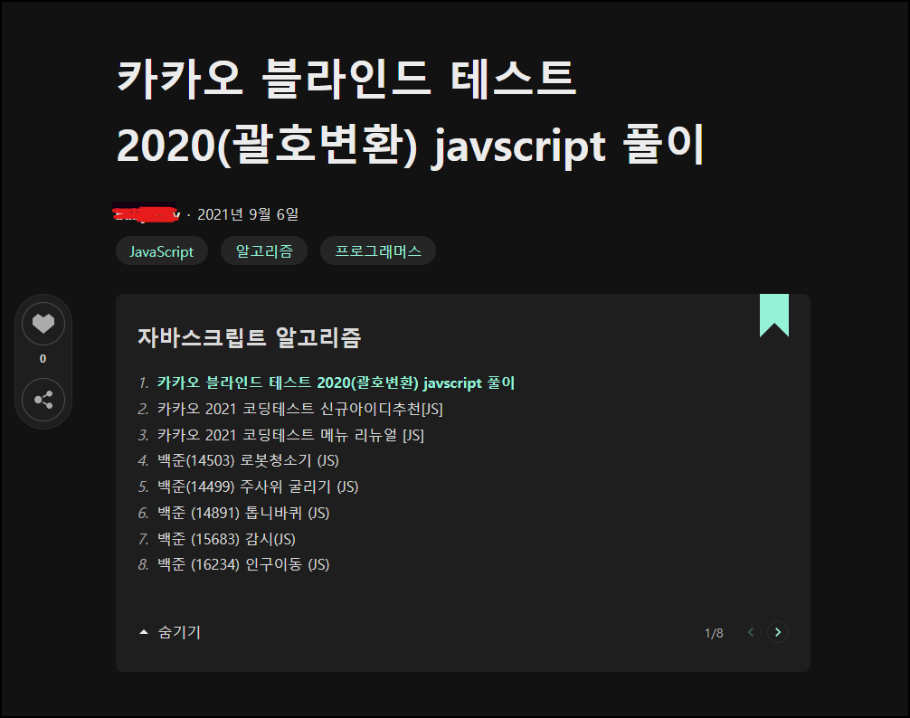

# Minimal Mistake 시리즈 만들기

​	아래 사진처럼 깃블로그에도 시리즈를 만들고 싶어서 한번 만들어봤습니다.



​	완성된 결과물입니다. 너무 따라했나요?


 일단 만드는 방법은 쉽습니다. **HTML, CSS, JS 파일을 만들고 적절하게 연결시켜주면 됩니다.**

## series.html

_includes 디렉토리에 추가해줍니다.

```

```

