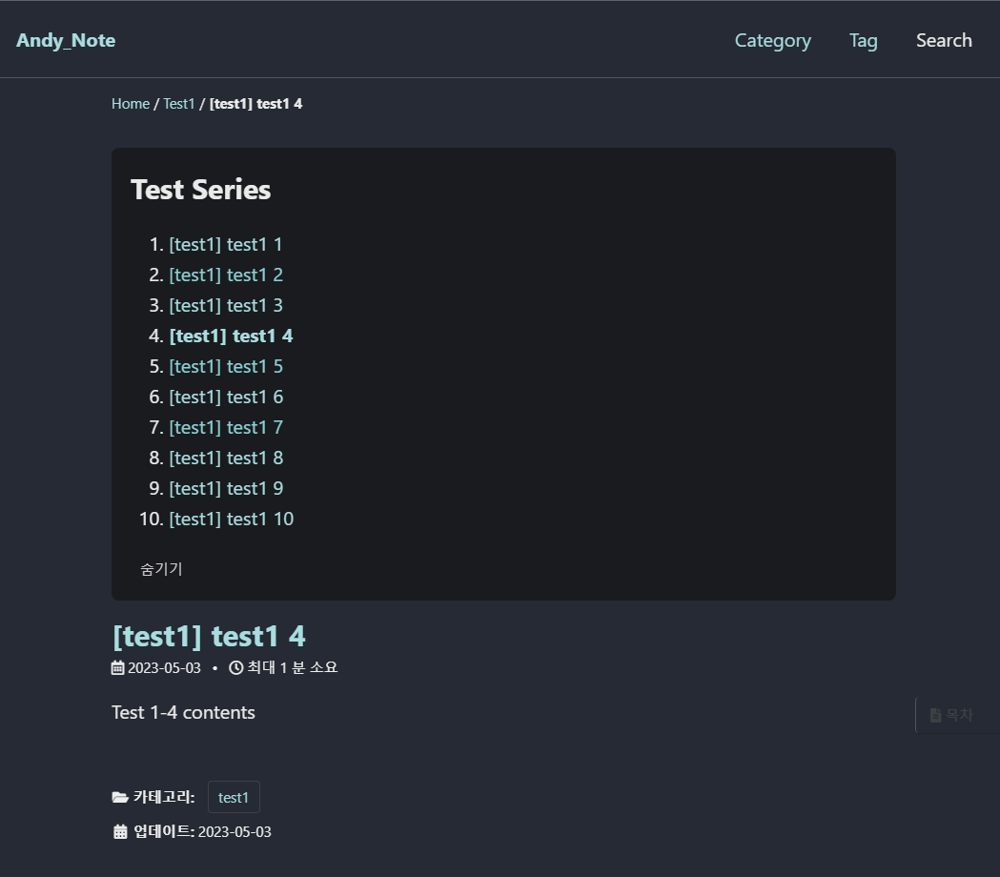
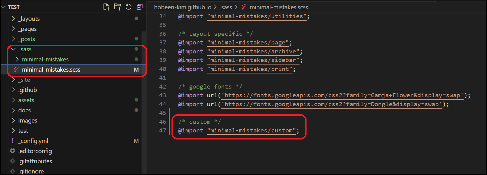
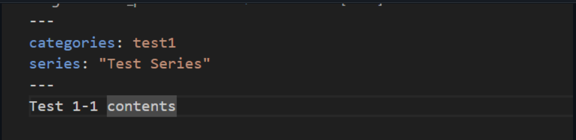

# Minimal Mistakes 시리즈 만들기



​	velog 의 시리즈처럼 깃블로그에도 시리즈를 만들고 싶어서 한번 만들어봤습니다. 카테고리가 있지만, 말 그대로 시리즈물처럼 1, 2, 3편이 있으면 묶어놓고 싶었습니다.

​	일단 완성된 결과물입니다. 너무 따라했나요? 사용방법은 깃에서 확인해주세요. 

[minimal-mistakes-series 깃저장소](https://github.com/hobeen-kim/minimal-mistakes-series)



 일단 만드는 방법은 쉽습니다. **HTML, CSS, JS 파일을 만들고 적절하게 연결시켜주면 됩니다.**

## series.html

`_includes` 디렉토리에 추가해줍니다.

```html
<div class="series">
<div class="series-title">{{page.series}}</div>

<ol class="series-ol">

    
    <li class="series-li">
        
            <strong><a href="{{post.url}}">{{post.title}}</a></strong>
        
            <a href="{{post.url}}">{{post.title}}</a>
        
    </li>
    

</ol>
<span class="collapsible">목록보기</span>
</div>

<script src="https://code.jquery.com/jquery-3.7.0.js" integrity="sha256-JlqSTELeR4TLqP0OG9dxM7yDPqX1ox/HfgiSLBj8+kM=" crossorigin="anonymous"></script>
<script src="../../assets/js/custom.js"></script>
```

위에서부터 한번 살펴보겠습니다.

1. 시리즈 제목입니다.

   ```html
   <div class="series-title">{{page.series}}</div>
   ```

2. `post` 를 최신순이 아닌, 역순으로 정렬하기 위해 `site.posts` 를 뒤집어줍니다.

   ```html
   
   ```

3. `<ol>` 태그 안에서 for 문을 돌려 `post.series == page.series` 인 모든 post 를 추출합니다.

   ```html
   
       
       <li class="series-li">
           ...
       </li>
       
   
   ```

4. 3번 안의 if 문은 현재 포스트인지 확인하는 절차입니다. 현재 포스트는 굵게 표시합니다.

   ```html
   
       <strong><a href="{{post.url}}">{{post.title}}</a></strong>
   
       <a href="{{post.url}}">{{post.title}}</a>
   
   ```

5. 목록보기를 만듭니다. Jquery 에 의해 누르면 숨기기로 바뀝니다.

   ```html
   <span class="collapsible">목록보기</span>
   ```

## custom.js

```js
$(document).ready(function() {
    $(".collapsible").click(function() {
        var seriesList = document.querySelector('.series-ol');
        $(this).next().toggle(); // 시리즈 목록 표시/숨김
        if ($(this).text() == "목록보기") {
            seriesList.classList.toggle('open');
            $(this).text("숨기기");
        } else {
            seriesList.classList.toggle('open');
            $(this).text("목록보기");
        }
    });
});
```

`"목록보기"` 를 누르면 시리즈 목록이 표시되고 "숨기기" 를 누르면 시리즈 목록이 숨김 표시되는 기능입니다.

## _custom.scss

```scss
.series{
    padding: 1rem 1rem;
    background: #191b1f;
    border-radius: 8px;
    margin-bottom: 1rem;
}

.series-title{
    font-size: 1.5rem;
    font-weight: 700;
}

.series-li{
    margin-bottom: 0.1rem;
}

.collapsible {
    background: none;
    color: rgb(212, 205, 205);
    cursor: pointer;
    padding: 10px;
    width: 100%;
    text-align: left;
    outline: none;
    font-size: 15px;
}

.series-ol {
    max-height: 0;
    overflow: hidden;
    transition: max-height 1s ease-in-out;
  }
  
.series-ol.open {
    max-height: 500px;
}
  
a:visited{
    color: #a9dde0;
}
  
```

기본적인 css 입니다. 색이나 위치, 크기가 마음에 안들면 해당 클래스를 보고 바꿔주면 됩니다.

# html, css, js 파일과 포스트 연결

​	포스트의 기본적인 뼈대는 `_layouts/posts.html` 이 아닌 `_layouts/sinlge.html` 입니다. (당연히 post.html 인줄 알고 꽤나 고생했습니다...)

## single.html 수정

먼저 `_layouts/single.html` 에서 `_includes/series.html` 을 추가해줍니다.

```html
...
<div class="page__inner-wrap">
    
        <header>
        <!--추가시작-->
          
            
          
        <!--추가 끝-->
          <h1 id="page-title" class="page__title p-name" itemprop="headline">
            <a href="{{ page.url | absolute_url }}" class="u-url" itemprop="url">{{ page.title | markdownify | remove: "<p>" | remove: "</p>" }}</a>
          </h1>
          
        </header>
    
    ...
```

1. 추가 시작 ~ 추가 끝 주석에 해당 내용을 추가합니다. `` 는 `_includes/series.html` 을 넣겠다는 liquid 문법입니다.
2. 제목 밑에 시리즈 드롭다운을 넣고 싶다면 `` ~ `` 아래에 넣으면 됩니다.

## minimal-mistakes.scss 수정



`_sass\minimal-mistakes.scss` 에서 아까 만든 custom 을 넣어줘야 합니다. `@import "minimal-mistakes/custom";` 라고 넣어줍니다.

# 사용 방법

​	`_includes/series.html` 은 마크다운의 front matter 의 "series" 가 있는지 찾아서 시리즈 드롭다운을 만듭니다.



이렇게 **series 를 front matter 로 넣으면 자동으로 같은 series 끼리 묶어서 드롭다운을 만들어줍니다.**

# 기능

- series 별로 시리즈 드롭다운을 만듭니다.
- front matter 에 series 가 없다면 시리즈 드롭다운을 만들지 않습니다.
- 날짜가 빠른 순부터 1번으로 시작합니다. 날짜가 같다면 사전 순서입니다.
- '목록보기' 를 누르면 목록이 보여지며 '목록보기' 가 '숨기기' 로 변경됩니다.
- '목록보기' 를 누르면 목록이 숨겨지며 '숨기기' 가 '목록보기' 로 변경됩니다.
- 시리즈 목록 중 현재 위치가 굵게 표시됩니다.


