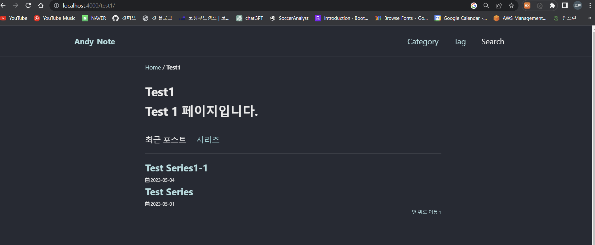



# 구현 모습



시리즈만 모아놓게 구현했습니다. 시리즈를 클릭하면 첫 포스트로 이동합니다.

# 구현

## _layout/categorylist.html

```html
---
layout: archive
---

{{content}}
<div class="button-container">
<span class="button-posts selected">{{ site.data.ui-text[site.locale].recent_posts | default: "Recent Posts" }}</span>
<span class="button-series">시리즈</span>
</div>
<hr/>
<div class="categorylist-posts">


    
    
    
        <section id="{{ category[0] | slugify | downcase }}" class="taxonomy__section">
            <div class="entries-{{ entries_layout }}">
            
                
            
            </div>
            <a href="#page-title" class="back-to-top">{{ site.data.ui-text[site.locale].back_to_top | default: 'Back to Top' }} &uarr;</a>
        </section>
    

</div>
<div class="categorylist-series categorylist-hide">
    
    
        
        
        
        
        
            <section id="{{ category[0] | slugify | downcase }}" class="taxonomy__section">
                <div class="entries-{{ entries_layout }}">
                
                    
                        
                            
                                         
                            
                                
                                
                                    
                                        
                                        
                                    
                                
                            
                        
                        
                    
                
                
                    
                    
                        
                            
                            
                        
                    
                
                    시리즈가 없습니다.
                
                </div>
                <a href="#page-title" class="back-to-top">{{ site.data.ui-text[site.locale].back_to_top | default: 'Back to Top' }} &uarr;</a>
            </section>
        

</div>
<script src="../../assets/js/custom_categorylist.js"></script>
<script src="https://ajax.googleapis.com/ajax/libs/jquery/3.5.1/jquery.min.js"></script>
```

하나하나 보겠습니다.

**버튼**

```html
<div class="button-container">
<span class="button-posts selected">{{ site.data.ui-text[site.locale].recent_posts | default: "Recent Posts" }}</span>
<span class="button-series">시리즈</span>
</div>
```

`Recent Posts` 는 `data` 의 전역변수로 로케일 설정이 되어있습니다. `series` 는 따로 안했는데, 하고 싶으면 `_data/ui-text.yml` 에서 영어랑 한국어 정도만 설정하면 될 듯합니다. 버튼을 누르면 `"selected"` 클래스가 추가되도록 js 를 만들었습니다.

**포스트 및 시리즈**

```html
<div class="categorylist-posts">
	<!--포스트-->
</div>
<div class="categorylist-series categorylist-hide">
    <!--시리즈-->
</div>
```

​	크게 보면 위와 같습니다. 버튼을 누르면 js 를 통해 `categorylist-hide` 클래스를 추가하거나 없앱니다. 해당 클래스가 있으면 `display: none` css 가 적용됩니다.

**div `categorylist-series` 태그 안**

​	기본적으로 모든 `post` 를 순회하면서 `sries` 가 있으면 해당 `sries` 중 첫번째 시리즈를 `` 로 출력하는 형태입니다. 변수 할당이 힘들어서 자바 쓰고 싶네요.

**js 사용**

```html
<script src="../../assets/js/custom_categorylist.js"></script>
<script src="https://ajax.googleapis.com/ajax/libs/jquery/3.5.1/jquery.min.js"></script>
```

최상위 문서인 `default.html` 에 사용하고 싶은데 그러면 충돌이 나서 포스트의 `toc` 가 현재 위치를 잡아주지 못하는 문제가 있었습니다. 그래서 따로 여기에서만 다시 jquery 를 넣어주겠습니다.

## _sass/minimal-mistakes/\_custom_categorylist.scss

```scss
.selected{
    border-bottom: 2px solid $link-color;
    color : $link-color;
}
.button-container{
    margin-top : 2rem;
    margin-bottom : 0.5rem;
}

.button-posts{
    margin-right : 1rem;
    cursor: pointer;
}

.button-series{
    margin-right : 1rem;
    cursor: pointer;
}

.categorylist-hide {
    display: none;
}
```

​	버튼을 눌렀을 때 `.selected` 와 `.categorylist-hide` 가 설정되거나 제거됩니다. `$link-color` 는 `_sass/minimal-mistakes/skins` 에서 해당되는 스킨의 `scss` 파일에 있는 전역변수입니다. 제 스킨은 현재 dark 입니다. (근데 dark 가 아니라 곰팡이 핀 죽 색깔같습니다.)

​	`scss` 를 새로 작성했다면 `_sass\minimal-mistakes.scss` 에 추가해줘야 합니다.

```scss
...
@import "minimal-mistakes/custom_categorylist";
```


## assets\js\custom_categorylist.js

```js
$('.button-posts').click(function(){
    $(this).addClass('selected');
    $('.button-series').removeClass('selected');
    $('.categorylist-series').addClass('categorylist-hide');
    $('.categorylist-posts').removeClass('categorylist-hide');
});

$('.button-series').click(function(){
    $(this).addClass('selected');
    $('.button-posts').removeClass('selected');
    $('.categorylist-posts').addClass('categorylist-hide');
    $('.categorylist-series').removeClass('categorylist-hide');
});
```

​	jQuery 입니다. 버튼을 누르면 class 를 추가하고 삭제하는 간단한 기능입니다.

## _include/archive_series.html

```html

  {{ post.header.teaser }}

  



  

  


<div class="{{ include.type | default: 'list' }}__item">
  <article class="archive__item" itemscope itemtype="https://schema.org/CreativeWork">
    
      <div class="archive__item-teaser">
        
      </div>
    
    <h2 class="archive__item-title no_toc" itemprop="headline">
      
        <a href="{{ post.link }}">{{ title }}</a> <a href="{{ post.url | relative_url }}" rel="permalink"><i class="fas fa-link" aria-hidden="true" title="permalink"></i><span class="sr-only">Permalink</span></a>
      
        <a href="{{ post.url | relative_url }}" rel="permalink">{{ title }}</a>
      
    </h2>
    
  </article>
</div>

```

​	`_layout/categorylist.html` 을 보면 포스트는 `archive_single.html` 을 사용하는데, 해당 파일은 포스트의 제목을 나타냅니다. 시리즈는 시리즈 제목으로 출력될 수 있도록 `archive_series.html` 를 만들어서 적용합니다. (이미 `categorylist.html` 에 적용되어있습니다.)


