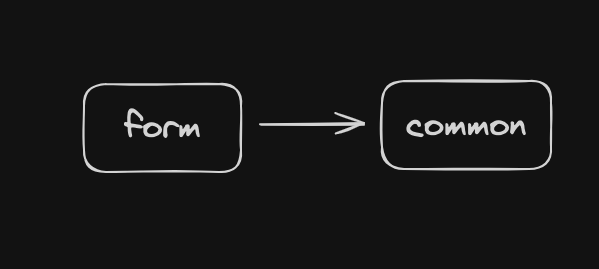
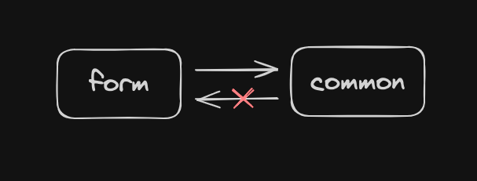
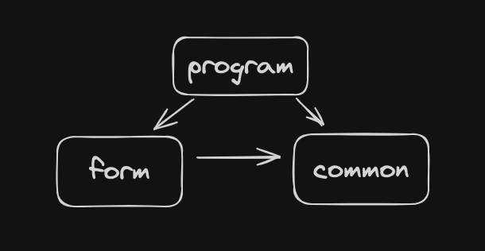
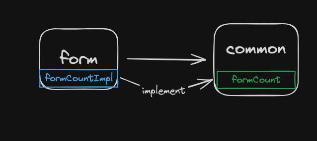
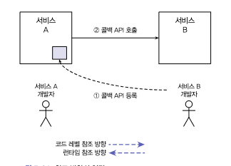
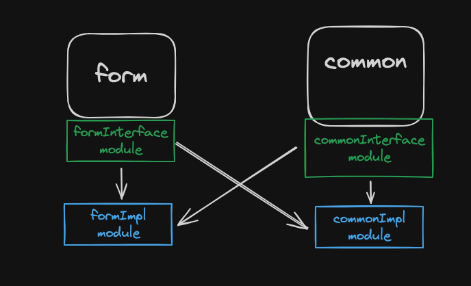

# 1. 문제상황

  코드 간 의존성을 정리하기 위한 방법으로 모듈을 분리하고자 계획했습니다. 제일 처음으로 비교적 독립적인 서비스인 form (신청서) api 를 별도 모듈로 분리하기로 결정했습니다. 그리고 나머지 코드는 common 모듈로 명명했습니다. 따라서 아래와 같이 form 모듈이 common 모듈을 의존하는 형태가 됩니다.

  form 모듈은 common 모듈에서 해당 신청서의 프로그램 정보, 유저정보 등등을 가져오기 때문에 common 모듈이 필수입니다. 하지만 common 모듈도 form 모듈의 기능이 필요할 때가 있는데, 바로 프로그램 목록을 반환할 때 신청이 몇개나 들어왔는지 입니다.

  하지만 서로를 의존할 수 없기 때문에 common 모듈은 form 모듈의 기능을 사용할 수 없습니다.

# 2. 해결 방법

해결방법은 아래 몇 가지가 있습니다.

## 2.1 두 모듈을 사용하는 모듈 생성

 예를 들어 위와 같이 program 모듈을 만들고 form, common 모듈에서 정보를 조합해 사용하는 방법입니다. 이 방법은 몇몇 경우에서 유용하지만, 제 경우는 아니었습니다.

 일단 form 모듈은 program 정보가 필요하기 때문에 다시금 program 모듈과 서로 의존관계가 되는 상황이 발생합니다. 그리고 program 기능이 가장 크기 때문에 분리하기가 쉽지 않습니다.

 또한 특정 기능을 위한 모듈을 만든다면 도메인 정책에 맞지 않는 모듈이 생겨날 가능성이 높습니다. **모듈이 목적성을 잃게되면 의사소통에 혼란이 생기고 관련된 모듈의 응집도가 낮아집니다.

## 2.2 API 를 따로 부른다.

form 모듈에 programId 에 따른 신청서 개수만 반환하는 api 를 만듭니다. 프론트측에서 program 리스트를 받은 후에 신청서 개수 api 를 다시 부릅니다. 이 방법도 좋지만 저는 프론트의 개선 없이 api 서버만 따로 발전시키고 싶었습니다.

## 2.3 의존성 역전

 여러 방법이 있겠지만 저는 이렇게 해결했습니다. common 모듈에서는 인터페이스를 통해 formCount 를 가져옵니다. (신청 수). 이러한 formCount 인터페이스는 form 모듈에서 구현합니다.

 이 개념은 '마이크로서비스 아키텍처 구축 가이드' (김용욱 저) 에서 봤는데, 이런 내용입니다. 이 내용은 MSA 라 약간 다르긴 합니다.

이 형태는 콜백 API 를 통해 코드 레벨 참조와 런타임 레벨 참조 방향을 역전시키는 경우입니다. 콜백 API 인터페이스를 정의하는 것은 서비스 A 의 개발자입니다. 서비스 A 가 콜백 API 의 인터페이스를 변경하면 서비스 B 도 이에 맞게 변경해야 합니다. 반대로 서비스 B 개발자가 콜백 API 의 구현 디테일을 변경한다고 해도 서비스 A 개발자는 신경 쓸 필요가 없습니다. 따라서 **코드 레벨의 참조 방향은 B 가 A 를 참조합니다.** 반대로 런타임에는 서비스 A 가 서비스 B 의 콜백 API 를 호출하게 됩니다. 따라서 서비스 B 에 장애가 발생하면 서비스 A 도 같이 영향을 받습니다. 반대로 서비스 A 에 장애가 발생하더라도 서비스 B 는 멈추거나 느려지지 않습니다. 따라서 **런타임 레벨의 참조 방향은 A 가 B 를 참조합니다.**

이는 서비스의 순환참조관계를 피하기 위해 설정할 수 있습니다.

## 2.3.1 또다른 멀티모듈 의존성 주입 방법

출처 : https://kciter.so/posts/spring-multi-module-architecture/

각각 모듈을 추상모듈과 구현모듈로 분리합니다. 그리고 구현모듈은 추상모듈만을 사용합니다. 이렇게 되면 구현모듈은 서로 순환참조를 피하게 됩니다. 하지만 이 방법은 MSA 로 넘어가게 되면 결국 서비스 간 순환참조가 일어나게 됩니다. 그렇다고 해서 나쁘다는 건 아닙니다. 왜냐하면 MSA 를 사용하지 않는다면 제일 깔끔한 방법이기 떄문입니다.

# 3. 의견

'마이크로서비스 아키텍처 구축 가이드' 에서 저 내용을 읽었을 때는 솔직히 "무슨 말이야" 했었는데 직접 필요해서 찾아보고 사용하다보니 책 내용이 다시 떠오르더군요. 그리고 다시 책을 읽으면서 좀 더 깊이 이해했습니다.

