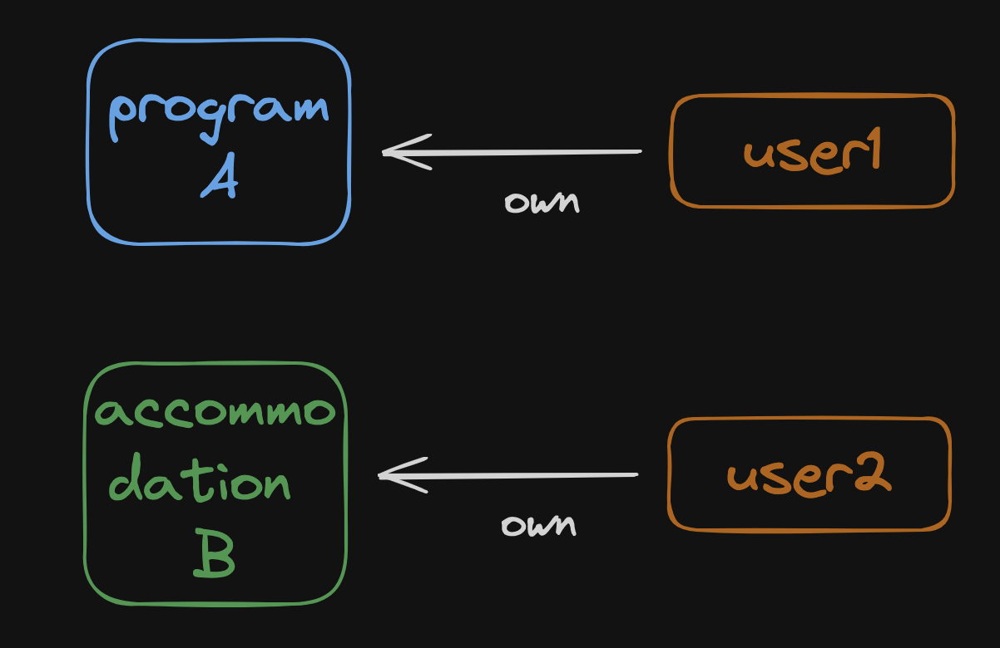

# 0. 문제상황

초기 monthler 프로젝트에서 프로그램 소개글에 대한 권한 관리는 간단했습니다. 특정 프로그램(A) 이 있다면 파트너가 해당 프로그램에 대한 수정, 삭제 등의 권한이 있는지만 체크하면 되었습니다.

위 그림처럼 user1 이 A 에 대해 소유권이 있는지만 체크하면 됩니다.

이러한 소유권은 **admin_authority** 테이블로 관리되고 있고, 프로그램을 가져올 때 **left join 으로 함께 묶어서** 특정 유저가 권한이 있는지만 sql 문으로 확인하면 됐습니다.

## 0.1 숙소 탭 추가

서비스가 발전하면서 숙소 도메인도 추가되었는데요. **숙소에 대한 권한 관리도 따로 필요**했습니다. 숙소는 프로그램과 별도의 도메인이기 때문에 권한관리도 별도로 했습니다.

위와 같이 따로 관리를 했고, 각각 admin_authority, **accommodation_authority** 테이블로 관리했습니다. 숙소 권한을 조회할 때도 숙소를 가져오면서 **accommodation_authority 테이블과 숙소 테이블을 조인**해서 권한을 체크했습니다.

## 0.2 브랜드 추가

파트너사가 많아지면서 **브랜드**를 추가해야 하는 요구사항이 생겼는데요. 브랜드는 유저 그룹이라고 볼 수 있습니다. 하나의 브랜드(ex. 서울특별시)에 여러 유저(관광과 주무관, 어디어디 주무관...)가 들어올 수 있는 구조입니다.

브랜드가 들어오면서 필요한 권한 관리 요구사항은 아래와 같습니다. (명시적으로 요구된 것도 있고 추정된 것도 있습니다.)

1. 권한을 read, write, own 으로 나눈다.
   1. 최초로 작성한 유저가 own 권한을 갖는다.
   2. 어드민은 특정 유저에게 own 권한을 부여할 수 있다.
   3. own 은 수정 및 읽기가 가능하며 브랜드 내 다른 사람에게 write, read 권한을 부여할 수 있다.
   4. write 는 수정 및 읽기 권한이 있다.
   5. read 는 읽기만 가능하다.
2. 브랜드에 속해있는 유저가 게시글, 숙소를 작성하면 해당 작성 유저는 own 권한을 갖고, 브랜드의 모든 사용자는 write 권한을 갖는다.
   1. 브랜드 <-> 게시글, 숙소는 write, read 권한으로 설정할 수 있다.
   2. write 는 브랜드 내 모든 사용자가 수정 및 읽기 권한이 있다.
   3. read 는 브랜드 내 모든 사용자가 읽기만 가능하다.
3. 브랜드와 유저 권한이 겹치면 유저 권한이 우선한다.
   1. 브랜드와 게시글 권한 관계가 write 라도, 유저 권한이 read 이면 읽기만 할 수 있다.
   2. 브랜드와 게시글 권한 관계가 read 라도, 유저 권한이 write 이면 수정 및 읽기가 가능하다.
   3. 브랜드와 게시글 권한 관계가 read 라도, 유저 권한이 own 이면 수정 및 읽기, 권한 부여가 가능하다.

필요한 권한 관게가 복잡해지면서 권한 api 를 하나 만들어서 따로 관리해야겠다는 생각이 들었습니다. 언제까지 sql 문으로만 join 해서 체크할 수는 없으니까요.

# 1. 해결 방법

zanzibar 는 구글에서 사용하는 권한 관리 시스템입니다. 특정 유저가 특정 문서, 파일, 동영상에 대해 권한이 있는지 질의할 수 있습니다. 하나의 시스템에게 단순한 api 로 사용되기 때문에 간단하게 통합적인 권한관리가 된다는 장점이 있지만, 모든 생성 활동에 대해 해당 시스템을 호출해서 저장해야 하는 단점이 있습니다. 

사실 지금의 사이드 프로젝트에서 zanzibar 까지 할 필요는 없는데요. 해당 논문을 읽어보면서 제 생각대로 적당히 구현해보는 것도 재밌겠다는 생각이 들었습니다. 

