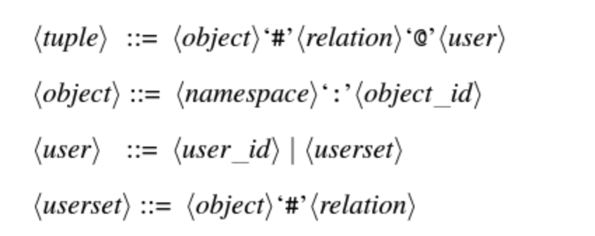
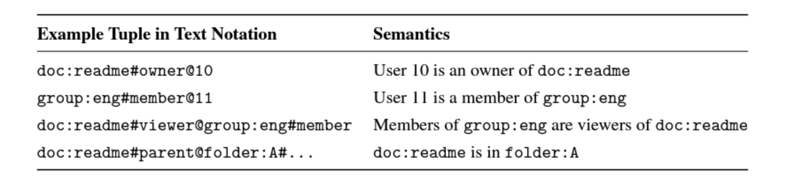

원문 : https://news.hada.io/topic?id=171

## 1.1 zanzibar

zanzibar 의 목표는 다음과 같습니다.

- **정확성(Correctness)**: 접근 제어 결정의 일관성을 보장하여 사용자 의도를 존중해야 합니다.
- **유연성(Flexibility)**: 소비자와 기업 애플리케이션 모두에서 요구되는 다양한 접근 제어 정책을 지원해야 합니다.
- **저지연(Low latency)**: 권한 검사는 종종 사용자 상호작용의 중요한 경로에 있기 때문에 빠르게 응답해야 합니다. 특히, 수십에서 수백 번의 검사가 필요한 검색 결과를 제공할 때는 저지연 응답이 매우 중요합니다.
- **고가용성(High availability)**: 명시적인 권한이 없을 경우, 클라이언트 서비스는 사용자의 접근을 차단해야 하므로, 시스템은 요청에 신뢰성 있게 응답해야 합니다.
- **대규모 처리(Large scale)**: 수십억 명의 사용자들이 공유하는 수십억 개의 객체를 보호해야 하며, 클라이언트와 최종 사용자 근처에 배포되어야 합니다.

## 1.2 모델, 언어, API

### 1.2.1 Relation Tuple

ACL 은 객체 - 유저 또는 객체 - 객체로 표현되는 튜플입니다. 그룹은 멤버십의 의미를 갖습니다. 아래와 같이 표현됩니다.

namespace 와 relation 은 미리 정의된 값입니다. 그리고 object_id 는 string 값, user_id 는 integer 입니다. (*object_id, user 가 왜 string, integer 인지는 모르겠음*) 튜플을 구분하는 PK 는 namespace, object_id, relation, user 입니다.

예시는 아래와 같습니다.

### 1.2.2 일관성 모델

*(이 파트는 일관성을 어떻게 보장하느냐를 "new enemy problem" 으로 보여주고 있습니다. 이 섹션을 이해하기 위해서는 spanner DB 에 대한 지식이 필요한데 저는 없어서 최대한 이해한대로 작성했습니다. 그리고 제 경우에는 분산DB 를 사용하는 게 아니라서 이정도는 필요없는 구현입니다.)*

권한을 변경했음에도 권한을 잃은 사용자가 해당 문서에 접근하는 문제를 막기 위해 반드시 "**순서**"가 보장되어야 합니다. 이러한 순서가 보장되지 않으면 new enemy problem 이 발생할 수 있습니다.

**Example A: Neglecting ACL update order** 

> 1. Alice 는 특정 폴더에 대한 Bob 의 권한을 제거한다.
> 1. Alice 는 Charlie 에게 새로운 문서를 해당 폴더로 옮겨달라고 요청한다.
> 1. 밥은 새로운 문서를 볼 수 없어야하지만, ACL 체크가 두 ACL 변화 간 순서를 무시한다면 새로운 문서를 볼 수도 있다.

**Example B: Misapplying old ACL to new content** 

> 1. Alice 는 특정 문서에 대한 Bob 의 권한을 제거한다.
> 1. Alice 는 Charlie 에게 문서에 새로운 내용을 추가해달라고 요청한다.
> 1. 밥은 새로운 내용을 볼 수 없어야하지만, ACL 체크가 밥 권한 해제 이전의 데이터로 권한을 평가하고 있다면 새로운 내용을 볼 수도 있다.

(*권한을 수정하면 권한이 삭제되는게 아니라 시간 순으로 새로운 권한을 저장하는 듯 함*)

이러한 문제를 해결하기 위해 zanzibar 시스템은 외부 일관성과 제한된 스냅샷 읽기를 제공합니다. 이를 통해 ACL(Access Control List) 또는 콘텐츠 업데이트 간의 인과적 순서를 이해하고 일관성을 유지합니다. zanzibar 는 Spanner 글로벌 데이터베이스를 사용하여 각 ACL 업데이트에 타임스탬프를 할당하고, ACL 및 콘텐츠 업데이트 간의 인과적 순서를 반영합니다. Zanzibar는 zookie 라는 일관성 토큰을 사용하여 콘텐츠 변경 시점을 기록하고, 이후 ACL 검사에서 이 토큰을 통해 최신 데이터를 기준으로 검사를 수행합니다. 이를 통해 새로운 ACL이 적용되지 않은 콘텐츠에 대한 잘못된 접근을 방지하면서도, 지연 시간과 가용성 목표를 충족시킵니다.

  예시 A 에서, ACL 업데이트 A1 과 A2 는 각각 타임스탬프 TA1, TA2 를 할당받게 됩니다. (TA1 < TA2) Bob은 Charlie 가 추가한 새로운 문서를 볼 수 없게 됩니다. 검사 시간이 T<TA2 인 경우, 문서 ACL은 폴더 ACL을 포함하지 않게 되고, 검사 시간이 TA1 < TA2 < T 인 경우, 검사에서는 Bob이 폴더 ACL에서 제거된 업데이트 A2 를 관찰하게 됩니다.

예시 B에서는, Bob이 문서에 추가된 새로운 콘텐츠를 보지 못하게 됩니다. Bob이 새로운 콘텐츠를 보려면, 검사는 콘텐츠 업데이트에 할당된 타임스탬프 T B2 이상의 zookie로 평가되어야 합니다. TB2 > TB1 이므로, 이러한 검사는 ACL 업데이트 B1 도 관찰하게 되어, Bob이 ACL에서 제거된 것을 반영합니다.

### 1.2.3 Namespace 구성

각각의 namespace 는 viewer, owner 와 같이 사전에 정의된 형식을 따릅니다. storage 파라미터는 샤딩과  zanzibar 최적화를 위한 데이터 인코딩을 포함합니다.

**Relation Configs and Userset Rewrites**

viewer, editor, owner 가 있을 때 owner 는 editor, viewer 의 권한을 포함하고, editor 는  viewer 의 권한을 포함한다는 내용입니다. 이는 userset rewrite rule 로 표현될 수 있는데, 아래와 같습니다.

- this: object#replation 튜플에 저장된 관계에서 모든 사용자를 반환하며, 여기에는 튜플의 사용자 세트로부터 참조된 간접 ACL도 포함됩니다. 이는 별도의 재작성 규칙이 지정되지 않은 경우 기본 동작입니다.
- computed userset: 입력된 객체에 대해 새로운 userset 을 계산합니다. 예를 들어, 뷰어(viewer) 관계에 대한 사용자 세트 표현식이 동일한 객체의 편집자(editor) 사용자 세트를 참조하도록 하여, 관계 간의 ACL 상속 기능을 제공합니다.
- tuple to userset: 입력된 객체에서 튜플 세트를 계산하고, 해당 튜플 세트와 일치하는 관계 튜플을 가져온 후, 가져온 모든 관계 튜플에서 사용자 세트를 계산합니다. 이는 “문서의 상위 폴더를 찾아서 그 뷰어를 상속받는” 것과 같은 복잡한 정책을 클라이언트가 표현할 수 있도록 합니다.

### 1.2.4 API

API 는 zookie 라는 방법을 통해 인터페이스로 제공됩니다.

**READ**

READ 요청은 하나 이상의 튜플셋과 otional zookie 를 지정합니다. 클라이언트는 튜플 세트를 사용하여 특정 멤버십 항목을 조회하거나, ACL 또는 그룹 내의 모든 항목을 읽거나, 특정 사용자가 직접 구성원인 모든 그룹을 조회할 수 있습니다. 읽기 요청의 모든 튜플 세트는 단일 스냅샷에서 처리됩니다. READ 결과는 관계 튜플의 내용에만 의존하며, userset rewrite rule을 반영하지 않습니다. 예를 들어, 뷰어(viewer) 사용자 세트에 항상 소유자(owner) 사용자 세트가 포함되어 있더라도, 뷰어 관계로 튜플을 읽는 것은 소유자 관계로 된 튜플을 반환하지 않습니다. 효과적인 사용자 세트를 이해해야 하는 클라이언트는 Expand AP를 사용할 수 있습니다.

**WRITE**

클라이언트는 ACL을 추가하거나 제거하기 위해 단일 관계 튜플을 수정할 수 있습니다. 클라이언트는 또한 낙관적 동시성 제어를 사용하는 읽기-수정-쓰기 과정을 통해 객체와 관련된 모든 튜플을 수정할 수 있습니다. 이 과정은 다음과 같습니다:

1. 객체의 모든 관계 튜플을 읽습니다.("lock" 튜플 포함)
2. 작성 또는 삭제할 튜플을 생성합니다. 잠금 튜플을 포함하여 쓰기 요청을 Zanzibar에 보냅니다. 쓰기 요청은 잠금 튜플이 읽은 이후 수정되지 않은 경우에만 커밋됩니다.
3. 쓰기 조건이 충족되지 않으면 1단계로 돌아갑니다. 

잠금 튜플은 클라이언트가 쓰기 경합을 감지하는 데 사용하는 일반적인 관계 튜플입니다.

**WATCH**

Zanzibar의 관계 튜플에 대한 보조 인덱스를 유지 관리하기 위해 Watch API를 사용할 수 있습니다. 감시 요청은 하나 이상의 네임스페이스와 감시 시작 시간을 나타내는 "zookie"를 지정합니다. 감시 응답에는 요청된 시작 타임스탬프부터 감시 응답에 포함된 하트비트 zookie에 인코딩된 타임스탬프까지의 모든 튜플 수정 이벤트가 오름차순으로 포함됩니다. 클라이언트는 하트비트 zookie를 사용하여 이전 감시 응답이 종료된 시점에서 감시를 재개할 수 있습니다.

**CHECK**

체크는 object#relation으로 표현되는 userset, 주로 인증 토큰으로 표현되는 가상의 사용자(putative user), 그리고 원하는 객체 버전에 해당하는 zookie를 지정합니다. 읽기 요청과 마찬가지로, 체크 요청도 주어진 zookie보다 이전이 아닌 일관된 스냅샷에서 평가됩니다.

애플리케이션 콘텐츠 수정 권한을 승인하기 위해, 클라이언트는 특별한 유형의 체크 요청인 '콘텐츠 변경 체크(content-change check)' 요청을 보냅니다. 콘텐츠 변경 체크 요청에는 zookie가 포함되지 않으며, 최신 스냅샷에서 평가됩니다. 콘텐츠 변경이 승인되면, 체크 응답에는 클라이언트가 객체 내용과 함께 저장하고 이후 콘텐츠 버전의 체크에 사용할 수 있는 zookie가 포함됩니다. 이 zookie는 평가된 스냅샷을 인코딩하고, ACL(액세스 제어 목록) 변경 사항에서 콘텐츠 변경까지의 인과 관계를 포착합니다. 왜냐하면 zookie의 타임스탬프는 새로운 콘텐츠를 보호하는 ACL 업데이트보다 나중의 시간대를 가리키기 때문입니다.

**EXPAND**

Expand API는 객체#관계 쌍과 선택적 zookie를 사용하여 userset 반환합니다. Read API와 달리, Expand 는 사용자 세트 재작성 규칙을 통해 표현된 간접 참조를 따릅니다. 결과는 사용자 ID 또는 다른 객체#관계 쌍을 가리키는 사용자 세트로 구성된 사용자 세트 트리로 표현되며, 중간 노드는 합집합, 교집합, 또는 제외 연산자를 나타냅니다. Expand는 클라이언트가 객체에 액세스할 수 있는 전체 사용자 및 그룹 세트를 이해하고, 액세스 제어된 콘텐츠를 위한 효율적인 검색 인덱스를 구축할 수 있도록 하는 중요한 기능입니다.

