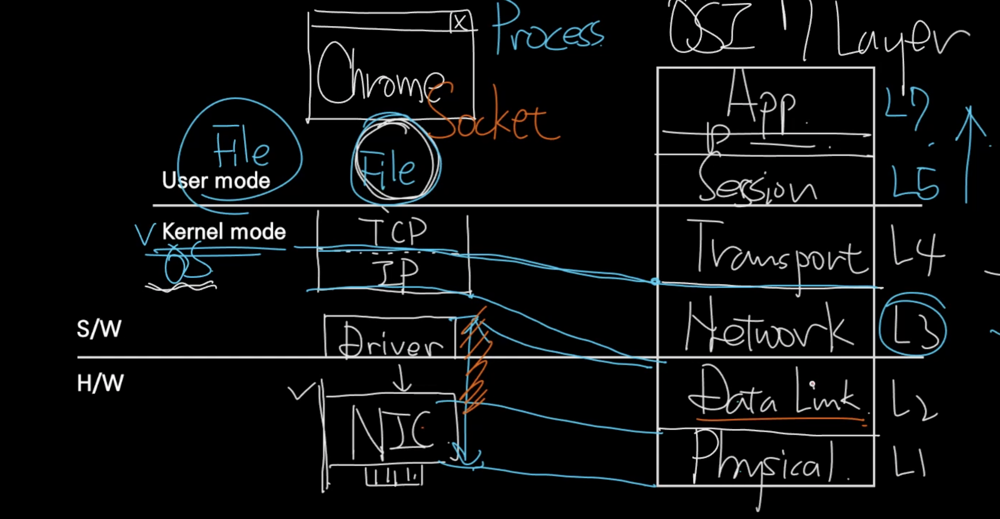
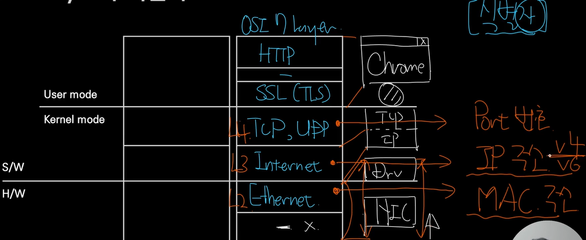

    <b>인프런 강의 내용입니다.</b> <a href="https://www.inflearn.com/course/%EB%84%A4%ED%8A%B8%EC%9B%8C%ED%81%AC-%ED%95%B5%EC%8B%AC%EC%9D%B4%EB%A1%A0-%EA%B8%B0%EC%B4%88/dashboard">외워서 끝내는 네트워크 핵심이론 - 기초</a>

# 네트워크 계층에서 User Mode 와 Kernel mode

​	

​	어플리케이션이 커널 모드에 접근하기 해서는 OS 로 보내는 **시스템 콜**을 해야 하는데, API 는 이러한 시스템 콜을 위한 파일입니다. 네트워크에서는 이를 **Socket** 이라고 부릅니다. 

​	Transport Layer(L4) 는 소켓으로 접근한 TCP 가 구성요소이며 NetWork Layer(L3) 는 IP 계층입니다. 요청이 H/W 를 통제할 수 있는 명령어로 변환되고 인터럽트를 발생시키면 그 명령어를 전달해야 하는데 그 역할이 바로 Driver 이며 Dtat Link(L2) 입니다. 그리고 NIC 는 H/W 로써 흔히 랜카드로 불리는 장치인데, Phisical(L1) 계층입니다.

# OSI 7 layer 와 식별자

​	각 계층별로 계층을 식별할 수 있는 식별자가 있습니다. L1 ~ L2 에는 NIC 를 식별하는 MAC address, L3 에는 host 를 식별하는 IP 가 있습니다. L4 에는 port 번호가 있는데, port 번호는 관점에 따라 무엇을 식별하는지 달라집니다. 관점을 L3 ~ L4 에 둔다면 네트워크 서비스, L5 ~ L7 에 둔다면 프로세스가 될 수 있습니다.

# HOST

​	컴퓨터가 네트워크에 연결되는 이를 "host" 라고 부릅니다. host 의 종류는 크게 두 가지인데요. **네트워크의 이용 주체인 End-Point(단말기)** 와 **네트워크 그 자체를 이루는 Switch** 입니다. end-point 는 client, server, peer 등이 있고 switch 에는 router, tab, IPS 등의 네트워크 infra 가 있습니다.

​	Switch 가 하는 일을 더 자세히 보겠습니다. switch 는 host 에서 다른 host 로 네트워크 신호를 보냈을 때 길의 분기점이라고 볼 수 있습니다. 도로로 따지면 교차로입니다. 교차로에서 오른쪽으로 갈지, 왼쪽으로 갈지, 직진할지 선택하기 위해서 가까운 길을 선택하는 이정표를 따라 최종 목적지에 도달합니다. IP 를 예로 들면, 교차로는 Router 입니다. IP 패킷은 Router 를 만났을 때 그 안의 이정표인 Routing table 을 보고 어디로 갈지 결정을 합니다. 이렇게 IP 패킷이 스위치를 만나 경로를 결정하는 것을 **L3 스위칭**이라고 합니다. 만약 MAC 주소로 길을 찾으면 **L2 스위칭**이 되고, 포트 번호로 스위칭을 한다면 L4 스위칭, HTTP 는 **L7 스위칭**이 됩니다.

​	또한 어느 길이 제일 빠를지 결정하는 방법은 비용이 가장낮은 방향으로 이동하는 것입니다. 이때 **비용을 네트워크에서는 Matric 값이라고 합니다.**
