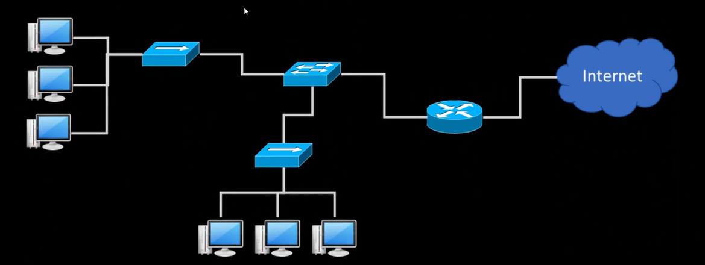

    <b>인프런 강의 내용입니다.</b> <a href="https://www.inflearn.com/course/%EB%84%A4%ED%8A%B8%EC%9B%8C%ED%81%AC-%ED%95%B5%EC%8B%AC%EC%9D%B4%EB%A1%A0-%EA%B8%B0%EC%B4%88/dashboard">외워서 끝내는 네트워크 핵심이론 - 기초</a>

# NIC, L2 Frame, LAN, MAC 주소

​	**NIC** 은 Network Interface Card 의 약자로 흔히 랜카드라고 불리는 하드웨어 장치입니다. 엄밀히 따지면 랜카드는 잘못된 표현이고 NIC 이 맞습니다. 

​	**LAN** 이란 Local Area Network 로 네트워크 규모 중 가장 작은 단위입니다. 집 공유기를 사용할 때도 휴대폰, 노트북, TV 등 수많은 호스트가 있는데, 이들이 모두 합쳐져 LAN 을 이룹니다. 더 큰 단위로 MAN, WAN 이 있습니다. 

​	**Frame** 은 L2 계층에서의 유통 데이터 단위로 크기는 1514byte 입니다. 

# L2 스위치

​	L2 스위치는 L2 에서의 스위칭을 위한 장비입니다. 이때 End-Point 와 직접 연결되는 스위치를 L2 Access Switch 라고 합니다. 스위치는 MAC 주소를 근거로 스위칭합니다. 스위치와 End-Point 를 연결했을 때 잘 연결되면 **link-up**, 아니면 **link-down** 이라고 합니다. 헷갈리는 용어로 upLink 가 있는데, upLink 는 스위치에서 상위 기기(router 등) 로 연결되는 선을 말합니다.

​	L2 Distribution switch 도 있는데 이 스위치는 여러 L2 Access Switch 를 연결하는 스위치 장비입니다. 보통 VLAN(Virtual LAN)  기능을 제공하는 것이 일반적입니다. 

​	예를 들어 10층 짜리 건물에서 한 층마다 사무실이 10개 있다고 가정하겟습니다. 그러면 사무실마다 L2 스위치를 1개씩 사용하고 그 Access Switch 들이 모여서 한 층의 L2 Distribution switch 에 연결됩니다. 그리고 Distribution switch 10개가 건물 전체의 Router 1개에 연결됩니다. 개략적으로 아래 그림처럼 됩니다.

# LAN 과 WAN 의 경계, 그리고 BroadCast

**BroadCast**

​	BroadCast 란 UniCast 의 반대로, 네트워크 상의 모든 end-point 와 통신하는 것입니다. 이 때 목적지 주소는 모든 bit 가 1인 주소로, MAC 은  FF-FF-FF-FF-FF-FF, IP 는 255.255.255.255 입니다. 브로드캐스팅을 하면 모든 컴퓨터가 통신상태로 되기 때문에 최소화해야 하고, 스위치나 라우터에서 브로드캐스팅 자체를 막을 수도 있습니다. 

**LAN 과 WAN 의 경계**

​	LAN 은 눈에 보이는 물리적 네트워크로, 통상 L1 ~ L2 계층입니다. H/W 가 물리적인 장치라는 걸 떠올리면 됩니다. WAN 은 논리적인 네트워크로 통상 L3 계층입니다. L3 계층부터는 논리적인 구조이며 가상(Virtual) 이라고도 합니다.

​	

