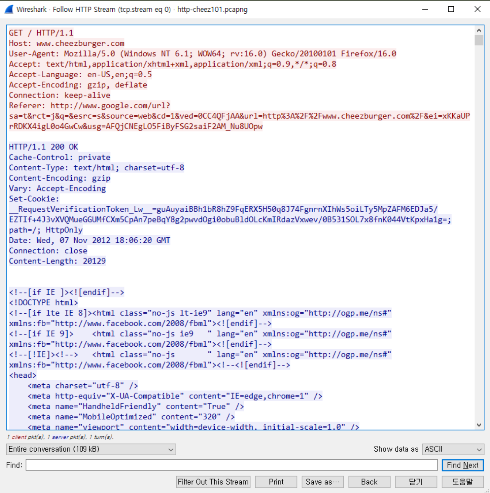

<div class="notice--danger">
    <b>인프런 강의 내용입니다.</b><br/><a href="https://www.inflearn.com/course/%EB%84%A4%ED%8A%B8%EC%9B%8C%ED%81%AC-%ED%95%B5%EC%8B%AC%EC%9D%B4%EB%A1%A0-%EA%B8%B0%EC%B4%88/dashboard">외워서 끝내는 네트워크 핵심이론 - 기초</a>
</div>

# URL, URL

​	URL 은Uniform Resource Locator 의 약자이며 URI 은 Uniform Resource Indentifier 의 약자입니다. 두 개를 구분하기 전에 Resource 가 뭔지 살펴보겠습니다. Web 의 본질은 HTML 과 그걸 실현하기 위한 HTTP 프로토콜입니다. 또한 HTML 뿐만 아니라 js, css, jpg 같은 파일들도 있겠죠. 이러한 파일들이 resource 가 됩니다.

```
http://www.test.co.kr/course.do?cmd=search&search_keyword=Test
```

위와 같은 URI 를 호출한다고 했을 때, 서버의 기준 디렉토리의 course.do 라는 파일을 실행한다는 뜻입니다. 이 때 쿼리로 다양한 값을 줄 수 있구요. 만약 domain name 뒤에 아무것도 없으면 index.html 파일을 실행한다는 뜻입니다.


# HTTP

​	HTTP 는 HTML 문서를 송수신하기 위해 만들어진 L7 프로토콜입니다. L5 이상은 소켓 통신이기 때문에 stream 데이터고, 데이터 길이가 정해져 있지 않습니다. 또한 HTTP 는 모두 문자열 형태로 되어있어서 직관적입니다. 아래와 같은 모양입니다.



