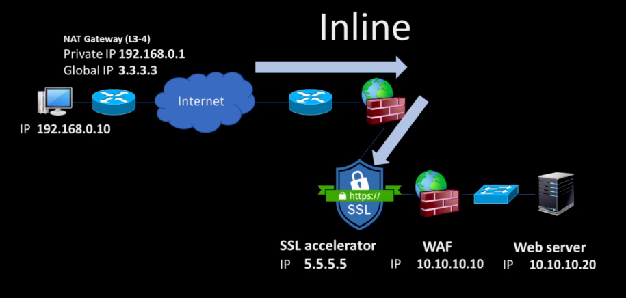
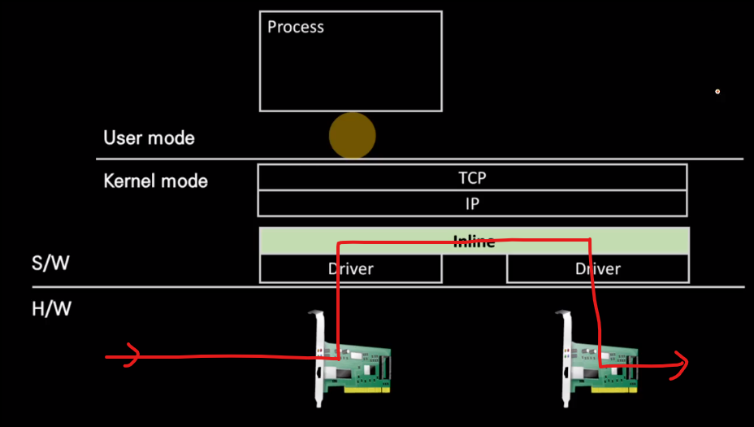
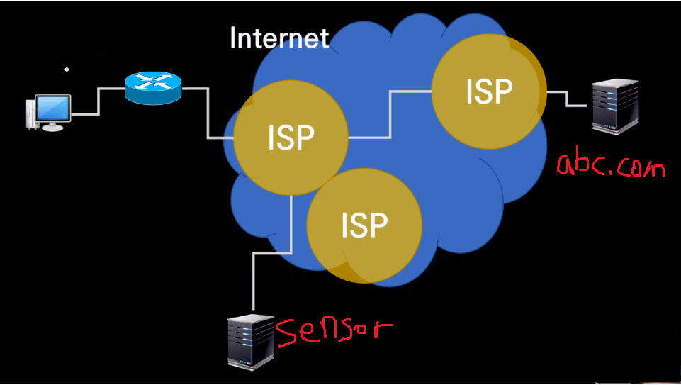
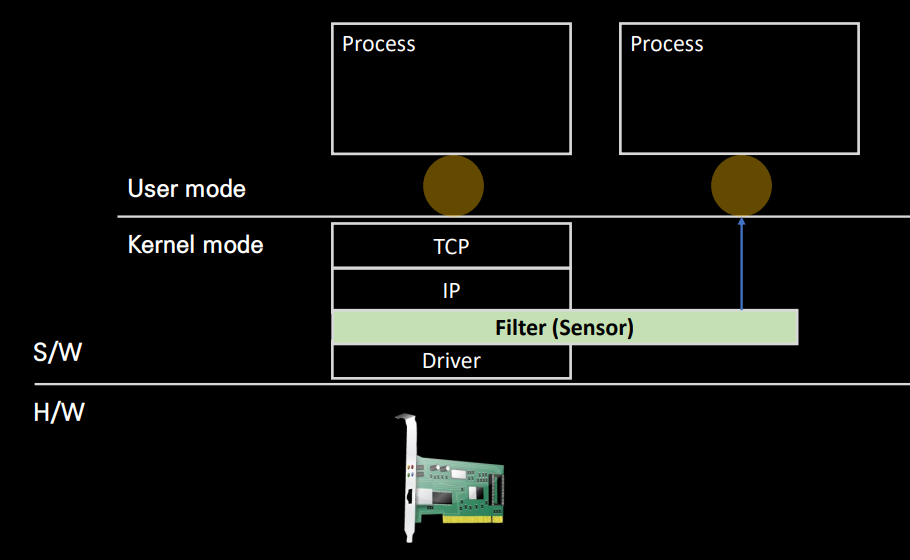
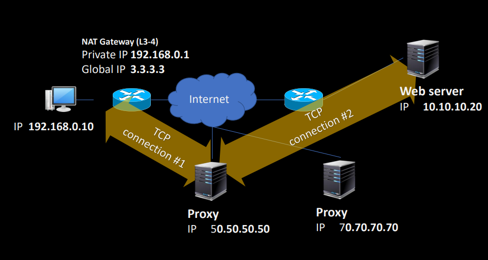
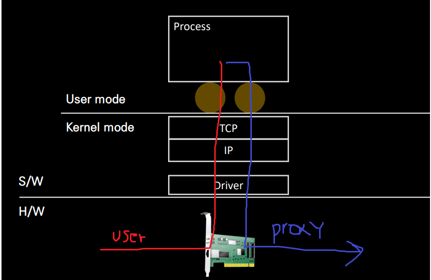
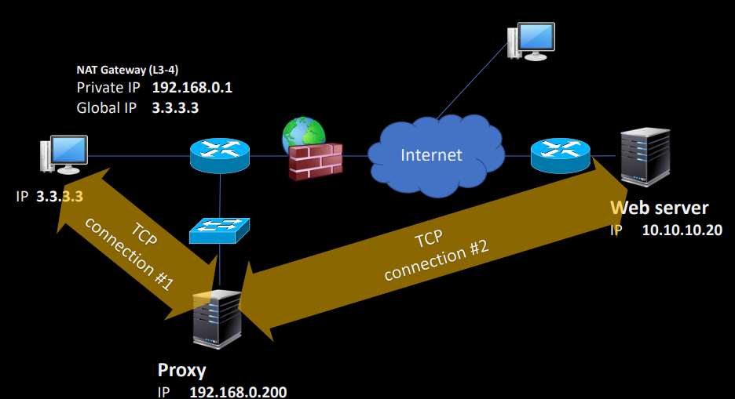
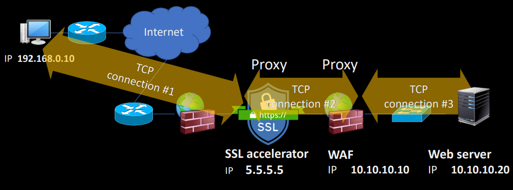
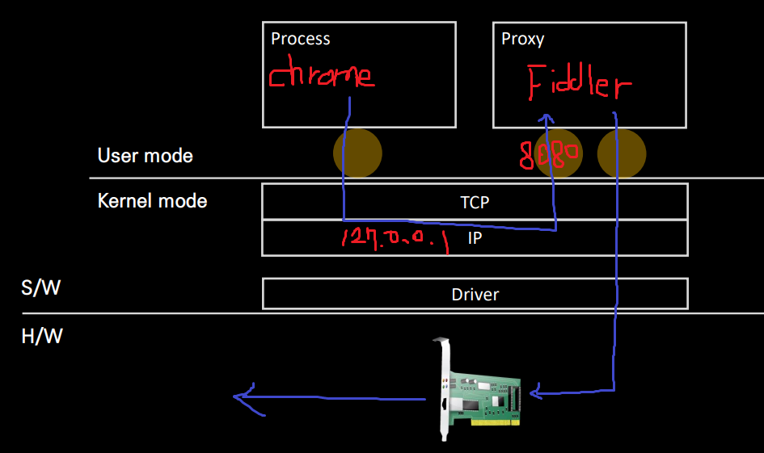

    <b>인프런 강의 내용입니다.</b> <a href="https://www.inflearn.com/course/%EB%84%A4%ED%8A%B8%EC%9B%8C%ED%81%AC-%ED%95%B5%EC%8B%AC%EC%9D%B4%EB%A1%A0-%EA%B8%B0%EC%B4%88/dashboard">외워서 끝내는 네트워크 핵심이론 - 기초</a>

# 세가지 네트워크 장치 구조

네트워크 장치의 3대 구조로 Inline, Out of Path, Proxy 가 있습니다. 

## Inline

​	패킷을 통과시킬 때 Drop 하거나 bypass 를 하고, bypass 하더라도 필터링을 거치는 장비입니다. 라우터가 전형적인 Inline 장비입니다.

위 그림에서 보이는 라우터, IPS, WAF, SSL 모두 inline 장비입니다.(Proxy 인 것도 있습니다.) 이 inline 장비의 구조를 더 자세히 보겠습니다.

위 그림을 라우터의 개략적인 구조라고 보면 되겠습니다. 패킷이 왼쪽 NIC 로 들어와서 Inline 을 지나고 오른쪽 NIC 로 빠져나가는 구조입니다. 여기서 정책에 의해 Drop 되거나, bypass 하거나 필터링됩니.

## Out of Path

​	패킷을 읽고 인지하는 네트워크 센서입니다. ReadOnly 이며 장애 대응 센서, 탭 스위치 등이 있습니다. 

센서는 주로 패킷 수집 장비이며 L2 수준에서는 port mirroring 이 있습니다. 미러링 자체가 부하를 야기하다 보니 전문 수집장치인 tab 스위치를 활용하기도 합니다.

위 그림에서 abc.com 이 유해사이트라고 가정하겠습니다. Out of Path 장비인 sensor 는 해당 패킷이 abc.com 으로 가는 패킷임을 알고 자기가 abc.com 인것처럼 꾸며서 응답을 보내줍니다. warning 페이지를 보여주겠죠.

​	이렇게 우리나라는 국가가 데이터를 어느정도 통제할 수 있습니다. DPI 란 L3 수준에서 HTTP payload 를 확인할 수 있고 SPI 는 HTTP header 를 볼 수 있습니다. 우리나라는 SPI 가 허용됩니다. 하지만 ISP(internet service provider) 에서 특정 ip 접근을 차단할 수 없습니다. 이를 망중립성의 원칙이라고 합니다.

Out of path 구조는 위와 같습니다. NIC 로 frame 이 들어오면 L3 의 Filter 를 통해 읽게 되고 DB 에 저장되고 분석됩니다. 네트워크 속도보다 DB IO 속도가 느리기 때문에 무손실로 하려면 센서의 가격이 매우 비싸집니다.

## Proxy 

​	Proxy 는 소켓 수준에서 스트림 데이터를 다룹니다. 따라서 프록시는 user mode 의 어플리케이션 수준에서의 장치입니다.

아래는 Proxy 를 **우회목적**으로 사용하는 예시입니다.

​	만약에 ISP 가 오른쪽에 있는 미국 서버(10.10.10.20 ) 를 차단했다면 어떻게 접속할까요? user 는 컴퓨터에서 proxy 서버의 ip 를 설정해서 proxy 서버를 통해 우회할 수 있습니다. user 와 proxy 서버가 통신가능하고 proxy 서버와 미국 서버가 통신 가능하다면 Proxy 로 우회할 수 있는거죠. ISP 입장에서는 50.50.50.50 proxy 서버에서 오는 데이터로 보이고, 미국 서버 입장에서는 Proxy 서버와 데이터를 송수신하게 되는겁니다.

프록시 서버의 구조입니다. socket 을 열어서 데이터를 받은 후 proxy 서버에서 보내는 것처럼 데이터를 보내면, ISP 나 미국서버 입장에서 user 가 보낸건지 알 수 없게 됩니다.

또는 Proxy 를 **보호와 감시 목적**으로 사용할 수도 있습니다. 

​	위 그림에서 3.3.3.3 은 회사의 보안 목적 상 인터넷에 직접 연결될 수 없고 Proxy 서버를 통해야만 합니다. 따라서 어떤 사이트에 들어가는지 등의 활동 내역을 감시할 수 있습니다. 또한 반대로 보호를 할 수도 있는데, 파일을 다운로드 받을 때 바이러스가 있다면 파일을 차단할 수도 있습니다. 이러한 차단은 IPS 도 가능은 하지만 IPS 는 패킷단위 데이터밖에 차단하지 못하고 HTTP 스트림 데이터를 검사하는 프록시가 파일 추출 검사에 유리합니다.

### Reverse Proxy

reverse proxy 는 서버 보호를 목적으로 하는 proxy 입니다. 위 그림에서 SSL, WAF 가 Proxy 입니다. 요즘 웹서버들은 대부분 HTTPS 통신을 하기 때문에 IPS 는 이 내용을 확인하기 위해 패킷을 분석하기 어렵습니다. SSL 은 HTTPS 를 받아서 HTTP 로 평문화하여 WAF 로 넘겨줍니다. WAF 또한 proxy 서버인데, 해당 내용을 보고 공격인지 아닌지 판단 후 공격이 아니면 서버에 전달해줍니다.

### Fiddler

​	Fiddler 는 PC 에 설치하는 HTTPS 를 분석 Proxy 서버입니다. 로컬에서 HTTPS 를 분석하고자 할 때 그대로 받으면 암호화가 되어 있어서 볼 수 없습니다. 따라서 내부 Proxy 서버를 한번 거친 후에 서버에 접속하고, 응답이 오면 먼저 Fiddler 로 들어가 복호화가 되어 HTTPS 를 볼 수 있습니다.

