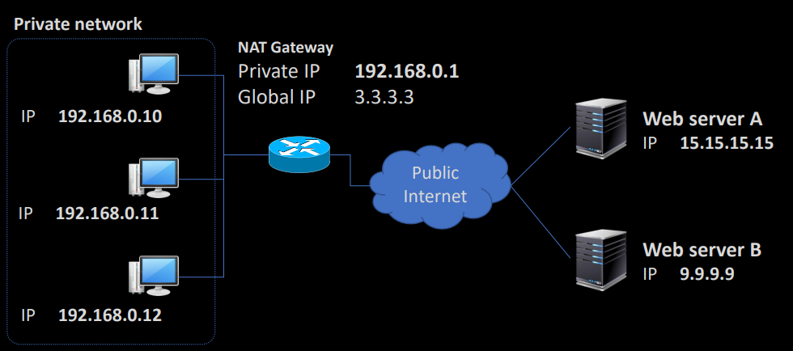
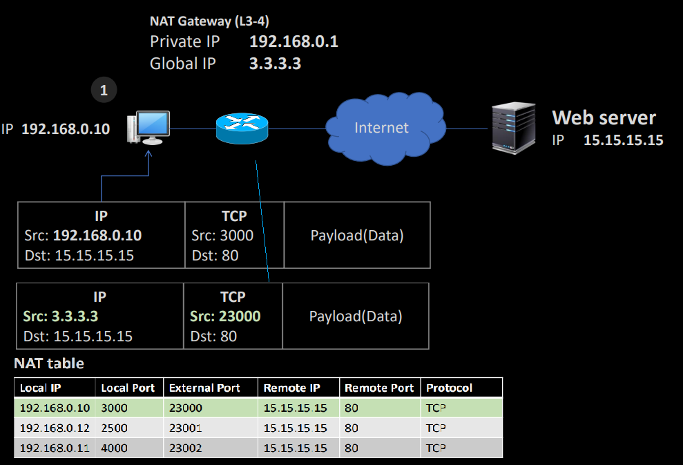
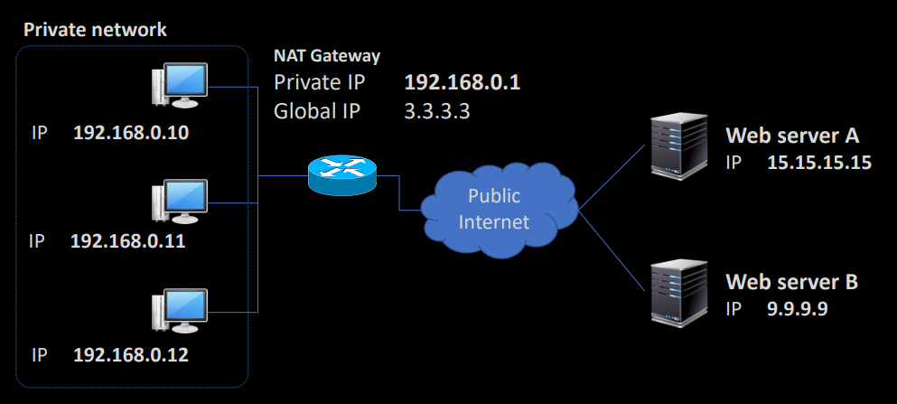
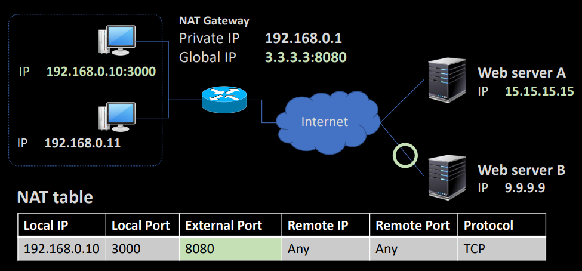
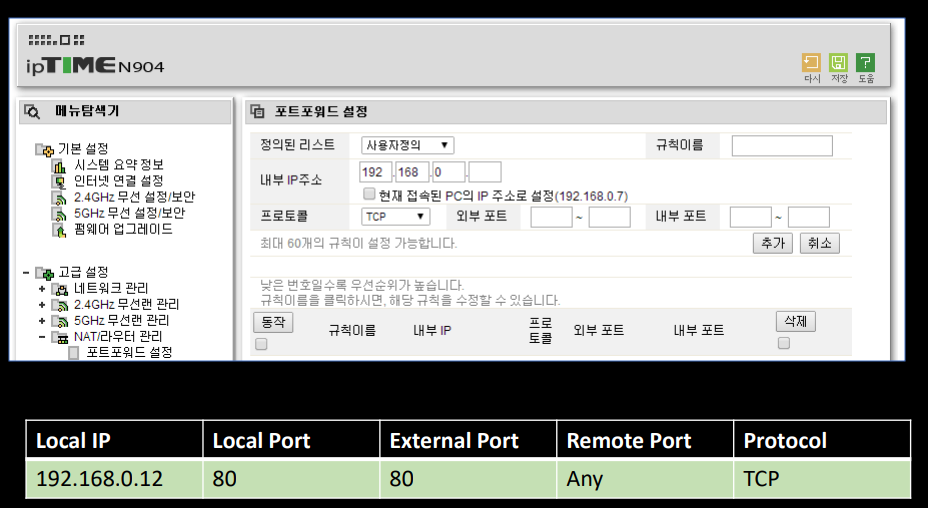

    <b>인프런 강의 내용입니다.</b> <a href="https://www.inflearn.com/course/%EB%84%A4%ED%8A%B8%EC%9B%8C%ED%81%AC-%ED%95%B5%EC%8B%AC%EC%9D%B4%EB%A1%A0-%EC%9D%91%EC%9A%A9/dashboard">외워서 끝내는 네트워크 핵심이론 - 응용</a>

# 공유기 작동원리 및 개요

일반적으로 인터넷 공유기는 NAT(Network Address Translation) 기술이 적용된 장치입니다. NAT 란 글자 그대로 주소를 변환하는 기술입니다. IP 에는 public IP 와 private IP 가 있습니다. NAT 를 통해 공유기에 연결된 end-point 는 private IP 를 사용하게 되고, IP 부족문제를 해결할 수 있습니다. 또한 NAT 를 통해 패킷필터링 방화벽과 비슷한 보안성을 제공합니다.

위 그림과 같이 private IP 는 192.168.x.x(클래스 C)으로 되어 있고, 172.16.x.x(클래스 B) 나 10.x.x.x(클래스 A) 일 수도 있습니다. 해당 IP 로는 public internet 에서 통신되지 않고, NAT Gateway 를 거치며 Public IP 로 통신합니다.

# Symmetric NAT

​	Symmetric NAT 는 TCP 세션마다 외부 포트를 지정하는 방식의 공유기입니다.

​	Private IP 192.168.0.10:3000 은 NAT 를 통과하면서 Public IP 인 3.3.3.3:23000 으로 변경됩니다. 그리고 어떤 포트가 어느 Private IP 에 연결되는지 NAT table 에 기록하게 됩니다. 그래야 응답이 왔을 때 응답을 받을 host 를 알 수 있겠죠. 이러한 table 기록은 OutBound 에서만 적용되고 InBound 는 적용되지 않습니다.

​	여기서 서버입장을 한번 살펴보겠습니다. 만약 다음과 같은 상황에서 end-point 3대 모두 A 서버로 접속한다면 서버는 어떻게 보일까요?

Private IP 입장에서는 개별적인 end-point 가 server A 로 접속하는 것이지만, server A 입장에서는 3.3.3.3 IP 3대가 각기 다른 포트로 접속하는 것처럼 보입니다. 따라서 해당 문제는 보안을 구성할 때 염두에 두어야 할 문제입니다.

# Full Cone NAT

​	Symmetric NAT 방식으로는 서버의 요청으로 private IP 에 접근할 수 없다는 문제점이 있습니다. 예를 들어 게임을 하는 등의 실시간 서버와 p2p 통신을 해야할 때 문제가 될 수 있습니다. 따라서 Full Cone NAT 방식으로 포트를 열어둘 수 있습니다. 

이렇게 8080 포트를 열어두고 모든 외부 IP 와 포트를 받으면 서버에서 3.3.3.3:8000 으로 접속하면 private ip 인 192.168.0.10 으로 접속 가능합니다. 또한 server A 가 server B 에게 해당 ip 와 포트번호를 알려주면, server B 는 private ip 와 통신한 적이 없어도 곧바로 접속이 가능합니다.

# Restricted Cone NAT

​	Full Cone NAT 방식은 엉뚱한 host 가 접속할 수도 있습니다. 따라서 IP 로 제한을 두는 Restricted Cone NAT 방식을 사용할 수 있습니다.

NAT table 을 보면 Remote IP 에 15.15.15.15 라는 제한사항이 생겼습니다. 따라서 15.15.15.15:any port 에서 오는 패킷만 private ip 로 접근가능합니다.

# Port Restricted Cone NAT

​	외부에서 내부로 인바운드될 때 포트까지 따져서 제한하겠다는 방식이 Port Restricted Cone NAT 방식입니다.

​	Server A 에서 5555번 포트만 받겠다는 뜻입니다. 결국 이 구조는 Symmetric 방식이란 비슷한걸로 보이는데 어떤 차이가 있을까요? 그 차이는 server A 의 포트가 추가될 때 나타납니다.

​	Server A 와 6666, 7777번 포트를 추가적으로 연결할 때 Port Restricted Cone NAT 방식에서는 NAT table 에 외부 포트는 그대로 8080 으로 둡니다. 하지만 Symmetric 방식에서는 포트 번호를 계속 바꿉니다. 따라서 보안성이 더 올라가게 됩니다. 

# Port Forwarding

​	포트 포워딩은 공유기에 Full Cone NAT 방식으로 host 에 접근 가능하도록 NAT table 을 직접 변경하는 겁니다.

위와 같이 설정하면 any IP, any Port 로부터 공유기 ip 의 80번 포트로 접속하면 192.168.0.12:80 으로 접속이 가능하다는 뜻입니다.

## UPnP 와 NAT

​	UPnP 은 Universal PnP 로, Port Forwarding 을 자동으로 해주는 플러그인입니다. host 에서 공유기로 구성을 요청하면 Port Forwarding 을 자동으로 구성해줍니다.