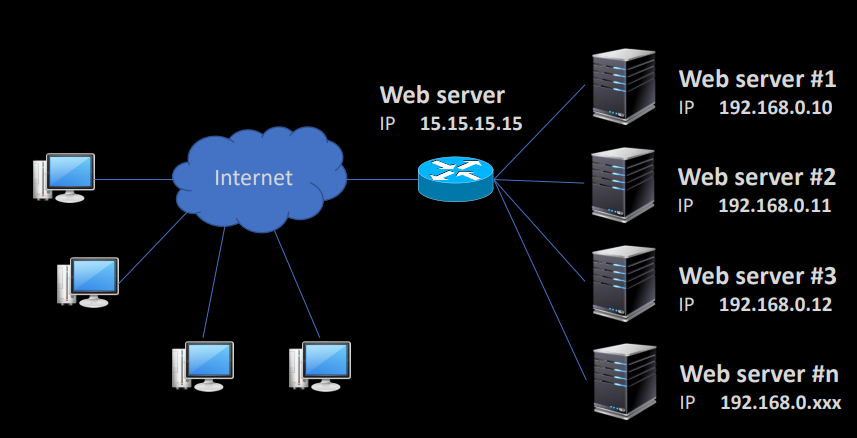
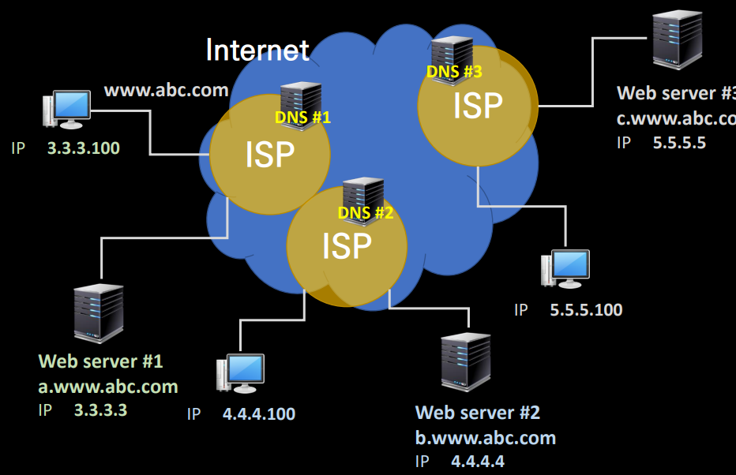

    <b>인프런 강의 내용입니다.</b> <a href="https://www.inflearn.com/course/%EB%84%A4%ED%8A%B8%EC%9B%8C%ED%81%AC-%ED%95%B5%EC%8B%AC%EC%9D%B4%EB%A1%A0-%EC%9D%91%EC%9A%A9/dashboard">외워서 끝내는 네트워크 핵심이론 - 응용</a>

# L4 부하분산과 무정지 시스템

​	L4 부하분산은 로드 밸런싱 내용입니다. 

각 host 는 Web server 15.15.15.15 에 접속합니다. 그러면 해당 서버가 여러 private 서버로 트래픽을 전달합니다. 이는 간단하게 구현되어 있지 않고 제 3의 서버(manager server) 가 모든 서버와 LB 와 연결되면서 부하를 적절하게 분배합니다. 또한 manager server 에 health check 도 포함되어 있습니다. LB 또한 문제가 날 수 있으니 이중화되어 있습니다. 

# 대규모 부하분산을 위한 GSLB

​	GSLB 는 Global Server Load Balancing 으로 global 기업들의 부하 분산 체계입니다. GSLB 는 DNS 체계를 활용하며, 클라이언트의 지리적 위치도 함께 고려해서 부하를 분산합니다.

​	3.3.3.100 이 www.abc.com 에 접속한다고 해보겠습니다. 해당 ISP 는 DNS 서버를 통해 ip 주소를 반환하는 게 아니라 CNAME(Canonical Name) 을 반환합니다. CNAME 이란 도메인 주소를 또 다른 도메인 주소로 매핑 시키는 형태의 DNS 레코드 타입입니다. 그러면 host 는 해당 CNAME(a.www.abc.com) 을 받고 해당 CNAME 으로 다시 DNS 서버에 질의를 하면 3.3.3.3 을 받습니다. 

​	이렇게 서버가 분산되어 있으면 서버의 컨텐츠에 대한 동기화 문제가 생길 수도 있습니다. 따라서 CDN(Content Delivery Network) 을 통해서 전세계에 똑같은 클론을 퍼트립니다. 이러한 배포는 Manager server 를 통해서 이루어지겠죠.

​	클라이언트의 지리적 위치는 IP 주소를 토대로 판단합니다. IP 를 알면 어느 국가의 어 ISP 인지, 어느 도시인지도 알 수 있습니다.