# GSLB

​	GSLB 는 Global Server Load Balancing 의 약자로 DNS 서비스의 발전 형태로 인터넷 트래픽을 전 세계에 걸쳐 분산된 수많은 연결된 서버에 배포하는 방식입니다. DNS 서버는 로컬 데이터베이스의 IP 목록을 확인해서 그 중 하나를 반환 할 뿐, 네트워크 지연, 성능, 트래픽 유입, 서비스 실패 등은 전혀 고려하지 않습니다. 이러한 문제를 해결하고 **로드밸런싱 및 가용성을 보장하는 것이 GSLB** 입니다.

# GSLB와 DNS 작동방식

## 재해 복구

**DNS**

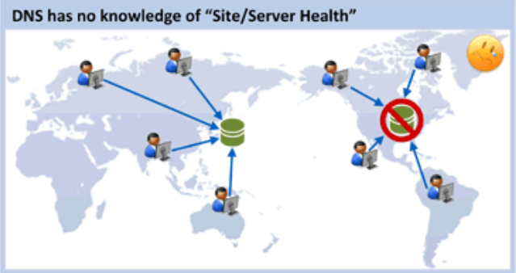

**GSLB**

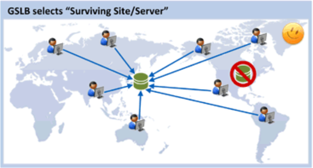

DNS 는 서버의 상태를 알 수 없기 때문에 서비스를 사용할 수 없을 수 있는 반면 GSLB 는 헬스 체크를 하기 때문에 실패한 서버의 IP 를 반환하지 않습니다.

## 로드밸런싱

**DNS**

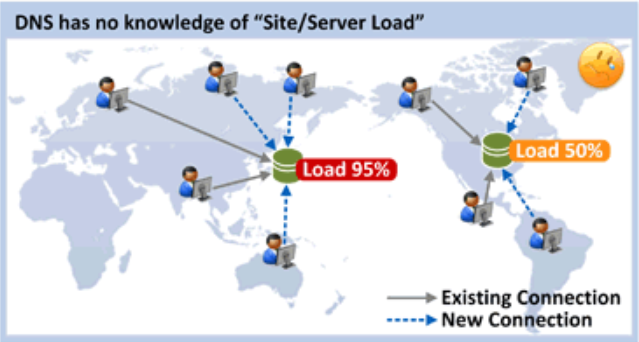

**GSLB**

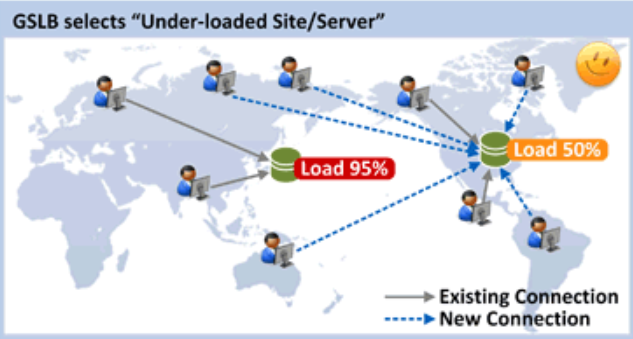

​	DNS는 Round Robin 방식으로 로드밸런싱합니다. 따라서 정교한 로드밸런싱이 힘들어서 부하가 높은 서버에 사용자가 계속 몰릴 수 있습니다. 반면 GSLB는 서버의 로드를 모니터링 한다. 로드가 적은 서버의 IP를 반환하는 식으로 정교한 로드밸런싱을 할 수 있습니다.

> DNS (Domain Name System)를 이용한 로드 밸런싱에는 일반적으로 **라운드 로빈 방식**이 사용됩니다. 이 방식은 요청이 들어올 때마다 순차적으로 서버를 선택하는 방식입니다. 예를 들어, 서버 A, B, C가 있을 때 첫 번째 요청은 A로, 두 번째 요청은 B로, 세 번째 요청은 C로 보내집니다. 그리고 네 번째 요청부터 다시 A로 보내는 식입니다.

## 레이턴시 기반 서비스

**DNS**

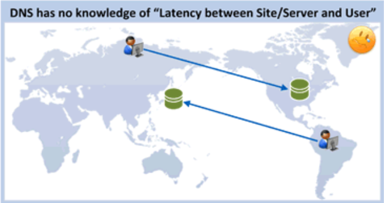

**GSLB**

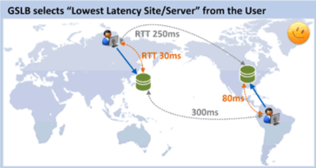

​	DNS는 Round Robin 방식을 사용하기 때문에 유저는 네트워크 상에서 멀리 떨어진 위치의 서버로 연결 할 수도 있습니다. 반면 GSLB 서버는 사용자와 응용 서버 사이 Network 구간의 RTT 측정을 통해 응답이 빠른(망 상태가 좋은) 서버로 사용자가 연결되도록 합니다.

## 위치기반 서비스

**DNS**

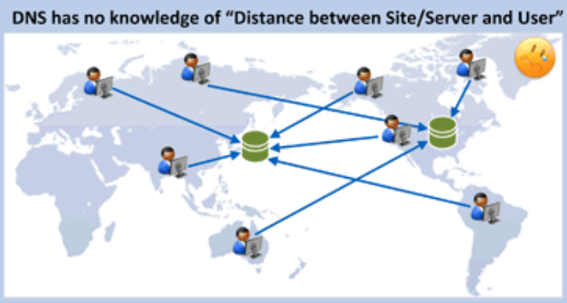

**GSLB**

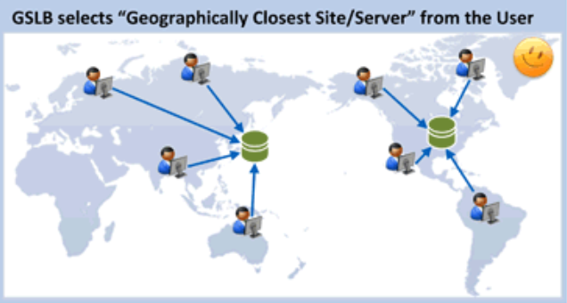

​	DNS 서버는 사용자의 지리적 위치를 고려하여 응용 서버를 선택할 수 없어서 먼 곳의 서버가 연결될 수 있지만 GSLB 서버는 사용자의 지리적 위치를 고려하여 응용 서버를 선택해 줄 수 있어 사용자는 지리적으로 가장 가까운 서버와 접속할 수 있습니다. 

> 일반적으로 지리적으로 가까우면 RTT도 작기 때문에 3번과 4번의 결과는 동일 한 경우가 많지만, Network Failure/Congestion 발생시에는 다른 결과를 가져 올 수도 있습니다.

# GSLB 서비스 로직

​	GSLB 는 SLB(Server Load Balancing) 의 L4 스위칭 기능과 유사한 동작을 통해 어떤 SLB 를 반환할지 결정합니다.

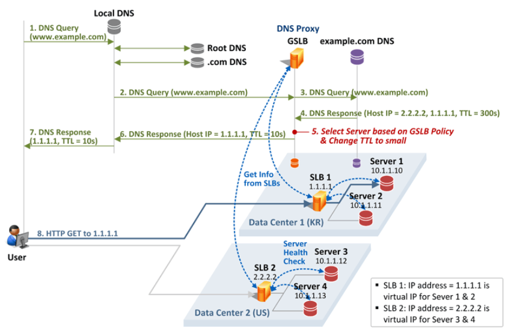

1. 사용자가 `www.example.com` 에 접속하기 위해 Local DNS 서버로 DNS Query 를 보내고, Local DNS 서버는 Root DNS, .com DNS 서버를 거쳐 ` www.example.com` 의 IP 주소를 알아냅니다.
2. Local DNS 는 `www.example.com` 에 대한 DNS Query를 보냅니다.
3. GSLB는 DNS Proxy 로 동작합니다. 따라서 이 DNS Query 를 그대로 `example.com` DNS 서버로 전달합니다.
4. `example.com` DNS 서버는 `www.example.com` 에 대한 IP 주소 (SLB의 Virtual IP) 1.1.1.1과 2.2.2.2가 미리 등록되어 있어 그 값을 GSLB로 전달해 줍니다. 전달 시 TTL은 300초라고 가정하겠습니다.
5. GSLB는 나름의 정책을 통해 1.1.1.1과 2.2.2.2 중에 사용자를 위한 최적의 사이트를 결정하고 또한 TTL을 작은 값으로 변경(ex. 10초)합니다. <u>TTL 값 변경은 Local DNS 서버가 바인딩 정보(`www.example.com` 에 대한 IP 주소)를 최소 시간 동안만 캐싱하게 하기 위함</u>입니다. 
6. GSLB의 정책(GSLB Policy)을 통해 결정된 웹서버 IP 1.1.1.1 과 변경된 TTL 값이 Local DNS 로 전달됩니다.
7. Local DNS 는 사용자 단말에게 그 값을 전달합니다.
8. 이제 사용자는 `www.example.com` 의 IP 주소 1.1.1.1을 목적지로 하여 한국 사이트 SLB1으로 HTTP GET을 보내고, SLB1은 다시 나름의 정책(서버 Health/Load 등 고려)을 적용하여 최종 서버인 10.1.1.10으로 HTTP GET 메시지를 전달합니다.

## GSLB의 서버/사이트 선택 정책 (GSLB Policy)

위 5번 과정에서 "나름의 정책" 이 아래 정책입니다. 

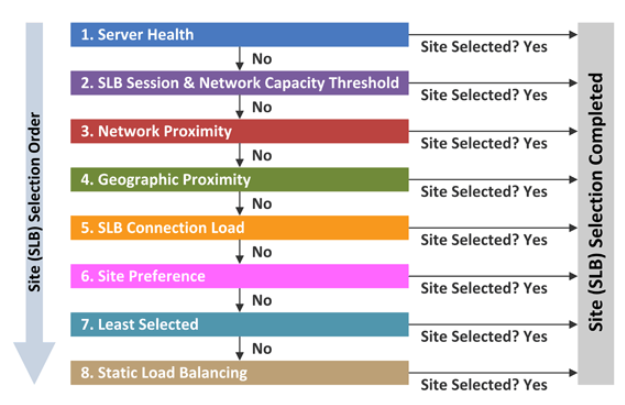

1. **Server Health** -  살아있는 사이트 선택
2. **SLB Session & Network Capacity Threshold** - 과부하 상태가 아닌 사이트 선택
3. **Network Proximity** - 응답 속도가 빠른(Low Latency) 사이트 선택
4. **Geographic Proximity** - 지리적으로 가까운 사이트 선택
5. **SLB Connection Load** - 새로운 연결 요청이 적은 사이트 선택
6. **Site Preference** - 운영자의 정책에 의해 특정 사이트 선택
7. **Least Selected** - 균등하게 사이트 선택
8. **Static Load Balancing** - 균등하게 사이트 선택

​	사이트/서버 선택 과정은 1번 단계를 시작으로 8번 단계까지 순차적으로 진행되며, 만약 1번 단계에서 사이트/서버가 선택이 되면 2번 단계로 넘어가지 않고 종료 되며 1번에서 결정이 나지 않으면 2번으로 넘어 가는 식입니다. (해당 기준이 절대적인 건 아니며 변경될 수 있습니다.)

서버 선택 기준은 자세하게 서술하지는 않고, Ref. 3번을 참고해주세요.

# CDN

​	GSLB를 구현하는 가장 쉽고 비용 효율적인 방법 중 하나는 **콘텐츠 전송 네트워크(Content Delivery Network, CDN)**를 사용하는 것입니다. 글로벌 CDN 서비스는 고객의 원본 서버에서 데이터를 가져와 지리적으로 분산된 서버 네트워크에 캐시하여 전 세계 사용자에게 인터넷 콘텐츠를 빠르고 안정적으로 제공합니다.

​	CDN으로 HTML 페이지, javascript 파일, 스타일시트, 이미지, 동영상을 비롯한 인터넷 콘텐츠를 로드하는 데 필요한 자산을 신속하게 전송할 수 있습니다. 

## CDN 의 작동원리

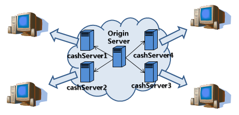

1. 최초 요청은 서버로부터 컨텐츠를 가져와 고객에게 전송하며 동시에 CDN 캐싱장비에 저장합니다.
2. 두번째 이후 모든 요청은 CDN 업체에서 지정하는 해당 컨텐츠 만료 시점까지 CDN캐싱장비에 저장된 컨텐츠를 전송합니다.
3. 자주사용하는 페이지에 한해서 CDN장비에서 캐싱이 되며, 해당 컨텐츠 호출이 없을 경우 주기적으로 삭제됩니다.
4. 서버가 파일을 찾는 데 실패하는 경우 CDN 플랫폼의 다른 서버에서 콘텐츠를 찾아 엔드유저에게 응답을 전송합니다.
5. 콘텐츠를 사용할 수 없거나 콘텐츠가 오래된 경우, CDN은 서버에 대한 요청을 프록시로 작동하여 향후 요청에 대해 응답할 수 있도록 새로운 콘텐츠를 저장합니다.

## CDN 필요 기술

**Load Balance**

- 사용자에게 콘텐츠 전송 요청(Delivery Request)을 받았을 때, 최적의 네트워크 환경을 찾아 연결하는 기술으로  GSLB 를 사용합니다.

**컨텐츠를 배포하는 기술**

- 컨텐츠의 삭제나 수정이 일어났을 때 이를 관리할 수 있는 기술이 필요합니다.

**CDN의 트래픽을 감지하는 기술**

- 통계자료를 고객에게 제공하거나 트래픽을 분산하기 위해 필요합니다.

## CDN 캐싱 방식

**Static Caching**

- Origin Server에 있는 Content 를 운영자가 미리 Cache Server 에 복사합니다. 미리 복사해 두기 때문에 사용자가 Cache Server에 Content를 요청시 무조건 Cache Server 에 있습니다.

**Dynamic Caching**

- Origin Server에 있는 Content를 운영자가 미리 Cache Server에 복사하지 않고 사용자가 Content를 요청시 해당 Content 가 없는 경우 Origin Server 로부터 다운로드 받아 전달합니다. (Content가 있는 경우는 캐싱된 Content 룰 사용자에게 전달.)
- 각각의 Content는 정책에 따라 일정 시간이후 Cache Server에서 삭제될 수도 있고 계속 보유될 수도 있습니다.

# Ref.

1. [네트워크 - GSLB(Global Server Load Balancing)란?](https://coding-start.tistory.com/339)
2. [KT 유클라우드, GSLB로 무중단 서비스 지원](https://www.netmanias.com/ko/post/blog/5617/dns-data-center-gslb-kt-network-protocol/global-server-load-balancing-gslb-service-for-kt-ucloud)
3. [Enterprise를 위한 GSLB(Global Server Load Balancing) - 1편: 개념 및 서비스 로직](https://www.netmanias.com/ko/post/blog/5620/dns-data-center-gslb-network-protocol/global-server-load-balancing-for-enterprise-part-1-concept-workflow)
4. [Enterprise를 위한 GSLB 서비스 - 2편: Site/Server 선택 정책 (1)](https://www.netmanias.com/ko/?m=view&id=blog&no=5622)
5. [GSLB - Global server Load Balancing](https://www.joinc.co.kr/w/man/12/GSLB)
6. [글로벌 서버 부하 분산(GSLB)이란?](https://www.cloudflare.com/ko-kr/learning/cdn/glossary/global-server-load-balancing-gslb/)
7. [CDN 소개 | CDN의 작동 방식](https://www.cloudflare.com/ko-kr/learning/cdn/what-is-a-cdn/)
8. [[HTTP 기초] CDN 이란?](https://goddaehee.tistory.com/173)