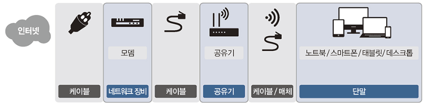
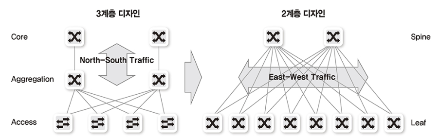
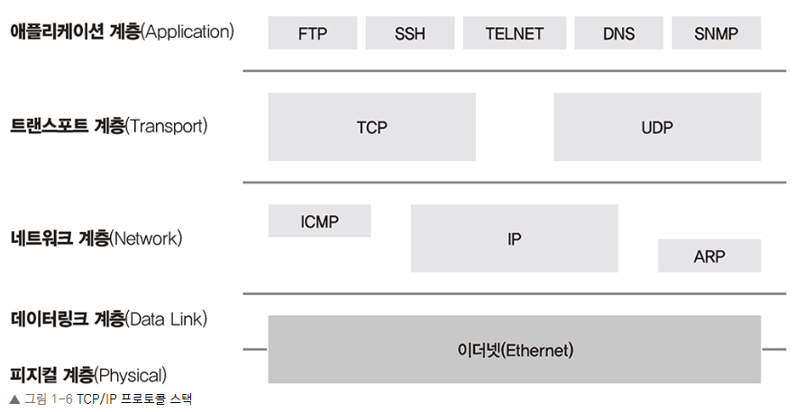
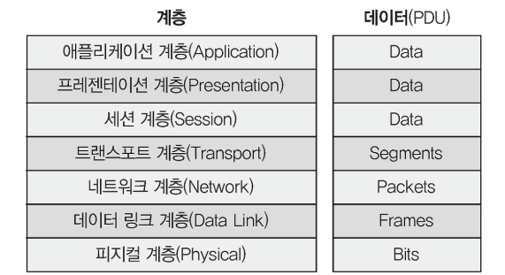
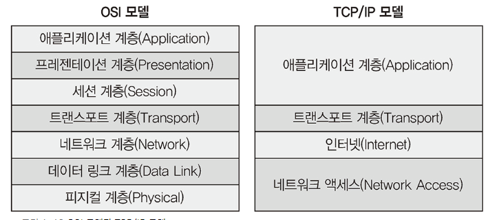
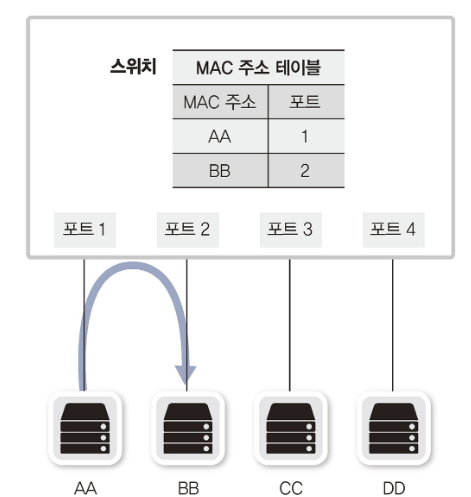
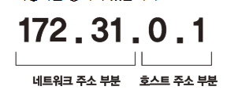
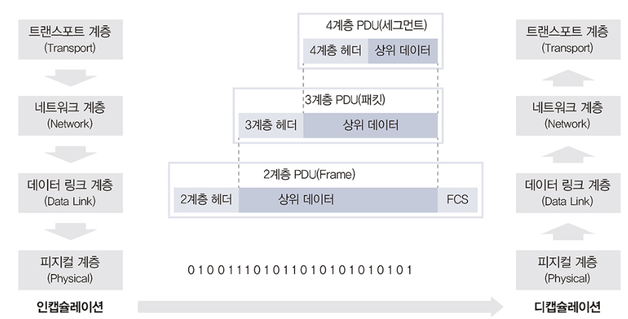
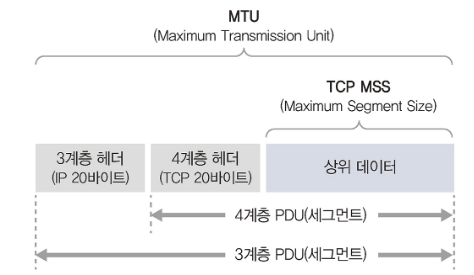

# 네트워크 구성도

## 홈네트워크

홈 네트워크를 구성하는 데는 모뎀, 공유기, 단말 간에 물리적 연결이 필요합니다. 무선 연결은 무선 랜 카드와 무선 신호를 보낼 수 있는 매체(공기)가 필요하고 유선 연결은 유선 랜 카드(이더넷 랜 카드: 일반적으로 보드에 내장됨), 랜 케이블(일반적으로 랜선이라고 부름)이 필요합니다.

## 데이터 센터 네트워크

데이터 센터 네트워크는 안정적이고 빠른 대용량 서비스 제공이 필요하기 때문에 높은 통신량을 수용할 수 있어야 합니다.

데이터 센터 구성은 기존에는 3계층 구성이 일반적이었지만 가상화 기술과 높은 대역폭을 요구하는 스케일 아웃(Scale-Out) 기반의 애플리케이션과 서비스가 등장하면서 2계층 구성인 스파인-리프(Spine-Leaf) 구조로 데이터 센터 네트워크가 변화되었습니다.

# 프로토콜

네트워크에서 프로토콜은 통신할 때의 규약입니다. TCP와 IP는 별도 계층에서 동작하는 프로토콜이지만 함께 사용하고 있는데 이런 프로토콜 묶음을 프로토콜 스택이라고 부릅니다.

TCP/IP 프로토콜 스택은 총 4개 부분으로 나뉩니다. 물리 부분인 이더넷 외에 데이터가 목적지를 찾아가도록 해주는 네트워크 계층, 잘린 패킷을 데이터 형태로 잘 조합하도록 도와주는 전송 계층과 애플리케이션 계층으로 구성됩니다.

# OSI 7계층

여기서 1 ~ 4 계층을 데이터 플로 계층 (하위 계층) 이라고 하고 5 ~ 7 계층을 애플리케이션 계층 (상위 계층) 이라고 합니다.

상위 계층은 애플리케이션 개발자가 주로 고려해야 할 부분이고, 하위 계층은 네트워크 엔지니어가 주로 고려합니다. 따라서 TCP/IP 모델은 아래와 같이 4단계로 구분합니다.

## 1계층 (Physical)

1계층의 주요 장비로 허브, 리피터, 케이블, 커넥터, 트랜시버, 탭이 있습니다.

1계층에서는 들어온 전기 신호를 그대로 잘 전달하는 것이 목적이므로 전기 신호가 1계층 장비에 들어오면 이 전기 신호를 재생성하여 내보냅니다. 

## 2계층 (Data link)

2계층의 네트워크 구성 요소로 네트워크 인터페이스 카드(NIC) 와 스위치가 있습니다.

2계층에서는 출발지와 도착지 주소(MAC) 를 확인하고 내게 보낸 것이 맞는지, 또는 내가 처리해야 하는지에 대해 검사한 후 데이터 처리를 수행합니다.

네트워크 인터페이스 카드와 스위치 모두 MAC 주소를 이해할 수 있고 스위치는 MAC 주소를 보고 통신해야 할 포트를 지정해 내보내는 능력이 있습니다.

## 3계층 (Network)

3계층의 네트워크 구성 요소로 라이터가 있습니다. 라우터는 3계층에서 정의한 IP 주소를 이해할 수 있습니다. 라우터는 IP 주소를 사용해 최적의 경로를 찾아주고 해당 경로로 패킷을 전송하는 역할을 합니다.

3계층에서는 IP 주소와 같은 논리적인 주소가 정의됩니다.

## 4계층(Transport)

4계층 네트워크 구성 요소로 로드 밸런서와 방화벽이 있습니다. 

4계층은 데이터들의 흐름 제어, 혼잡 제어, 오류 제어 등의 역할을 합니다. 패킷에 보내는 순서인 시퀀스 번호(Sequence Number) 를 명시하고 ACK 번호(Acknowledgement Number) 로 받는 순서를 나타냅니다. 또한 장치 내의 많은 애플리케이션을 구분할 수 있도록 포트 번호(Port Number)를 사용해 상위 애플리케이션을 구분합니다.

## 5계층(Session)

5계층은 양 끝단의 응용 프로세스가 연결을 성립하도록 도와주고 연결이 안정적으로 유지되도록 관리하고 작업 완료 후에는 이 연결을 끊는 역할을 합니다.

## 6계층(Presentation)

6계층은 일종의 번역기나 변환기 역할을 수행하는 계층으로, 표현 방식이 다른 애플리케이션이나 시스템 간의 통신을 돕기 위해 하나의 통일된 구문 형식으로 변환시키는 기능을 수행합니다.

MIME 인코딩이나 암호화, 압축, 코드 변환과 같은 동작이 이 계층에서 이루어집니다.

## 7계층(Application)

7계층에서는 애플리케이션 프로세스를 정의하고 애플리케이션 서비스를 수행합니다. 네트워크 소프트웨어의 UI 부분이나 사용자 입.출력 부분을 정의하는 것이 애플리케이션 계층의 역할입니다.

## 계층별 주요 프로토콜 및 장비

| 계층         | 주요 프로토콜                                      | 장비                          |
| ------------ | -------------------------------------------------- | ----------------------------- |
| Application  | HTTP, SMP, SMTP, STUN, TFTP, TELNET                | ADC, NGFW, WAF                |
| Presentation | TLS, AFP, SSH                                      |                               |
| Session      | L2TP, PPTP, NFS, RPC, RTCP, SIP, SSH               |                               |
| Transport    | TCP, UDP, SCTP, DCCP, AH, AEP                      | 로드 밸런서, 방화벽           |
| Network      | ARP, IPv4, IPv6, NAT, IPSec, VRRP, 라우팅 프로토콜 | 라우터, L3 스위치             |
| Data link    | IEEE 802.2, FDDI                                   | 스위치, 브릿지, 네트워크 카드 |
| Physical     | RS-232, RS-449, V.35, S 등의 케이블                | 케이블, 허브, 탭(TAP)         |

# 인캡슐레이션과 디캡슐레이션

상위 계층에서 하위 계층으로 데이터를 보내는 것을 인캡슐레이션, 다시 하위 계층으로 전기신호를 받아 상위계층으로 데이터를 보내는 것을 디캡슐레이션이라고 합니다.

인캡슐레이션 과정에서 4계층, 3계층, 2계층은 아래로 내려가면서 네트워크 전송을 위한 정보를 헤더에 붙여넣습니다. 

헤더의 정보는 많지만 아래 2가지는 반드시 포함되어야 합니다.

1. 현재 계층에서 정의하는 정보
   - 4계층 : 데이터 순서, 빠진 패킷은 없는지 등등 (시퀀스, 에크 번호)
   - 3계층 : 논리적 주소인 출발지, 도착지 IP 주소
   - 2계층 : 출발지, 도착지 MAC 주소 
2. 상위 프로토콜 지시자
   - 디캡슐레이션 과정에서 어떤 상위 프로토콜로 올려보내줄지 결정하기 위해 필요

> MTU 와 MSS
>
> 1. MTU : 2계층의 최대 데이터 값, 1500바이트
> 2. MSS : 4계층의 최대  데이터 값, 1460바이트
>
> 