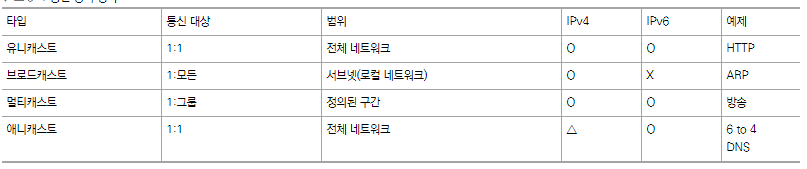
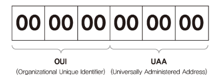
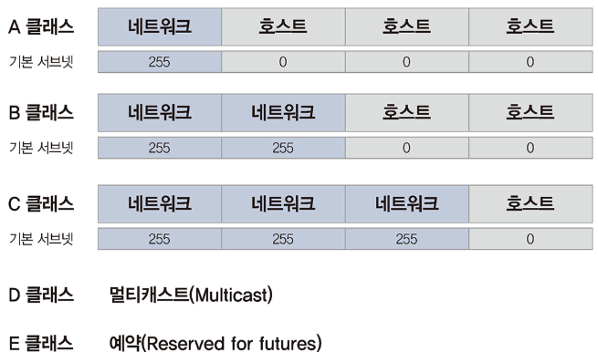
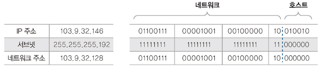
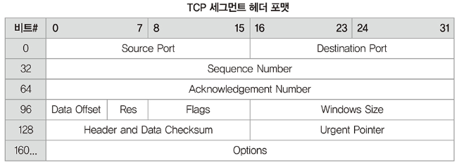
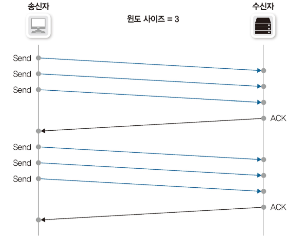
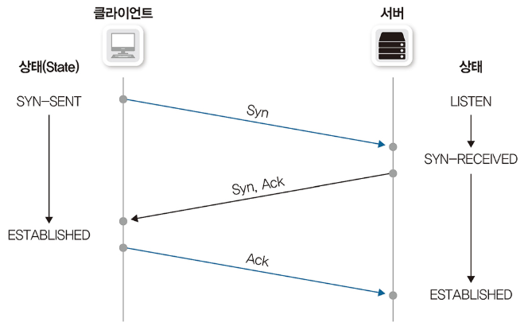
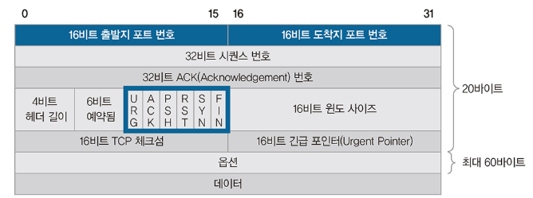
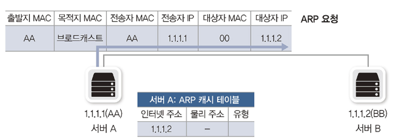
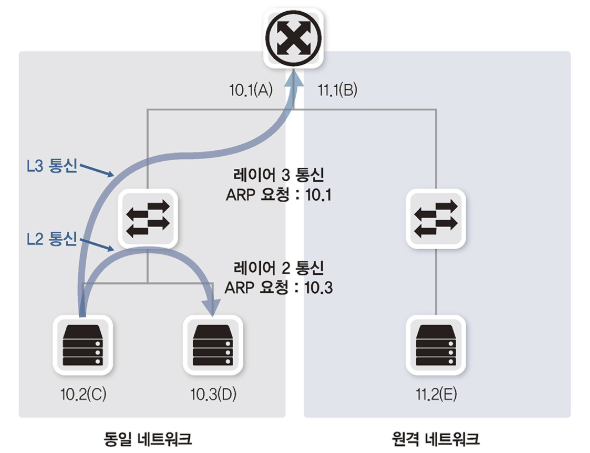

# 유니캐스트, 멀티캐스트, 브로드캐스트, 애니캐스트

네트워크에서 출발지 ~ 목적지로 데이터를 전송할 때 사용하는 통신 방식입니다.

- 유니캐스트 : 1:1 통신입니다.
- 브로드캐스트 : 동일 네트워크 내 모든 호스트로 통신합니다.
- 멀티캐스트 : 하나의 출발지에서 다수의 특정 목적지로 통신합니다.
- 애니캐스트 : 1:1 통신으로, 다수의 동일 그룹 중 가장 가까운 호스트가 응답합니다.

# MAC 주소

MAC (Media Access Control) 주소는 2계층(데이터 링크 계층)에서 통신을 위해 네트워크 인터페이스에 할당된 고유 식별자입니다.

MAC 주소는 48비트의 16진수 12자리로 표현됩니다.  48비트의 MAC 주소는 다시 제조사 코드의 앞 24비트와 제조사 임의 코드인 뒤의 24비트로 나누어 구분됩니다.

NIC 은 자신의 MAC 주소를 가지고 있으면서 전기 신호가 들어오면 해당 신호의 도착지 MAC 주소를 확인합니다. 만약 도착지 MAC 주소가 자신이 갖고 있는 MAC 주소와 다르면 그 패킷을 폐기하고, 같으면 상위 계층으로 넘깁니다.

# IP 주소

IPv4 주소는 8비트 단위의 옥텟 4개로 이루어져있는 32비트 주소체계입니다.

A 클래스는 $2^{24}$ 개, B 클래스는 $2^{16}$ 개, C 클래스는 $2^{8}$ 개의 IP 를 표현할 수 있습니다. 하지만 IP 체계에서 맨 앞의 숫자를 네트워크 주소로, 맨 뒤의 숫자를 브로드캐스트 주소로 사용하므로 실제로 사용할 수 있는 IP는 2개 적습니다.

## 클래스리스, CIDR 기반 주소 체계

기존 클래스 기반 주소 체계는 주소 낭비가 심했기 때문에 지금은 CIDR(Classless Inter-Domain Routing) 기반의 주소 체계를 사용합니다. 클래스리스 네트워크에서는 별도로 네트워크와 호스트 주소를 나누는 구분자를 사용해야 하는데 이 구분자를 서브넷 마스크(Subnet Mask)라고 부릅니다.

예를 들어 103.9.32.146 주소에 서브넷 마스크가 255.255.255.0 이라면 네트워크 주소는 103.9.32.0, 호스트 주소는 0.0.0.146 입니다. 또한 아래와 같이 클래스 기준을 무시하고 네트워크를 쪼개 사용할 수 있는데 이를 **서브네팅**(Subnetting) 이라고 합니다.

# TCP 와 UDP

4계층에서 동작하는 프로토콜은 목적지 단말 안에서 동작하는 여러 애플리케이션 프로세스 중 통신해야 할 목적지 프로세스를 정확히 찾아가고 패킷 순서가 바뀌지 않도록 잘 조합해 원래 데이터를 잘 만들어내기 위한 역할을 합니다.

## TCP

### 패킷 순서, 응답 번호

​	TCP 에서는 시퀀스 번호로 패킷에 순서를 부여하고, ACK 번호로 응답 번호를 부여합니다. 이를 통해 순서가 바뀌거나 패킷이 손실된 것을 파악할 수 있습니다.

이때 패킷을 하나 보내고 응답을 받는 것이 아니라 많은 패킷을 한꺼번에 보내고 응답을 하나만 받습니다. 이 패킷의 적정 송신량을 **윈도 사이즈**라고 하며 네트워크 상황에 따라 윈도 사이즈를 조절하는 것을 **슬라이딩 윈도**라고 합니다.

TCP 헤더에서 표현할 수 있는 최대 크기의 윈도 사이즈는 $2^{16}$ 으로 64K 지만 현대 네트워크에서는 너무 작은 숫자입니다. 점점 고속화, 안정화되는 환경에 적응하기 위해 윈도 사이즈를 64K보다 대폭 늘려 통신하는데 TCP 헤더는 변경이 불가능하므로 헤더 사이즈를 늘리지 않고 뒤의 숫자를 무시하는 방법으로 윈도 사이즈를 증가시켜 통신합니다. 이런 방법을 사용하면 기존 숫자에 10배, 100배로 윈도 사이즈가 커집니다. TCP는 데이터에 유실이 발생하면 윈도 사이즈를 절반으로 떨어뜨리고 정상적인 통신이 되는 경우, 서서히 하나씩 늘립니다. 

### 3-way handshake

3-way handshake 는 통신 시작 전의 사전 연결 작업입니다. 

1. 서버에서는 서비스를 제공하기 위해 클라이언트의 접속을 받아들일 수 있는 LISTEN 상태로 대기합니다.
2. 클라이언트에서 통신을 시도할 때 Syn 패킷을 보내고 SYN-SENT 상태가 됩니다. 
3. 클라이언트의 Syn을 받은 서버는 SYN-RECEIVE 상태로 변경되고 Syn, Ack로 응답합니다. 
4. 이 응답을 받은 클라이언트는 ESTABLISHED 상태로 변경하고 그에 대한 응답을 서버로 다시 보냅니다. 
5. 서버에서도 클라이언트의 이 응답을 받고 ESTABLISHED 상태로 변경됩니다. ESTABLISHED 상태는 서버와 클라이언트 간의 연결이 성공적으로 완료되었음을 나타냅니다.

이러한 3-way handshake 와 기존 통신을 구분하기 위해 헤더에 Flag 를 넣습니다.

TCP 플래그는 총 6가지가 있고 통신의 성질을 나타냅니다. 초기 연결, 응답, 정상 종료, 비정상 종료 등의 용도로 사용됩니다.

- SYN :연결 시작 용도로 사용합니다. 연결이 시작될 때 SYN 플래그에 1로 표시해 보냅니다.
- ACK : ACK 번호가 유효할 경우, 1로 표시해 보냅니다. 초기 SYN이 아닌 모든 패킷은 기존 메시지에 대한 응답이므로 ACK 플래그가 1로 표기됩니다.
- FIN :연결 종료 시 1로 표시됩니다. 데이터 전송을 마친 후 정상적으로 양방향 종료 시 사용됩니다.
- RST : 연결 종료 시 1로 표시됩니다. 연결 강제 종료를 위해 연결을 일방적으로 끊을 때 사용됩니다.
- URG : 긴급 데이터인 경우, 1로 표시해 보냅니다.
- PSH : 서버 측에서 전송할 데이터가 없거나 데이터를 버퍼링 없이 응용 프로그램으로 즉시 전달할 것을 지시할 때 사용됩니다.

## UDP

UDP 는 4계층 프로토콜이 가져야 할 특징이 거의 없습니다. UDP는 음성 데이터나 실시간 스트리밍과 같이 시간에 민감한 프로토콜이나 애플리케이션을 사용하는 경우나 사내 방송이나 증권 시세 데이터 전송에 사용되는 멀티캐스트처럼 단방향으로 다수의 단말과 통신해 응답을 받기 어려운 환경에서 주로 사용됩니다. 

UDP는 TCP와 달리 통신 시작 전, 3방향 핸드셰이크와 같이 사전에 연결을 확립하는 절차가 없습니다. 그 대신 UDP에서 첫 데이터는 리소스 확보를 위해 인터럽트(Interrupt)를 거는 용도로 사용되고 유실됩니다.

# ARP

ARP(Address Resolution Protocol) 는 IP 주소 기반으로 MAC 주소를 알아내기 위해 사용되는 프로토콜입니다. 

## ARP 브로드캐스트

호스트에서 아무 통신이 없다가 처음 통신을 시도하면 상대방의 IP 주소는 알지만 MAC 주소는 모르기 때문에 ARP 브로드캐스트를 이용해 네트워크 전체에 상대방의 MAC 주소를 질의해야 합니다. ARP 브로드캐스트를 받은 목적지는 ARP 프로토콜을 이용해 자신의 MAC 주소를 응답합니다. 이 작업이 완료되면 출발지, 목적지 둘 다 상대방에 대한 MAC 주소를 학습하고 이후 패킷이 정상적으로 인캡슐레이션되어 상대방에게 전달될 수 있습니다.

패킷을 보낼 때마다 ARP 브로드캐스트를 수행하면 네트워크 통신의 효율성이 크게 저하되므로 메모리에 이 정보를 저장해두고 재사용합니다.

## ARP 동작

서버 A는 목적지 서버 B의 MAC 주소(1.1.1.2 IP의 MAC 주소)를 알아내기 위해 ARP 요청을 네트워크에 브로드캐스트합니다. 이때 출발지 MAC 은 자신으로, 목적지 MAC 은 브로드캐스트인 FF-FF-FF-FF-FF-FF 로 채웁니다. 그리고 ARP 프로토콜 필드의 전송자 MAC과 IP 주소에는 자신의 주소로, 대상자 IP 주소는 10.1.1.2를, 대상자 MAC 주소는 00-00-00-00-00-00으로 채워 네트워크에 뿌립니다.

브로드 캐스트이므로 동일 네트워크의 모든 단말이 해당 요청을 받아서 ARP 프로토콜 필드의 대상자 IP가 자신이 맞는지 확인하고 자신이 아니면 ARP 패킷을 버립니다. 대상자가 맞다면 송신자와 대상자의 위치를 바꾸고 자신의 MAC 주소를 응답합니다. 

## ARP 동작 - 동일 네트워크가 아닐 떄

출발 호스트는 **서브넷 마스크**를 통해 목적지가 목적지 호스트가 다른 네트워크인지 확인합니다. 다른 네트워크면 출발 호스트는 목적지가 자신이 직접 보낼 수 없는 위치에 있다고 판단하고 ARP 요청을 기본 게이트웨이의 IP 주소로 요청합니다.

게이트웨이는 데이터 포워딩 테이블을 참고해 패킷의 목적지 IP 주소가 있다면 **출발 호스트에 자신의 MAC 주소를 적어 ARP Reply 를 보냅니다.**

게이트웨이에서 ARP 응답을 받은 단말은 도착지 MAC 주소에 응답받은 기본 게이트웨이의 MAC 주소를 적어넣고 통신을 시작합니다.