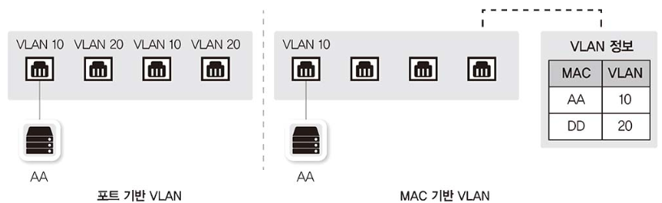
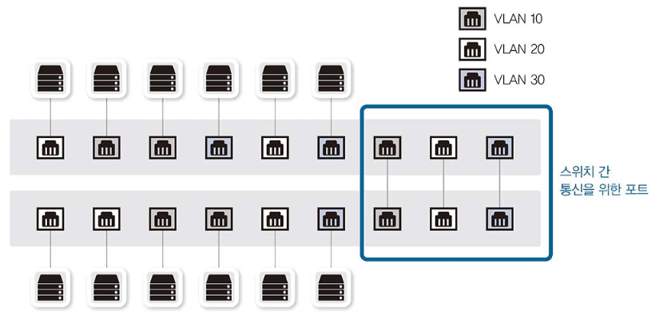
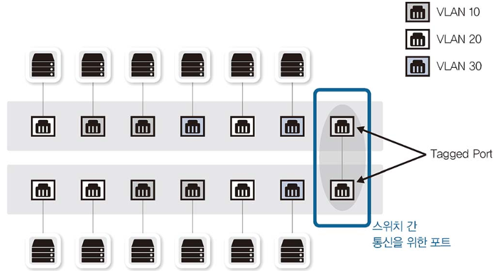
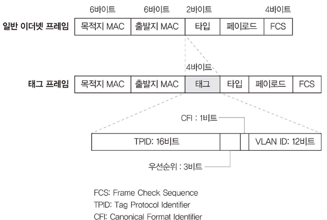
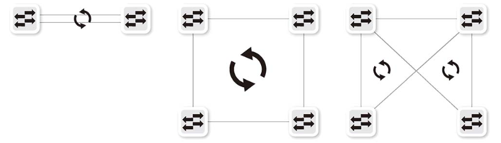

# 스위치 장비 동작

스위치는 네트워크 패킷 전송 시 서로 간섭 없이 통신하도록 도와주는 장비입니다. 스위치는 단말의 주소인 MAC 주소와 단말이 위치하는 인터페이스 정보를 매핑한 MAC 주소 테이블을 갖고 있습니다. 이를 통해 패킷을 정확히 전송할 수 있습니다. 

**스위치의 핵심 역할**은 누가 어느 위치에 있는지 파악하고 실제 통신이 시작되면 자신이 알고 있는 위치로 패킷을 정확히 전송하는 것입니다. 이런 동작은 스위치가 2계층 주소를 이해하고 단말의 주소인 MAC 주소와 단말이 위치하는 인터페이스 정보를 매핑한 MAC 주소 테이블을 갖고 있어서 가능합니다.

스위치 동작 방식은 다음 3가지로 정리됩니다.

- 플러딩 : 스위치는 부팅하면 아무런 정보가 없기 때문에 모든 포트로 패킷을 전달합니다. 이러한 동작 방식을 플러딩이라고 합니다.
- 어드레스 러닝 : MAC 주소 테이블을 만들고 유지하는 과정을 어드레스 러닝이라고 합니다.
- 포워딩/필터링 : 패킷이 스위치에 들어온 경우, 도착지 MAC 주소를 확인하고 자신이 가진 MAC 테이블과 비교해 맞는 정보가 있으면 매치되는 해당 포트로 패킷을 포워딩합니다. 이때 다른 포트로는 해당 패킷을 보내지 않으므로 이 동작을 필터링이라고 합니다. 

# VLAN

VLAN 은 물리적 배치와 상관없이 LAN 을 논리적으로 분할하는 기술입니다.  그리고 이렇게 분리된 단말 간에는 3계층 장비를 통해 통신하게 됩니다.

## VLAN 의 종류와 특징

VLAN 은 **포트 기반 VLAN** 과 **MAC 기반 VLAN** 이 있습니다.

포트 기반 VLAN 은 스위치의 특정 포트가 VLAN 의 선정기준입니다. 반면 MAC 기반 VLAN 은  VLAN 을 할당하는 기준이 PC 의 MAC 주소입니다. 위 그림에서 AA PC 는 어떤 스위치의 어떤 포트에 접속하더라도 동일한 VLAN 10 이 할당됩니다.

## VLAN 모드(Trunk/Access) 동작 방식

여러 개의 VLAN 이 존재하는 상황에서 스위치를 서로 연결해야 하는 경우에는 각 VLAN 끼리 통신하려면 VLAN 개수만큼 포트를 연결해야 합니다. 

따라서 위와 같이 VLAN 을 3개 구성했다면 각 VLAN 간 통신에 필요한 3개의 포트가 필요합니다. VLAN 을 더 많이 사용하는 네트워크에서는 이렇게 VLAN별로 포트를 연결하면 장비 간의 연결만으로도 많은 포트가 낭비됩니다. 이 문제를 해결하기 위한 것이 VLAN 태그 기능입니다.

태그 기능은 하나의 포트에 여러 개의 VLAN 을 함께 전송할 수 있게 해줍니다. 이 포트를 태그(Tagged) 포트 또는 트렁크(Trunk) 포트라고 합니다.이렇게 통신하려면 이더넷 프레임 중간에 VLAN ID 필드를 끼워 넣어 이 정보를 이용합니다.

일반적인 포트를 언태그(Untagged) 포트 또는 액세스(Access) 포트라고 하고 VLAN 정보를 넘겨 여러 VLAN이 한꺼번에 통신하도록 해주는 포트를 태그 포트 또는 트렁크 포트라고 부릅니다.

# STP

 SPoF(Single Point of Failure: 단일 장애점) 로 인한 장애를 피하기 위해 스위치를 두 대로 디자인할 수 있습니다. 하지만 두 대 이상의 스위치로 디자인하면 패킷이 네트워크를 따라 계속 전송되므로 네트워크를 마비시킬 수 있습니다. 이런 상황을 네트워크 루프(Loop)라고 합니다.

스패닝 트리 프로토콜(Spanning Tree Protocol) 은 루프를 확인하고 적절히 포트를 사용하지 못하게 만들어 루프를 예방하는 메커니즘입니다. 용어 그대로 잘 뻗은 나무처럼 뿌리부터 가지까지 루프가 생기지 않도록 유지하는 것이 스패닝 트리 프로토콜의 목적입니다.