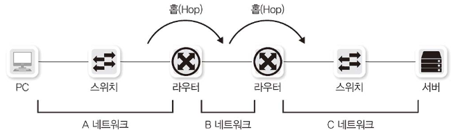
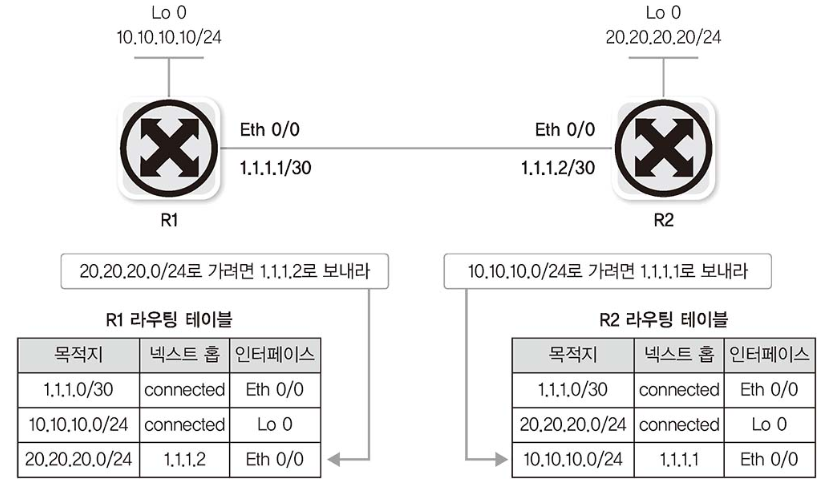
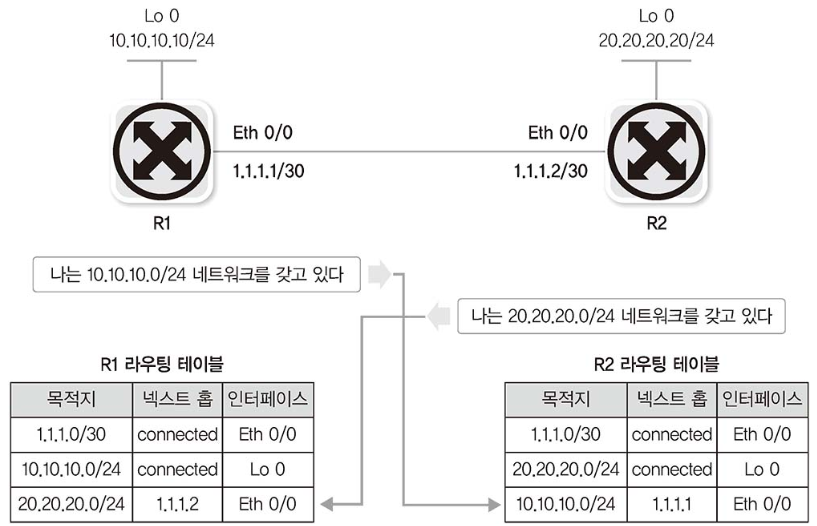
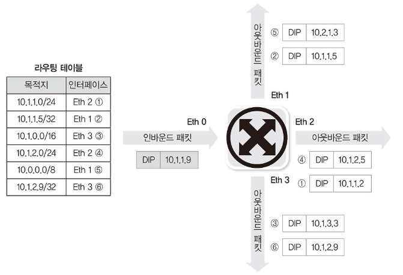
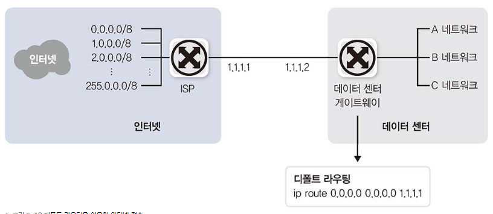

# 라우터의 동작 방식과 역할

라우터는 다양한 경로 정보를 수집해 최적의 경로를 라우팅 테이블에 저장한 후 패킷이 라우터로 들어오면 도착지 IP 주소와 라우팅 테이블을 비교해 최선의 경로로 패킷을 내보냅니다. 라우터는 패킷 포워딩 과정에서 기존 2계층 헤더 정보를 제거한 후 새로운 2계층 헤더를 만들어냅니다.

## 경로 지정

라우터의 가장 중요한 역할은 경로 지정으로, 패킷의 IP 주소를 확인해 적절한 경로로 패킷을 포워딩합니다. 라우터는 다양한 방법으로 경로를 얻는데, IP 주소를 입력하면서 자연스럽게 인접 네트워크 정보를 얻는 방법과 관리자가 직접 경로 정보를 입력하는 방법, 라우터끼리 서로 경로 정보를 자동으로 교환하는 방법이 있습니다.

## 브로드캐스트 컨트롤

2계층의 스위치는 패킷의 도착지 주소를 모르면 어딘가에 존재할지 모를 장비와의 통신을 위해 플러딩해 패킷을 모든 포트에 전송합니다. 2계층까지는 LAN 크기가 작기 때문에 전체 네트워크에 큰 무리가 가지 않습니다. 반면 3계층에서 목적지가 없거나 명확하지 않은 패킷이 플러딩된다면 인터넷에 쓸모 없는 패킷이 가득 차 통신불능 상태가 될 수 있습니다. 

따라서 라우터의 기본 동작은 멀티캐스트 정보를 습득하지 않고 브로드캐스트 패킷을 전달하지 않습니다. 라우터의 이 기능을 이용해 브로드캐스트가 다른 네트워크로 전파되는 것을 막을 수 있습니다. 이 기능을 "브로드캐스트 컨트롤/멀티캐스트 컨트롤" 이라고 합니다.

## 프로토콜 변환

과거에는 LAN 과 WAN 에서 사용하는 프로토콜이 전혀 다랐습니다. 따라서 LAN 기술이 WAN 기술로 변환되어야만 인터넷과 같이 원격지 네트워크와의 통신이 가능했고 이 역할을 라우터가 담당했습니다.

라우터에 패킷이 들어오면 2계층까지의 헤더 정보를 벗겨내고 3계층 주소를 확인한 후 2계층 헤더 정보를 새로 만들어 외부로 내보냅니다. 그래서 라우터에 들어올 때의 패킷 2계층 헤더 정보와 나갈 때의 패킷 2계층 헤더 정보가 다른 것입니다. 이 기능을 이용하면 전혀 다른 기술 간 변환이 가능합니다.

# 경로 지정 - 라우팅/스위칭

라우터는 패킷을 처리할 때 크게 두 가지 작업을 합니다. <u>경로 정로를 얻어 경로 정보를 정리하는 역할</u>과 <u>정리된 경로 정보를 기반으로 패킷을 포워딩하는 역할</u>입니다. 라우터에 들어온 패킷의 목적지 주소와 라우터가 갖고 있는 라우팅 테이블 정보가 정확히 일치하지 않더라도 수많은 정보 중 목적지에 가장 근접한 정보를 찾아 패킷을 포워딩해야 합니다.

## 라우팅 동작과 라우팅 테이블

라우터는 전체 경로를 모두 책임지는 게 아니라 인접한 라우터까지의 경로만 지정합니다. 그러면 인접 라우터에서 최적의 경로를 다시 파악한 후 라우터로 패킷을 포워딩합니다. 네트워크를 한 단계씩 뛰어넘는다는 의미로 이 기법을 **홉-바이-홉(Hop-by-Hop) 라우팅**이라고 부르고 인접한 라우터를 **넥스트 홉(Next Hop)** 이라고 부릅니다.

라우터가 패킷을 포워딩할 때 출발지는 고려하지 않고 목적지 주소와 라우팅 테이블을 비교해서 어느 경로로 포워딩할지 결정합니다. 따라서 라우팅 테이블에 저장하는 데이터는 아래 정보가 포함됩니다.

- 목적지 주소
- 넥스트 홉 IP 주소, 나가는 로컬 인터페이스(선택 가능, 보통은 넥스트 홉 IP 주소)

## 라우팅(라우터가 경로 정보를 얻는 방법)

라우터가 경로 정보를 얻는 방법은 크게 다음 3가지 방법으로 구분할 수 있습니다.

1. 다이렉트 커넥티드
2. 스태틱 라우팅
3. 다이나믹 라우팅

### 다이렉트 커넥티드

​	IP 주소를 입력할 때 사용된 IP 주소와 서브넷 마스크로 해당 IP 주소가 속한 네트워크 주소 정보를 알 수 있습니다. 라우터나  PC에서는 이 정보로 해당 네트워크에 대한 라우팅 테이블을 자동으로 만듭니다. 이 경로 정보를 다이렉트 커넥티드(Direct Connected)라고 부릅니다. 

### 스태틱 라우팅

관리자가 목적지 네트워크와 넥스트 홉을 라우터에 직접 지정해 경로 정보를 입력하는 것을 스태틱 라우팅(Static Routing)이라고 합니다.

### 다이나믹 라우팅

네트워크 상 경로는 계속 변화하고, 라우터가 다운되거나 하는 상황도 동적으로 대응할 수 있어야 합니다. 또한 네트워크 수가 많아지거나 연결이 복잡해지면 관리자가 직접 라우팅 테이블을 작성하는 것도 한계가 있습니다.

다이나믹 라우팅(Dynamic Routing )은 스태틱 라우팅의 이런 단점을 보완하기 위해 라우터끼리 자신이 알고 있는 경로 정보나 링크 상태 정보를 교환해 전체 네트워크 정보를 학습합니다. 주기적으로 또는 상태 정보가 변경될 때 라우터끼리 경로 정보가 교환되므로 라우터를 연결하는 회선이나 라우터 자체에 장애가 발생하면 이 상황을 인지해 대체 경로로 패킷을 포워딩할 수 있습니다. 

## 스위칭(라우터가 경로를 지정하는 방법)

패킷이 들어와 라우팅 테이블을 참조하고 최적의 경로를 찾아 라우터 외부로 포워딩하는 작업을 스위칭이라고 합니다. 이 스위칭은 2계층의 스위치와 이름은 비슷하지만 다른 용어이며 3계층 장비인 라우터가 패킷 경로를 지정해 보내는 작업을 말합니다.

IP가 목적지인 패킷이 라우터로 들어온 경우, 라우터는 도착지 IP와 가장 가깝게 매치되는 경로 정보를 찾습니다. 이때 롱기스트 프리픽스 매치(Longest Prefix Match) 기법을 이용해 갖고 있는 경로 정보 중 가장 가까운 경로를 선택합니다.

라우팅 테이블과 도착지 정보가 매치되는 정보는 10.0.0.0/8, 10.1.0.0/16, 10.1.1.0/24입니다. 이중 10.1.1.0/24 가 앞의 두 라우팅 정보보다 더 많은 네트워크 정보가 목적지와 매치되므로 이 정보를 최선의 정보로 인식해 Eth 2 인터페이스 쪽으로 패킷을 내보내게 됩니다.

정확한 정보를 매치하는 이그잭트 매치(Exact Match)는 단순한 서치 작업으로 찾고 패킷을 처리할 수 있지만 롱기스트 매치처럼 부정확한 정보 중 가장 비슷한 경로를 찾는 작업은 더 많은 리소스를 소모합니다. 라우터에서 패킷이 들어올 때마다 이 작업을 수행하면 많은 리소스를 소모하게 됩니다. 따라서 대부분의 라우터는 캐시를 이용해 반복작업을 줄여줍니다.

# 라우팅 설정 

라우터나 PC에 IP 주소, 서브넷 마스크를 입력하면 **다이렉트 커넥티드** 라우팅 테이블이 생성됩니다. **스태틱 라우팅**은 관리자가 직접 추가해야 하는데, 네트워크 규모가 커지면 라우팅을 처리하는 데 어려움이 있습니다. 따라서 많은 라우팅 정보를 처리하기 위해 ISP 의 전용 라우터를 사용합니다.

네트워크가 몇 개 없는 간단한 네트워크 구조에서는 스태틱 라우팅으로 망을 유지하는 것이 가능하지만 일반적으로 IT 환경을 구축할 때는 SPoF(Single Point of Failure: 단일 장애점) 를 없애기 위해 두 개 이상의 경로를 유지하는데 이 경우, 대체 경로에 대한 고민이 필요합니다. 이런 대체 경로가 필요한 네트워크를 스태틱 라우팅만으로 구성하면 한 홉이 넘어간 네트워크 상태가 변경될 때 신속히 대응할 수 없습니다.

**다이나믹 라우팅 프로토콜**을 사용하면 관리자의 직접적인 개입 없이 라우터끼리 정보를 교환해 경로 정보를 최신으로 유지할 수 있습니다. 라우터끼리 경로 정보를 수집하고 전달하므로 관리자가 라우팅 정보를 직접 입력해줄 필요가 없습니다. 다이나믹 라우팅 뒤에 프로토콜이 붙는 것은 라우터끼리 자신들만의 프로토콜로 정보를 교환하기 때문입니다. 주기적으로나 특별한 변화가 있으면 경로 정보를 교환하므로 중간 경로에 문제가 발생하더라도 대체 경로를 찾는 작업이 자동으로 수행됩니다.