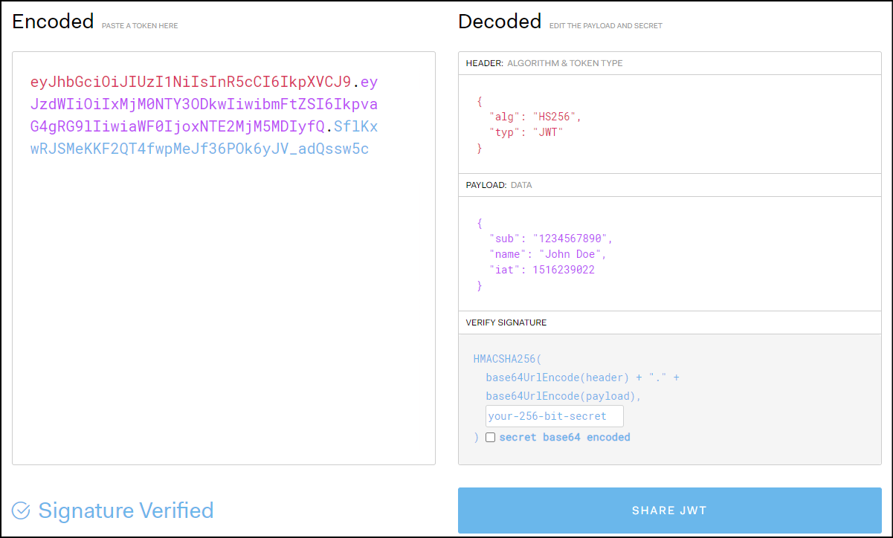
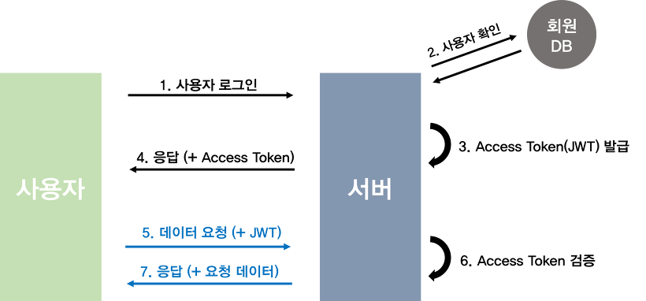

# Jwt Token 기반 인증 방식

JWT는 Json Web Token의 약자로 인증에 필요한 정보들을 암호화시킨 토큰을 뜻합니다. 세션/쿠키 방식과 유사하게 사용자는 Access Token(JWT 토큰)을 HTTP 헤더에 실어 서버로 보내게 됩니다.



<center><u><i><a href= https://jwt.io/>jwt.io사이트 캡쳐</a></i></u></center>

토큰에는 3가지 정보가 들어갑니다.

- Header : 암호화 방식(alg), 타입(type) 등이 들어갑니다.
- Payload : 서버에서 보낼 데이터가 들어갑니다. 일반적으로 유저의 고유 ID값, 유효기간이 들어갑니다.
- Verify Signature : Base64 방식으로 인코딩한 Header,payload 그리고 SECRET KEY를 더한 후 서명됩니다.

최종적인 결과 : Encoded Header + "." + Encoded Payload + "." + Verify Signature 형태가 됩니다. 

이 떄 Header 와 Payload 는 암호화되지 않지만 Verify Signature 는 사용자의 정보를 기반으로 암호화됩니다.

**JWT 인증 flow**



**JWT 토큰 인증의 장점**

1. JWT 는 발급 후 따로 저장소가 필요없어 Stateless 서버를 만들 수 있습니다.
2. Facebook 로그인, Google 로그인 등은 모두 토큰을 기반으로 인증을 하는 방식으로 확장이 용이합니다.

**JWT 토큰 인증의 단점**

1. 이미 발급된 JWT에 대해서는 돌이킬 수 없습니다. -> AcessToken, RefreshToken 으로 관리합니다. AcessToken 은 유효기간을 짧게 하고 RefreshToken 유효기간을 길게 합니다.
2. Payload 에 중요한 정보를 넣을 수 없습니다.
3. JWT 길이가 길어 인증이 필요한 요청이 많아지면 서버의 자원낭비가 심해집니다.

# AccessToken, RefreshToken

RefreshToken 은 기존의 1개의 토큰만 운용하는 AccessToken 보다 더 강화되었다고 생각하면 됩니다. 

AccessToken 은 탈취 당할 경우 보안에 취약하므로 탈취당할 때는 대비해 유효기간을 짧게 설정합니다. 하지만 유효기간이 짧으면 서비스를 이용하다가 새롭게 로그인을 해야한다는 단점이 있습니다. 

따라서 유효기간이 짧고 인증에 사용하는 AccessToken 과 유효기간이 길고 AccessToken 을 발급해주는 용도인 RefreshToken 으로 나눠서 사용합니다.

flow 는 다음과 같습니다.


- 사용자는 최초 로그인 시 accessToken 과 RefreshToken 을 받습니다.
- Http 요청 시 AccessToken 으로 통신합니다.
- 서버에서 AccessToken 이 만료되었다고 판단하면 만료 신호를 보내고 클라이언트는 자동으로 RefreshToken 으로 AccessToken 발급을 요청합니다.
- 클라이언트는 받은 AccessToken 을 다시 저장하여 사용합니다.

# 백엔드 RefreshToken 구현

이제 refreshToken 을 구현해보겠습니다. 자연스럽게 AccessToken 까지 설명이 되겠습니다.

## TokenDto

먼저 정보를 주고받는 TokenDto 입니다. 최초 로그인 시 서버는 TokenDto 를 클라이언트에 주게 됩니다.  

```java
package soccer.backend.auth.dto;

import lombok.AllArgsConstructor;
import lombok.Builder;
import lombok.Getter;
import lombok.NoArgsConstructor;

@Getter
@NoArgsConstructor
@AllArgsConstructor
@Builder
public class TokenDto {
    private String grantType;
    private String accessToken;
    private String refreshToken;
    private Long accessTokenExpiresIn;
    private Long refreshTokenExpiresIn;
}
```

TokenDto 에는 GrantType 은 Jwt 를 의미하는 "Bearer" 를 넣어줄 예정입니다. accessToken, refreshToken 에 붙여도 상관없습니다.

프론트에서 데이터를 다루기 편하게 ExprireTime 은 따로 빼놨습니다.

## TokenProvider

다음은 TokenProvider 입니다. 토큰을 생산, 유효성 확인 작업을 실시합니다.

```java
package soccer.backend.auth.jwt;

import io.jsonwebtoken.*;
import io.jsonwebtoken.io.Decoders;
import io.jsonwebtoken.security.Keys;
import lombok.extern.slf4j.Slf4j;
import org.springframework.beans.factory.annotation.Value;
import org.springframework.security.authentication.UsernamePasswordAuthenticationToken;
import org.springframework.security.core.Authentication;
import org.springframework.security.core.GrantedAuthority;
import org.springframework.security.core.authority.SimpleGrantedAuthority;
import org.springframework.security.core.userdetails.User;
import org.springframework.security.core.userdetails.UserDetails;
import org.springframework.stereotype.Component;
import soccer.backend.auth.dto.TokenDto;
import soccer.backend.auth.service.CustomUserDetailsService;
import soccer.backend.repository.MemberRepository;

import java.security.Key;
import java.util.Arrays;
import java.util.Collection;
import java.util.Date;
import java.util.stream.Collectors;

@Component
@Slf4j
public class TokenProvider {

    private static final String AUTHORITIES_KEY = "auth";
    private static final String BEARER_TYPE = "bearer";
    private static final long ACCESS_TOKEN_EXPIRE_TIME = 1000 * 60 * 60 * 2;
    private static final long REFRESH_TOKEN_EXPIRE_TIME = 1000 * 60 * 60 * 24 * 14;
    private final Key key;
    private final CustomUserDetailsService userDetailsService;

    public TokenProvider (@Value("${jwt.secret-key}") String secretKey, CustomUserDetailsService userDetailsService, MemberRepository memberRepository) {
        this.userDetailsService = userDetailsService;
        byte[] keyBytes = Decoders.BASE64.decode(secretKey);
        this.key = Keys.hmacShaKeyFor(keyBytes);
    }

    // 토큰 생성
    public TokenDto generateTokenDto(Authentication authentication) {

        String authorities = authentication.getAuthorities().stream()
                .map(GrantedAuthority::getAuthority)
                .collect(Collectors.joining(","));

        Date date = new Date();
        long now = date.getTime();

        Date AccessTokenExpiresIn = new Date(now + ACCESS_TOKEN_EXPIRE_TIME);
        Date refreshTokenExpiresIn = new Date(now + REFRESH_TOKEN_EXPIRE_TIME);

        String accessToken = Jwts.builder()
                .setSubject(authentication.getName())
                .claim(AUTHORITIES_KEY, authorities)
                .setExpiration(AccessTokenExpiresIn)
                .signWith(key, SignatureAlgorithm.HS512)
                .compact();

        //refreshToken 에는 권한정보가 필요없다
        String refreshToken = Jwts.builder()
                .setSubject(authentication.getName())
                .setExpiration(refreshTokenExpiresIn)
                .signWith(key, SignatureAlgorithm.HS512)
                .compact();

        return TokenDto.builder()
                .grantType(BEARER_TYPE)
                .accessToken(accessToken)
                .refreshToken(refreshToken)
                .accessTokenExpiresIn(AccessTokenExpiresIn.getTime())
                .refreshTokenExpiresIn(refreshTokenExpiresIn.getTime())
                .build();
    }

    public TokenDto createAccessToken(Authentication authentication){
        String authorities = authentication.getAuthorities().stream()
                .map(GrantedAuthority::getAuthority)
                .collect(Collectors.joining(","));

        Date date = new Date();
        long now = date.getTime();

        Date AccessTokenExpiresIn = new Date(now + ACCESS_TOKEN_EXPIRE_TIME);

        String accessToken = Jwts.builder()
                .setSubject(authentication.getName())
                .claim(AUTHORITIES_KEY, authorities)
                .setExpiration(AccessTokenExpiresIn)
                .signWith(key, SignatureAlgorithm.HS512)
                .compact();

        return TokenDto.builder()
                .grantType(BEARER_TYPE)
                .accessToken(accessToken)
                .accessTokenExpiresIn(AccessTokenExpiresIn.getTime())
                .build();
    }

    public Authentication getAuthenticationFromRefreshToken(String refreshToken) {
        Claims claims = parseClaims(refreshToken);
    	String username = claims.getSubject();

        // Load the user and their authorities from your data source
        UserDetails userDetails = userDetailsService.loadUserByUsername(username);

        // Create an Authentication object for the user
        UsernamePasswordAuthenticationToken authentication = new UsernamePasswordAuthenticationToken(
                userDetails, null, userDetails.getAuthorities());

        return authentication;
    }

    public Authentication getAuthentication(String accessToken) {
        Claims claims = parseClaims(accessToken);

        if (claims.get(AUTHORITIES_KEY) == null) {
            throw new RuntimeException("권한 정보가 없는 토큰입니다.");
        }

        Collection<? extends GrantedAuthority> authorities =
                Arrays.stream(claims.get(AUTHORITIES_KEY).toString().split(","))
                        .map(SimpleGrantedAuthority::new)
                        .collect(Collectors.toList());

        UserDetails principal = new User(claims.getSubject(), "", authorities);

        return new UsernamePasswordAuthenticationToken(principal, "", authorities);
    }

    public boolean validateToken(String token, boolean isRefreshToken) {
    try {
        Jwts.parserBuilder().setSigningKey(key).build().parseClaimsJws(token);
        return true;
    } catch (io.jsonwebtoken.security.SecurityException | MalformedJwtException e) {
        log.info("잘못된 JWT 서명입니다.");
   	} catch (ExpiredJwtException e) {
            log.info("만료된 토큰입니다.");
            throw new ExpiredJwtException(e.getHeader(), e.getClaims(), "만료된 토큰입니다.");
    }  catch (UnsupportedJwtException e) {
        log.info("지원되지 않는 JWT 토큰입니다.");
    } catch (IllegalArgumentException e) {
        log.info("JWT 토큰이 잘못되었습니다.");
    }
    return false;
}

    private Claims parseClaims(String accessToken) {
        try {
            return Jwts.parserBuilder().setSigningKey(key).build().parseClaimsJws(accessToken).getBody();
        } catch (ExpiredJwtException e) {
            throw new ExpiredJwtException(e.getHeader(), e.getClaims(), "만료된 토큰입니다.");
        }
    }
}

```

하나씩 보도록 하겠습니다.

**필드, 생성자**

```java
private static final String AUTHORITIES_KEY = "auth";
private static final String BEARER_TYPE = "bearer";
private static final long ACCESS_TOKEN_EXPIRE_TIME = 1000 * 60 * 60 * 2;
private static final long REFRESH_TOKEN_EXPIRE_TIME = 1000 * 60 * 60 * 24 * 14;
private final Key key;
private final CustomUserDetailsService userDetailsService;
private final MemberRepository memberRepository;

public TokenProvider (@Value("${jwt.secret-key}") String secretKey, CustomUserDetailsService userDetailsService, MemberRepository memberRepository) {
    this.userDetailsService = userDetailsService;
    this.memberRepository = memberRepository;
    byte[] keyBytes = Decoders.BASE64.decode(secretKey);
    this.key = Keys.hmacShaKeyFor(keyBytes);
}
```

먼저 필드와 생성자입니다. `AUTHORITIES_KEY`, `BEARER_TYPE` 은 사용할 일이 많아서 static 으로 선언했습니다.

`ACCESS_TOKEN_EXPIRE_TIME`, `REFRESH_TOKEN_EXPIRE_TIME` 은 유효기간 설정입니다. AcessToken 은 2시간, RefreshToken 은 14일입니다.

`key` 는 JWT 를 만들 때 사용하는 키값을 사용하기 위해 spring security 를 사용했습니다.

`CustomUserDetailsService` 는 사용자 정보로 인증 정보를 만들기 위해 사용합니다. 나중에 추가 설명드리겠습니다.

생성자에서 `secretKey` 는 `application.yml` 에 있는 `jwt.secret-key` 값입니다. 다음과 같이 설정합니다.

```yml
jwt:
  secret-key: "..."
```

signing algorithm 에 따라 secret-key 의 길이가 다릅니다. 제가 사용하는 `HS512` 는 최소 64bytes 를 사용해야 합니다. 

**토큰 생성(generateTokenDto, createAccessToken) **

```java
// 토큰 생성
public TokenDto generateTokenDto(Authentication authentication) {

    String authorities = authentication.getAuthorities().stream()
            .map(GrantedAuthority::getAuthority)
            .collect(Collectors.joining(","));

    Date date = new Date();
    long now = date.getTime();

    Date AccessTokenExpiresIn = new Date(now + ACCESS_TOKEN_EXPIRE_TIME);
    Date refreshTokenExpiresIn = new Date(now + REFRESH_TOKEN_EXPIRE_TIME);

    String accessToken = Jwts.builder()
            .setSubject(authentication.getName())
            .claim(AUTHORITIES_KEY, authorities)
            .setExpiration(AccessTokenExpiresIn)
            .signWith(key, SignatureAlgorithm.HS512)
            .compact();

    //refreshToken 에는 권한정보가 필요없다
    String refreshToken = Jwts.builder()
            .setSubject(authentication.getName())
            .setExpiration(refreshTokenExpiresIn)
            .signWith(key, SignatureAlgorithm.HS512)
            .compact();

    return TokenDto.builder()
            .grantType(BEARER_TYPE)
            .accessToken(accessToken)
            .refreshToken(refreshToken)
            .accessTokenExpiresIn(AccessTokenExpiresIn.getTime())
            .refreshTokenExpiresIn(refreshTokenExpiresIn.getTime())
            .build();
}

public TokenDto createAccessToken(Authentication authentication){
    String authorities = authentication.getAuthorities().stream()
            .map(GrantedAuthority::getAuthority)
            .collect(Collectors.joining(","));

    Date date = new Date();
    long now = date.getTime();

    Date AccessTokenExpiresIn = new Date(now + ACCESS_TOKEN_EXPIRE_TIME);

    String accessToken = Jwts.builder()
            .setSubject(authentication.getName())
            .claim(AUTHORITIES_KEY, authorities)
            .setExpiration(AccessTokenExpiresIn)
            .signWith(key, SignatureAlgorithm.HS512)
            .compact();

    return TokenDto.builder()
            .grantType(BEARER_TYPE)
            .accessToken(accessToken)
            .accessTokenExpiresIn(AccessTokenExpiresIn.getTime())
            .build();
}
```

다음은 토큰을 만드는 메서드입니다. 토큰에는 유저 정보(`            .setSubject(authentication.getName())`), 권한 정보(`.claim(AUTHORITIES_KEY, authorities)`), 만료시간(`.setExpiration(AccessTokenExpiresIn)`), 서명(`.signWith(key, SignatureAlgorithm.HS512)`) 이 들어갑니다.

refreshToken 은 권한정보가 필요없으므로 넣어주지 않았습니다.

`createAccessToken` 은 `generateTokenDto` 에서 RefreshToken 생성이 빠졌습니다. 해당 메서드는 accessToken 이 만료되었을 때 발급하기 위한 메서드입니다.

**토큰 인증 확인 (getAuthenticationFromRefreshToken, getAuthentication)**

```java
public Authentication getAuthenticationFromRefreshToken(String refreshToken) {
    Claims claims = parseClaims(refreshToken);
    String username = claims.getSubject();

    // Load the user and their authorities from your data source

    UserDetails userDetails = userDetailsService.loadUserByUsername(username);

    // Create an Authentication object for the user
    UsernamePasswordAuthenticationToken authentication = new UsernamePasswordAuthenticationToken(
            userDetails, null, userDetails.getAuthorities());

    return authentication;
}

public Authentication getAuthentication(String accessToken) {
    Claims claims = parseClaims(accessToken);

    if (claims.get(AUTHORITIES_KEY) == null) {
        throw new RuntimeException("권한 정보가 없는 토큰입니다.");
    }

    Collection<? extends GrantedAuthority> authorities =
            Arrays.stream(claims.get(AUTHORITIES_KEY).toString().split(","))
                    .map(SimpleGrantedAuthority::new)
                    .collect(Collectors.toList());

    UserDetails principal = new User(claims.getSubject(), "", authorities);

    return new UsernamePasswordAuthenticationToken(principal, "", authorities);
}

...
    
private Claims parseClaims(String token) {
    try {
        return Jwts.parserBuilder().setSigningKey(key).build().parseClaimsJws(token).getBody();
    } catch (ExpiredJwtException e) {
        throw new ExpiredJwtException(e.getHeader(), e.getClaims(), "만료된 토큰입니다.");
    }
}
```

토큰의 인증을 꺼냅니다. 토큰은 String 이므로 `parseClaims` 메서드를 사용하여 Claims 타입으로 변경합니다.  

`getAuthenticationFromRefreshToken(String refreshToken)` 은 refreshToken 으로부터 인증정보를 꺼냅니다.

`getAuthentication(String accessToken)` 은 accessToken 으로부터 인증정보를 꺼냅니다. 차이는 accessToken 은 authorities 를 꺼낼 수 있습니다. 나중에 사용할 `SecurityContext` 에 `Authentication`객체를 저장하기 위해 `UsernamePasswordAuthenticationToken` 안에 `UserDetails` 와 권한정보를 넣고 반환합니다. `UsernamePasswordAuthenticationToken` 은 `Authentication` 을 간접상속합니다.

**유효기간 확인(validateToken)**

```java
public boolean validateToken(String token, boolean isRefreshToken) {
    try {
        Jwts.parserBuilder().setSigningKey(key).build().parseClaimsJws(token);
        return true;
    } catch (io.jsonwebtoken.security.SecurityException | MalformedJwtException e) {
        log.info("잘못된 JWT 서명입니다.");
   	} catch (ExpiredJwtException e) {
            log.info("만료된 토큰입니다.");
            throw new ExpiredJwtException(e.getHeader(), e.getClaims(), "만료된 토큰입니다.");
    }  catch (UnsupportedJwtException e) {
        log.info("지원되지 않는 JWT 토큰입니다.");
    } catch (IllegalArgumentException e) {
        log.info("JWT 토큰이 잘못되었습니다.");
    }
    return false;
}
```

토큰의 유효기간을 확인합니다. 유효기간이 만료되면 AccessToken 은 JwtFilter 에서 ExpiredJwtException 을 던지고, RefreshToken 은 GlobalExceptionHandler 에서 `@ExceptionHandler(ExpiredJwtException.class)` 에 걸려서 오류응답을 던집니다. 차이가 나는 이유는 AccessToken 만료 시 JwtFilter 에 걸리면 핸들러까지 정보가 오지 않기 때문입니다.

## JwtFilter

필터는 spring container 에 들어오기 전에 실행됩니다.

```java
package soccer.backend.auth.jwt;

import io.jsonwebtoken.ExpiredJwtException;
import jakarta.servlet.FilterChain;
import jakarta.servlet.ServletException;
import jakarta.servlet.http.HttpServletRequest;
import jakarta.servlet.http.HttpServletResponse;
import lombok.RequiredArgsConstructor;
import lombok.extern.slf4j.Slf4j;
import org.springframework.http.HttpStatus;
import org.springframework.security.core.Authentication;
import org.springframework.security.core.context.SecurityContextHolder;
import org.springframework.util.StringUtils;
import org.springframework.web.filter.OncePerRequestFilter;

import java.io.IOException;

@RequiredArgsConstructor
@Slf4j
public class JwtFilter extends OncePerRequestFilter {
    public static final String AUTHORIZATION_HEADER = "Authorization";
    public static final String BEARER_PREFIX = "Bearer ";
    private final TokenProvider tokenProvider;


    private String resolveToken(HttpServletRequest request) {
        String bearerAccessToken = request.getHeader(AUTHORIZATION_HEADER);

        if (StringUtils.hasText(bearerAccessToken) && bearerAccessToken.startsWith(BEARER_PREFIX)) {
            return bearerAccessToken.substring(7);
        }
        return null;
    }

    @Override
    protected void doFilterInternal(HttpServletRequest request, HttpServletResponse response, FilterChain filterChain) throws ServletException, IOException, ServletException, IOException {

        try{
            String jwt = resolveToken(request);

            if (StringUtils.hasText(jwt) && tokenProvider.validateToken(jwt)) {
                Authentication authentication = tokenProvider.getAuthentication(jwt);
                SecurityContextHolder.getContext().setAuthentication(authentication);
            }
            filterChain.doFilter(request, response);
            
        }catch (ExpiredJwtException e) {
            // Handle the exception and send a response
            response.setStatus(HttpStatus.OK.value());
            response.setCharacterEncoding("UTF-8"); // Set the character encoding to UTF-8
            response.setContentType("application/json");

            // Create a custom response with the error message
            String jsonResponse = String.format("{\"message\": \"%s\"}", e.getMessage());
            response.getWriter().write(jsonResponse);
        }

    }
}
```

doFilter 를 보면, request 를 받아서 Header 정보에서 accessToken 을 가져옵니다. 만약 token 의 유효기간이 만료되었다면 `tokenProvider.validateToken(jwt)` 메서드를 통해 `ExpiredJwtException` 이 발생합니다. 

에러 메시지는 `만료된 토큰입니다.` 인데, 이 메세지를 통해서 클라이언트측은 토큰이 만료되었음을 알고 refreshToken 으로 accessToken 재발급을 요청하게 됩니다.

accessToken 이 만료되지 않았다면 `getAuthentication` 을 통해 토큰에서 `authentication` 을 받습니다. 이 인증정보는  `SecurityContextHolder.getContext().setAuthentication(authentication);` 를 통해 `SecurityContext` 에 저장되게 됩니다. 

## JwtSecurityConfig

`SecurityConfigurerAdapter<DefaultSecurityFilterChain, HttpSecurity>` 는 직접 만든 `TokenProvider`와 `JwtFilter`를 `SecurityConfig`에 적용할 때 사용합니다. 

```java
package soccer.backend.config;

import lombok.RequiredArgsConstructor;
import org.springframework.security.config.annotation.SecurityConfigurerAdapter;
import org.springframework.security.config.annotation.web.builders.HttpSecurity;
import org.springframework.security.web.DefaultSecurityFilterChain;
import org.springframework.security.web.authentication.UsernamePasswordAuthenticationFilter;
import soccer.backend.auth.jwt.JwtFilter;
import soccer.backend.auth.jwt.TokenProvider;

@RequiredArgsConstructor
public class JwtSecurityConfig extends SecurityConfigurerAdapter<DefaultSecurityFilterChain, HttpSecurity> {

    private final TokenProvider tokenProvider;

    @Override
    public void configure(HttpSecurity http) {
        JwtFilter customFilter = new JwtFilter(tokenProvider);
        http.addFilterBefore(customFilter, UsernamePasswordAuthenticationFilter.class);
    }
}
```

## SecurityUtil

```java
package soccer.backend.config;

import org.springframework.security.core.Authentication;
import org.springframework.security.core.context.SecurityContextHolder;

public class SecurityUtil {

    private SecurityUtil() { }

    public static String getCurrentMemberId() {
        final Authentication authentication = SecurityContextHolder.getContext().getAuthentication();

        if (authentication == null || authentication.getName() == null) {
            throw new RuntimeException("Security Context에 인증 정보가 없습니다.");
        }

        return authentication.getName();
    }
}

```

저장된 인증 정보를 통해 MemberId 를 가져옵니다. 인증정보에 저장하는 로직은 JwtFilter 에서 진행됩니다. 

## WebSecurityConfig

```java
package soccer.backend.config;

import ...;

@RequiredArgsConstructor
@Configuration
@EnableWebSecurity
@Component
public class WebSecurityConfig {

    private final TokenProvider tokenProvider;
    private final JwtAuthenticationEntryPoint jwtAuthenticationEntryPoint;
    private final JwtAccessDeniedHandler jwtAccessDeniedHandler;

    @Bean
    public PasswordEncoder passwordEncoder() {
        return new BCryptPasswordEncoder();
    }


    @Bean
    public SecurityFilterChain filterChain(HttpSecurity http) throws Exception {
        http
                .cors().configurationSource(corsConfigurationSource())

                .and()
                .httpBasic().disable()
                .csrf().disable()
                .sessionManagement().sessionCreationPolicy(SessionCreationPolicy.STATELESS)

                .and()
                .exceptionHandling()
                .authenticationEntryPoint(jwtAuthenticationEntryPoint)
                .accessDeniedHandler(jwtAccessDeniedHandler)

                .and()
                .authorizeHttpRequests()
                .requestMatchers( "/auth/**").permitAll()
                .requestMatchers(CorsUtils::isPreFlightRequest).permitAll()
                .anyRequest().authenticated()

                .and()
                .apply(new JwtSecurityConfig(tokenProvider));

        return http.build();
    }

    @Bean
    public CorsConfigurationSource corsConfigurationSource() {
       ... Cors 생략
    }
}

```

먼저 `AuthService` 서비스 클래스에서 비밀번호 암호화를 위해 `PasswordEncoder` 빈을 생성했습니다. 현재는 localStorage 에 토큰을 저장하고 있기 때문에 `csrf.disable()` 로 해줍니다. csrf protection 은 토큰 방식일 때 해당사항이 없지만, xss 공격에 취약합니다. 따라서 나중에 토큰저장소를 localStorage 에서 httpOnly 방식의 쿠키저장소로 옮길 예정입니다.

`.authenticationEntryPoint(jwtAuthenticationEntryPoint).accessDeniedHandler(jwtAccessDeniedHandler)` 을 통해 401, 403 에러에 대한 처리를 해줍니다. 

이후에 `requestMathers` 를 통해 `"/auth/**"` 를 제외하고 모두 인증이 필요한 걸로 합니다.

`.apply(new JwtSecurityConfig(tokenProvider));` 를 통해 Filter 를 적용시킵니다.


## 오류페이지(JwtAccessDeniedHandler, JwtAuthenticationEntryPoint)

```java
package soccer.backend.auth.jwt;

@Component
public class JwtAccessDeniedHandler implements AccessDeniedHandler {

    @Override
    public void handle(HttpServletRequest request, HttpServletResponse response, AccessDeniedException accessDeniedException) throws IOException, ServletException, IOException {
        // 필요한 권한이 없이 접근하려 할때 403
        response.sendError(HttpServletResponse.SC_FORBIDDEN);
    }
}

```

```java
package soccer.backend.auth.jwt;

@Component
public class JwtAuthenticationEntryPoint implements AuthenticationEntryPoint {

    @Override
    public void commence(HttpServletRequest request, HttpServletResponse response, AuthenticationException authException) throws IOException {
        // 유효한 자격증명을 제공하지 않고 접근하려 할때 401
        response.sendError(HttpServletResponse.SC_UNAUTHORIZED);
    }
}

```


## AuthService

```java
package soccer.backend.auth.service;

import lombok.RequiredArgsConstructor;
import lombok.extern.slf4j.Slf4j;
import org.springframework.http.HttpStatus;
import org.springframework.http.ResponseEntity;
import org.springframework.security.authentication.BadCredentialsException;
import org.springframework.security.authentication.UsernamePasswordAuthenticationToken;
import org.springframework.security.config.annotation.authentication.builders.AuthenticationManagerBuilder;
import org.springframework.security.core.Authentication;
import org.springframework.security.core.userdetails.UserDetails;
import org.springframework.security.core.userdetails.UsernameNotFoundException;
import org.springframework.security.crypto.password.PasswordEncoder;
import org.springframework.stereotype.Service;
import org.springframework.transaction.annotation.Transactional;
import org.springframework.util.StringUtils;
import org.springframework.web.bind.annotation.GetMapping;
import soccer.backend.auth.dto.MemberRequestDto;
import soccer.backend.auth.dto.MemberResponseDto;
import soccer.backend.auth.dto.TokenDto;
import soccer.backend.auth.jwt.TokenProvider;
import soccer.backend.domain.member.Member;
import soccer.backend.dto.MessageDto;
import soccer.backend.repository.MemberRepository;

@Service
@RequiredArgsConstructor
@Transactional
@Slf4j
public class AuthService {
    private final AuthenticationManagerBuilder managerBuilder;
    private final MemberRepository memberRepository;
    private final PasswordEncoder passwordEncoder;
    private final TokenProvider tokenProvider;
    private final CustomUserDetailsService customUserDetailsService;

    public MemberResponseDto signup(MemberRequestDto requestDto) {
        if (memberRepository.existsByMemberId(requestDto.getMemberId())) {
            throw new RuntimeException("이미 가입되어 있는 유저입니다");
        }

        Member member = requestDto.toMember(passwordEncoder);
        return MemberResponseDto.of(memberRepository.save(member));
    }

    public TokenDto login(MemberRequestDto requestDto) {
        UsernamePasswordAuthenticationToken authenticationToken = requestDto.toAuthentication();
        TokenDto tokenDto = null;

        // 비밀번호 일치 여부 확인
        try{
            UserDetails userDetails = customUserDetailsService.loadUserByUsername(requestDto.getMemberId());
            if (!passwordEncoder.matches(requestDto.getPassword(), userDetails.getPassword())) {
                throw new BadCredentialsException("비밀번호가 일치하지 않습니다.");
            }
            Authentication authentication = managerBuilder.getObject().authenticate(authenticationToken);
            tokenDto = tokenProvider.generateTokenDto(authentication);

        }catch (UsernameNotFoundException e) {
            throw new UsernameNotFoundException(e.getMessage());
        }

        log.info("tokenDto: {}", tokenDto);

        return tokenDto;
    }
        
    public TokenDto refreshToken(String refreshToken) {

        String jwt = refreshToken.substring(7);

        if (StringUtils.hasText(jwt) && tokenProvider.validateToken(jwt)) {
            Authentication authentication = tokenProvider.getAuthenticationFromRefreshToken(jwt);
            TokenDto newToken = tokenProvider.createAccessToken(authentication);
            // Return the new access token in the response
            return newToken;
        } else {
            throw new RuntimeException("로그인 정보를 확인해주세요.");
        }
    }
}

```

로그인, 회원가입 서비스 클래스입니다. 하나씩 살펴보겠습니다.

**signup**

`MemberRequestDto` 를 받아서 password 를 인코딩해준 뒤 저장합니다.

**login**

이 부분만 보도록 하겠습니다. 그 윗 부분은 password 검증을 따로 하려고 추가한 것이고, 실질적으로 필요한 코드는 아래와 같습니다.

```java
Authentication authentication = managerBuilder.getObject().authenticate(authenticationToken);
        tokenDto = tokenProvider.generateTokenDto(authentication);

    }catch (UsernameNotFoundException e) {
        throw new UsernameNotFoundException(e.getMessage());
    }
```

`requestDto.toAuthentication();` 를 통해 `UsernamePasswordAuthenticationToken` 클래스를 만듭니다. `toAuthentication()` 메서드는 다음과 같습니다. `UsernamePasswordAuthenticationToken` 은 `Authentication` 을 간접상속합니다.

```java
public UsernamePasswordAuthenticationToken toAuthentication() {
        return new UsernamePasswordAuthenticationToken(memberId, password);
    }
```

주입받은 `private final AuthenticationManagerBuilder managerBuilder;` 의 구현체는 `ProviderManager` 입니다. 

즉 ProviderManager 의 `Authentication authenticate(Authentication authentication)` 을 실행하게 됩니다. 이때  `ProviderManger.authenticate()` 는 아래와 같습니다.

```java
@Override
	public Authentication authenticate(Authentication authentication) throws AuthenticationException {
		...
		Authentication result = null;
		...
			try {
				result = provider.authenticate(authentication);
				...
				}
			}
			...
		}
		if (result != null) {
			...
			return result;
		}
```

너무 많아서 다 뺐습니다... ㅎㅎ 결국 중요한건 `provider.authenticate(authentication)` 메서드인데, 이 메서드를  `AbstractUserDetailsAuthenticationProvider` 에서 실행하게 됩니다.

`AbstractUserDetailsAuthenticationProvider.authenticate` 메서드는 아래와 같습니다. ( 아래에 나오는 `DaoAuthenticationProvider` 는 `AbstractUserDetailsAuthenticationProvider` 를 상속한 클래스입니다.)

```java
@Override
	public Authentication authenticate(Authentication authentication) throws AuthenticationException {
		...
        //authentication 에서 username 을 얻습니다. (sksjsksh32)
		String username = determineUsername(authentication);
		boolean cacheWasUsed = true;
		UserDetails user = this.userCache.getUserFromCache(username);
		...
		if (user == null) {
			try {
                //DaoAuthenticationProvider 의 retrieveUser 를 실행합니다.
                //userDetailsService 에서 UserDetails 를 얻습니다. 
                //즉, user = CustomUserDetailsSevice90.loadUserByUsername(sksjsksh32)
                //반환되는 값에 db 에서 얻은 인코딩된 password 도 있습니다.
				user = retrieveUser(username, (UsernamePasswordAuthenticationToken) authentication);
			}
			catch (UsernameNotFoundException ex) {
				...
		}
		try {
			this.preAuthenticationChecks.check(user);
            //DaoAuthenticationProvider 의 additionalAuthenticationChecks 를 실행합니다.
            //user 의 password(DB 에 저장된 값) 와 authentication 의 password(로그인 시 입력한 값, UsernamePasswordAuthenticationToken) 를 비교합니다.
            //다르면 BadCredentialsException 를 던집니다.
			additionalAuthenticationChecks(user, (UsernamePasswordAuthenticationToken) authentication);
		}
		catch (AuthenticationException ex) {
			...
		}
		this.postAuthenticationChecks.check(user);
		if (!cacheWasUsed) {
			this.userCache.putUserInCache(user);
		}
		Object principalToReturn = user;
		...
        //DaoAuthenticationProvider 의 createSuccessAuthentication 를 실행합니다.
        //UsernamePasswordAuthenticationToken 클래스로 반환됩니다. 
       //UsernamePasswordAuthenticationToken 는 principal(sksjsksh32), credentials(password), authorities(인가 정보) 를 갖습니다. 즉, 인증이 완료되었다는 겁니다.
		return createSuccessAuthentication(principalToReturn, authentication, user);
	}

```

전체적인 흐름만 아시면 될 듯합니다. 저도 완벽하게 알고 적은 건 아닙니다.

인증이 완료되면 `tokenDto = tokenProvider.generateTokenDto(authentication);` 을 통해 토큰을 만들고 반환해줍니다.


**refreshToken**

refreshToken 을 이용해서 accessToken 을 발급받는 메서드입니다.

```java
 public TokenDto refreshToken(String refreshToken) {

        String jwt = refreshToken.substring(7);

        if (StringUtils.hasText(jwt) && tokenProvider.validateToken(jwt)) {
            Authentication authentication = tokenProvider.getAuthenticationFromRefreshToken(jwt);
            TokenDto newToken = tokenProvider.createAccessToken(authentication);
            // Return the new access token in the response
            return newToken;
        } else {
            throw new RuntimeException("로그인 정보를 확인해주세요.");
        }
    }
```

`tokenProvider.createAccessToken` 로 accessToken 만 새로 발급 받은 후 반환해줍니다.


## AuthController

```java
package soccer.backend.auth.controller;

@RestController
@RequestMapping("/auth")
@RequiredArgsConstructor
@Slf4j
public class AuthController {
    private final AuthService authService;

    @PostMapping("/signup")
    public ResponseEntity<MemberResponseDto> signup(@RequestBody @Valid MemberRequestDto requestDto) {

        MemberResponseDto responseDto = authService.signup(requestDto);
        return ResponseEntity.ok(responseDto);
    }

    @PostMapping("/login")
    public ResponseEntity<TokenDto> login(@RequestBody MemberRequestDto requestDto) {
        TokenDto token = authService.login(requestDto);
        return ResponseEntity.ok(token);
    }

    @GetMapping("/refreshToken")
    public ResponseEntity<TokenDto> refreshToken(@RequestHeader("X-REFRESH-TOKEN") String refreshToken) {
        TokenDto token = authService.refreshToken(refreshToken);
        return ResponseEntity.ok(token);
    }
}

```

마지막으로 `AuthController `입니다. `signup` 과 `login` 메서드는 MemberRequestDto를 받아서 각각 MemberResponseDto, token 을 반환해줍니다.

**refreshToken** 은 Header 의 `X-REFRESH-TOKEN` 값을 읽어서 아까 봤던 `authService.refreshToken` 를 실행하고, 에러가 없다면 `TokenDto` 를 반환해줍니다. 해당 Dto 에는 accessToken 과 그 만료시간 정보만 있습니다.


# 마치며

프론트 쪽은 다음 포스팅에 적겠습니다. 프론트 쪽을 하면서 토큰 저장소를 localStorage 에서 쿠키로 옮겨보겠습니다.

할 때보다 포스팅하는 게 시간이 더 걸리네요. 정확하게 찾아서 적는다는 게 힘듭니다 ㅎㅎ

# Ref.

[쉽게 알아보는 서버 인증 1편(세션/쿠키 , JWT)](https://tansfil.tistory.com/59)

[Spring Security + JWT + React - 01. 백엔드](https://velog.io/@juno0713/Spring-Security-JWT-React-w3wpg5yi#jwt)