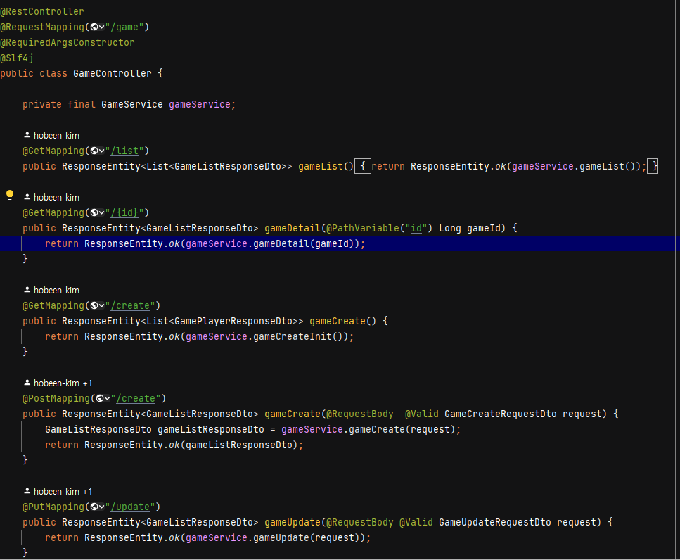
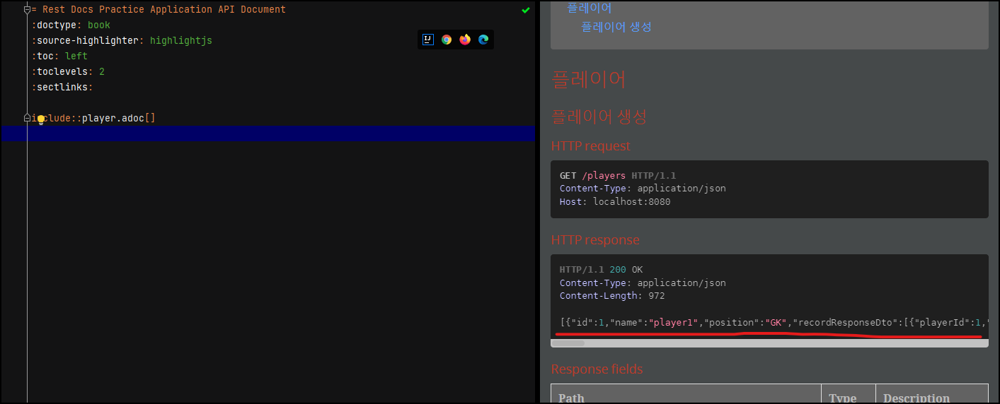
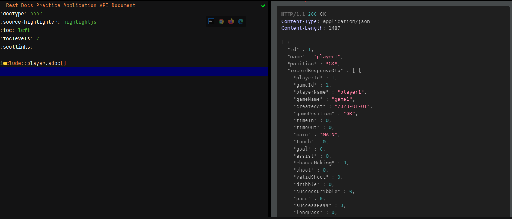
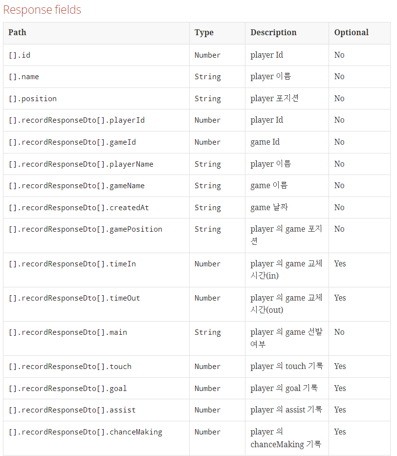

이번에는 토이 프로젝트의 API 의 RESTful 하지 못한 점을 RESTful 하게 바꾸는 과정을 포스팅했습니다. 그리고 변경 이후 RestDocs 까지 적용해봤습니다.

이론적인 부분은 제 블로그의 아래 포스팅에서 확인할 수 있습니다.

[[spring\] springrestdocs 를 활용한 restful api 확인](https://hobeen-kim.github.io/til-spring/Spring-SpringRestDocs-를-활용한-RESTful-API-확인/)
[[web\] restapi](https://hobeen-kim.github.io/web/WEB-RESTAPI/)
*근데 왜 제목을 대문자로 적어도 소문자로 변환될까요... 사소한 문제라 찾을 여력이 없네요 ㅎㅎ*

# RESTful 하게 변경

일단 변경해야 할 부분을 찾아보겠습니다. 아래가 game 을 CRUD 하는 컨트롤러입니다.



네 매우 문제가 큽니다. 너무 부끄럽네요 .. 이건 기초 중에 기초인데 말이죠.

일단 크게 3가지 문제점이 있는데요. 동사를 사용한다는 점(create, update), 제공하는 데이터타입이 단수형이라는 점(game), 행위를 포함한다는 점(delete)입니다.

나머지 authController, memberController, playerController 도 비슷했습니다. 그래서 GameController 와 AuthController 만 살펴보겠습니다.

**GameController**

| Method | Before                   | Description                         | Method | Refactoring                    |
| ------ | ------------------------ | ----------------------------------- | ------ | ------------------------------ |
| GET    | /game/list               | game 리스트를 모두 조회             |        | /games                         |
| GET    | /game/{id}               | id 로 game 조회                     |        | /games/{id}                    |
| GET    | /game/create             | game 을 생성하기 위한 초기정보 조회 |        | 삭제                           |
| POST   | /game/create             | game 생성                           |        | /games                         |
| PUT    | /game/update             | game 내용 수정                      |        | /games/{id}                    |
| DELETE | /game/delete/?id={id}    | game 삭제                           |        | /games/{id}                    |
| POST   | /game/addPlayer          | game 내 player 정보 추가            |        | /games/{id}/players            |
| POST   | /game/updatePlayer       | game 내 player 정보 수정            | PUT    | /games/{id}/players/{PlayerId} |
| DELETE | /game/deletePlayer       | game 내 player 정보 삭제            |        | /games/{id}/players/{PlayerId} |
| GET    | /game/gameField/?id={id} | id 로 조회한 game 의 gameField      |        | /games/{id}/gameField          |
| POST   | /game/gameField          | game 의 gameField  생성(수정)       |        | /games/{id}/gameField          |

- game 생성 시 해당 유저가 가진 모든 players 를 넘겨야 하는데요. 해당 값이 PlayerController 에서 그대로 제공한다는 걸 찾았습니다. 중복된 API 였던거죠. 만약 해당 API 가 없었다면 `GET: /games/init` 으로 설정했을 겁니다.
- gameField 는 game 당 1개만 있으므로 그냥 단수형으로 사용했습니다.

**AuthController**

| Method | Before        | Description       | Method | Refactoring |
| ------ | ------------- | ----------------- | ------ | ----------- |
| POST   | /auth/signup  | 회원 가입         |        |             |
| POST   | /auth/login   | 로그인            |        |             |
| GET    | /refreshToken | refreshToken 발급 |        | /refresh    |

- 크게 바뀌는 건 없습니다. 로그인, 회원가입 등은 login, signup 등으로 정해져있고, 데이터를 조회하기보다는 인증절차니까요. 
- refreshToken 은 refresh 로 변경했습니다.

이런 방법으로 모든 컨트롤러를 변경합니다.

# 문서화

위에 링크 걸어둔 내용은 생략하고 적겠습니다. 간략하게 `POST: /players` 로 새로운 player 를 생성하는 것만 해보겠습니다.

## PlayerControllerTest

```java
@ExtendWith({RestDocumentationExtension.class, SpringExtension.class})
@SpringBootTest
class PlayerControllerTest {

    private MockMvc mockMvc;

    @BeforeEach
    public void setUp(WebApplicationContext webApplicationContext,
                      RestDocumentationContextProvider restDocumentation) {

        this.mockMvc = MockMvcBuilders.webAppContextSetup(webApplicationContext)
                .apply(documentationConfiguration(restDocumentation)
                .build();
    }

    @MockBean
    private PlayerService playerService;

    @Test
    void create() throws Exception {

        List<RecordResponseDto> recordResponseDtos1 = Lists.newArrayList(
                new RecordResponseDto(1L, 1L, "player1", "game1", LocalDate.parse("2023-01-01"), Position.GK, 0, 0, Main.MAIN, 0, 0, 0, 0, 0, 0, 0, 0, 0, 0, 0, 0, 0, 0, 0, 0, 0, 0, 0)
        );

        List<RecordResponseDto> recordResponseDtos2 = Lists.newArrayList(
                new RecordResponseDto(2L, 1L, "player2", "game1", LocalDate.parse("2023-01-01"), Position.RCB, 0, 0, Main.MAIN, 0, 0, 0, 0, 0, 0, 0, 0, 0, 0, 0, 0, 0, 0, 0, 0, 0, 0, 0)
                );

        List<PlayerResponseDto> playerResponseDtos = Lists.newArrayList(
                new PlayerResponseDto(1L, "player1", Position.GK, recordResponseDtos1),
                new PlayerResponseDto(2L, "player2", Position.CB, recordResponseDtos2)
        );

        when(playerService.playerList()).thenReturn(playerResponseDtos);

        ObjectMapper objectMapper = new ObjectMapper();
        //LocalDate 를 읽지 못해서 넣어줬습니다.
        objectMapper.registerModule(new JavaTimeModule());
        objectMapper.configure(SerializationFeature.WRITE_DATES_AS_TIMESTAMPS, false);

        String expectedJson = objectMapper.writeValueAsString(playerResponseDtos);


        this.mockMvc.perform(get("/players")
                        .contentType(MediaType.APPLICATION_JSON))
                .andExpect(status().isOk())
                .andExpect(content().json(expectedJson))
                .andDo(document("player-create",
                        responseFields(
                                fieldWithPath("[].id").description("player Id"),
                                fieldWithPath("[].name").description("player 이름"),
                                fieldWithPath("[].position").description("player 포지션"),
                                fieldWithPath("[].recordResponseDto[].playerId").description("player Id"),
                                fieldWithPath("[].recordResponseDto[].gameId").description("game Id"),
                                fieldWithPath("[].recordResponseDto[].playerName").description("player 이름"),
                                fieldWithPath("[].recordResponseDto[].gameName").description("game 이름"),
                                fieldWithPath("[].recordResponseDto[].createdAt").description("game 날짜"),
                                fieldWithPath("[].recordResponseDto[].gamePosition").description("player 의 game 포지션"),
                                fieldWithPath("[].recordResponseDto[].timeIn").description("player 의 game 교체 시간(in)"),
                                fieldWithPath("[].recordResponseDto[].timeOut").description("player 의 game 교체 시간(out)"),
                                fieldWithPath("[].recordResponseDto[].main").description("player 의 game 선발 여부"),
                                fieldWithPath("[].recordResponseDto[].touch").description("player 의 touch 기록"),
                                fieldWithPath("[].recordResponseDto[].goal").description("player 의 goal 기록"),
                                fieldWithPath("[].recordResponseDto[].assist").description("player 의 assist 기록"),
                                fieldWithPath("[].recordResponseDto[].chanceMaking").description("player 의 chanceMaking 기록"),
                                fieldWithPath("[].recordResponseDto[].shoot").description("player 의 shoot 기록"),
                                fieldWithPath("[].recordResponseDto[].validShoot").description("player 의 validShoot 기록"),
                                fieldWithPath("[].recordResponseDto[].dribble").description("player 의 dribble 기록"),
                                fieldWithPath("[].recordResponseDto[].successDribble").description("player 의 successDribble 기록"),
                                fieldWithPath("[].recordResponseDto[].pass").description("player 의 pass 기록"),
                                fieldWithPath("[].recordResponseDto[].successPass").description("player 의 successPass 기록"),
                                fieldWithPath("[].recordResponseDto[].longPass").description("player 의 longPass 기록"),
                                fieldWithPath("[].recordResponseDto[].successLongPass").description("player 의 successLongPass 기록"),
                                fieldWithPath("[].recordResponseDto[].crossPass").description("player 의 crossPass 기록"),
                                fieldWithPath("[].recordResponseDto[].successCrossPass").description("player 의 successCrossPass 기록"),
                                fieldWithPath("[].recordResponseDto[].tackle").description("player 의 tackle 기록"),
                                fieldWithPath("[].recordResponseDto[].intercept").description("player 의 intercept 기록"),
                                fieldWithPath("[].recordResponseDto[].contention").description("player 의 contention 기록"),
                                fieldWithPath("[].recordResponseDto[].successContention").description("player 의 successContention 기록"),
                                fieldWithPath("[].recordResponseDto[].turnover").description("player 의 turnover 기록")

                        )
                ));
    }


}
```

Test Case 작성도 힘드네요. 일단 이렇게 하고 src 에 docs 파일을 작성합니다.

## *.adoc

**index.adoc**

```
= Rest Docs Practice Application API Document
:doctype: book
:source-highlighter: highlightjs
:toc: left
:toclevels: 2
:sectlinks:

include::player.adoc[]
```

**player.adoc**

```
== 플레이어

=== 플레이어 생성
operation::player-create[snippets='http-request,http-response,response-fields']

```

이렇게 했을 때 문제가 한가지 발생하는데요. 바로 JSON 이 정렬되지 않았다는 점입니다.



따라서 정렬하기 위해 test 코드에 다음과 같이 추가합니다.

```java
@BeforeEach
    public void setUp(WebApplicationContext webApplicationContext,
                      RestDocumentationContextProvider restDocumentation) {

        this.mockMvc = MockMvcBuilders.webAppContextSetup(webApplicationContext)
                .apply(documentationConfiguration(restDocumentation)
                        .operationPreprocessors()
                        .withResponseDefaults(prettyPrint())) // Enable pretty printing for JSON responses
                .build();
    }
```

다음과 같이 예쁘게 정렬되었습니다.



### 문서 custom 하기

지금 Response Fields 가 이렇게 되어있는데요. optional() 필드까지 추가해보겠습니다.  src/test/resources/org/springframework/restdocs/templates 경로에 request-fields.snippet 파일을 추가하면 됩니다. 문법은 mustache 입니다.

```java
|===
|Path|Type|Description|Optional

{{#fields}}
|{{#tableCellContent}}`+{{path}}+`{{/tableCellContent}}
|{{#tableCellContent}}`+{{type}}+`{{/tableCellContent}}
|{{#tableCellContent}}{{description}}{{/tableCellContent}}
|{{#tableCellContent}}{{^optional}}No{{/optional}}{{#optional}}Yes{{/optional}}{{/tableCellContent}}

{{/fields}}
|===
```

참고로 intellij 에서는 빨간줄이 뜨는데요. 무시하면 됩니다. 이제 다음과 같이 optional 필드가 추가된 걸 볼 수 있습니다.




이렇게 만든 Rest Docs 문서를 프론트에게 줍니다. 여기선 제가 저한테 줘야겠네요.. 따흐흑. REST API 창시자인 Roy Fielding 은 시스템을 완전히 통제할 수 있으면 RESTful 할 필요가 없다고 했었는데요. 개인 토이프로젝트가 그런 경우가 아닐까 싶습니다. 물론 공부한다는 차원에서 RESTful  하게 설계하는 게 맞지만요.

