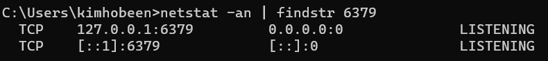
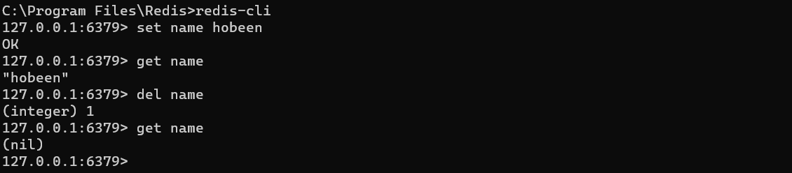
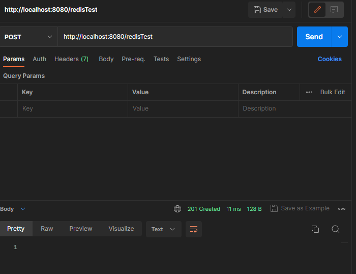
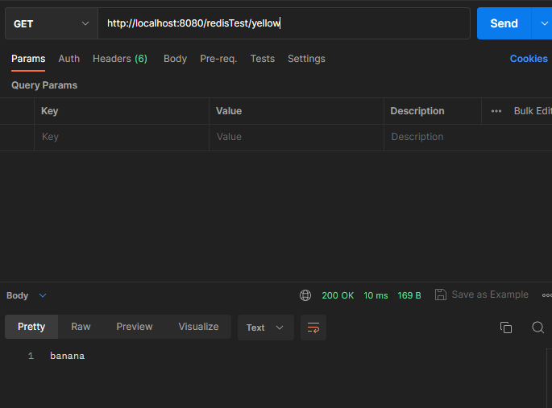
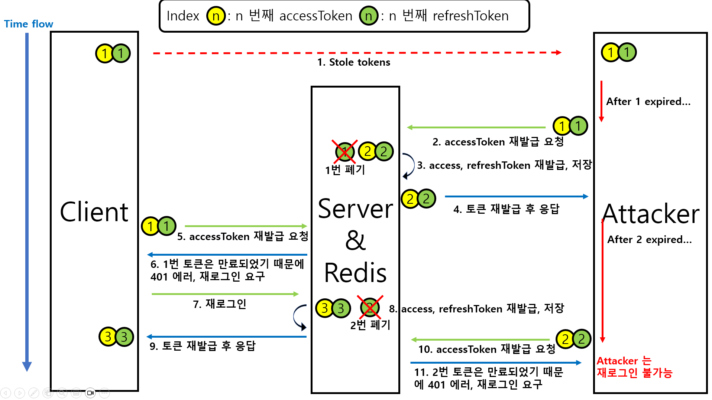

<div class="notice--danger">
    <b>
    refreshToken, RTR, Redis 모두 Spring 에 국한된 건 아니지만, Spring 에 적용할 것이기 때문에 'TIL-Spring' 카테고리로 분류하였습니다.
    </b>
</div>

# Redis

> Redis is an open source (BSD licensed), in-memory **data structure store** used as a database, cache, message broker, and streaming engine.
>
> [Retis Introduction](https://redis.io/docs/about/)

Redis 란 DB, cache, Message broker, streaming engine 을 제공하는 인메모리 데이터 저장소 입니다. 

## 인메모리

인메모리는 RAM 에 데이터를 올려서 사용하는 방법입니다. 메모리에 올리는 이유는 SSD, HDD 같은 저장공간에서 데이터를 읽는 것보다 속도가 빠르기 때문입니다.

하지만 속도가 빠른 대신 당연하게도 용량이 작다는 단점이 있습니다. 그리고 **Redis 는 key, value 형태**의 NOSQL 로 저장되며 다양한 데이터 구조를 지원하기는 하지만 복잡한 데이터를 저장하기는 어렵습니다. 

또한 인메모리이기 때문에 서버에 충돌이 발생하거나 다운되면 저장된 값이 사라지게 됩니다.

따라서 Redis 는 주로 보조적인 수단으로 사용되는 **캐시 DB 서버** 입니다. (Persistence x)

## 특징

- Redis는 List, Set, Sorted Set, Hash 등과 같은 Collection을 지원합니다.
  - List : redis Strings의 묶음 Collection
  - Set : 중복되지 않는 값을 데이터로 갖는 Colelction
  - Sorted Set : 가중치(Score)를 갖고 가중치(Score)에 따른 정렬된 순서로 중복되지 않는 값을 데이터로 가지는 Colelction
  - Hash : Key 하나에 여러개의 Field와 Value로 구성된 즉, Key 내부에 또 다른 Key - value로 이루어진 Collection
- Dump 파일과 AOF(Append Of File) 방식으로 메모리 상의 데이터를 디스크에 저장할 수 있습니다.
- Master/Slave Replication 기능을 통해 데이터의 분산, 복제 기능을 제공하며 Query Off Loading 기능을 통해 Master는 Read/Write를 수행하고 Slave는 Read만 수행할 수 있습니다.
- 파티셔닝(Partitioning)을 통해 동적인 스케일 아웃(Scale Out)인 수평 확장이 가능합니다.
- Expiration 기능은 일정 시간이 지났을 때 메모리 상의 데이터를 자동 삭제할 수 있습니다.
- Redis는 Single Thread -> Atomic 보장

## Redis 사용

원도우용 Redis 는 여기서 다운로드 받습니다. [윈도우용 Redis 다운로드](https://github.com/microsoftarchive/redis/releases)

Redis 의 기본포트는 6379 입니다. 다운로드 이후 가동상태를 확인하려면 cmd 에서 다음과 같은 명령어를 입력해줍니다.

`netstat -an | findstr 6379`



잘 가동중임을 알 수 있습니다. 재부팅을 하면 자동으로 서비스로 등록이 되어 있고 실행이 되어서 따로 시작을 안해줘도 됩니다. 따로 시작을 하려면 Redis 폴더에서 `redis-server.exe` 를 실행하면 됩니다.

### CLI 환경에서 저장

redis 폴더에서 `redis-cli` 로 redis 를 실행시킵니다.

- key, value 저장 : `set name hobeen` 으로 저장합니다.
- value 조회 : `get name` 으로 값을 조회합니다.
- key, value 삭제 : `del name` 으로 값을 삭제합니다.



### SpringBoot 연동

1. **의존성**을 추가합니다. (build.gradle)

```
	implementation 'org.springframework.boot:spring-boot-starter-data-redis-reactive'
	implementation 'org.springframework.boot:spring-boot-starter-web'
```


2. **application.yml** 에 Redis 를 연결하기 위한 값을 넣습니다.

```yaml
spring:
  redis:
    lettuce:
      pool:
        max-active: 10
        max-idle: 10
        min-idle: 2
    port: 6379
    host: 127.0.0.1
    password:
```

해당 값들의 의미는 다음과 같습니다.

| **변수**                     | **기본값**                        | **설명**                                                     |
| ---------------------------- | --------------------------------- | ------------------------------------------------------------ |
| spring.redis.database        | 0                                 | 커넥션 팩토리에 사용되는 데이터베이스 인덱스                 |
| spring.redis.host            | localhost                         | 레디스 서버 호스트                                           |
| spring.redis.password        | 레디스 서버 로그인 패스워드       |                                                              |
| spring.redis.pool.max-active | 8                                 | pool에 할당될 수 있는 커넥션 최대수 (음수로 하면 무제한)     |
| spring.redis.pool.max-idle   | 8                                 | pool의 "idle" 커넥션 최대수 (음수로 하면 무제한)             |
| spring.redis.pool.max-wait   | -1                                | pool이 바닥났을 때 예외발생 전에 커넥션 할당 차단의 최대 시간 (단위: 밀리세컨드, 음수는 무제한 차단) |
| spring.redis.pool.min-idle   | 0                                 | 풀에서 관리하는 idle 커넥션의 최소 수 대상 (양수일 때만 유효) |
| spring.redis.port            | 6379                              | 레디스 서버 포트                                             |
| spring.redis.sentinel.master | 레디스 서버 이름                  |                                                              |
| spring.redis.sentinel.nodes  | 호스트:포트 쌍 목록 (콤마로 구분) |                                                              |
| spring.redis.timeout         | 0                                 | 커넥션 타임아웃 (단위: 밀리세컨드)                           |

3. **RedisConfig** 를 설정합니다.

```java
@Configuration
public class RedisConfig {
 
    @Value("${spring.redis.host}")
    private String redisHost;
	
    @Value("${spring.redis.port}")
    private String redisPort;
	
    @Value("${spring.redis.password}")
    private String redisPassword;
	
    @Bean
    public RedisConnectionFactory redisConnectionFactory() {
        RedisStandaloneConfiguration redisStandaloneConfiguration = new RedisStandaloneConfiguration();
        redisStandaloneConfiguration.setHostName(redisHost);
        redisStandaloneConfiguration.setPort(Integer.parseInt(redisPort));
        redisStandaloneConfiguration.setPassword(redisPassword);
        LettuceConnectionFactory lettuceConnectionFactory = new LettuceConnectionFactory(redisStandaloneConfiguration);
        return lettuceConnectionFactory;
    }
 
    @Bean
    public RedisTemplate<String, Object> redisTemplate() {
        RedisTemplate<String, Object> redisTemplate = new RedisTemplate<>();
        redisTemplate.setConnectionFactory(redisConnectionFactory());
        redisTemplate.setKeySerializer(new StringRedisSerializer());
        redisTemplate.setValueSerializer(new StringRedisSerializer());
        return redisTemplate;
    }
}
```

- Redis 에 연결하기 위한 `RedisConnectionFactory` 와 `RedisTemplate` 입니다. redisTemplate 을 이용하여 Redis 를 사용합니다.

4. **RedisController**

```java
package redis.hello.controller;

import lombok.RequiredArgsConstructor;
import org.springframework.data.redis.core.RedisTemplate;
import org.springframework.data.redis.core.ValueOperations;
import org.springframework.http.HttpStatus;
import org.springframework.http.ResponseEntity;
import org.springframework.web.bind.annotation.GetMapping;
import org.springframework.web.bind.annotation.PathVariable;
import org.springframework.web.bind.annotation.PostMapping;
import org.springframework.web.bind.annotation.RestController;

@RestController
@RequiredArgsConstructor
public class RedisController {

    private final RedisTemplate<String, String> redisTemplate;

    @GetMapping("/")
    public String hello() {
        return "Hello Redis";
    }

    @PostMapping("/redisTest")
    public ResponseEntity<?> addRedisKey() {
        ValueOperations<String, String> vop = redisTemplate.opsForValue();
        vop.set("yellow", "banana");
        vop.set("red", "apple");
        vop.set("green", "watermelon");
        return new ResponseEntity<>(HttpStatus.CREATED);
    }

    @GetMapping("/redisTest/{key}")
    public ResponseEntity<?> getRedisKey(@PathVariable String key) {
        ValueOperations<String, String> vop = redisTemplate.opsForValue();
        String value = vop.get(key);
        return new ResponseEntity<>(value, HttpStatus.OK);
    }
}

```

- `redisTemplate` 를 주입받습니다.
- `redisTemplate.opsForValue();` 으로 Redis 와 연결하여 key, value 를 넣고 꺼냅니다.

5. **Postman** 으로 확인해보겠습니다.

   - POST `http://localhost:8080/redisTest` : 201 응답이 잘 옵니다. Redis 에 잘 저장되었습니다.

   

   - GET `http://localhost:8080/redisTest/yellow` : key 값인 `yellow` 를 넣었을 때 value 값인 `banana` 가 잘 출력됩니다.

   


이를 활용해서 socceranalyst 프로젝트에 Redis 를 적용해보겠습니다.


## RefreshToken 과 Redis

갑자기 Redis 를 언급한 이유는 **RTR** 적용을 위해서 refreshToken 을 Redis 에 저장하기 위함입니다. 다음에 언급할 주제이기도 한 RTR 은 Refresh Token Rotation 의 약자로, refreshToken 을 일회용으로 사용하고 폐기하는 정책입니다.

따라서 해당 refreshToken 을 유효한지 검증하고 처리하는 과정을 빠르게 하기 위해 Redis 를 사용하여 저장하고, 재발급 요청 시 DB 에 있는 refreshToken 인지 확인한 후에 재발급을 하게 됩니다.

# RTR (Refresh Token Rotation)

JWT Token 은 보통 accessToken 과 refreshToken 으로 나눠 사용합니다. accessToken 은 인증 및 인가 권한을 가지며 만료시간이 짧습니다. refreshToken 은 만료기간이 길지만, accessToken 을 재발급하는 데만 사용됩니다.

## RefreshToken 의 보안성 문제

하지만 이러한 Token 의 이원화에도 몇 가지 문제점이 있는데, 그 중 하나가 refreshToken 이 탈취당했을 때입니다. refreshToken 은 보통 2주의 만료기간을 가지니, 그 동안 attacker 는 계속해서 accessToken 을 발급받을 수 있습니다. Token 은 클라이언트의 상태를 보존하지 않는 stateless 상태이기 때문입니다.

## RTR 동작 flow

RTR 정책이 동작하는 방식입니다.


1. client 는 ID, PW 로 로그인을 요청합니다.
2. 서버는 `TokenProvider` 로 accessToken, refreshToken 을 발급합니다.
3. refreshToken 은 사용자의 ID 등 식별할 수 있는 값으로 key 를 정하여 Redis 에 저장합니다.
4. client 에게 accessToken, refreshToken 을 응답합니다.
5. server 가 client 에서 만료된 accessToken 을 받으면,
6. client 에게 401 에러를 반환합니다.
7. client 는 accessToken 이 만료되었음을 확인하고 refreshToken 을 전송합니다.
8. server 는 accessToken 에서 userID 를 key 로 하여 Redis 에서 refreshToken 을 조회합니다.
9. Redis 는 refreshToken 을 반환하고, server 는 이 값을 대조합니다.
10. 해당 값이 맞으면 accessToken, refreshToken 을 재발급 하고 refreshToken 은 다시 Redis 에 저장합니다.
11. 새로운 accessToken, refreshToken 을 client 에게 반환합니다.

## Attacker 에게 토큰을 탈취당할 경우



1. 1번 accessToken, refreshToken 을 Attacker 에게 탈취당합니다.
2. 1번 accessToken 만료 시 Attacker 는 재발급 요청을 합니다. 
3. 서버는 해당 토큰이 정상적이므로 Token 을 재발급하고 2번 refreshToken 은 Redis 에 저장합니다.
4. 이후 재발급된 2번 accessToken, refreshToken 을 Attacker 에게 반환합니다.
5. Client 측도 accessToken 만료 시 1번 refreshToken 으로 server 에게 재발급 요청을 합니다. 
6. 이 때 Redis 에 저장된 refreshToken 은 2번이므로 1번 refreshToken 은 유효하지 않습니다. 따라서 server 는 client 에게 재로그인 요구를 합니다.
7. client 는 재로그인을 실시합니다.
8. server 는 로그인 시 새로운 accessToken, refreshToken 를 발급하므로, 3번 accessToken, refreshToken 을 발급하고 3번 refreshToken 은 Redis 저장합니다.
9. 이후 재발급된 3번 accessToken, refreshToken 을 client 에게 반환합니다.
10. 2번 accessToken 이 만료되었을 때 Attacker 는 다시 2번 refreshToken 으로 accessToken 재발급을 요청합니다.
11. server 는 Redis 조회 결과 2번 refreshToken 은 만료된 상태이므로 Attacker 에게 재로그인을 요구합니다.
12. Attacker 는 client 의 ID, PW 를 알 수 없으므로 재로그인에 실패하게 됩니다.

## 문제점

1. 이러한 방법은 JWT의 Stateless 방식에 어긋나는 행동입니다. Redis 에 refreshToken 을 저장함으로써 서버가 클라이언트의 상태를 보존하고 있기 때문입니다.
2. Attacker 에게 accessToken, refreshToken 이 함께 탈취당했을 때 accessToken 이 만료되기 전까지 Attacker 는 사용자 정보에 접근할 수 있습니다. 이 점은 접속 IP 확인 등을 통해서 해결할 수도 있습니다.

***<u>보안에서 모든 상황을 만족할 수 없습니다. 적절한 Trade-off 가 필요합니다.</u>***

# 마치며

Redis, RTR 의 개념적인 부분만 개략적으로 알아봤습니다. 다음 포스팅은 [socceranalyst] 카테고리에서 직접 적용하는 걸 해보겠습니다.

1. Redis 연동
2. RefreshToken 저장 및 조회 구현
3. Access Token 만료 시에만 새로운 Token을 발급 받을 수 있도록 구현. 그전에 발급받으려고 하면 Access, Refresh Token을 모두 폐기
   - Attacker 가 Refresh Token을 사용하여 일찍 Access Token을 발급받으려는 상황 방지

*+추가 : [RTR 구현 코드 포스팅 링크입니다.](https://hobeen-kim.github.io/socceranalyst/socceranalyst-RTR-%EA%B8%B0%EC%88%A0-%EC%A0%81%EC%9A%A9/)*

# Ref.

[Springboot + Redis 연동하는 초간단 샘플 만들어보기](https://oingdaddy.tistory.com/239)

[인메모리 데이터 저장소 Redis, 왜 사용할까? #Redis 파헤치기](https://zangzangs.tistory.com/72)

[Spring - Redis 연동하기](https://backtony.github.io/spring/redis/2021-08-29-spring-redis-1/)

