# Proxy

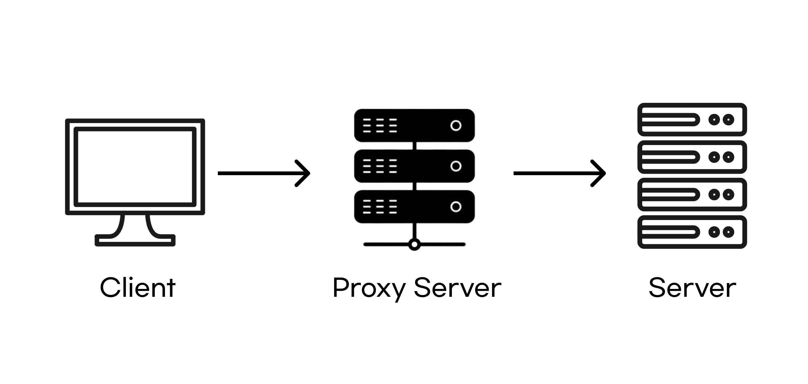

​	프록시란 "대리" 의 의미를 가지며 네트워크에서 클라이언트가 프록시를 통해서 다른 네트워크 서비스에 간접적으로 접속할 수 있게 해 주는 컴퓨터 시스템이나 응용 프로그램을 가리킵니다.

​	이 때 서버는 **접속한 클라이언트가 실제 클라이언트인지 프록시 서버인지 알 수 없습니다.**


## Spring 에서 Proxy 기술

​	프록시는 네트워크에서만 사용되는 용어가 아닙니다. 소프트웨어 개발에서도 프록시 기술을 사용할 수 있습니다. 이 때 등장하는 용어가 **프록시 패턴**입니다.

## 프록시 패턴


​	프록시 패턴은 이름에서도 알 수 있듯이, 네트워크의 "프록시" 모양을 그대로 가져온 패턴입니다. 원래 클라이언트가 바로 서버로 접근했다면, **중간에 프록시를 끼워서 클라이언트는 프록시를 사용하게 됩니다.** 이를 위해서는 **서버와 프록시가 같은 인터페이스를 사용**해야 합니다.


​	Client 는 ServerInterface 를 주입받아서 사용하게 되고, 이 인터페이스를 구현하는 구현체는 Server 가 되든, Proxy 가 되든 상관없습니다. 따라서 **Client 입장에서는 Server 를 사용하는 것처럼 구현되지만 실제로는 Proxy 를 사용**하는 겁니다.

# AOP

​	AOP란 **공통 관심 사항과 핵심 관심 사항을 분리시켜 코드의 중복을 제거하고, 코드의 재사용성을 높이는 프로그래밍 방법론**을 말합니다.

​	예를 들어 아래와 같은 클래스가 있다고 하겠습니다. A, B 클래스는 C 인터페이스를 구현합니다.


​	이 때 유지보수 차원에서 각 메서드의 실행시간을 시간을 측정하는 로직과 메서드 실행 시 이메일을 보내는 로직을 넣는다고 해보겠습니다. 아래 그림과 같이 되겠죠.

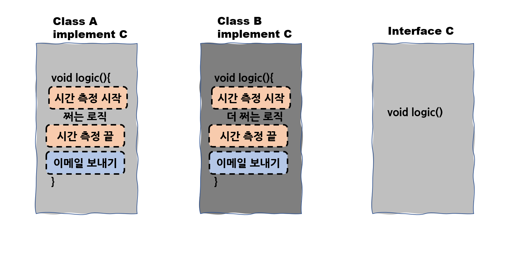

​	그런데 PM 으로부터 "이메일은 확인이 힘드니 문자로 바꾸고, 시간을 측정하고 로그를 TRACE 로 남겨라" 라는 얘기를 들었습니다. 그러면 두 클래스 모두의 로직을 아래와 같이 바꿔야 합니다.

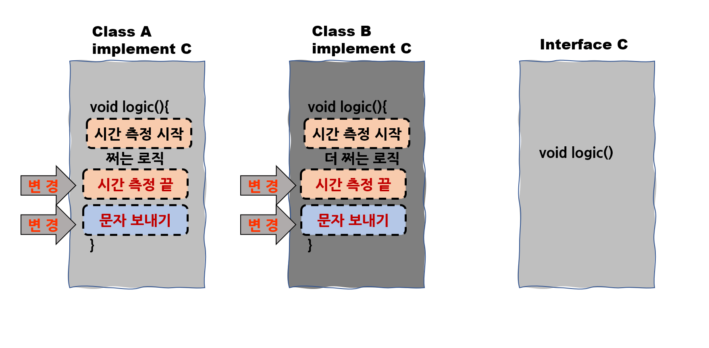

​	만약 클래스가 수백 개면 이러한 간단한 로직을 고치느라 하루, 이틀을 사용해야 합니다. 하지만 이러한 로직이 소프트웨어의 핵심 로직일까요? 아닙니다. 시간을 측정해서 로그를 남기거나 이메일을 보내는 등의 로직은 **공통적으로 처리되는 공통 관심 사항**입니다. 우리는 이렇게 공통적으로 반복되는 관심 사항을 밖으로 꺼내서 따로 만들고 싶은 욕구가 생깁니다.

​	AOP 를 모른다면 다음과 같이 상속으로 관리할 수도 있습니다.

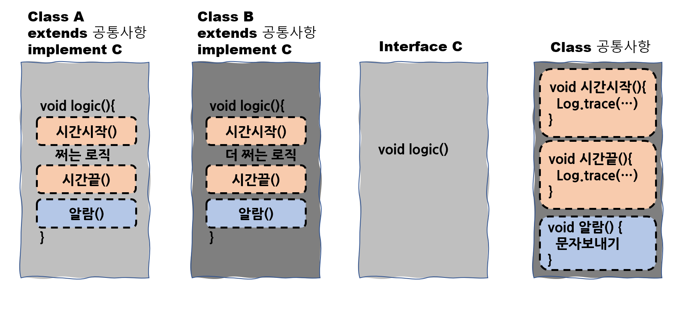

​	하지만 자바는 **다중 상속을 허용하지 않게 때문에 다양한 모듈에 다양한 공통 기능을 부여하기가 어렵고**, **공통 관심 사항과 핵심 로직이 분리가 안된다는 문제점**이 있습니다.

​	그래서 등장한 것이 AOP 입니다. 아래 처럼 공통 관심 사항을 별도로 분리하고 위임하는 방식입니다. Class 공통사항은 C 인터페이스를 구현하는 모든 클래스의 logic 을 위임받아 실행합니다.

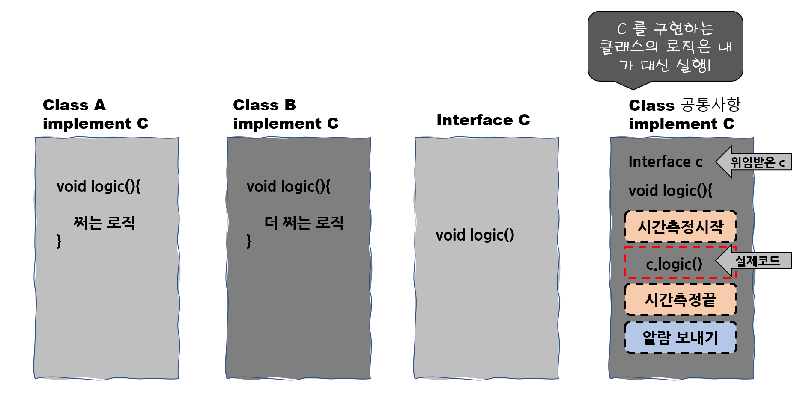

​	이제 앞에서 봤던 프록시를 생각하면서 아래 그림을 보겠습니다.

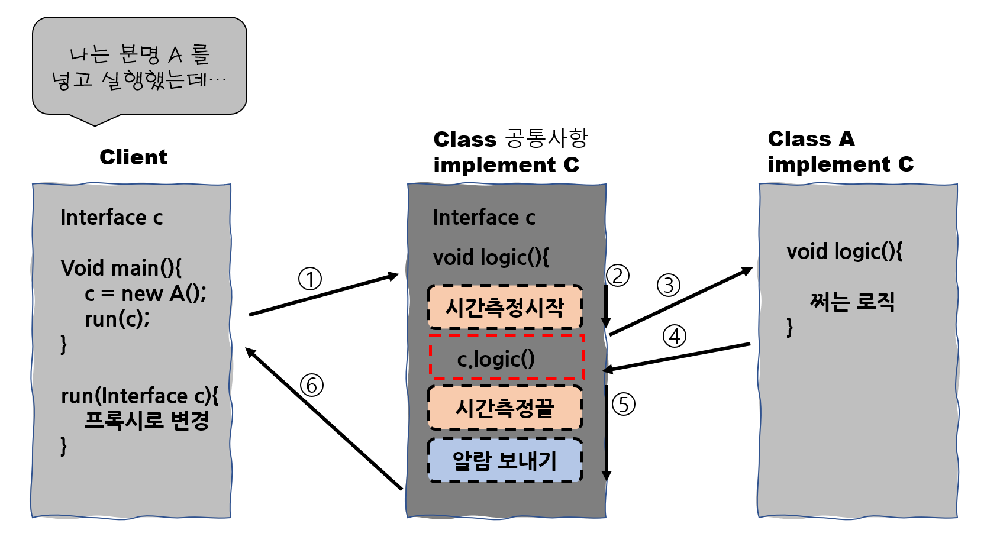

​	Client 입장에서는 클래스 A 를 호출해서 run() 메서드를 돌렸는데 프록시 객체가 실행되고, 프록시 객체 안에서 다시 A 의 logic() 메서드가 실행됩니다. 개략적으로 표현한 것이니까 ''아~ 이런 흐름이구나" 정도로만 이해하시면 됩니다. 이 그림이 위에서 봤던 프록시 그림과 똑같이 생겼죠. 따라서 이러한 패턴을 프록시 패턴이라고 부릅니다.

​	아래 그림을 보면 좀 더 이해가 될 겁니다.

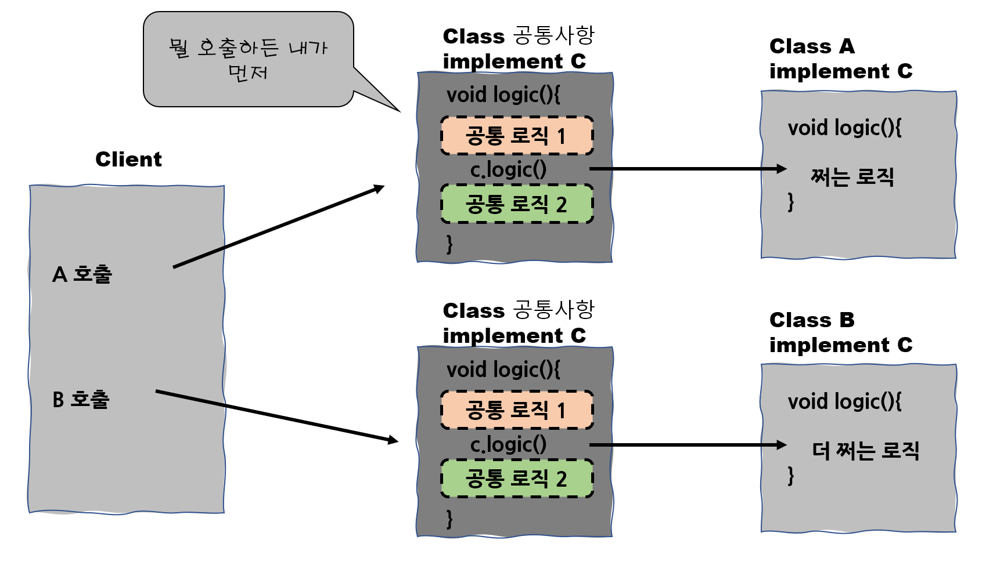

# 스프링 AOP

​	그렇다면 스프링에서는 프록시와 AOP 가 어떻게 구현될까요? @Aspect 어노테이션으로 AOP 를 어느정도 구현해보신 분들은 "나는 Class A 를 빈동록했는데 사용되는 건 왜 A 의 프록시 객체일까?" 라는 의문이 생길 수도 있습니다. 이제 스프링에서 AOP 를 어떻게 구현하는지 알아보겠습니다.

​	스프링은 등록되는 모든 빈에 대해서 빈 후처리기를 통해 프록시 객체를 생성할지 말지 결정합니다. 아래 그림을 보겠습니다.

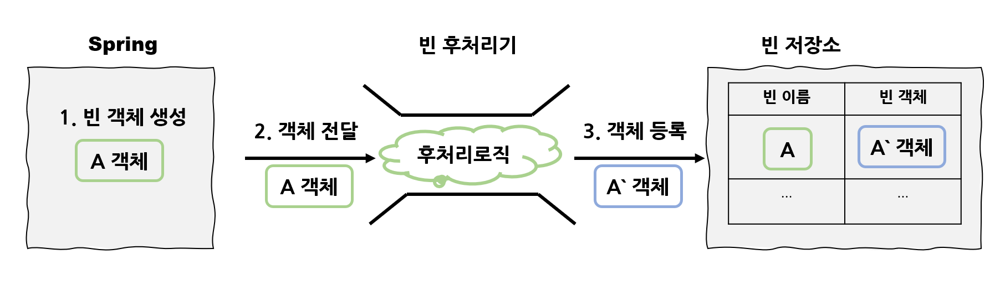

​	스프링에서는 빈 후처리기(BeanPostProcessor) 를 통해 `@Bean` 어노테이션이 붙은 빈 객체를 후처리합니다. 이 때 **객체를 조작할 수도 있고 완전히 다른 객체로 바꿔치기 하는 것도 가능**합니다. 즉 우리가 만든 빈 객체는 '어떤어떤' 과정을 거쳐서 프록시 객체가 되는 겁니다.

​	그럼 이러한 '어떤어떤' 과정이 일어나기 위해 먼저 정해줘야 하는건 뭘까요? 바로 **어떤 객체**에 **무슨 로직**을 적용할지입니다. 어때 **'어떤 객체'가 포인트컷(Pointcut) 을 의미하고 '무슨 로직'이 어드바이스(Advice)를 의미** 합니다.

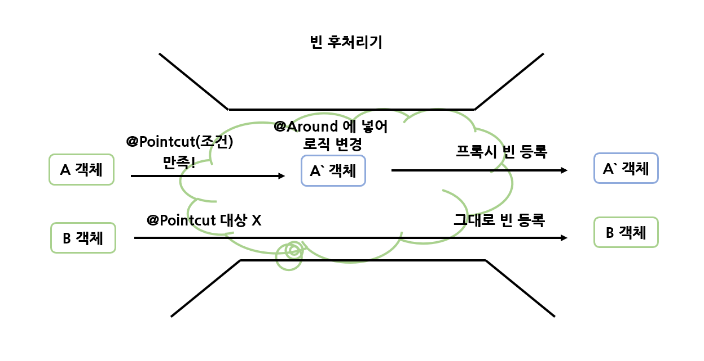

​	@Pointcut 에 해당하는 조건(어디 패키지에 있는 빈, 이름이 xxx 인 클래스, xxx 메서드 등) 에 만족하면 로직이 변경되어 프록시로 등록됩니다. 이때 어드바이스( = Around) 를 통해 로직이 변경됩니다.

​	이렇게 어드바이스와 포인트컷으로 구성되어 있는 것을 **어드바이저(Advisor)** 라고 합니다. 그리고 자주 사용하는 **@Aspect 어노테이션이 편리하게 포인트컷과 어드바이스로 구성되어 있는 어드바이저 생성 기능을 지원**합니다. 아래 코드를 보겠습니다.

```java
@Aspect
public class AspectC {

    @Pointcut("execution(* com.codestates.test..*(..))")
    private void targetMethod() {}

    @Around("targetMethod()")
    public Object measureTime(ProceedingJoinPoint joinPoint) throws Throwable {

        long start = System.nanoTime(); //시간 측정 시작

        try {
            Object result = joinPoint.proceed(); //로직 실행
            return result; //로직 반환
        } finally {
            long end = System.nanoTime(); //시간 측정 완료
            System.out.printf("실행 시간: %d ns", (end-start)); //측정된 시간 출력
        }
    }
}
```

하나하나 해석해보겠습니다. 

- ` @Pointcut("execution(* com.codestates.test..*(..))")` : "어디에 적용할지?" 입니다. com.codestates.test 를 포함하는 하위 클래스에 모두 적용합니다. 
- `@Around("targetMethod()")` : "무슨 로직을 적용할지?" 입니다. `targetMethod()` 를 대상으로 `measureTime` 이라는 메서드를 실행할 건데요. 시간을 측정하고, 로직을 실행 한 뒤 측정된 시간을 출력합니다. 이때 기존 객체가 가진 로직(메서드)  가 `ProceedingJoinPoint joinPoint` 입니다.

아래 그림처럼 되는 겁니다.

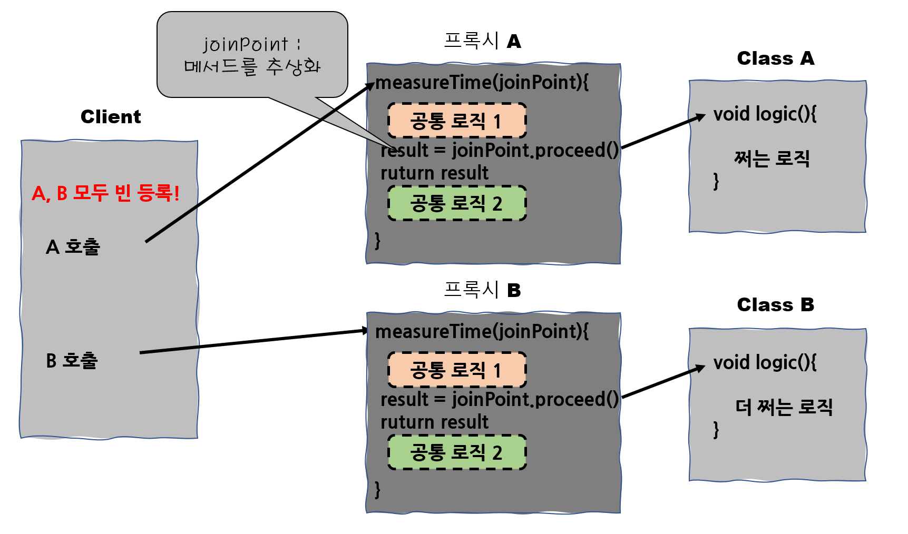

​	A, B 가 모두 빈에 등록되고, @Pointcut 에 만족하기 때문에 빈 후처리기에 의해 프록시 빈이 등록되었다고 하겠습니다. 그러면 A.logic 을 호출하면 자동으로 프록시 A 의 measureTime 이 호출되게 되고, 그 안에서 공통로직 처리가 일어난 뒤 A.logic 이 호출됩니다. 이 때 **measureTime 안에서는 반드시 return 값이 있어야 합니다.** 

​	여기서 JoinPoint 를 메서드를 추상화한 것이라고 했는데요. 정확히는 필드, 메서드 등 어드바이스가 적용될 수 있는 위치를 의미하며, **스프링 AOP 에서는 메서드 호출에 대한 JoinPoint** 만 제공합니다. 아래 그림처럼 실행 흐름이 진행된다고 보면 됩니다.

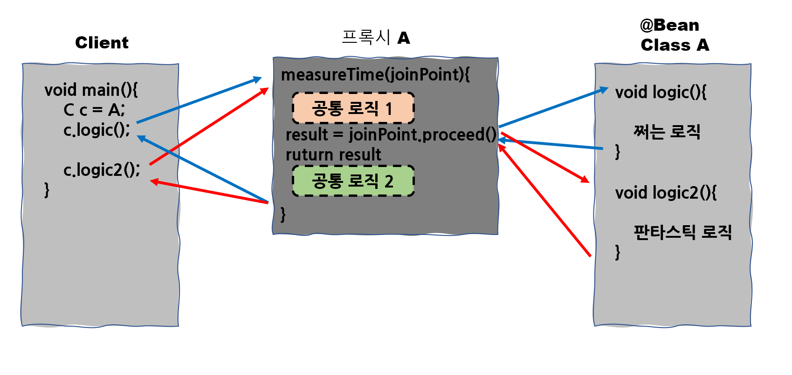

​	위 그림에서 A 는 logic() 과 logic2() 메서드를 가집니다. 해당 로직을 실행하면 실행시점에 프록시 A 에서 해당 메서드가 @Pointcut 조건에 만족하는지 확인하고 실행합니다.

​	아래는 지금까지 말했던 코드들입니다.

```java
public interface C { //공통 인터페이스
    void logic();
    void logic2();
}

public class A implements C { //Class A

    public void logic() {
        System.out.println("개쩌는 로직1");
    }

    public void logic2() {
        System.out.println("판타스틱 로직1");
    }

}

public class B implements C { //Class B
    public void logic() {
        System.out.println("개쩌는 로직2");
    }

    @Override
    public void logic2() {
        System.out.println("판타스틱 로직1");

    }
}

@Aspect
public class AspectC { //Aspect 클래스

    @Pointcut("execution(* com.codestates.test..*(..))")
    private void targetMethod() {}

    @Around("targetMethod()")
    public Object measureTime(ProceedingJoinPoint joinPoint) throws Throwable {

        long start = System.nanoTime();

        try {
            Object result = joinPoint.proceed();
            return result;
        } finally {
            long end = System.nanoTime();
            System.out.printf("실행 시간: %d ns", (end-start));
            System.out.println();
        }
    }
}

public class GugudanTest { //실행메서드

    public static void main(String[] args) {

        AnnotationConfigApplicationContext annotationConfigApplicationContext = new AnnotationConfigApplicationContext(GugudanConfig.class);

        Gugudan gugudan = annotationConfigApplicationContext.getBean("gugudan", Gugudan.class);
        System.out.println("gugudan.getClass() = " + gugudan.getClass());
        gugudan.calculate(2,1);

    }
}
```

​	여기서 빼먹은 게 있습니다. 바로 **Configuration** 파일입니다.

```java
package com.codestates.config;

@Configuration
@EnableAspectJAutoProxy
public class ConfigC {

    @Bean
    public C c() {
        return new A();
    }

    @Bean
    public AspectC aspectC() {
        return new AspectC();
    }
}
```

​	A 를 빈으로 등록했습니다. 그리고 AspectC 클래스도 빈으로 등록해야 합니다. **스프링은 빈으로 등록된 객체 중 어드바이저가 있는지 살펴보고 해당 어드바이저를 적용하기 때문입니다.** (참고 : 나중에 컨트롤러의 예외처리할 때 @ControllerAdvice 는 @Component 가 달려있습니다.) 

​	그리고 `@EnableAspectJAutoProxy` 을 통해 프록시 객체를 자동생성하도록 설정합니다. 아래 그림과 비슷하게 생각하면 됩니다.

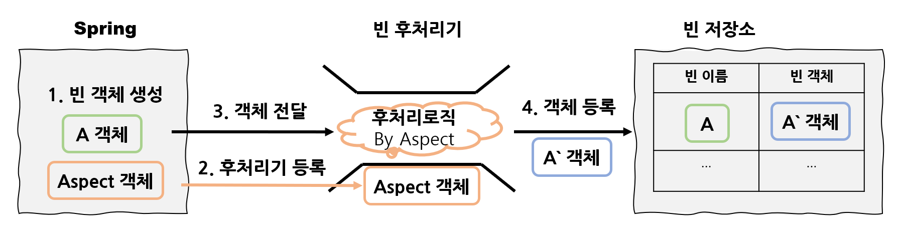

​	스프링은 @Aspect 어노테이션이 붙은 객체를 후처리기로 등록하고, 해당 객체는 후처리기로 동작합니다. 

​	이번엔 아래와 같이 @Aspect 클래스가 2개라고 생각해보겠습니다. 어떻게 동작할까요?

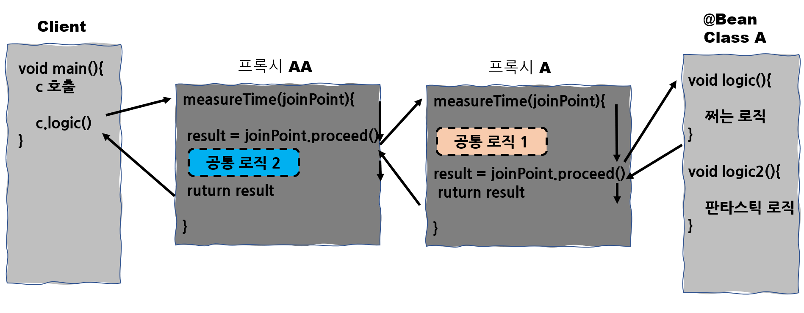

​	공통로직 1 -> logic() -> 공통로직2 순서대로 실행됩니다. 이 순서를 변경하기 위해서는 다음과 같이 `@Order(value=1)` 과 같은 어노테이션을 붙이면 됩니다.

```java
@Aspect
@Order(value = 1) // 추가 
public class AspectC {

    --- 생략 ---

}
```

