<div class="notice--danger">
    <b>이전 기본 내용입니다.</b><br/><a href="https://hobeen-kim.github.io/spring/Spring-Proxy-%EC%99%80-AOP/">[spring] proxy 와 aop</a>
</div>


*지금부터 소개할 내용은 나름 "심화" 과정이라고 생각하는데요. 심화는 다른 말로 "**몰라도 되지만 알면 좋은 것"** 이죠. 내용 흐름 자체는 김영한님의 inflearn 스프링 고급편 강의를 중심이고, 나름 클래스를 연구하면서 필요한 건 추가하고 했습니다.*

# 동적 프록시 기술

​	지금부터 자바의 Aspect 가 어떻게 구현되는지 한번 알아보겠습니다.

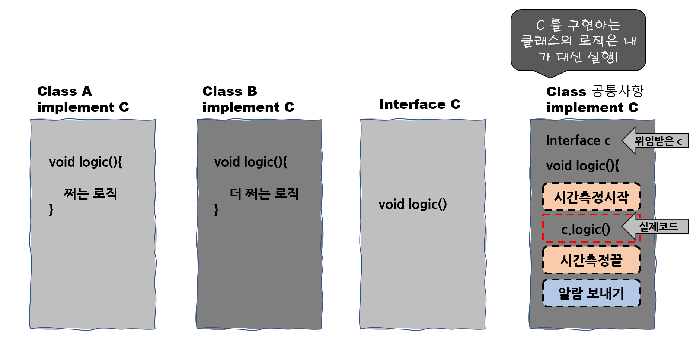

​	먼저, 이전 기본 내용에서 @Aspect 를 적용하기 전을 생각해보겠습니다. 위와 같은 코드입니다. 여기서 **문제는 대상 클래스 수 만큼의 프록시 클래스를 만들어야 한다는 것**입니다. 만약 Interface D 를 만들고 해당 인터페이스를 구현하는 구현체를 만든다면, 같은 공통 관심 사항이라도 또 프록시 객체를 만들어야겠죠. 이를 해결하기 위해 자바가 기본으로 제공하는 **JDK 동적 프록시 기술이나 CGLIB 같은 프록시 생성 오픈소스 기술을 활용하면 프록시 객체를 동적으로 만들어낼 수 있습니다.** 

## 리플렉션

​	동적 프록시 기술을 알기 전에 먼저 리플렉션(Reflection) 에 대해 알아야 합니다. 리플렉션은 클래스나 메서드의 메타정보를 사용해서 동적으로 호출하는 메서드를 변경할 수 있습니다.

​	아래는 리플렉션을 간단하게 구현한 코드입니다. 

```java
void reflection(){
    
    C target = new A();
    
    Class c = Class.forName("com.codestates.test.A"); //경로를 통해 클래스 정보를 얻음
    Method method = c.getMethod("logic"); //클래스 내부의 메서드 메타정보 획득
    method.invoke(target); //획득한 메타정보로 실제 인스턴스의 메서드를 호출
}
```

​	코드가 복잡한데요. 이런 리플렉션 기술은 왜 쓸까요? 바로 **애플리케이션을 동적으로 유연하게 만들 수 있기 때문**입니다. 아래 코드처럼 좀 더 "유연하게" 설계해보겠습니다.

```java
public class Reflection {
    
	//예외는 Exception 으로 간단하게 처리
    public void reflectionLogic(Method method, Object target) throws Exception { 

        System.out.println("공통로직 1");
        method.invoke(target);
        System.out.println("공통로직 2");
        System.out.println("==========");

    }
}
```

​	위 코드는 런타임 시점에서 method, target 등을 모두 주입받아서 사용하게 됩니다. 따라서 동적으로 변경할 수 있습니다. 그리고 `method.invoke(target);` 전에  공통로직1, 2 를 넣어줬습니다.

```java
public class TestMain {

    public static void main(String[] args) throws Exception {

        C c = new A();
        Reflection reflection = new Reflection();

        //A 클래스의 logic 메서드와 target c 를 넣어줘서 동적으로 실행
        reflection.reflectionLogic(c.getClass().getMethod("logic"), c);
        
		//A 클래스의 logic2 메서드와 target c 를 넣어줘서 동적으로 실행
        reflection.reflectionLogic(c.getClass().getMethod("logic2"), c);

    }
}

/* 결과
공통로직 1
개쩌는 로직1
공통로직 2
==========
공통로직 1
판타스틱 로직1
공통로직 2
==========
*/
```

​	결과는 위에 보이는 것처럼 각각의 로직마다 공통로직이 처리되었습니다. 이렇게 리플렉션을 잘 활용하면 하나의 클래스로 공통 관심 사항을 처리할 수 있습니다.

## JDK 동적 프록시

​	앞서 말한 문제점인, 프록시를 적용하기 위해 적용 대상의 숫자만큼의 프록시 클래스를 만드는 문제는 **동적 프록시 기술로 해결**할 수 있습니다. 이름 그대로 프록시 객체를 동적으로 런타임에 개발자 대신 만들어줍니다. 

​	JDK 동적 프록시는 인터페이스를 기반으로 프록시를 동적으로 만들어줍니다. 따라서 인터페이스가 필수입니다.

**JDK 동적 프록시 InvocationHandler**

​	JDK 동적 프록시에 적용할 로직은 InvocationHandler 인터페이스를 구현해서 작성하면 됩니다. 해당 인터페이스는 `invoke` 메서드를 가집니다.

```java
public interface InvocationHandler {

    public Object invoke(Object proxy, Method method, Object[] args) throws Throwable;
}

```

​	이제 이전 Relection 과 같이 공통 관심 사항을 처리하는 CInvocationHandler 클래스를 작성해보겠습니다.

```java
public class CInvocationHandler implements InvocationHandler {

    private final Object target;

    public CInvocationHandler(Object target) {
        this.target = target;
    }


    @Override
    public Object invoke(Object proxy, Method method, Object[] args) throws Throwable {
        System.out.println("공통로직 1");
        Object result = method.invoke(target);
        System.out.println("공통로직 2");
        System.out.println("==========");
        return result;
    }
}
```

​	Reflection 과 비슷하게 invoke 에는 실제 인스턴스인 `target`, 메서드 정보인 `method`, proxy 자기 자신인 `proxy` 가 있습니다. 또한 현재는 사용하지 않지만, 매개변수인 `args` 가 있습니다.

​	이제 아래의 메인 메서드를 실행시켜보겠습니다.

```java
public class TestMain {

    public static void main(String[] args) throws Exception {

        C c = new A(); //실제 인스턴스
        CInvocationHandler handler = new CInvocationHandler(c); //핸들러 호출
        
        C proxy = (C) Proxy.newProxyInstance(c.getClass().getClassLoader(), c.getClass().getInterfaces(), handler); //핸들러를 통해 프록시 객체 생성
        
        proxy.logic();


        System.out.println("c.getClass().getName() = " + c.getClass().getName());
        System.out.println("proxy.getClass().getName() = " + proxy.getClass().getName());

    }
}
/* 결과
공통로직 1
개쩌는 로직1
공통로직 2
==========
c.getClass().getName() = com.codestates.test.A
proxy.getClass().getName() = com.sun.proxy.$Proxy0
*/
```

​	결과를 보면 proxy 의 클래스는 `com.sun.proxy.$Proxy0` 임을 알 수 있습니다. 완전히 새로운 클래스인거죠. 하지만 똑같이 `logic()` 메서드를 가지고 있습니다. 왜냐하면 C 인터페이스를 참고하여 만들었기 때문입니다.

​	프록시는 `Proxy.newProxyInstance` 메서드로 만듭니다. 클래스 로더 정보, 인터페이스, 그리고 핸들러 로직을 넣어주면 됩니다. 그러면 해당 인터페이스를 기반으로 동적 프록시를 생성하고 그 결과를 반환합니다. 아래는 **개략적인 프록시 내부 모습입니다.** 이해를 돕기 위한 것으로, 실제 JVM이 생성하는 코드는 다를 수 있습니다. 

```java
public class $Proxy0 extends Proxy implements C {
    private static Method m1;
    private static Method m2;

    static {
        try {
            m1 = Class.forName("com.codestates.test.C").getMethod("logic");
            m2 = Class.forName("com.codestates.test.C").getMethod("logic2");
        } catch (NoSuchMethodException e) {
            throw new NoSuchMethodError(e.getMessage());
        } catch (ClassNotFoundException e) {
            throw new NoClassDefFoundError(e.getMessage());
        }
    }

    public $Proxy0(InvocationHandler h) {
        super(h);
    }

    public void logic() {
        try {
            super.h.invoke(this, m1, null); //logic() 실행 시 InvocationHandler.invoke 가 실행됩니다.
        } catch (Throwable throwable) {
            throw new UndeclaredThrowableException(throwable);
        }
    }

    public void logic2() {
        try {
            super.h.invoke(this, m2, null); //logic2() 실행 시 InvocationHandler.invoke 가 실행됩니다.
        } catch (Throwable throwable) {
            throw new UndeclaredThrowableException(throwable);
        }
    }
}
```

​	`$Proxy0` 클래스는 프록시 클래스의 이름을 나타내며, JVM에 의해 자동으로 생성됩니다. 이 클래스는 `Proxy` 클래스를 확장하고 `C` 인터페이스를 구현하며, 이 인터페이스의 각 메소드에 대해 호출 처리기를 사용하여 구현합니다.

​	프록시 클래스의 모든 메소드는 `super.h.invoke(this, method, args)`를 호출하여 실제 작업을 처리합니다. 여기서 `super.h`는 생성자에서 받은 `InvocationHandler`의 참조이며, `method`는 현재 메소드의 `Method` 객체이고, `args`는 메소드에 전달된 인자입니다.

​	따라서 아래 그림과 같이 로직 플로우가 형성됩니다.


​	이제 어떤 클래스를 만들든지 공통로직1, 공통로직 2 를 처리하는 사항은 CInvocationHandler 를 통해 처리하면 됩니다. 아래 그림과 같이 바뀐 겁니다.

**동적 프록시 도입 전 : 직접 프록시 생성**

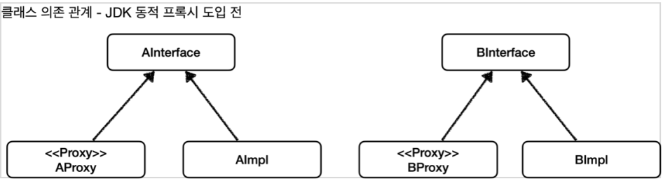

**동적 프록시 도입 후 : 핸들러 하나로 처리!**


## CGLIB

​	JDK 동적 프록시는 인터페이스가 필수입니다. 하지만 인터페이스가 없는 객체도 많이 있겠죠. 이런 경우에는 어떻게 동적 프록시를 적용해야 할까요? 이를 위해서 **CGLIB 라는 바이트코드를 조작하는 특별한 라이브러리를 사용해야 합니다.**

​	CGLIB는 원래는 외부 라이브러리인데, 스프링 프레임워크가 스프링 내부 소스 코드에 포함했습니다. 따라서 스프링을 사용한다면 별도의 외부 라이브러리를 추가하지 않아도 사용할 수 있습니다.

​	CGLIB 도 JDK Proxy 와 비슷하게 아래 **MethodInterceptor** 인터페이스를 구현해서 사용합니다.

```java
public interface MethodInterceptor extends Callback {
	Object intercept(Object obj, Method method, Object[] args, MethodProxy proxy) throws Throwable;
}
```

​	이제 CGLIB 를 사용해서 CMethodInterceptor 를 만들어보겠습니다.

```java
public class CMethodInterceptor implements MethodInterceptor {

    private final Object target;

    public CMethodInterceptor(Object target) {
        this.target = target;
    }


    @Override
    public Object intercept(Object obj, Method method, Object[] args, MethodProxy proxy) throws Throwable {

        System.out.println("공통로직 1");
        Object result = proxy.invoke(target, args);
        System.out.println("공통로직 2");
        return result;
    }
}
```

​	로직 자체는 JDK 동적 프록시와 같습니다. obj 는 CGLIB 가 적용된 객체이고, method 는 호출된 메서드, MethodProxy 는 추가적인 기능이 있는 메서드입니다. 이 때 ` proxy.invoke(target, args);` 에서 proxy 대신 method 를 사용해도 됩니다. 하지만 성능 상 이점으로 proxy.invoke 를 호출합니다.

> proxy.invoke() 성능 상 이점
>
> ​	 MethodProxy 객체는 invokeSuper 메소드를 통해 대상 객체의 원본 메소드를 호출할 수 있습니다. 이는 Method의 invoke 메소드와 유사하지만, invokeSuper는 프록시를 거치지 않고 직접 대상 클래스의 메소드를 호출합니다.
>
> ​	반면 Method.invoke() 는 Reflection을 사용합니다. 따라서 런타임에 클래스, 메서드, 필드 등에 접근할 수 있지만, 이는 성능 오버헤드를 초래합니다. Reflection 을 통한 메서드 호출은 직접 메서드를 호출하는 것보다 더 많은 시간과 리소스를 소비하기 때문입니다.

​	메인 메서드는 아래와 같습니다.

```java
package com.codestates.test;

import org.springframework.cglib.proxy.Enhancer;

import java.lang.reflect.Proxy;

public class TestMain {

    public static void main(String[] args) throws Exception {

        A target = new A();
        Enhancer enhancer = new Enhancer();
        enhancer.setSuperclass(A.class);
        enhancer.setCallback(new CMethodInterceptor(target));
        A proxy = (A) enhancer.create();

        proxy.logic();


        System.out.println("target.getClass().getName() = " + target.getClass().getName());
        System.out.println("proxy.getClass().getName() = " + proxy.getClass().getName());

    }
}

/* 결과
공통로직 1
개쩌는 로직1
공통로직 2
target.getClass().getName() = com.codestates.test.A
proxy.getClass().getName() = com.codestates.test.A$$EnhancerByCGLIB$$fd704818
*/
```

​	결과는 JDK 동적 프록시와 비슷하게 나옵니다. CGLIB 는 Enhancer 를 사용해서 프록시를 생성합니다. **`enhancer.setSuperclass` 를 통해 구체 클래스를 상속**받고, **`enhancer.setCallback` 으로 프록시에 적용할 실행 로직을 할당**합니다. 그리고 `enhencer.create()` 로 최종적으로 프록시가 생성되는데요. 앞서 설정한 구체 클래스를 상속 받아서 프록시가 만들어집니다. proxy 의 클래스명을 보면 A 뒤에 \$\$EnhancerByCGLIB$$fd704818 라고 붙어있습니다.

​	객체 의존 관계는 아래와 같습니다.

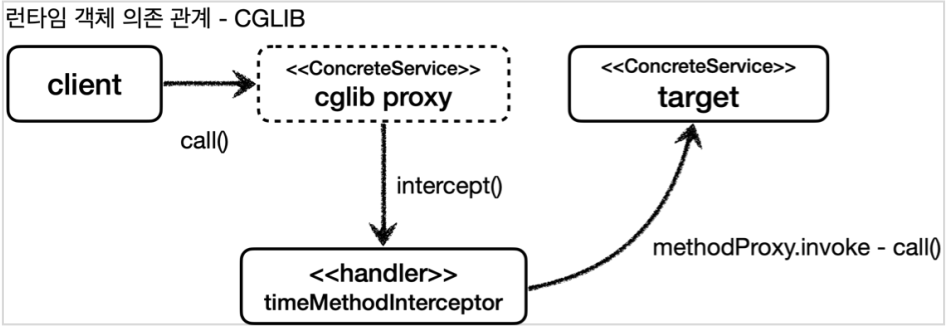

​	CGLIB 도 제약이 있는데요. 이 제약은 상속으로 인한 제약입니다.

1. CGLIB 는 자식 클래스를 동적으로 생성하기 때문에 기본 생성자가 필요합니다.
2. 클래스에 final 키워드가 붙으면 상속이 불가능합니다.
3. 메서드에 final 키워드가 붙으면 해당 메서드를 오버라이딩할 수 없습니다.

위 제약들은 모두 **자바 기본 문법에 의한 상속 제약**입니다.

# 프록시 팩토리

​	그렇다면 위와 같이 인터페이스가 있는 경우와 그렇지 않은 경우를 나눠서 만들어야 할까요? 스프링은 유사한 구체적인 기술들이 있을 때, 그것들을 통합해서 일관성 있게 접근할 수 있고, 더욱 편리하게 사용할 수 있는 추상화된 기술을 제공합니다. **스프링은 동적 프록시를 통합해서 편리하게 만들어주는 프록시 팩토리(ProxyFactory)라는 기능을 제공합니다.**

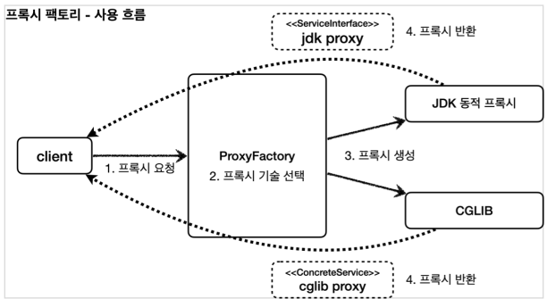

​	또한 두 기술을 함께 사용할 때 부가 기능을 적용하기 위해, 'JDK 동적 프록시가 제공하는 InvocationHandler' 와 'CGLIB가 제공하는 MethodInterceptor' 를 함께 만들 수 있는 **Adivce** 라는 개념을 도입했습니다. 프록시 팩토리를 사용하면 Advice 를 호출하는 전용 InvocationHandler , MethodInterceptor 를 내부에서 사용합니다.

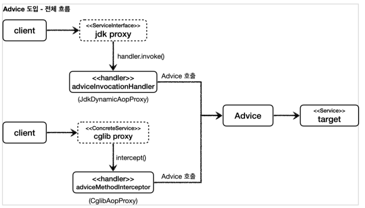

## MethodInterceptor

​	JDK 동적 프록시, CGLIB 프록시를 모두 포괄할 수 있는 Advice 는 MethodInterceptor 로 구현됩니다. CGLIB의 MethodInterceptor 와 이름이 같은데, 여기서 사용하는 org.aopalliance.intercept 패키지는 스프링 AOP 모듈(spring-aop) 안에 들어있습니다.

```java
public interface MethodInterceptor extends Interceptor {
	Object invoke(MethodInvocation invocation) throws Throwable;
}
```

​	파라미터인 `MethodInvocation invocation` 은 내부에 **다음 메서드를 호출하는 방법, 현재 프록시 객체 인스턴스, args , 메서드 정보 등**이 포함되어 있습니다. 기존에 파라미터로 제공되는 부분들이 이 안에 모두 들어간 겁니다. 이제 해당 인터페이스를 구현해보겠습니다.

```java
public class CAdvice implements MethodInterceptor {
    
    @Override
    public Object invoke(MethodInvocation invocation) throws Throwable {
        System.out.println("공통 로직 1");
        Object result = invocation.proceed();
        System.out.println("공통 로직 2");

        return result;
    }
}
```

​	`invocation.proceed()` 를 통해서 target 클래스를 호출하고 그 결과를 받습니다. target 의 정보는 `MethodInvocation` 안에 있습니다.

​	이제 프록시 팩토리를 만들어보겠습니다.

```java
public class Dconcrete { //먼저 인터페이스가 없는 Dconcrete 를 만들었습니다.

    public void logic() {
        System.out.println("구체 클래스 로직");
    }

    public void logic2() {
        System.out.println("구체 클래스 로직2");
    }
}

public class TestMain {

    public static void main(String[] args) throws Exception {

        C target = new A();
        ProxyFactory proxyFactory = new ProxyFactory(target); //target 을 넣어서 ProxyFactory 생성합니다.
        proxyFactory.addAdvice(new CAdvice()); //advice 를 붙여줍니다.
        C proxy = (C) proxyFactory.getProxy(); //proxyFactory 로 프록시 객체를 만듭니다.
        
        proxy.logic();
        
        System.out.println("target.getClass().getName() = " + target.getClass().getName());
        System.out.println("proxy.getClass().getName() = " + proxy.getClass().getName());

        Dconcrete target2 = new Dconcrete();
        ProxyFactory proxyFactory2 = new ProxyFactory(target2);
        proxyFactory2.addAdvice(new CAdvice());
        Dconcrete proxy2 = (Dconcrete) proxyFactory2.getProxy();
        
        proxy2.logic();
        
        System.out.println("target2.getClass().getName() = " + target2.getClass().getName());
        System.out.println("proxy2.getClass().getName() = " + proxy2.getClass().getName());

    }
}

/*결과
공통 로직 1
개쩌는 로직1
공통 로직 2
target.getClass().getName() = com.codestates.test.A
proxy.getClass().getName() = com.sun.proxy.$Proxy0

공통 로직 1
구체 클래스 로직
공통 로직 2
target2.getClass().getName() = com.codestates.test.Dconcrete
proxy2.getClass().getName() = com.codestates.test.Dconcrete$$EnhancerBySpringCGLIB$$4bd00286
*/
```

​	결과를 보면 C 인터페이스를 구현하는 A 클래스는 `$Proxy0` 와 같이 JDK 동적 프록시를 만들고 Dconcrete 클래스는 `Dconcrete$$EnhancerBySpringCGLIB$$4bd00286` 와 같이 CGLIB 클래스를 구현합니다. 하지만 메인 메서드 내에서는 서로 구분하지 않죠.

​	그러면 이러한 구분은 누가, 어떻게 할까요? 답은 DefaultAopProxyFactory 클래스에 있습니다. 아래 순서를 따라가보겠습니다. (*직접 IDE 를 켜서 디버깅을 찍고 클래스 내부로 들어가보면 쉽게 이해할 수 있습니다.*)

​	먼저 getProxy() 를 호출하면 `createAopProxy().getProxy()` 가 리턴됩니다.

```java
public class ProxyFactory extends ProxyCreatorSupport {
	...
	public Object getProxy() {
		return createAopProxy().getProxy();
	}
	...

}
```

​	`createAopProxy()` 는 AopProxy 를 리턴해주는 메서드로, ProxyFactory 의 부모클래스인 ProxyCreatorSupport 의 메서드입니다. 

```java
public class ProxyCreatorSupport extends AdvisedSupport {
    
    ...
    private AopProxyFactory aopProxyFactory; //aopProxyFactory
    
    public ProxyCreatorSupport() {
		this.aopProxyFactory = new DefaultAopProxyFactory(); //aopProxyFactory 로 DefalutAopProxyFactory() 사용
	}
    
    public AopProxyFactory getAopProxyFactory() {
		return this.aopProxyFactory;
	}
    
    protected final synchronized AopProxy createAopProxy() {
        if (!this.active) {
            activate();
        }
        return getAopProxyFactory().createAopProxy(this); //DefalutAopProxyFactory.createAopProxy() 호출
    }
    ...
}
```

​	위 코드에서 `createAopProxy()` 는 다시 `DefalutAopProxyFactory.createAopProxy(this)` 를 호출합니다.

```java
public class DefaultAopProxyFactory implements AopProxyFactory, Serializable {

	private final AdvisedSupport advised; //AdvisedSupport 를 생성자로 받아서 저장합니다. 
    
    public JdkDynamicAopProxy(AdvisedSupport config) throws AopConfigException {
    ...
    this.advised = config;
    ...
}

    @Override
    public AopProxy createAopProxy(AdvisedSupport config) throws AopConfigException {
        if (!NativeDetector.inNativeImage() &&
                (config.isOptimize() || config.isProxyTargetClass() || hasNoUserSuppliedProxyInterfaces(config))) {
            Class<?> targetClass = config.getTargetClass();
            if (targetClass == null) {
                throw new AopConfigException("TargetSource cannot determine target class: " +
                        "Either an interface or a target is required for proxy creation.");
            }
            if (targetClass.isInterface() || Proxy.isProxyClass(targetClass) || ClassUtils.isLambdaClass(targetClass)) {
                return new JdkDynamicAopProxy(config); //여러 조건에 따라 JdkDynamicAopProxy
            }
            return new ObjenesisCglibAopProxy(config); //아니면 CglibAopProxy 를 반환
        }
        else {
            return new JdkDynamicAopProxy(config);
        }
    }
}

```

​	위 코드는 저도 다 해석하지 못하구요. 주석 단 return 값만 보면 됩니다. `createAopProxy()` 를 통해 여러 조건을 확인하고 JdkDynamicAopProxy 를 반환하거나 ObjenesisCglibAopProxy 를 반환합니다. **결론적으로 메인 메서드에서`proxyFactory.getProxy();` 를 호출할 때 proxy 가 Jdk 동적 프록시냐, CGLIB 프록시냐 가 결정되는군요.**

​	CGLIB 프록시는 다시 내부적으로 받은 ProxyCreatorSupport 정보를 가지고 MethodInterceptor 를 구현하고 Enhancer 등 필요한 정보를 만들구요. Jdk 동적 프록시도 내부적으로 InvocationHandler 를 구현하고 `Proxy.newProxyInstance(classLoader, this.proxiedInterfaces, this)` 를 통해 프록시를 만듭니다. 그러면 각각의 구현체들의 메서드(InvocationHandler 의 invoke, MethodInterceptor 의 intercept) 는 내부적으로 Advice 를 호출하게 되는거죠. 그리고 그 Advice 는 실제 객체를 호출하게 됩니다. 아래가 다사다난한 과정입니다.

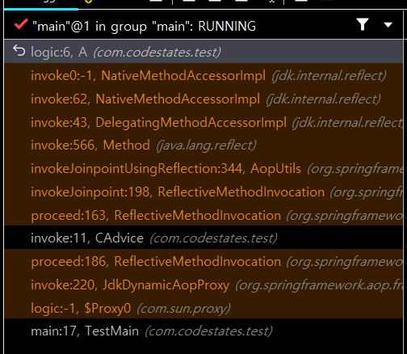

​	proxy.logic() -> JdkDynamicAopProxy.invoke() -> CAdvice.invoke() -> A.logic() 으로 호출하네요.

# 포인트컷, 어드바이스, 어드바이저

​	이제 AOP 에서 중요한 개념인 포인트컷, 어드바이스, 어드바이저에 대해 얘기해보겠습니다.

- **포인트컷(Pointcut)** : 어디에 부가 기능을 적용할지, 어디에 적용하지 않을지 판단하는 필터링 로직
- **어드바이스(Advice)** : 프록시가 호출하는 부가 기능
- **어드바이저(Advisor)** : 하나의 포인트컷과 하나의 어드바이스를 가지고 있는 것

이렇게 나눈 이유는 역할과 책임을 명확히 구분하기 위함입니다. 포인트 컷은 대상 여부를 확인만 하고, 어드바이스는 부가 기능 로직만 담당합니다. 이전 예시에서는 어드바이스는 만들었는데 포인트컷은 만들지 않았죠? 그러면 포인트컷이 True 인 (항상 적용되는) 어드바이저가 만들어진겁니다. 즉, `만들어진 어드바이저 = 항상 참인 포인트컷 + 만든 어드바이스` 이 된거죠. 이번엔 포인트컷을 만들어서 프록시를 만드는 데 적용해보겠습니다.

```java
public class TestMain {

    public static void main(String[] args) throws Exception {

        C target = new A();
        ProxyFactory proxyFactory = new ProxyFactory(target);
        DefaultPointcutAdvisor advisor = new DefaultPointcutAdvisor(Pointcut.TRUE, new CAdvice()); //포인트 컷을 더한 advisor
        //proxyFactory.addAdvice(new CAdvice()); <- advice 만 넣으면 Pointcut.TRUE 가 디폴트로 들어간 advisor 가 만들어진다.
        proxyFactory.addAdvisor(advisor);
        C proxy = (C) proxyFactory.getProxy();

        proxy.logic();

        System.out.println("target.getClass().getName() = " + target.getClass().getName());
        System.out.println("proxy.getClass().getName() = " + proxy.getClass().getName());
    }
}
/*실행결과
공통 로직 1
개쩌는 로직1
공통 로직 2
target.getClass().getName() = com.codestates.test.A
proxy.getClass().getName() = com.sun.proxy.$Proxy0
*/
```

​	위 코드를 보면, `proxyFactory.addAdvisor(advisor)` 를 통해 어드바이저가 추가됩니다. 이렇게 추가된 Advisor 는 부모 클래스인 ProxyCreatorSupport 의 `private List<Advisor> advisors = new ArrayList<>();` 필드로 리스트 형태로 추가됩니다. **리스트 형태라는 건 여러 어드바이저가 함께 적용될 수 있다는 뜻입니다.** 그리고 아까 프록시 객체를 만드는 DefaultAopProxyFactory 클래스에서 ProxyCreatorSupport 를 생성자의 매개변수로 받았기 때문에 advisors 리스트에 접근할 수 있게 되는 겁니다.

## 포인트컷

​	이제 포인트컷이 어떻게 만들어지는지 파헤쳐보겠습니다. 먼저 **Pointcut 관련 인터페이스입니다.**

```java
public interface Pointcut {
    ClassFilter getClassFilter();
    MethodMatcher getMethodMatcher();
}

public interface ClassFilter {
	boolean matches(Class<?> clazz);
}
public interface MethodMatcher {
	boolean matches(Method method, Class<?> targetClass);
 	...
}
```

​	포인트컷 인터페이스는 크게 ClassFilter 와 MethodMatcher 인터페이스를 반환하는 메서드로 나누어집니다.  이름 그대로 하**나는 클래스가 맞는지, 하나는 메서드가 맞는지 확인할 때 사용합니다. 둘다 true 로 반환해야 어드바이스를 적용할 수 있습니다.**

​	아래는 포인트컷을 커스텀으로 구현해본 것입니다.

```java
public class CPointCut implements Pointcut {
    @Override
    public ClassFilter getClassFilter() {
        return ClassFilter.TRUE;
    }

    @Override
    public MethodMatcher getMethodMatcher() {
        return new CMethodMatcher();
    }
}
```

```java
public class CMethodMatcher implements MethodMatcher {

    private String matchName = "logic";

    @Override
    public boolean matches(Method method, Class<?> targetClass) {
        System.out.println("포인트컷 호출 method= " + method.getName() +" targetClass= " + targetClass);
        boolean result = method.getName().equals(matchName);
        System.out.println("포인트컷 결과 result= " + result);
        return result;
    }

    @Override
    public boolean isRuntime() {
        return false;
    }

    @Override
    public boolean matches(Method method, Class<?> targetClass, Object... args) {
        throw new UnsupportedOperationException();
    }
}
```

​	Pointcut 의 클래스 필터는 항상 true 를 반환하게 했고, 메서드 비교 기능은 CMethodMatcher 를 통해 "logic" 메서드만 찾도록 했습니다. CMethodMatcher 내부에서는 `matches(Method method, Class<?> targetClass)` 의 값을 통해 해당 클래스의 메서드가 "logic" 인지 확인해서 **boolean 값**을 반환합니다. 나머지 메서드들은 아래 참고 글을 읽어주세요. 크게 중요한 부분은 아닙니다.

> ​	MethodMatcher 에서 `isRuntime()` 이 true 이면 `matches(... args)` 가 대신 호출되는데요. 동적으로 넘어오는 매개변수를 판단 로직으로 사용할 수 있게 됩니다. `isRuntime()` 이 false 인 경우 클래스의 정적 정보만 사용하기 때문에 스프링이 내부에서 캐싱을 통해 성능 향상이 가능하지만, isRuntime() 이 true 인 경우 매개변수가 동적으로 변경된다고 가정하기 때문에 캐싱을 하지 않습니다.

​	그럼 Proxy 내부의 어떤 로직이 Pointcut.getClassFilter() 와 Pointcut.getMethodMatcher() 를 호출할테고, 두 값이 모두 참이면 Advisor 를 적용하는 로직이 있겠죠? 해당 로직이 아래와 같습니다. 너무 많아서 캡쳐만 해봤습니다.

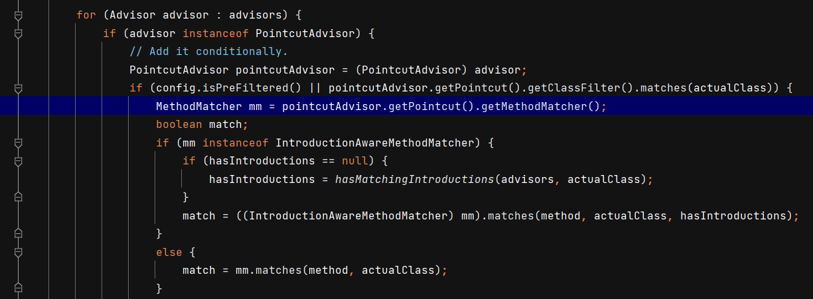

​	실행 흐름 : `proxy.logic()`(main 메서드에서 로직 호출) -> `JdkDynamicAopProxy.invoke()`(프록시 객체에서 로직 호출) -> `DefaultAdvisorChainFactory.getInterceptorsAndDynamicInterceptionAdvice()`(pointcut 에 적용대상인지 확인)

위 캡쳐에서 `getPointcut().getClassFilter()` 와 `getPointcut().getMethodMatcher()` 가 보이시나요? 이 조건에 맞으면 최종적으로JdkDynamicAopProxy 에서 리플렉션이 적용됩니다.

아래는 **커스텀 포인트컷을 CPointcut() 을 적용한 메인 메서드**입니다.

```java
public class TestMain {

    public static void main(String[] args) throws Exception {

        C target = new A();
        ProxyFactory proxyFactory = new ProxyFactory(target);
        DefaultPointcutAdvisor advisor = new DefaultPointcutAdvisor(new CPointCut(), new CAdvice());
        proxyFactory.addAdvisor(advisor);
        System.out.println("proxy 생성");
        C proxy = (C) proxyFactory.getProxy();

        System.out.println("proxy.logic() 호출");
        proxy.logic();
        
        proxy.logic2();

        System.out.println("target.getClass().getName() = " + target.getClass().getName());
        System.out.println("proxy.getClass().getName() = " + proxy.getClass().getName());

    }
}

/*
proxy 생성
proxy.logic() 호출
포인트컷 호출 method= logic targetClass= class com.codestates.test.A
포인트컷 결과 result= true
공통 로직 1
개쩌는 로직1
공통 로직 2

포인트컷 호출 method= logic2 targetClass= class com.codestates.test.A
포인트컷 결과 result= false
판타스틱 로직1
target.getClass().getName() = com.codestates.test.A
proxy.getClass().getName() = com.sun.proxy.$Proxy0

*/
```

​	출력결과를 보면 몇가지를 알 수 있는데요. `getProxy()` 를 호출해 proxy 를 생성한 이후 `proxy.logic()` 를 호출하면 그제서야 pointcut 을 살펴봅니다. 생각해보면 당연한 얘기인데, 메서드별로 포인트컷을 적용하는지 안하는지 결정되기 때문에 proxy 생성시점에서는 pointcut 을 살펴볼 이유가 없겠죠. 이후에 메서드를 실행할 때 해당 메서드가 pointcut 에 걸리는지 확인하는 것입니다. 

​	또한 `logic2()` 를 호출할 때는 포인트컷을 조회하긴 하지만 어드바이저가 적용되지 않았다는 것을 알 수 있습니다.

그림으로 살펴보면 아래와 같습니다. (제가 만들던 로직과는 조금 다릅니다. `save()` -> `logic()`)

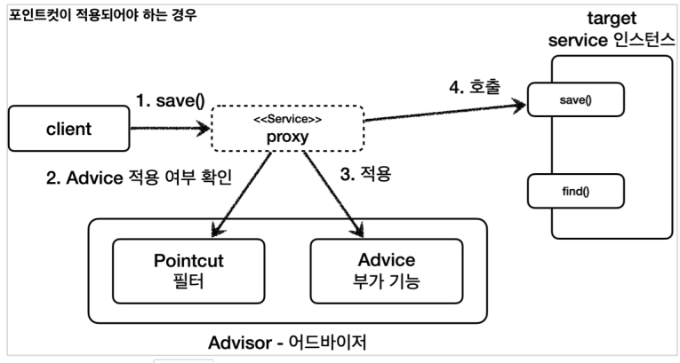

​		위 그림을 보면, 먼저 client 가 proxy 의 로직을 실행하면 proxy 는 Pointcut 을 살펴보고 Advice 를 적용할건지 확인하고 조건에 해당된다면 Advice 를 적용합니다. 그리고 부가기능을 추가한 로직을 실행하게 됩니다. 물론 포인트컷에 해당되지 않는다면 실제 객체의 로직만 실행합니다.

​	스프링은 Pointcut 을 구현한 여러 구현체가 있는데요. 대표적으로 NameMatchMethodPointcut, JdkRegexpMethodPointcut, AnnotationMatchingPointcut 등등이 있습니다. 하지만 가장 중요한 건 **AspectJExpressionPointcut 으로, aspectJ 표현식으로 매칭**합니다. 우리가 살펴봐야할 `@Pointcut("execution(* com.codestates.test..*(..))")` 과 같은 표현식이 바로 AspectJExpressionPointcut 을 사용한거죠.

​	만약 여러 어드바이저를 적용하고 싶다면 addAdvisor 메서드를 계속 사용하면 됩니다. 아까 설명드렸듯이 Advisor 는 리스트로 관리됩니다. 이렇게 만들면 **하나의 프록시에 여러 어드바이저가 적용**됩니다.

```java
public static void main(String[] args) throws Exception {

        C target = new A();
        ProxyFactory proxyFactory = new ProxyFactory(target);
        DefaultPointcutAdvisor advisor = new DefaultPointcutAdvisor(new CPointCut(), new CAdvice());
        DefaultPointcutAdvisor advisor2 = new DefaultPointcutAdvisor(new CPointCut(), new CAdvice2());
        proxyFactory.addAdvisor(advisor); //advisor 등록
        proxyFactory.addAdvisor(advisor2); //advisor2 등록

        C proxy = (C) proxyFactory.getProxy();

       ...
    }
```


# 빈 후처리기(BeanPostProcessor)

​	빈 후처리기에 대한 설명은 이전 포스팅에서 했기 때문에 생략하고 넘어가겠습니다. 빈 후처리기가 필요한 이유는 **핵심 로직 내에서 A 라는 빈을 등록할 때 코드의 변경없이 Aproxy 객체를 빈으로 등록해야 하기 때문**입니다. 프록시 객체를 등록하기 위한 일련의 과정(ProxyFactory 구현, Advisor 등록 등) 도 핵심로직을 방해한다는 거죠. 이제 직접 빈 후처리기를 구현하고, 프록시 대상이 등록되었을 때 빈 후처리기가 작동하도록 해보겠습니다.

​	먼저 스프링이 제공하는 **BeanPostProcessor 인터페이스** 입니다.

```java
public interface BeanPostProcessor {

	@Nullable
	default Object postProcessBeforeInitialization(Object bean, String beanName) throws BeansException {
		return bean;
	}

	@Nullable
	default Object postProcessAfterInitialization(Object bean, String beanName) throws BeansException {
		return bean;
	}

}

```

​	`postProcessBeforeInitialization` 는 객체 생성 이후에 @PostConstruct 같은 초기화가 발생하기 전에 호출되는 포스트 프로세서이며, `postProcessAfterInitialization` 는 객체 생성 이후에 @PostConstruct 같은 초기화가 발생한 다음에 호출되는 포스트 프로세서입니다. 기본적으로는 bean 을 받아서 bean 을 그대로 반환하죠. 여기서 뭔가 **빈을 프록시로 바꾸는 로직을 넣고 프록시를 반환하면, 프록시가 빈으로 등록될 것 같다는 생각이 듭니다.** 바로 아래와 같이 말이죠.

```java
package com.codestates.test.beanpostprocessor;

import org.springframework.aop.Advisor;
import org.springframework.beans.BeansException;
import org.springframework.beans.factory.config.BeanPostProcessor;
import org.springframework.aop.framework.ProxyFactory;

import java.util.List;

public class CBeanPostProcessor implements BeanPostProcessor {

    private final String basePackage;
    private final List<Advisor> advisors;

    public CBeanPostProcessor(String basePackage, List<Advisor> advisors) {
        this.basePackage = basePackage;
        this.advisors = advisors;
    }

    @Override
    public Object postProcessAfterInitialization(Object bean, String beanName) throws BeansException {
        
        System.out.println("CBeanPostProcessor.postProcessBeforeInitialization 호출, beanName : " + beanName);
        
        //bean 의 패키지가 basePackage 하위인지 확인
        String packageName = bean.getClass().getPackageName();
        if (!packageName.startsWith(basePackage)) {
            return bean;
        }
        
        //프록시 대상이면 프록시를 만들어서 반환
        ProxyFactory proxyFactory = new ProxyFactory(bean);
        for (Advisor advisor : advisors){
            proxyFactory.addAdvisor(advisor);
        }
        Object proxy = proxyFactory.getProxy();
        System.out.println("create proxy target : " + bean.getClass() + ", proxy : " + proxy.getClass());

        return proxy;
    }

}
```

​	`postProcessAfterInitialization` 메서드 안에는 bean 의 패키지가 basePackage 의 하위 패키지인지 확인하는 로직과 해당 빈을 프록시로 만드는 로직이 들어갔습니다. 그럼 이제 **C 인터페이스를 구현하는 A 클래스와 빈후처리기를 빈으로 등록**해야 합니다.

```java
@Configuration
public class Config {

    @Bean
    public C c(){ //C 의 구현 클래스는 A
        return new A();
    }

    @Bean
    public BeanPostProcessor beanPostProcessor(){ //beanPostProcessor 등록
        return new CBeanPostProcessor("com.codestates.test", getAdvisors());
    }

    private List<Advisor> getAdvisors() { //Advisor 는 2개

        List<Advisor> advisors = new ArrayList<>();

        advisors.add(new DefaultPointcutAdvisor(new CPointCut(), new CAdvice()));
        advisors.add(new DefaultPointcutAdvisor(new CPointCut(), new CAdvice2()));

        return advisors;
    }
}

```

​	빈 후처리기를 보겠습니다. basepackage 는 `com.codestates.test` 입니다. 해당 패키지와 그 하위를 포함하겠다는 겁니다. `getAdvisors()` 메서드로 포인트컷과 어드바이스를 결합한 어드바이저 리스트를 받습니다. 그럼 빈후처리기가 최종적으로 만들어집니다.

​	이제 테스트를 해볼 **메인 메서드**를 만들어보겠습니다.

```java
public class TestMain {

    public static void main(String[] args) throws Exception {

        AnnotationConfigApplicationContext context = new AnnotationConfigApplicationContext(Config.class);
        C c = context.getBean("c", C.class);

        c.logic();

        c.logic2();
        
        System.out.println(c.getClass().getName());
    }
}
```

​	메인 메서드는 간단하게 구현했습니다. "c" 로 등록된 빈을 가져와 logic() 과 logic2() 를 실행시킵니다. 결과는 아래와 같습니다.

```
CBeanPostProcessor.postProcessBeforeInitialization 호출, beanName : c
create proxy target : class com.codestates.test.A, proxy : class com.sun.proxy.$Proxy10

포인트컷 호출 method= logic targetClass= class com.codestates.test.A
포인트컷 결과 result= true
포인트컷 호출 method= logic targetClass= class com.codestates.test.A
포인트컷 결과 result= true
공통 로직 1
공통 로직 3
개쩌는 로직1
공통 로직 4
공통 로직 2

포인트컷 호출 method= logic2 targetClass= class com.codestates.test.A
포인트컷 결과 result= false
포인트컷 호출 method= logic2 targetClass= class com.codestates.test.A
포인트컷 결과 result= false
판타스틱 로직1
com.sun.proxy.$Proxy10
```

​	제일 위 두줄을 보면 **빈후처리기가 작동해 C 빈을 $Proxy10 객체로 등록**했다는 걸 알 수 있습니다. 그 다음 **logic() 이 실행될 때 포인트컷을 모두 확인한 후 공통로직을 실행**했습니다. **logic2() 는 포인트컷을 만족하지 않으니 공통로직이 실행되지 않았습니다.**

​	이제 빈 후처리기 덕분에 프록시를 생성하는 부분을 하나로 집중할 수 있습니다. 그리고 스프링이 직접 대상을 빈으로 등록하는 경우에도 중간에 빈 등록 과정을 가로채서 원본 대신에 프록시를 스프링 빈으로 등록할 수 있게 되었습니다. **덕분에 애플리케이션에 수 많은 스프링 빈이 추가되어도 프록시와 관련된 코드는 전혀 변경하지 않아도 됩니다.**

​	스프링은 당연히 빈후처리기를 만들어서 제공합니다. **가장 대표적인 후처리기가 AnnotationAwareAspectJAutoProxyCreator 인데요. Advisor 는 물론이고 @AspectJ와 관련된 AOP 기능도 자동으로 찾아서 처리해줍니다.** 결국 이 클래스가 어떻게 동작하는지 이해하기 위해 이 포스팅을 쓰고 있다고 해도 과언이 아닙니다.

​	아래와 같이 **Advisor 만 빈으로 등록하면, AnnotationAwareAspectJAutoProxyCreator 가 자동으로 찾아서 후처리기로 동작**합니다. Advisor 에 어드바이스와 포인트컷이 있으니 프록시 생성에 필요한 정보가 다 있으니까요.

```java
@Configuration
public class Config {

    @Bean
    public C c(){
        return new A();
    }

    @Bean
    public Advisor getAdvisor1() {
        return new DefaultPointcutAdvisor(new CPointCut(), new CAdvice());
    }

    @Bean
    public Advisor getAdvisor2() {
        return new DefaultPointcutAdvisor(new CPointCut(), new CAdvice2());
    }
}
```

​	이제 실행할 메인메서드입니다.

```java
@SpringBootApplication(scanBasePackages = "com.codestates.test")
@Import(Config.class)
public class Section2Week3Application {

	public static void main(String[] args) {

		ConfigurableApplicationContext context = SpringApplication.run(Section2Week3Application.class, args);
		C c = context.getBean("c", C.class);
		c.logic();
		c.logic2();
		System.out.println(c.getClass().getName());

	}

}
/*
포인트컷 호출 method= logic targetClass= class com.codestates.test.A
포인트컷 결과 result= true
포인트컷 호출 method= logic targetClass= class com.codestates.test.A
포인트컷 결과 result= true
포인트컷 호출 method= logic targetClass= class com.codestates.test.A
포인트컷 결과 result= true
포인트컷 호출 method= logic targetClass= class com.codestates.test.A
포인트컷 결과 result= true
포인트컷 호출 method= logic2 targetClass= class com.codestates.test.A
포인트컷 결과 result= false
포인트컷 호출 method= logic2 targetClass= class com.codestates.test.A
포인트컷 결과 result= false
포인트컷 호출 method= toString targetClass= class com.codestates.test.A
포인트컷 결과 result= false
포인트컷 호출 method= toString targetClass= class com.codestates.test.A
포인트컷 결과 result= false
포인트컷 호출 method= clone targetClass= class com.codestates.test.A
포인트컷 결과 result= false
포인트컷 호출 method= clone targetClass= class com.codestates.test.A
포인트컷 결과 result= false
...스프링 시작...
포인트컷 호출 method= logic targetClass= class com.codestates.test.A
포인트컷 결과 result= true
포인트컷 호출 method= logic targetClass= class com.codestates.test.A
포인트컷 결과 result= true
공통 로직 1
공통 로직 3
개쩌는 로직1
공통 로직 4
공통 로직 2

포인트컷 호출 method= logic2 targetClass= class com.codestates.test.A
포인트컷 결과 result= false
포인트컷 호출 method= logic2 targetClass= class com.codestates.test.A
포인트컷 결과 result= false
개쩌는 로직2
com.codestates.test.A$$EnhancerBySpringCGLIB$$8c8c0cc
*/
```

​	Section2Week3Application 에서 실행했습니다. 기본 디렉토리구조에 다른 @Configuration 이 있어서 `scanBasePackages` 속성과 @Import 를 사용했습니다.

​	결과를 보면 몇가지 특이한 걸 발견할 수 있는데요. **포인트컷은 2가지에 적용된다는 점**입니다. **첫번째는 빈 생성 단계**입니다. AnnotationAwareAspectJAutoProxyCreator 는 포인트컷을 실행하면서 해당 객체를 프록시로 만들지 체크합니다. **두번째는 로직 사용 단계**입니다. 프록시가 호출되었을 때 부가 기능인 어드바이스를 적용할지 말지 포인트컷을 보고 판단합니다.

​	아래와 같이 순서로 동작했음을 알 수 있습니다.

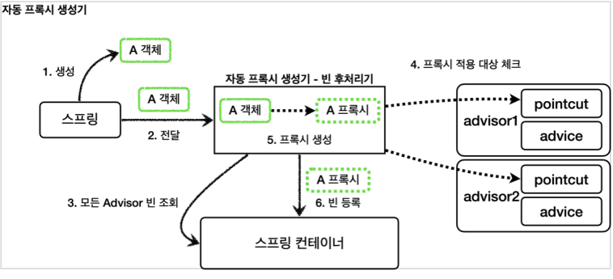

# AnnotationAwareAspectJAutoProxyCreator

​	이제 해당 클래스를 확인해보겠습니다. 이름부터 '어노테이션', '인식', 'AspectJ', '자동프록시생성기' 네요. 직관적입니다.

​	아래는 **AnnotationAwareAspectJAutoProxyCreator** 에서 Advisor 를 찾는 메서드입니다.

```java
@Override
protected List<Advisor> findCandidateAdvisors() {

    List<Advisor> advisors = super.findCandidateAdvisors(); //최종적으로 BeanFactoryAdvisorRetrievalHelper.findAdvisorBeans() 메서드로 List<Advisor> 를 리턴합니다.

    if (this.aspectJAdvisorsBuilder != null) {
        advisors.addAll(this.aspectJAdvisorsBuilder.buildAspectJAdvisors());
    }
    return advisors;
}
```

​	결론적으로 빈으로 등록된 advisor 들을 모두 찾아서 결과로 저장합니다. 이 값은 candidateAdvisors 필드로 저장됩니다. 이 필드는 다시 bean 이름과 비교해서 eligibleAdvisors 를 찾는데 비교됩니다. 아래는 **AbstractAdvisorAutoProxyCreator 의 findEligibleAdvisors 메서드** 입니다.

```java
protected List<Advisor> findEligibleAdvisors(Class<?> beanClass, String beanName) {
    List<Advisor> candidateAdvisors = findCandidateAdvisors();
    List<Advisor> eligibleAdvisors = findAdvisorsThatCanApply(candidateAdvisors, beanClass, beanName);
    extendAdvisors(eligibleAdvisors);
    if (!eligibleAdvisors.isEmpty()) {
        eligibleAdvisors = sortAdvisors(eligibleAdvisors);
    }
    return eligibleAdvisors;
}
```

​	findEligibleAdvisors 메서드는 내부에서 candidateAdvisors 중 빈 이름에 해당하는 Advisor 만 따로 모아서 eligibleAdvisors 를 리스트 형태로 반환합니다. 이제 적용될 Advisors 를 찾았으니 프록시로 만들어야겠죠? 아래가 프록시를 만드는 빈후처리기 로직입니다.

```java
public abstract class AbstractAutoProxyCreator extends ProxyProcessorSupport
		implements SmartInstantiationAwareBeanPostProcessor, BeanFactoryAware {
		
		...
            

	protected Object wrapIfNecessary(Object bean, String beanName, Object cacheKey) {
            ...    
		//specificInterceptors 는 적용되는 어드바이저(eligibleAdvisors) 를 나타냅니다.
		Object[] specificInterceptors = getAdvicesAndAdvisorsForBean(bean.getClass(), beanName, null);
        
		if (specificInterceptors != DO_NOT_PROXY) {
			this.advisedBeans.put(cacheKey, Boolean.TRUE);
			Object proxy = createProxy( //프록시 만드는 로직
					bean.getClass(), beanName, specificInterceptors, new SingletonTargetSource(bean));
			this.proxyTypes.put(cacheKey, proxy.getClass());
			return proxy;
		}

		this.advisedBeans.put(cacheKey, Boolean.FALSE);
		return bean;
	}
    
...
}
```

​	커스텀 빈 후처리기랑 큰 틀에서는 비슷합니다. Object[] specificInterceptors (적용되는 어드바이저 배열) 가 null 이 아니면 proxy 를 리턴합니다. 그렇지 않으면 `return bean;` 으로 실제 객체를 리턴하구요. proxy 를 만들 때는 createProxy 메서드를 호출하는데요. **매개변수로 빈 클래스, 빈 이름, 어드바이저, targetSource 를 사용합니다. targetSource 는 이전에 사용했던 target 으로, 실제 객체를 의미한다고 보면 됩니다.** 이렇게 하면 프록시가 만들어지게 됩니다.

​	그렇다면 **이렇게 @Aspect 가 붙은 빈을 따로 빈후처리기의 Advisor 로 등록해주는 로직**은 어디있을까요? 이것도 마찬가지로 **AbstractAutoProxyCreator 에 있습니다.** 

```java
@Override
public Object postProcessBeforeInstantiation(Class<?> beanClass, String beanName) {
    Object cacheKey = getCacheKey(beanClass, beanName);

    if (!StringUtils.hasLength(beanName) || !this.targetSourcedBeans.contains(beanName)) {
        if (this.advisedBeans.containsKey(cacheKey)) {
            return null;
        }
        if (isInfrastructureClass(beanClass) || shouldSkip(beanClass, beanName)) {
            this.advisedBeans.put(cacheKey, Boolean.FALSE); //@Aspect 는 여기에 걸립니다.
            return null;
        }
    }

    ...
}
```

​	위 코드는 AbstractAutoProxyCreator 의 postProcessBeforeInstantiation 메서드입니다. postProcessBeforeInstantiation 는 앞에서 설명한대로 **빈 초기화가 발생하기 전에 호출되는 포스트 프로세서로, Advisor 들을 advisedBeans 해시맵에 넣는다고 생각하면 됩니다.** `isInfrastructureClass(beanClass)` 는 beanClass 가 @Aspect 를 가지고 있는지 체크합니다.

​	**@Pointcut, @Around 로 Advisor 를 만드는 기능은 ReflectiveAspectJAdvisorFactory 클래스의 `getAdvisors` 메서드에서 제공**합니다. 해당 메서드에서 @Pointcut, @Around 와 같은 어노테이션이 있는지 확인하고 각각 포인트컷과 어드바이스로 만들어서 어드바이저로 등록합니다.

​	Advisors 까지 찾았으니 아까 위에 있던 AbstractAutoProxyCreator 의 `wrapIfNecessary` 메서드로 advisor 를 등록한 proxy 가 만들어져서 반환되는 겁니다. 아래와 같은 순서로 동작됩니다. 마지막의 AspectJExpressionPointcut 클래스는 ReflectiveAspectJAdvisorFactory 가 내부적으로 호출하는 클래스입니다.

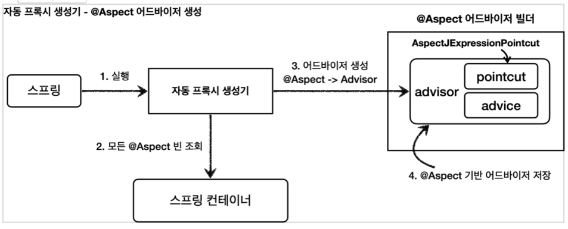


# Aspect 사용

​	사실 중요한 부분은 Aspect 를 어떻게 사용하는지 입니다. 간단하게 알아보겠습니다.

## Apsect 클래스 구조

```java
@Aspect
public class AspectC {

    @Pointcut("execution(* com.codestates.test..*(..))")
    private void targetMethod() {}

    @Around("targetMethod()")
    public Object measureTime(ProceedingJoinPoint joinPoint) throws Throwable {


            System.out.println("공통로직 1");
            Object result = joinPoint.proceed();
            System.out.println("공통로직 2");

            return result;
    }
}
```

- `@Aspect` : 애노테이션 기반 프록시를 적용할 때 필요합니다.
- `@Pointcut("execution(* com.codestates.test..*(..))")` : 포인트컷 표현식입니다.
- `@Around("targetMethod()")` : 해당 메서드가 어드바이스입니다.
- ProceedingJoinPoint joinPoint : 어드바이스에서 살펴본 MethodInvocation invocation 과 유사한 기능입니다. 내부에 실제 호출 대상, 전달 인자, 그리고 어떤 객체와 어떤 메서드가 호출되었는지 정보가 포함되어 있습니다.
- joinPoint.proceed() : 실제 호출 대상( target )을 호출합니다.

​	이제 AspectJ 를 빈으로 등록해야 합니다. @Component 를 사용해도 되지만, 이번에는 직접 등록해주겠습니다.

```java
@Configuration
public class Config {

    @Bean
    public C c(){
        return new A();
    }

    @Bean
    public AspectC aspectC(){ //AspectC 등록
        return new AspectC();
    }
}

```

​	이제 메인 메서드에서 호출하면 아래 결과와 같이 잘 동작하는 걸 알 수 있습니다.

```java
@SpringBootApplication(scanBasePackages = "com.codestates.test")
@Import(Config.class)
public class Section2Week3Application {

	public static void main(String[] args) {

		ConfigurableApplicationContext context = SpringApplication.run(Section2Week3Application.class, args);
		C c = context.getBean("c", C.class);
		c.logic();
		c.logic2();
		System.out.println(c.getClass().getName());
	}
}
/*
공통로직 1
개쩌는 로직1
공통로직 2

공통로직 1
개쩌는 로직2
공통로직 2
com.codestates.test.A$$EnhancerBySpringCGLIB$$fdd3a116
*/
```


## Advice 종류

​	어드바이스 종류에는 아래와 같이 총 5가지가 있습니다.

- @Around : 메서드 호출 전후에 수행, 가장 강력한 어드바이스, 조인 포인트 실행 여부 선택, 반환 값 변환, 예외 변환 등이 가능 
- @Before : 조인 포인트 실행 이전에 실행 
- @AfterReturning : 조인 포인트가 정상 완료후 실행 
- @AfterThrowing : 메서드가 예외를 던지는 경우 실행
-  @After : 조인 포인트가 정상 또는 예외에 관계없이 실행(finally)

​	어드바이스 종류를 확인하기 위해 아래와 같이 Aspect 를 구성했습니다.

```java
@Aspect
public class AspectC {

    @Pointcut("execution(* com.codestates.test..*(..))")
    private void targetMethod() {}

    @Around("targetMethod()")
    public Object around(ProceedingJoinPoint joinPoint) throws Throwable {

        System.out.println("around 1");
        System.out.println("joinPoint.getSignature().getName() = " + joinPoint.getSignature().getName());
        System.out.println("joinPoint.getArgs() = " + Arrays.toString(joinPoint.getArgs()));
        System.out.println("joinPoint.getTarget() = " + joinPoint.getTarget());
        System.out.println("joinPoint.getThis() = " + joinPoint.getThis());
        Object result = joinPoint.proceed();
        System.out.println("around 2");
        return result;

    }

    @Before("targetMethod()")
    public void before(JoinPoint joinPoint) throws Throwable {

        System.out.println("before");

    }

    @AfterReturning(value = "targetMethod()", returning = "result")
    public void afterReturning(JoinPoint joinPoint, Object result) throws Throwable {

        System.out.println("afterReturning");
    }

    @AfterThrowing(value = "targetMethod()", throwing = "e")
    public void afterThrowing(JoinPoint joinPoint, Throwable e) throws Throwable {

        System.out.println("afterThrowing");
    }

    @After("targetMethod()")
    public void after(JoinPoint joinPoint) throws Throwable {

        System.out.println("after");
    }
}
```

1. 기본적으로 Around 를 제외하고는 반환타입이 void 입니다. 왜냐하면 메서드를 직접 실행시키는 게 아니기 때문입니다.
2. @AfterReturning 은 속성으로 return 을 줘서 return 값을 받을 수 있습니다. 하지만 **해당 값을 단순히 이용만 할 수 있을 뿐 변경해서 다시 리턴하지 못합니다.**
3. @AfterThrowing 은 에러발생 시 사용됩니다. throwing 속성으로 e 를 받을 수 있습니다.
4. @After 은 finally 와 비슷하게 에러가 발생하든 안하든 실행되는 어드바이스입니다.

​	아래와 같은 메인 메서드를 실행해보겠습니다.

```java
@SpringBootApplication(scanBasePackages = "com.codestates.test")
@Import(Config.class)
public class Section2Week3Application {

	public static void main(String[] args) {

		ConfigurableApplicationContext context = SpringApplication.run(Section2Week3Application.class, args);
		C c = context.getBean("c", C.class);
		try{
			c.logic();
			c.logic2();
		}catch (Exception e){
			System.out.println(e.getMessage());
		}

		System.out.println(c.getClass().getName());
	}
}
/*
----------logic()--------------
around 1
joinPoint.getSignature().getName() = logic
joinPoint.getArgs() = []
joinPoint.getTarget() = com.codestates.test.A@516592b1
joinPoint.getThis() = com.codestates.test.A@516592b1
before
개쩌는 로직1
afterReturning
after
around 2
----------logic2()--------------
around 1
joinPoint.getSignature().getName() = logic2
joinPoint.getArgs() = []
joinPoint.getTarget() = com.codestates.test.A@516592b1
joinPoint.getThis() = com.codestates.test.A@516592b1
before
예외 로직
afterThrowing
after
예외 발생
com.codestates.test.A$$EnhancerBySpringCGLIB$$345ecfed

*/
```

- `logic()` : around1 -> before -> logic() -> afterReturning -> after -> around2 순서로 실행됩니다.
- `logic2()` : around1 -> before -> logic2() throws RuntimeException -> afterThrowing-> after -> catch(e) 순서로 실행됩니다.

​	예외가 발생하면 around2 는 실행이 안되는 걸 알 수 있습니다. 아래와 같은 플로우입니다.

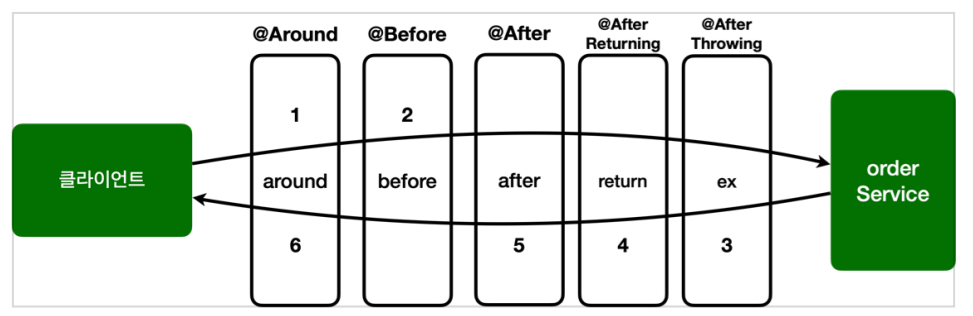

​	사실 **@Around 를 제외한 모든 어노테이션은 @Around 로 구현할 수 있습니다.** 그런데 왜 이렇게 나눠서 사용할까요? 바로 **코드의 의도를 명확하게 하고, 실수를 방지하기 위한 제약을 두는 것입니다.** 만약 @Around 를 사용했는데 중간에 다른 개발자가 코드를 수정하고 나서 `joinPoint.proceed();` 를 호출하지 않는다면 큰 장애가 발생하게 됩니다. 하지만 처음부터 @Before 을 사용했다면 이런 문제 자체가 발생하지 않겠죠.

## Pointcut 정규식

​	AspectJ 에서는 포인트컷을 편리하게 표현하기 위한 특별한 표현식을 제공합니다. 포인트컷 지시자의 종류는 아래와 같습니다.

- execution : 메소드 실행 조인 포인트를 매칭합니다. 스프링 AOP에서 가장 많이 사용하고, 기능도 복잡합니다.
-  within : 특정 타입 내의 조인 포인트를 매칭합니다.
- args : 인자가 주어진 타입의 인스턴스인 조인 포인트 
- this : 스프링 빈 객체(스프링 AOP 프록시)를 대상으로 하는 조인 포인트 
- target : Target 객체(스프링 AOP 프록시가 가르키는 실제 대상)를 대상으로 하는 조인 포인트 
- @target : 실행 객체의 클래스에 주어진 타입의 애노테이션이 있는 조인 포인트 
- @within : 주어진 애노테이션이 있는 타입 내 조인 포인트 
- @annotation : 메서드가 주어진 애노테이션을 가지고 있는 조인 포인트를 매칭 
- @args : 전달된 실제 인수의 런타임 타입이 주어진 타입의 애노테이션을 갖는 조인 포인트 
- bean : 스프링 전용 포인트컷 지시자, 빈의 이름으로 포인트컷을 지정합니다.