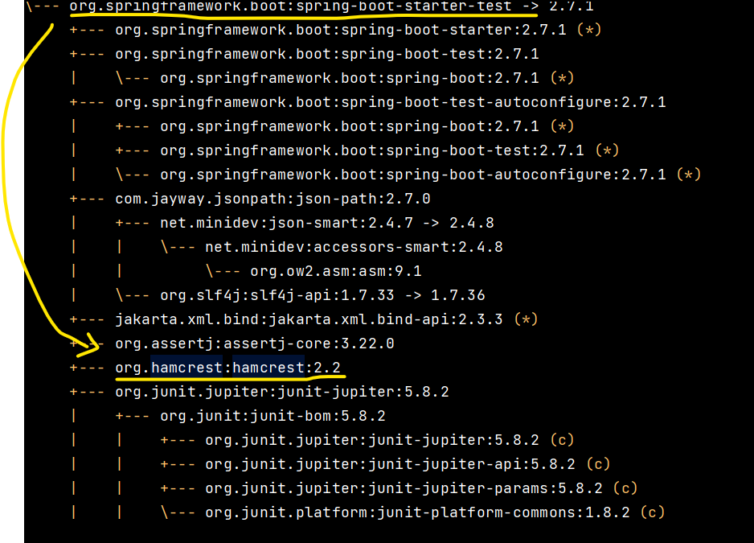
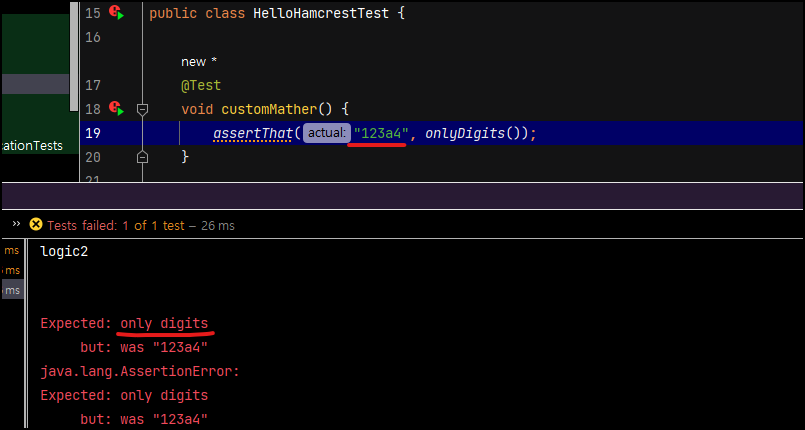
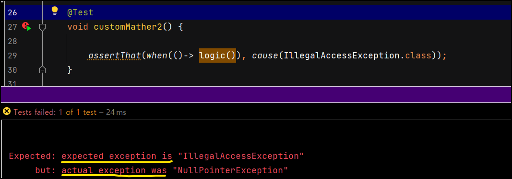

# Hamcrest

​	Hamcrest 는 JUnit 기반의 단위 테스트에서 사용할 수 있는 Assertion Framework 입니다. Assertion을 위한 **매쳐(Matcher)**가 자연스러운 문장으로 이어지므로 **가독성이 향상**된다는 장점이 있습니다.

Hamcrest 는 `org.hamcrest:hamcrest` 의존성을 주입해줘야 하는데요. 다행히 `spring-boot-starter-test` 에 있습니다.



*콘솔창에 `./gradlew dependencies` 라고 하면 위와 같이 나옵니다.*

메서드 종류는 해당 docs 에서 참고했습니다. [API reference](https://hamcrest.org/JavaHamcrest/javadoc/1.3/org/hamcrest/Matchers.html)

## is(), equalTo()

```java
public class HelloHamcrestTest {

    @Test
    public void assertionTest() {
        Coffee coffee = new Coffee();
        coffee.setCoffeeCode("123");

        Coffee coffee2 = new Coffee();
        coffee2.setCoffeeCode("123");

        assertThat(coffee, equalTo(coffee2));
    }
}
```

`equalTo()` 는 `actual` 과 `expected` 값을 `equals()` 메서드로 비교합니다.

`is()` 는 내부적으로 아래와 같이 사용됩니다.

```java
public class Is<T> extends BaseMatcher<T> {

    public static <T> Matcher<T> is(T value) {
            return is(equalTo(value));
        }
    }
```

즉, `is`는 `equalTo`를 디폴트 매처로 사용하기 때문에 결국 `equals()` 메서드를 사용하게 됩니다.

일반적으로, Hamcrest의 `is`와 `equalTo`는 같은 행동을 보이므로, 대부분의 경우에 둘 중 어느 것을 사용해도 무방합니다. 둘다 객체의 동일성과 동등성을 확인합니다. 다만, **코드의 가독성을 생각해서 짜는 게 좋습니다.** 예를 들어, `assertThat(x, is(y))`는 자연스러운 영어 문장처럼 읽힙니다. 반면에, `assertThat(x, equalTo(y))`는 조금 더 기술적인 어투입니다.

## notNullValue(), nullValue()

```java
@Test
public void assertionTest() {
	String n = null;
	String NotN = "null";
	assertThat(n, is(nullValue()));
	assertThat(n, is(notNullValue()));
}
```

## allOf(), anyOf()

`allOf()` 는 Matcher 를 파라미터로 받아서, 해당 조건이 다 만족하면 검증이 됩니다. `anyOf()` 또한 Matcher 를 파라미터로 받지만 하나라도 만족하면 검증이 됩니다.

```java
@Test
@DisplayName("hamcrest allOf(), anyOf() 테스트")
void hamcrestAllOfAnyOfTest() {
    assertThat("123", allOf(startsWith("1"), containsString("2"), endsWith("3"))); //전부 다 맞아야 통과
    assertThat("123", anyOf(startsWith("1"), containsString("2"), endsWith("3"))); //하나라도 맞으면 통과

    assertThat("123", not(allOf(startsWith("1"), containsString("2"), endsWith("4")))); //하나라도 틀리면 실패
    assertThat("123", not(anyOf(startsWith("0"), containsString("2"), endsWith("4")))); //다 틀리면 실패
}
```

## hasToString()

Actual 값을 `ToString` 으로 바꿨을 때 해당값을 가지고 있는지 보는 메서드입니다.

```java
@Test
@DisplayName("hamcrest hasToString() 테스트")
void hamcrestHasToStringTest() {
    assertThat("123", hasToString("123"));
    assertThat("123", hasToString(endsWith("3")));

    Coffee coffee = new Coffee();
    assertThat(coffee, hasToString(containsString("Coffee"))); //coffee 의 주소값은 "Coffee" 를 포함합니다.
}
```

## instanceOf(), sameInstance()

`instanceOf()` 는 해당 인스턴스가 특정 클래스인지 검증하는 메서드며, `sameInstance()` 은 같은 객체인지 검증하는 메서드입니다.

```java
@Test
@DisplayName("instanceOf(), sameInstance() 테스트")
void instanceOfSameInstanceTest() {
    assertThat("123", instanceOf(String.class));
    assertThat("123", not(instanceOf(Integer.class)));

    Coffee coffee1 = new Coffee();
    Coffee coffee2 = coffee1;
    assertThat(coffee1, sameInstance(coffee2));
}
```

## hasEntry(), hasKey(), hasValue()

`Map` 에 해당 `entry`, `key`, `value` 가 있는지 확인합니다.

```java
@Test
@DisplayName("hasEntry(), hasKey(), hasValue() 테스트")
void hasEntryHasKeyHasValueTest() {
    HashMap<String, Integer> map = new HashMap<>();
    map.put("price1", 2000);
    map.put("price2", 3000);

    assertThat(map, hasEntry("price1", 2000));
    assertThat(map, hasEntry("price2", 3000));

    assertThat(map, hasKey("price1"));
    assertThat(map, hasKey("price2"));

    assertThat(map, hasValue(2000));
    assertThat(map, hasValue(3000));
}
```

## hasItem(), hasItems()

`hasItem()`, `hasItems()` 는 `Iterable` 클래스가 해당 원소를 가지고 있는지 확인합니다.

```java
@Test
@DisplayName("hasItem, hasItems 테스트")
void hasItemHasItemsTest() {
    List<String> list = List.of("1", "2", "3", "4", "5");

    assertThat(list, hasItem("1"));
    assertThat(list, hasItem("2"));
    assertThat(list, hasItem("3"));
    assertThat(list, hasItem("4"));
    assertThat(list, hasItem("5"));
    assertThat(list, not(hasItem("6")));
    assertThat(list, hasItem(endsWith("5")));

    assertThat(list, hasItems("1", "2", "3", "4", "5"));
    assertThat(list, hasItems("2", "3", "4", "5"));
    assertThat(list, not(hasItems("2", "3", "4", "5", "6")));
}
```


## hasItemInArray()

배열에서 해당 값이 있는지 확인합니다.

```java
    @Test
@DisplayName("hasItemInArray() 테스트")
void hasItemInArrayTest() {
    String[] array = {"1", "2", "3", "4", "5", "66"};

    assertThat(array, hasItemInArray("1"));
    assertThat(array, hasItemInArray("2"));
    assertThat(array, hasItemInArray("3"));
    assertThat(array, hasItemInArray("4"));
    assertThat(array, hasItemInArray("5"));
    assertThat(array, not(hasItemInArray("6")));
    assertThat(array, hasItemInArray(endsWith("6")));

}
```


## 기타

그밖에도 아래와 같은 다양한 메서드를 지원합니다.

- `greaterThan`, `greaterThanOrEqualTo`, `lessThan`, `lessThanOrEqualTo`
- `equalToIgnoringCase` : 대소문자를 무시하고 비교합니다.
- `equalToIgnoringWhiteSpace` : 공백을 무시하고 비교합니다.
- `containsString`, `endsWith`, `startsWith` 


## 에러 검증

​	예외에 대한 테스트는 Hamcrest 만으로 `Assertion` 을 구성하기 듭니다. 따라서 아래와 같이 JUnit 의 `assertThrows()` 메서드를 이용해서 `assertThrows()`의 리턴 값을 전달받은 후에 `assertThat(actualException.getClass(), is(NullPointerException.class));` 을 통해 `throw` 된 `Exception` 타입이 기대했던 `Exception` 타입과 일치하는지 추가로 검증을 진행합니다.

```java
 @Test
public void assertionTest() {
    Throwable actualException = assertThrows(NullPointerException.class, () -> {
                throw new NullPointerException();
            });

    assertThat(actualException.getClass(), is(NullPointerException.class));
}
```

만약 Hamcrest 만으로 던져진 예외를 테스트하기 위해서는 `Custom Matcher` 를 직접 구현해서 사용할 수 있습니다.

# Hamcrest 의 Custom Matcher

에러를 검증하는 `Custom Matcher` 를 만들어보겠습니다. 그전에 간단하게 `String` 이 숫자로 이루어져있는지 검증하는 `isOnlyDigits` 클래스부터 만들면서 알아보겠습니다.

## isOnlyDigits

```java
public class IsOnlyDigits extends TypeSafeMatcher<String> {

    @Override
    protected boolean matchesSafely(String actualValue) {
        try {
            Integer.parseInt(actualValue);
            return true;
        } catch (NumberFormatException nfe){
            return false;
        }
    }

    @Override
    public void describeTo(Description description) {
        description.appendText("only digits");

    }

    public static Matcher<String> onlyDigits() {
        return new IsOnlyDigits();
    }
}
```

​	`IsOnlyDigits` 클래스는 `TypeSafeMatcher`클래스를 상속받습니다. 이때 제네릭은 실제로 받을 `actual value` 의 타입입니다. `IsOnlyDigits` 을 통해 `"1234"` 와 같은 `String` 을 받아서 `Digits` 인지 확인할 것이기 때문에 제네릭은 `String` 입니다.

​	`matchesSafely()` 메서드는 `actualValue` 를 파라미터로 받습니다. (원래 `Overriding` 을 하면 `item` 이라고 되어있는데 헷갈리지 않게 변경했습니다.)  그리고 `boolean` 값으로 성공인지 실패인지 검증해서 리턴합니다. 즉, <u>검증 로직은 `matchesSafely` 내에서 진행됩니다.</u>

​	`onlyDigits()` 메서드는 `IsOnlyDigits` 클래스를 리턴합니다. 실질적으로 Test 에서 사용되는 메서드입니ㅏㄷ.

​	`describeTo()` 메서드는 검증이 실패했을 때 보여주는 값입니다.



위 사진처럼, `Expected` 에 표시됩니다. 만약 `onlyDigits(...)` 에서 파라미터를 받는다면 해당 값을 보여줄 수도 있습니다.

아래는 성공 케이스입니다.

```java
 @Test
void customMather() {
    assertThat("1234", onlyDigits());
}
```

`onlyDigits()` 가 실행되어 `IsOnlyDigits` 클래스가 반환됩니다. 해당 클래스에서 `matchesSafely("1234")` 를 실행시키고 `boolean` 값을 반환합니다.

## IsExceptionOf

이번에는 예외를 검증하는 Exception 클래스입니다. 먼저 Junit 의 예외검증 메서드인 `assertThrows()` 메서드를 보겠습니다.

```java
@Test
    void customMather2() {
        assertThrows(NullPointerException.class, () -> logic());
    }

    void logic(){
        throw new NullPointerException();
    }
```

 간단한 로직이라서 괜찮지만, `NullPointerException.class` 는 결과이고 `() -> logic()` 는 행동이 되니까 읽기에 불편합니다. 기존의 Hamcrest 는 `Actual is Expected`, `Actual is NotNull` 과 같은 형식이었다면 `assertThrows()` 는 `error, Exception, caused By logic` 과 같이 되겠네요. 이거를 보기 좋게 `logic cause Exception` 으로 고쳐보겠습니다.

처음에는 아래와 같은 형식을 만들어놓고 고치려고 했는데요.

```java
assertThat(logic(), cause(NullPointerException.class));
```

하지만 여기에는 큰 문제가 있습니다. **`logic()` 이 실행되는 시점에서 Hamcrest 의 `assertThat` 이 자동으로 캐치해서 동작하지 않는다는 것입니다. 즉 `logic()` 이 `Exception` 을 던지면 그대로 빨간 불로 끝납니다.** 이를 해결하기 위해서는 2가지 방법이 있는데요.

1. `try ~ catch` 문 사용

   ```java
   try{
   	logic()
   }catch(Throwable e){
   	assertThat(e.getclass, cause(NullPointerException.class));
   }
   ```

2. `Executable` 사용

   ```java
   assertThat(()-> logic(), cause(NullPointerException.class));
   ```

일단 저는 당연히 가독성을 위해 2번을 골랐습니다. 이렇게 하고 해당 `Executable` 로직이 실행되면 `logic()` 을 실행하고, `Throwable` 을  반환하는 `when()` 메서드를 사용해보겠습니다.

```java
assertThat(when(()-> logic()), cause(NullPointerException.class));
```

음... 가독성이 점점 떨어지는 것 같은데요. 어쨋든 모두 `assertThat` 으로 통일하면서 `when A cause B` 정도의 가독성은 얻은 것 같습니다. 제가 만들어서 잘 읽히는건가요? 

이제 `IsExceptionOf` 코드를 보겠습니다.

```java
package com.codestates;

import org.hamcrest.Description;
import org.hamcrest.Matcher;
import org.hamcrest.TypeSafeMatcher;
import org.junit.jupiter.api.function.Executable;

public class IsExceptionOf extends TypeSafeMatcher<Throwable> {

    private final Class<? extends Throwable> expectedException;

    private IsExceptionOf(Class<? extends Throwable> expectedException) {
        this.expectedException = expectedException;
    }

    public static Matcher<Throwable> cause(Class<? extends Throwable> expectedException) {
        return new IsExceptionOf(expectedException);
    }

    public static Throwable when(Executable method) {

        try{
            method.execute();
        }catch(Throwable e){
            return e;
        }
        return null;
    }

    @Override
    protected boolean matchesSafely(Throwable e) {
        return expectedException.equals(e.getClass());
    }

    @Override
    public void describeTo(Description description) {
        description.appendText("expected exception is ").appendValue(expectedException.getSimpleName());
    }

    @Override
    protected void describeMismatchSafely(Throwable item, Description mismatchDescription) {
        mismatchDescription.appendText("actual was ").appendValue(item.getClass().getSimpleName());
    }
}
```

하나하나 보겠습니다.

### 필드, 생성자, cause() 메서드

```java
public class IsExceptionOf extends TypeSafeMatcher<Throwable> {

    private final Class<? extends Throwable> expectedException;

    private IsExceptionOf(Class<? extends Throwable> expectedException) {
        this.expectedException = expectedException;
    }

    public static Matcher<Throwable> cause(Class<? extends Throwable> expectedException) {
        return new IsExceptionOf(expectedException);
    }
    
```

`expectedException` 는 생성자를 통해서 주입받습니다. 기대되는 `Exception` 값입니다. 생성자는 직접적으로 사용할 일이 없으므로 `private` 으로 막아둡니다.

`cause` 는 테스트 코드에서 직접 사용하는 메서드입니다. `expectedException` 을 받아서 생성자를 통해 객체에 주입한 후 해당 객체를 반환합니다.

### when() 메서드

```java
public static Throwable when(Executable method) {
    try{
        method.execute();
    }catch(Throwable e){
        return e;
    }
    return null;
}
```

`when()` 메서드는 꼭 여기있지 않아도 상관없습니다. 오히려 공통으로 사용하기 위해 빼놓는게 낫겠죠. 물론 `Throwable` 자체를 리턴하는거니까 여기에서밖에 쓸 일이 없겠지만요. `Executable` 를 파라미터로 받아서 실행시킨 후, `Exception` 이 발생하면 그대로 해당 클래스를 리턴해줍니다. 이 리턴값은 `matchesSafely()` 메서드에서 사용하게 됩니다.

### matchesSafely() 메서드

```java
@Override
protected boolean matchesSafely(Throwable actualException) {
    return expectedException.equals(actualException.getClass());
}
```

해당 메서드는 간단히 비교만 합니다. `expectedException` 과 `actualException` 을 비교해서 `boolean` 값을 리턴합니다.

### describeTo() 메서드, describeMismatchSafely() 메서드

```java
@Override
public void describeTo(Description description) {
    description.appendText("expected exception is ").appendValue(expectedException.getSimpleName());
}

@Override
protected void describeMismatchSafely(Throwable actualException, Description mismatchDescription) {
    mismatchDescription.appendText("actual exception was ").appendValue(actualException.getClass().getSimpleName());
}
```

해당 메서드들은 `mismatch` 상황에서 쓰이게 됩니다. 콘솔창에서 보는게 이해가 빠르겠네요.



`Expected` 에는 `describeTo()` 메서드에서 붙인 `expected exception is ` 가 출력되고 `expectedException.getSimpleName()` 가 출력됩니다. 그리고 `but` 에는 `describeMismatchSafely()` 메서드에서 붙인 `actual exception was ` 가 출력되고 이후에 `actualException.getClass().getSimpleName()` 이 출력됩니다. 이걸로 **에러 메세지도 가독성을 향상시킬 수 있습니다.**
