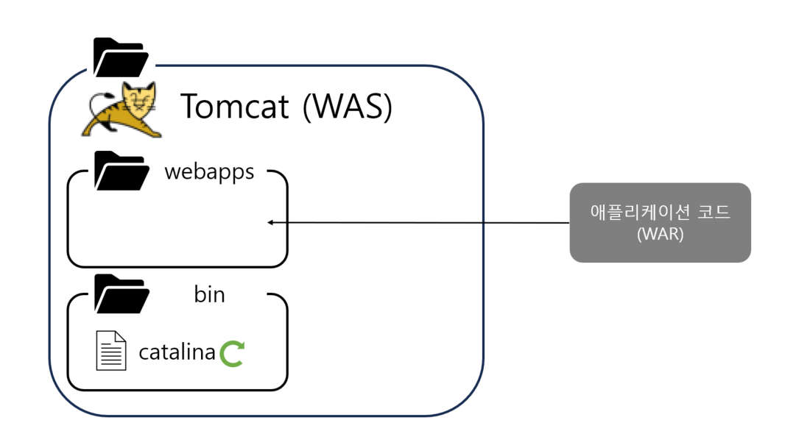
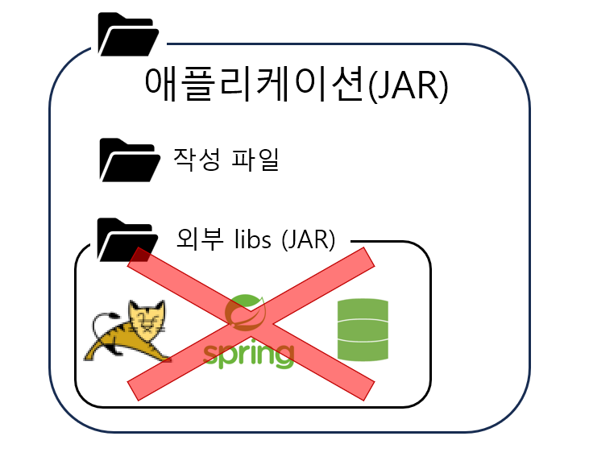
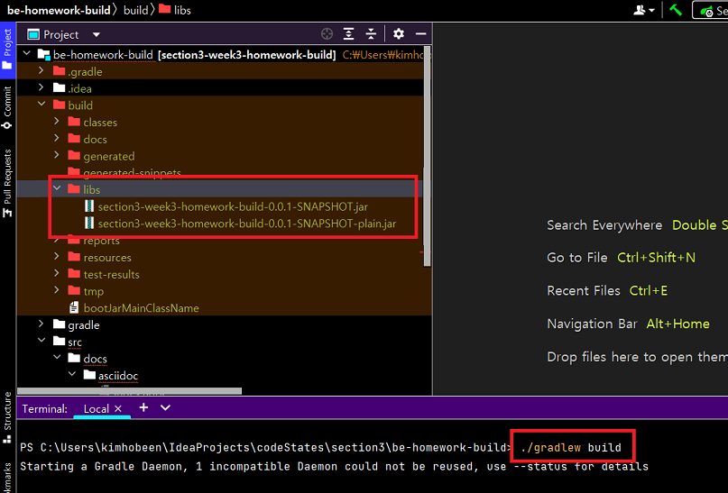
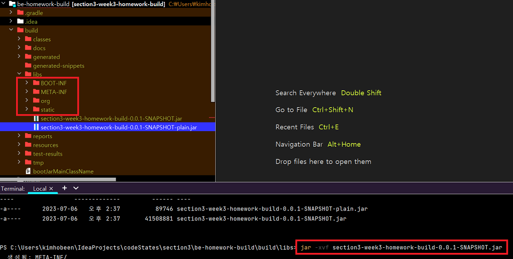
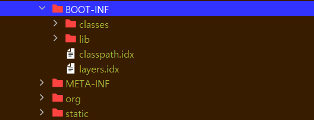
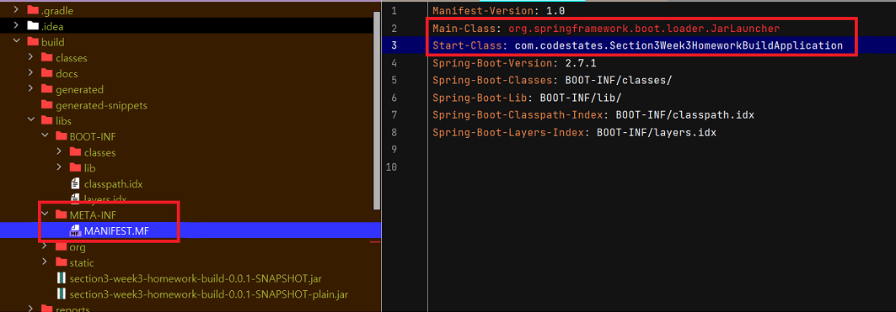
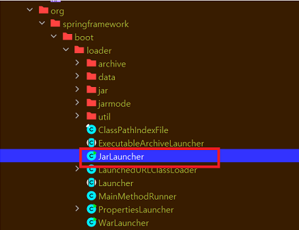

# War 배포

## 톰캣을 별도로 설치하고 War 배포

​	내장 톰캣이 생기기 이전에는 톰캣을 별도로 설치하고 자바 파일을 War 파일로 압축한 후 톰캣에 올려서 사용했습니다.

먼저 작성파일을 WAR 로 압축한 후 Tomcat 디렉토리의 `webapps` 에 올립니다. 이때 압축 WAR 파일 명은 `ROOT.war` 가 되야 합니다. 그리고 `bin/catalina` 를 실행하면 웹서버가 실행됩니다.

**하지만 이 방법은 너무 귀찮았습니다.**

## 라이브러리로 내장 톰캣 설치

그래서 등장한 방법이 내장 톰캣을 설치하는 방법입니다. 하나의 외장 라이브러리로 톰캣을 사용하고, JAR 파일로 압축해서 배포하는 겁니다. 하지만 여기에는 큰 문제가 있는데요. 자바 스펙에서 JAR 파일 내부에는 JAR  파일이 들어가지 못하는 겁니다. 이는 Java의 ClassLoader가 JAR 내부의 JAR 파일을 처리할 수 없는 방식으로 설계되어 있기 때문입니다. 

이를 해결하기 위해 외부 libs 의 JAR 파일 내부 클래스를 모두 추출해서 로드하는 방법(fat Jar) 도 있지만, 클래스명이 겹치면 서로 충돌하는 등의 문제가 있었습니다. 이를 해결하기 위해 나온 개념이 SpringBoot 의 Executable JAR 입니다.

# 스프링 부트의 Jar 파일 구조

​	스프링 부트의 JAR 의 압축을 풀어보면서 보겠습니다.

## 빌드

`./gradlew build` 를 하면 JAR 파일이 생깁니다. 이 파일을 실행하거나 배포하면 하나의 어플리케이션이 됩니다. 

`.jar` 파일은 외부 라이브러리가 포함된 파일이고 `-plain.jar` 파일은 작성한 `java` 클래스만 포함된 파일입니다. 특별한 일이 없다면 `-plain.jar` 은 사용할 일이 없습니다.

## Jar 분석

Jar 은 Java Archive Files 의 약자로, 일종의 자바 프로젝트 압축 파일입니다. 압축을 해제하기 위해선 아래 명령어를 사용합니다.

` jar -xvf section3-week3-homework-build-0.0.1-SNAPSHOT.jar`

### BOOT-INF

​	먼저 `BOOT-INF` 는 작성한 `class` 파일과 외부 `lib` 가 있습니다. 외부 `lib` 는 JAR 파일 형태로 들어있는데요. 스프링 부트는 JAR 파일이 내부에 JAR 파일을 포함하지 못하는 문제를 해결하기 위해 JAR 내부에 JAR 를 포함할 수 있는 특별한 구조의 JAR 를 만들고 동시에 만든 JAR 를 내부 JAR 를 포함해서 실행할 수 있게 했습니다. 이것을 **실행 가능 Jar(Executable Jar)** 라 합니다.

​	`classpath.idx` 와 `layers.idx`는 Spring Boot의 새로운 기능인 레이어 인덱스(Layer Index)에 속해있습니다. 이 레이어 인덱스는 도커 이미지를 효과적으로 만들고 관리할 수 있도록 도와주는 기능입니다. `classpath.idx` 는 각 클래스파일과 라이브러리의 위치를 참조하고 있습니다.  `layers.idx` 는 실행 가능한 JAR 파일 또는 WAR 파일이 레이어로 분할될 때 사용됩니다. 각 레이어에는 해당 레이어에 포함된 파일의 목록이 포함되어 있습니다. 

### META-INF 

​	이 파일은 아카이브의 메타데이터를 포함하며, 특정 정보와 속성을 정의하는데 사용됩니다.

Main-Class 는 이 압축파일을 실행할 때의 Main 메서드가 있는 클래스인데요. 스프링 부트 파일의 `~~Application` 이 아닌 다른 파일이 있습니다. 이 파일이 바로 실제로 스프링부트가 실행하는 메인메서드이며, 해당 메서드에서 `~~Application` 을 실행합니다.

### org

`org` 디렉토리 안에는 `org.springframework.boot.loader` 패키지가 있습니다. 이 디렉토리 안에는 Spring Boot 의 실행 가능한 JAR 파일을 로드하고 실행하는데 필요한 클래스들이 포함되어 있습니다. 해당 디렉토리를 통해 Executable JAR 가 구현됩니다.
